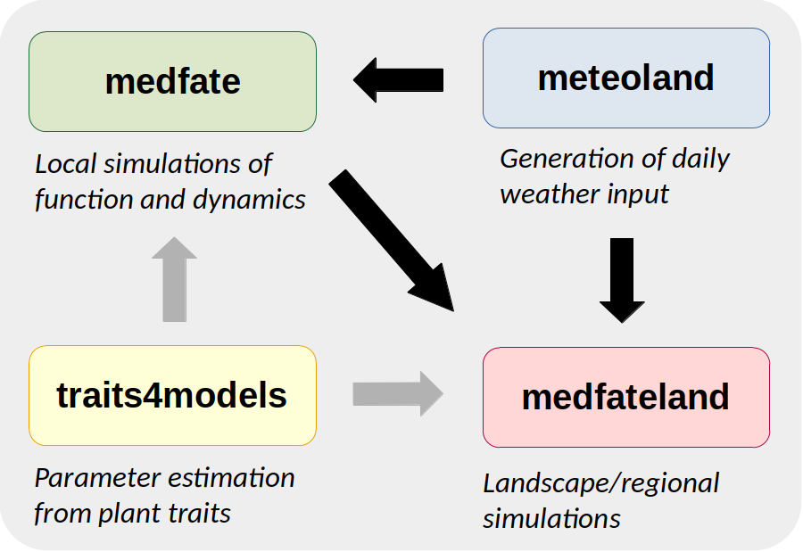

# medfate - Mediterranean Forest Simulation

[](https://cran.r-project.org/package=medfate)
[](https://cran.rstudio.com/web/packages/medfate/index.html)
[](https://github.com/emf-creaf/medfate/actions)

## Introduction <a href="https://emf-creaf.github.io/medfate/"></a>

Package **medfate** is designed to assist forest scientists to simulate
forest functioning and dynamics, using cohort-based description of
forest stands. The package provides functions to simulate the following
processes:

- Soil water balance (De Cáceres et al. 2015)
- Plant hydraulics, transpiration and photosynthesis (De Cáceres et
  al. 2021, Ruffault et al. 2022)
- Carbon balance, plant growth, senescence and mortality (De Cáceres et
  al. 2023)
- Forest dynamics, including recruitment and management (De Cáceres et
  al. 2023)

The models are parameterized for species of the Mediterranean region
(particularly for Catalonia, NE Spain), but forests with different
composition could be modelled with different parameter sets.

## Package installation & documentation

Package **medfate** can be found at
[CRAN](https://CRAN.R-project.org/package=medfate), where it is updated
every few months. Installation from CRAN can be done via:

``` r
install.packages("medfate")
```

Users can also download and install the latest stable versions GitHub as
follows (required package `remotes` should be installed/updated first):

``` r
remotes::install_github("emf-creaf/medfate")
```

A number of *vignettes* illustrate how to run simulation models in
**medfate**. These, and additional articles regarding parameter
estimation and model evaluation can be found at the package
[website](https://emf-creaf.github.io/medfate/).

A complete documentation of the models included in the package can be
found in [medfate’s reference
book](https://emf-creaf.github.io/medfatebook/index.html).

## Companion R packages

During the development of **medfate** some functions have been
originally placed there and then moved to more specialized packages
which evolve together with **medfate**:

- Package [**medfateland**](https://emf-creaf.github.io/medfateland)
  extends **medfate** by allowing simulations to be performed in a
  spatially explicit context.
- Package [**meteoland**](https://emf-creaf.github.io/meteoland) allows
  generating daily weather input for simulation models in **medfate**
  and **medfateland**.
- Package [**traits4models**](https://emf-creaf.github.io/traits4models)
  provides functions to help creating species parameter inputs for
  **medfate** and **medfateland** simulation functions \[*under
  development*\].

The relationships between the four packages are illustrated in the
figure below, where black arrows indicate package dependencies and gray
arrows indicate model parameter provision.



## Authorship

The set of R packages are developed and maintained by the [*Ecosystem
Modelling Facility*](https://emf.creaf.cat) unit at
[*CREAF*](https://www.creaf.cat/) (in Spain), in close collaboration
with researchers from
[*URFM-INRAE*](https://www6.paca.inrae.fr/ecologie_des_forets_mediterraneennes/)
(in France) and [*CTFC*](https://www.ctfc.cat/) (in Spain).


## References

- De Cáceres M, Martínez-Vilalta J, Coll L, Llorens P, Casals P, Poyatos
  R, Pausas JG, Brotons L. (2015) Coupling a water balance model with
  forest inventory data to predict drought stress: the role of forest
  structural changes vs. climate changes. Agricultural and Forest
  Meteorology 213: 77-90
  (<https://doi.org/10.1016/j.agrformet.2015.06.012>).

- De Cáceres M, Mencuccini M, Martin-StPaul N, Limousin JM, Coll L,
  Poyatos R, Cabon A, Granda V, Forner A, Valladares F, Martínez-Vilalta
  J (2021) Unravelling the effect of species mixing on water use and
  drought stress in holm oak forests: a modelling approach. Agricultural
  and Forest Meteorology 296
  (<https://doi.org/10.1016/j.agrformet.2020.108233>).

- Ruffault J, Pimont F, Cochard H, Dupuy JL, Martin-StPaul N (2022)
  SurEau-Ecos v2.0: a trait-based plant hydraulics model for simulations
  of plant water status and drought-induced mortality at the ecosystem
  level. Geoscientific Model Development 15, 5593-5626
  (<https://doi.org/10.5194/gmd-15-5593-2022>).

- De Cáceres M, Molowny-Horas R, Cabon A, Martínez-Vilalta J, Mencuccini
  M, García-Valdés R, Nadal-Sala D, Sabaté S, Martin-StPaul N, Morin X,
  D’Adamo F, Batllori E, Améztegui A (2023) MEDFATE 2.9.3: A
  trait-enabled model to simulate Mediterranean forest function and
  dynamics at regional scales. Geoscientific Model Development 16,
  3165–3201 (<https://doi.org/10.5194/gmd-16-3165-2023>).
