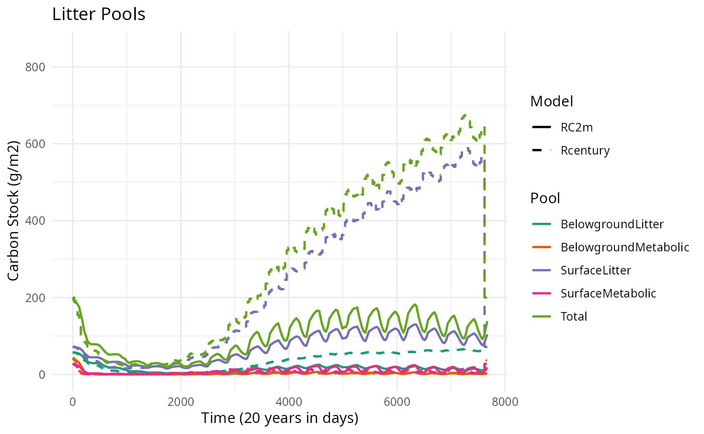
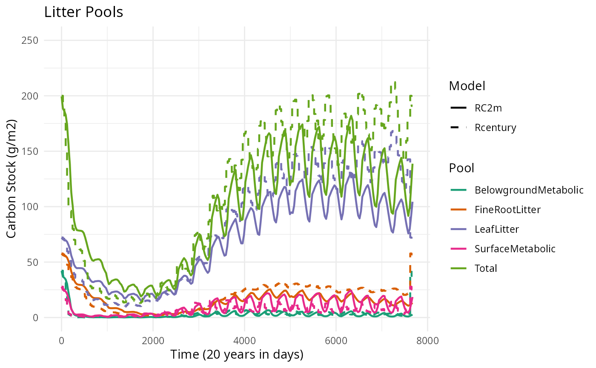
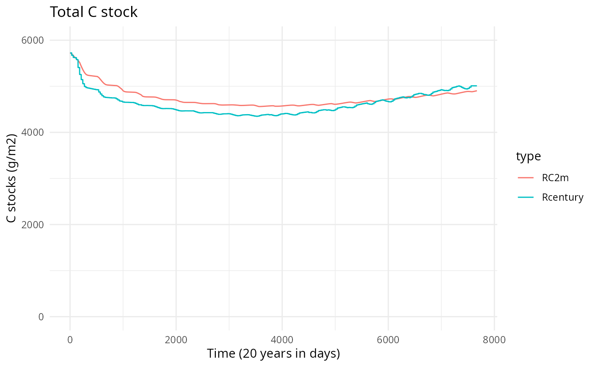
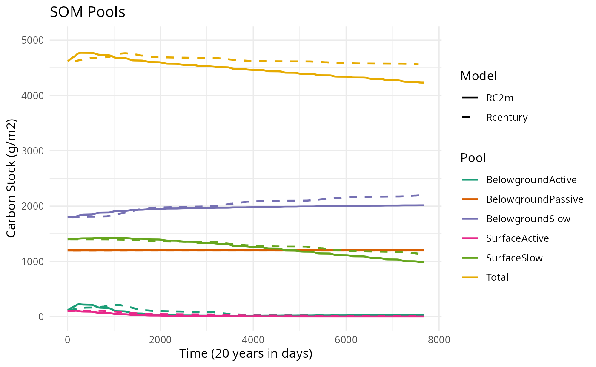
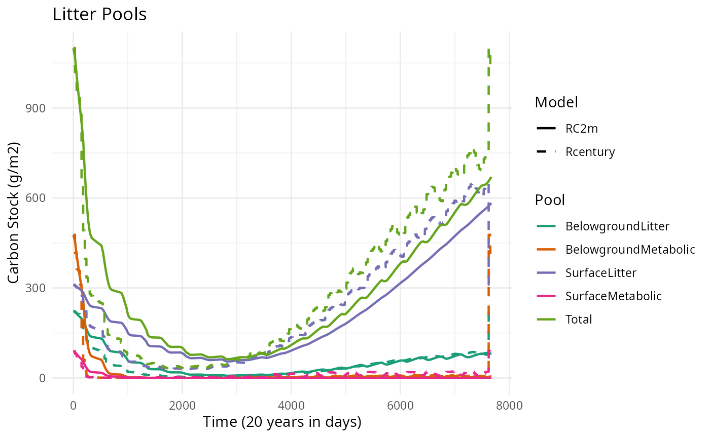

# Verification of carbon decomposition (DAYCENT)

### Initial surface/soil plant residue

In the Duke example, surface structural = 72 g m2. This value is applied
to the leaves pool (strucc(1)).

Additionaly, soil structural = 57.75 g m2. This value is applied to the
fine roots pools (strucc(2)).

``` r

# Initialize litter pools
nlitter <- 1

strucc1 <- out_duke$strucc.1.[1]
strucc2 <- out_duke$strucc.2.[1]

litterData <- data.frame(Species = as.character(rep(paramsLitterDecomposition$Species[1], nlitter)),
                         Leaves = as.numeric(rep(strucc1, nlitter)),
                         Twigs = as.numeric(rep(0, nlitter)),
                         SmallBranches = as.numeric(rep(0, nlitter)),
                         LargeWood = as.numeric(rep(0, nlitter)),
                         CoarseRoots = as.numeric(rep(0, nlitter)),
                         FineRoots = as.numeric(rep(strucc2, nlitter)))
```

Snags are not relevant at this point in time. No changes will be made.

### SOC pools

We took the SOC data from the site.100 file and the surface and soil
metabolic data from the output file of our Rcentury simulation of the
Duke site.

``` r

# Initialize SOC pools
SOM1C1 <- subset(site_d$`organic matter`$df, field == "SOM1CI(1,1)")$value
SOM1C2 <- subset(site_d$`organic matter`$df, field == "SOM1CI(2,1)")$value
SOM2C1 <- subset(site_d$`organic matter`$df, field == "SOM2CI(1,1)")$value
SOM2C2 <- subset(site_d$`organic matter`$df, field == "SOM2CI(2,1)")$value
SOM3C <- subset(site_d$`organic matter`$df, field == "SOM3CI(1)")$value

Metabc1 <-   out_duke$metabc.1.[1]
Metabc2 <- out_duke$metabc.2.[1]

SOCData <- c(SurfaceMetabolic = Metabc1, BelowgroundMetabolic = Metabc2, SurfaceActive = SOM1C1, BelowgroundActive = SOM1C2, SurfaceSlow = SOM2C1, BelowgroundSlow = SOM2C2, BelowgroundPassive = SOM3C)
```

The base rates from RC2m have been changed to match the base rates from
Rcentury. These can be found in the fix.100 file under the name
‘decx(x)’. As Rcentury does not distinguish between leaves, small
branches etc., the base rate for surface structural has been applied to
leaves while Twigs, Smallbranches and LargeWood remain unchanges. The
same counts for the soil structural. Fineroots has been changed and
Coarse roots remain the same.

``` r

#Change base rates
baseAnnualRates <- c(SurfaceMetabolic = 14.8, BelowgroundMetabolic = 18.5, Leaves = 3.9 , FineRoots = 4.9, Twigs = 1.8,  SmallBranches = 1.5,LargeWood = 0.02 , CoarseRoots = 0.1,SurfaceActive = 6, BelowgroundActive = 7.3, SurfaceSlow = 0.03, BelowgroundSlow = 0.07, BelowgroundPassive = 0.0008)
# baseAnnualRates <- c(SurfaceMetabolic = 14.8, BelowgroundMetabolic = 18.5, Leaves = 3.9 , FineRoots = 4.9, Twigs = 3.9,  SmallBranches = 3.9,LargeWood = 3.9 , CoarseRoots = 3.9,SurfaceActive = 6, BelowgroundActive = 7.3, SurfaceSlow = 0.03, BelowgroundSlow = 0.07, BelowgroundPassive = 0.0008)
```

### Texture & pH

We took the the sand and clay values (and multiplied them by 100 to
obtain the fractions) and the pH value from the site.100 file.

``` r

# Retrieve soil site data
sand <- subset(site_d$`site and control`$df, field == "SAND")$value * 100
clay <- subset(site_d$`site and control`$df, field == "CLAY")$value * 100
soilPH <- subset(site_d$`site and control`$df, field == "PH")$value 
```

### Results

The monthly results from the Rcentury simulation are transformed to
daily data to make it comparable to the results from medfate. The
results are further divided into total C stock, soil organic matter
pools (SOM pools) and litter pools.

#### Total

The SOM and Litter pools are summed manually to calculate the total C
stock for both models. For Rcentury, there is also the option to use the
parameter ‘tomres’, which should already include the total C stock. In
this case, the manual option was preferable to main.

``` r

# Get dimensions
n_days <- nrow(res$DecompositionPools)  
n_months <- nrow(out_duke) 

# Create data frames with time indices
RC2m_duke <- data.frame(
  value = rowSums(res$DecompositionPools[,c(3,8:15)], na.rm = TRUE),
  day = 1:n_days,
  type = "RC2m"
)

# Calculate days per month (approximately equal)
days_per_month <- rep(round(n_days / n_months), n_months)
# Adjust last month to match exactly
days_per_month[length(days_per_month)] <- n_days - sum(days_per_month[-length(days_per_month)])

# Expand monthly data to daily
Rcentury_duke <- RC_total |>
  mutate(
    days = days_per_month,
    monthly_value = value  
  ) |>
  rowwise() |>
  mutate(
    daily_values = list(rep(monthly_value, days))
  ) |>
  unnest(daily_values) |>
  mutate(
    day = 1:n(),
    type = "Rcentury"
  ) |>
  select(day, value = daily_values, type)

# Combine
combined <- bind_rows(RC2m_duke, Rcentury_duke)

# Plot
ggplot(combined, aes(x = day, y = value, color = type)) +
  geom_line() +
  labs(title = "Total C stock",
       x = "Time (20 years in days)", 
       y = "C stocks (g/m2)") +
  ylim(1400,4500) +
  xlim(0,7671) +
  theme_minimal() 
```

 This
figure shows a similar pattern for both models: a small decrease in the
beginning and then a an increase later on. However, RC2m increases
faster than Rcentury and there is a ~500 g/m2 difference in total C
stock.

#### SOM pool analysis

To further analyze the results, all SOM pools are selected from the
models results and compared.

Then we rename the Century pool codes to the names used in Bonan.


This figure shows that the results of both the Rcentury model and RC2m
model are very similar, which indicates that the simulation of the SOM
pools in RC2m appears to function well.

#### Litter pool analysis


Contrary to the SOM pools, RC2m shows a rapid increase in total and
Surface litter after 2000 days. Soil litter increases as well, while the
other pools remain near 0. In Rcentury, all pools decrease slowly and
remain near 0.

### Structural litter

The Century model only includes leaves and fine roots in the structural
pools, while RC2m also includes fine branches, large wood litter and
coarse roots. These are included in the Century model, but in the dead
wood compartments. Two new simulations of the models are created to
compare both models with all structural litter and with only leaves and
fine roots.

#### All structural litter

A new selection of litter data has been made, which adapts the
SurfaceStructural pool to include C in dead fine branches and large
wood, and the SoilStructural to include coarse roots.



The total litter has improved on the previous version. There are still
some differences between the Surface litter and Soil litter pools, but
overall less severe than before. Both now also include a total of all
pools.

##### Total

If we include the dead wood in Rcentury, we can see an improvement in
the total C stock as well.

#### Only leaves

In this simulation, only the leaf litter and !Coarse root! litter pools
are selected and shown with the regular Rcentury run.



The difference between RC2m and Rcentury is much less in the structural
litter pools (leaf litter) compared to the original litter pool
analysis. The Rcentury results are slightly higher, but do show similar
patternes.

## Harvard

### Total

For this simulation, all structural litter has been taken into
consideration by default. So for the total C stock, wood1c, wood2c, etc.
have been included.



Here you can see

### SOM pool analysis



### Litter

Again, all structural components are included here (so not just leaves
and fine roots).


