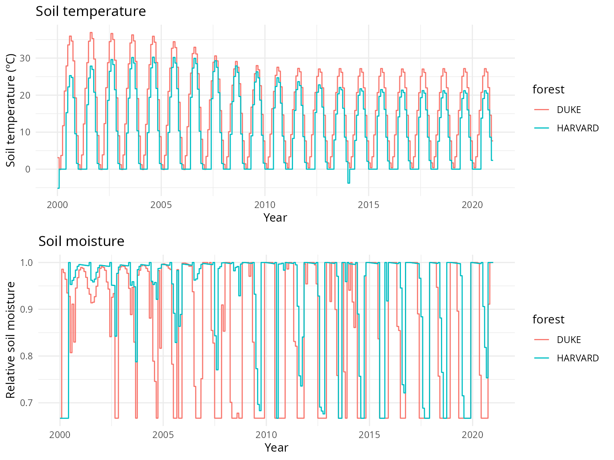
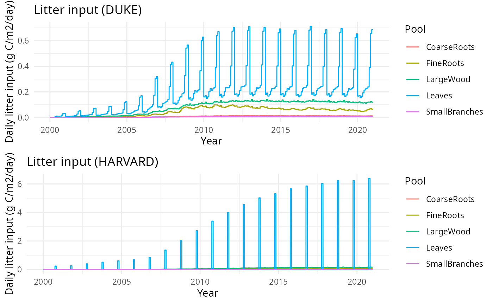
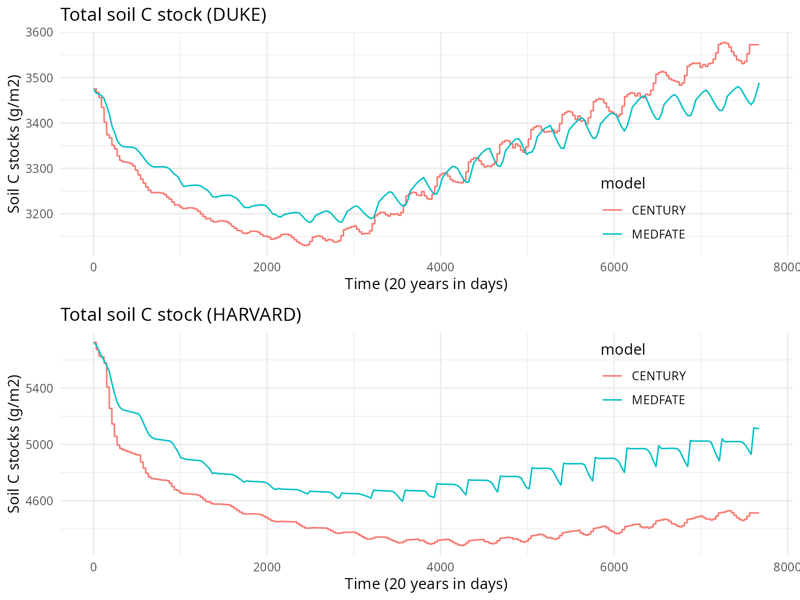
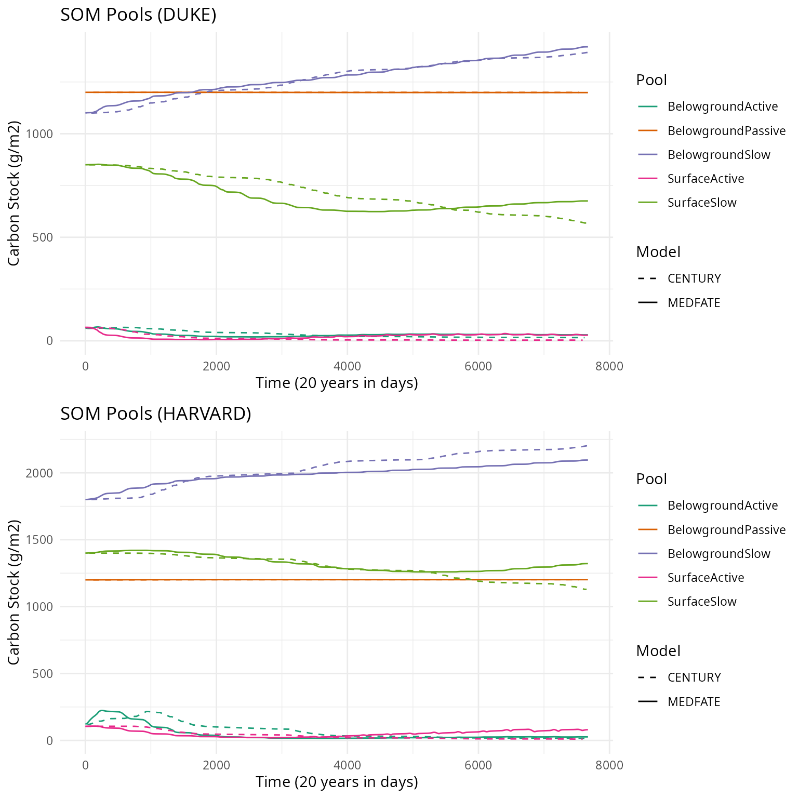
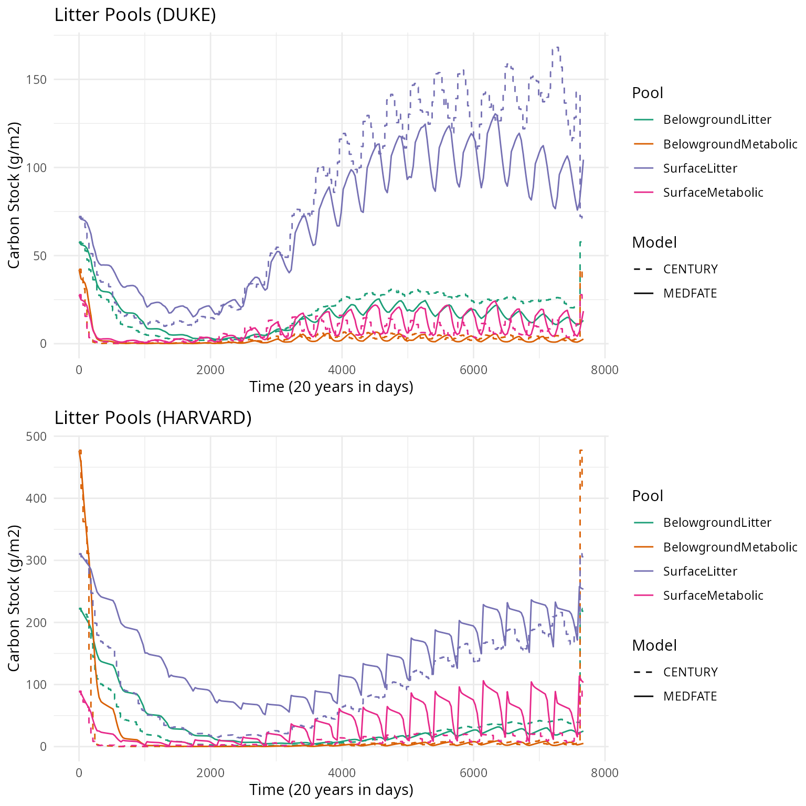
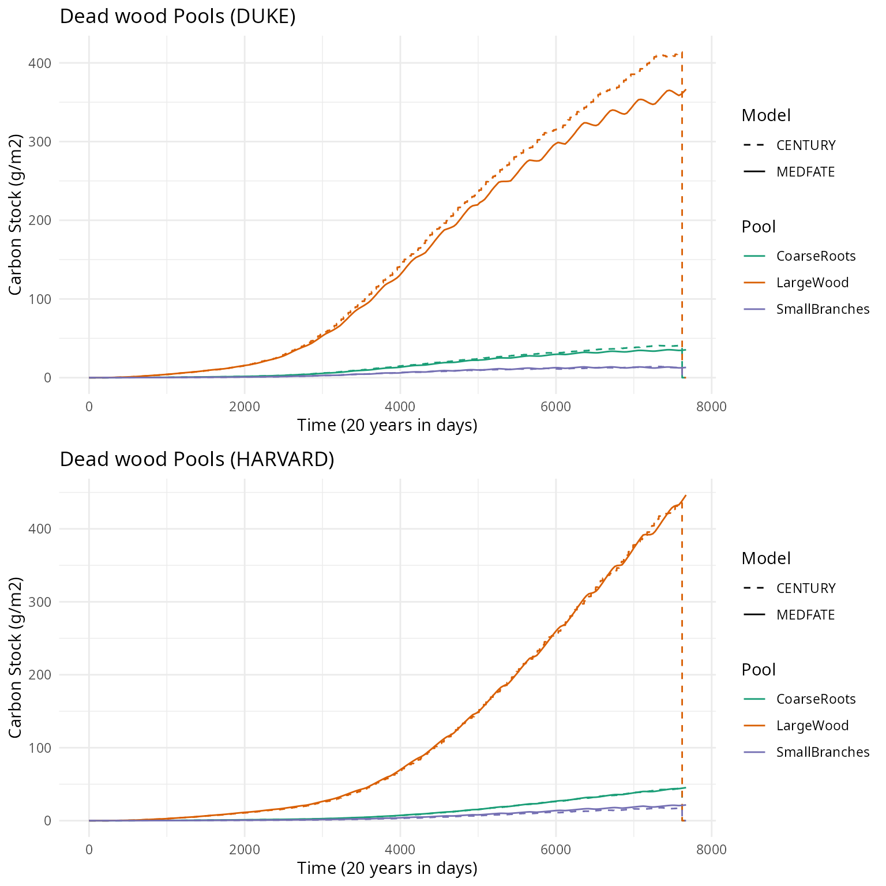

# Verification of carbon decomposition (DAYCENT)

## Introduction

This document presents an exercise to verify the implementation of the
carbon decomposition process of DAYCENT into MEDFATE. The verification
is done against the outputs of CENTURY (ver. 4.7) corresponding to
simulation of Duke and Harvard forests.

## Methods

### Initial soil carbon content

- Surface structural (`strucc(1)`) was applied as the initial carbon
  content for the `Leaves` pool. Similarly, belowground structural
  (`strucc(2)`) was applied to the `FineRoots` pool. The remaining
  litter pools (snags, small branches, large wood and coarse roots) are
  set to zero initial value.

- We took the soil organic carbon (SOC) initial values from the CENTURY
  `site.100` input file, and the surface and belowground metabolic data
  from the first row of the output file of our CENTURY simulation of the
  Duke site.

| MEDFATE pool           | CENTURY parameter | DUKE | HARVARD |
|------------------------|-------------------|------|---------|
| `Leaves`               | `strucc.1.`       | 72   | 311     |
| `FineRoots`            | `strucc.2.`       | 58   | 223     |
| `SurfaceMetabolic`     | `metabc.1.`       | 28   | 89      |
| `BelowgroundMetabolic` | `metabc.2.`       | 42   | 477     |
| `SurfaceActive`        | `SOM1CI(1,1)`     | 65   | 105     |
| `BelowgroundActive`    | `SOM1CI(2,1)`     | 60   | 120     |
| `SurfaceSlow`          | `SOM2CI(1,1)`     | 850  | 1400    |
| `BelowgroundSlow`      | `SOM2CI(2,1)`     | 1100 | 1800    |
| `BelowgroundPassive`   | `SOM3CI(1)`       | 1200 | 1200    |

### Decomposition parameters

#### Litter decomposition parameters

| Species | LeafLignin | WoodLignin | FineRootLignin | Nleaf | Nsapwood | Nfineroot | LeafLigninN |
|:---|---:|---:|---:|---:|---:|---:|---:|
| DUKE | 20.0 | 25 | 20 | 5.000000 | 1.744186 | 10 | 40.000 |
| HARVF | 20.3 | 25 | 8 | 8.474576 | 4.658385 | 10 | 23.954 |

#### Maximum decomposition rates

The maximum (base) decomposition rates for the different soil pools in
MEDFATE (i.e. control parameter `baseAnnualRates`) were adapted to match
the maximum rates from CENTURY (these can be found in the `fix.100`
file).

| Element in `baseAnnualRates` | CENTURY pool | CENTURY parameter | Value |
|----|----|----|----|
| `Leaves` | Surface structural | `DEC1(1)` | 3.9 |
| `FineRoots` | Belowground structural | `DEC1(2)` | 4.9 |
| `SurfaceMetabolic` | Surface metabolic | `DEC2(1)` | 14.8 |
| `BelowgroundMetabolic` | Belowground metabolic | `DEC2(2)` | 18.5 |
| `SurfaceActive` | Surface active | `DEC3(1)` | 6 |
| `BelowgroundActive` | Soil active | `DEC3(2)` | 7.3 |
| `BelowgroundPassive` | Soil slow turnover | `DEC4` | 8^{-4} |
| `SurfaceSlow` | Surface intermediate | `DEC5(1)` | 0.03 |
| `BelowgroundSlow` | Soil intermediate | `DEC5(2)` | 0.07 |

Maximum decomposition rates for dead wood pools (small branches, large
wood and coarse roots) were taken from elements `DECW1`, `DECW2` and
`DECW3` of `tree.fix`.

| Element in `baseAnnualRates` | CENTURY parameter | DUKE | Harvard |
|------------------------------|-------------------|------|---------|
| `SmallBranches`              | `DECW1`           | 1.5  | 1.5     |
| `LargeWood`                  | `DECW2`           | 0.5  | 0.5     |
| `CoarseRoots`                | `DECW3`           | 0.6  | 0.6     |

Rate of mixing between surface slow and belowground slow compartments
was taken from `tree.100`:

| Element in `control` | CENTURY parameter | DUKE | Harvard |
|----------------------|-------------------|------|---------|
| `annualTurnoverRate` | `TMIX`            | 0.11 | 0.11    |

#### Soil texture and pH

We took the the sand and clay values (and multiplied them by 100 to
obtain the fractions) and the pH value from the CENTURY `site.100` file.

| Soil property | CENTURY parameter | DUKE | Harvard |
|---------------|-------------------|------|---------|
| Percent sand  | `SAND`            | 28   | 80      |
| Percent clay  | `CLAY`            | 12   | 5       |
| Soil pH       | `PH`              | 5    | 5.16    |

### Environmental variation

Variation of environmental conditions for carbon decomposition were
drawn from CENTURY outputs. Specifically, soil temperature was taken
from CENTURY variable `stemp`, whereas CENTURY variable `asmos.1.` was
used to estimate soil relative moisture.

### Litter input

Litter inputs (senescence of leaves, small branches, large wood, fine
roots and coarse roots) are estimated using CENTURY output corresponding
to variation in live carbon pools in the forest system (i.e. `rleavc`,
`fbrchc`, `rlwodc`, `frootc` and `crootc`) and the CENTURY parameters
specifying monthly death rates for those live pools (i.e. leaf death
rates `leafdr(x)` for each month and `wooddr(2-5)` for the remaining
four pools, and `wooddr(1)` in case of a deciduous forest).

### Simulations

MEDFATE simulations were run using function
[`decomposition_DAYCENT()`](https://emf-creaf.github.io/medfate/reference/decomposition_DAYCENT.md).

### Comparison

The monthly results from the CENTURY simulation are transformed to daily
data to make it comparable to the results from MEDFATE. The results are
compared in terms of total soil C stock, soil organic matter pools (SOM
pools), (leaf and fine root) litter pools and dead wood pools.

## Results

### Total soil carbon

### SOM pools

### Structural (leaf and fine root) and metabolic pools

### Dead wood pools

