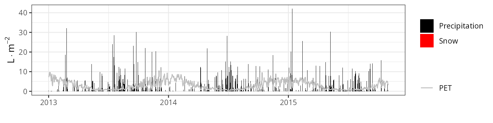
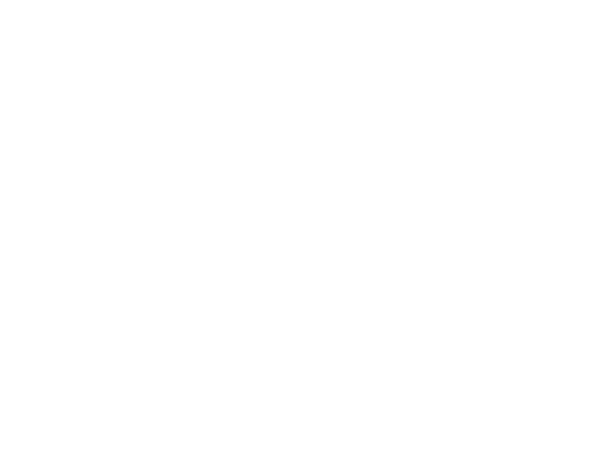

# Model evaluation in experimental plots

    ## Error in `get()`:
    ## ! object 'SpParamsAU' not found

## Introduction

This document presents **medfate** (**ver. 4.9.0**) model evaluation
results at stand-level, using data from a set of **20 experimental
forest plots**. The main source of observed data are SAPFLUXNET database
([Poyatos et
al. 2021](https://essd.copernicus.org/articles/13/2607/2021/)) and
FLUXNET 2015 dataset ([Pastorello et
al. 2020](https://doi.org/10.1038/s41597-020-0534-3)).

### List of sites

The table below lists the experimental forest plots used in the report
and the data sources available.

| Country | Plot | Stand | SAPFLUXNET | FLUXNET/ICOS |
|:--------|:-----|:------|:-----------|:-------------|
|         |      |       |            |              |
|         |      |       |            |              |
|         |      |       |            |              |
|         |      |       |            |              |
|         |      |       |            |              |
|         |      |       |            |              |
|         |      |       |            |              |
|         |      |       |            |              |
|         |      |       |            |              |
|         |      |       |            |              |
|         |      |       |            |              |
|         |      |       |            |              |
|         |      |       |            |              |
|         |      |       |            |              |
|         |      |       |            |              |
|         |      |       |            |              |
|         |      |       |            |              |
|         |      |       |            |              |
|         |      |       |            |              |
|         |      |       |            |              |

### Parametrization and simulations

Forest water balance simulations (i.e. function
[`spwb()`](https://emf-creaf.github.io/medfate/reference/spwb.md)) have
been conducted using the three transpiration modes (i.e. `Granier`,
`Sperry` or `Sureau`).

The set of control parameters modified from defaults in simulations are
the following:

| transpirationMode | soilDomains | stemCavitationRecovery | leafCavitationRecovery | segmentedXylemVulnerability | subdailyResults |
|:---|:---|:---|:---|:---|:---|
| Granier | dual | rate | total | NA | NA |
| Sperry | dual | rate | total | TRUE | FALSE |
| Sureau | dual | rate | rate | FALSE | FALSE |

Soil characteristics have been tuned to modulate total available water
and fit observed saturation and residual moisture values, but
calibration exercises have not been conducted. When available, however,
local leaf area to sapwood area ratios have been used. Thus, the
evaluation exercise is meant to be more or less representative of
simulations with default species-level trait data.

### Evaluation variables

The table below lists the set of predicted variables that are evaluated
and the data sources used:

| Variable | Level | Observation source | Units |
|----|----|----|----|
| Sensible heat turbulent flux | Stand | FLUXNET / ICOS | MJ/m2 |
| Latent heat turbulent flux | Stand | FLUXNET / ICOS | MJ/m2 |
| Gross primary productivity | Stand | FLUXNET / ICOS | gC/m2 |
| Soil moisture content (topsoil) | Stand | SAPFLUXNET / FLUXNET / ICOS | % vol. |
| Transpiration per leaf area | Plant | SAPFLUXNET | l/m2 |
| Predawn/midday leaf water potential | Plant | SAPFLUXNET (addition) | MPa |

### Structure of site reports

The following contains as many sections as forest stands included in the
evaluation. The following sub-sections are reported for each stand:

1.  **General information**: General information about the site,
    topography, soil and climate, as well as data sources used.
2.  **Model inputs**: Description of model inputs (vegetation, soil,
    custom species parameters and parameterization remarks).
3.  **Climate**: Graphical description of climate inputs and predicted
    soil/canopy temperatures (under Sperry).
4.  **Evaluation results**: Evaluation results are presented for
    variables with available measurements.

## Wombat

### General information

||
||
||

### Model inputs

#### Vegetation

    ## Error in `if (miscData$herbCover > 0) ...`:
    ## ! argument is of length zero

||
||
||

#### Soil

||
||
||

#### Custom traits

    ## Error in `colSums()`:
    ## ! 'x' must be an array of at least two dimensions

||
||
||

#### Custom control

||
||
||

#### Remarks

||
||
||

### Macroclimate

### Microclimate

    ## Error in `xy.coords()`:
    ## ! 'x' and 'y' lengths differ

### Runoff & deep drainage

    ## Error in `plot.window()`:
    ## ! need finite 'xlim' values

### Evaluation results

    ## Error in `startsWith()`:
    ## ! non-character object(s)

    ## Error:
    ## ! object 'eval_Eplant' not found

## Euc-FACE

### General information

||
||
||

### Model inputs

#### Vegetation

    ## Error in `if (miscData$herbCover > 0) ...`:
    ## ! argument is of length zero

||
||
||

#### Soil

||
||
||

#### Custom traits

    ## Error in `colSums()`:
    ## ! 'x' must be an array of at least two dimensions

||
||
||

#### Custom control

||
||
||

#### Remarks

||
||
||

### Macroclimate

    ## Error in `xy.coords()`:
    ## ! 'x' and 'y' lengths differ

### Microclimate

    ## Error in `xy.coords()`:
    ## ! 'x' and 'y' lengths differ

### Runoff & deep drainage

    ## Error in `xy.coords()`:
    ## ! 'x' and 'y' lengths differ

### Evaluation results

    ## Error in `startsWith()`:
    ## ! non-character object(s)

    ## Error:
    ## ! object 'eval_Eplant' not found

## Soroe

### General information

||
||
||

### Model inputs

#### Vegetation

    ## Error in `if (miscData$herbCover > 0) ...`:
    ## ! argument is of length zero

||
||
||

#### Soil

||
||
||

#### Custom traits

    ## Error in `colSums()`:
    ## ! 'x' must be an array of at least two dimensions

||
||
||

#### Custom control

||
||
||

#### Remarks

||
||
||

### Macroclimate

    ## Error in `xy.coords()`:
    ## ! 'x' and 'y' lengths differ

### Microclimate

    ## Error in `xy.coords()`:
    ## ! 'x' and 'y' lengths differ

### Runoff & deep drainage

    ## Error in `xy.coords()`:
    ## ! 'x' and 'y' lengths differ

### Evaluation results

    ## Error in `startsWith()`:
    ## ! non-character object(s)

    ## Error:
    ## ! object 'eval_Eplant' not found

## Puéchabon

### General information

||
||
||

### Model inputs

#### Vegetation

    ## Error in `if (miscData$herbCover > 0) ...`:
    ## ! argument is of length zero

||
||
||

#### Soil

||
||
||

#### Custom traits

    ## Error in `colSums()`:
    ## ! 'x' must be an array of at least two dimensions

||
||
||

#### Custom control

||
||
||

#### Remarks

||
||
||

### Macroclimate

    ## Error in `xy.coords()`:
    ## ! 'x' and 'y' lengths differ

### Microclimate

    ## Error in `xy.coords()`:
    ## ! 'x' and 'y' lengths differ

### Runoff & deep drainage

    ## Error in `xy.coords()`:
    ## ! 'x' and 'y' lengths differ

### Evaluation results

    ## Error in `startsWith()`:
    ## ! non-character object(s)

    ## Error:
    ## ! object 'eval_Eplant' not found

## Hesse

### General information

||
||
||

### Model inputs

#### Vegetation

    ## Error in `if (miscData$herbCover > 0) ...`:
    ## ! argument is of length zero

||
||
||

#### Soil

||
||
||

#### Custom traits

    ## Error in `colSums()`:
    ## ! 'x' must be an array of at least two dimensions

||
||
||

#### Custom control

||
||
||

#### Remarks

||
||
||

### Macroclimate

    ## Error in `xy.coords()`:
    ## ! 'x' and 'y' lengths differ

### Microclimate

    ## Error in `xy.coords()`:
    ## ! 'x' and 'y' lengths differ

### Runoff & deep drainage

    ## Error in `xy.coords()`:
    ## ! 'x' and 'y' lengths differ

### Evaluation results

    ## Error in `startsWith()`:
    ## ! non-character object(s)

    ## Error:
    ## ! object 'eval_Eplant' not found

## Fontainebleau-Barbeau

### General information

||
||
||

### Model inputs

#### Vegetation

    ## Error in `if (miscData$herbCover > 0) ...`:
    ## ! argument is of length zero

||
||
||

#### Soil

||
||
||

#### Custom traits

    ## Error in `colSums()`:
    ## ! 'x' must be an array of at least two dimensions

||
||
||

#### Custom control

||
||
||

#### Remarks

||
||
||

### Macroclimate

    ## Error in `xy.coords()`:
    ## ! 'x' and 'y' lengths differ

### Microclimate

    ## Error in `xy.coords()`:
    ## ! 'x' and 'y' lengths differ

### Runoff & deep drainage

    ## Error in `xy.coords()`:
    ## ! 'x' and 'y' lengths differ

### Evaluation results

    ## Error in `startsWith()`:
    ## ! non-character object(s)

    ## Error:
    ## ! object 'eval_Eplant' not found

## Font-Blanche

### General information

||
||
||

### Model inputs

#### Vegetation

    ## Error in `if (miscData$herbCover > 0) ...`:
    ## ! argument is of length zero

||
||
||

#### Soil

||
||
||

#### Custom traits

    ## Error in `colSums()`:
    ## ! 'x' must be an array of at least two dimensions

||
||
||

#### Custom control

||
||
||

#### Remarks

||
||
||

### Macroclimate

    ## Error in `xy.coords()`:
    ## ! 'x' and 'y' lengths differ

### Microclimate

    ## Error in `xy.coords()`:
    ## ! 'x' and 'y' lengths differ

### Runoff & deep drainage

    ## Error in `xy.coords()`:
    ## ! 'x' and 'y' lengths differ

### Evaluation results

    ## Error in `startsWith()`:
    ## ! non-character object(s)

    ## Error:
    ## ! object 'eval_Eplant' not found

## Collelongo

### General information

||
||
||

### Model inputs

#### Vegetation

    ## Error in `if (miscData$herbCover > 0) ...`:
    ## ! argument is of length zero

||
||
||

#### Soil

||
||
||

#### Custom traits

    ## Error in `colSums()`:
    ## ! 'x' must be an array of at least two dimensions

||
||
||

#### Custom control

||
||
||

#### Remarks

||
||
||

### Macroclimate

    ## Error in `xy.coords()`:
    ## ! 'x' and 'y' lengths differ

### Microclimate

    ## Error in `xy.coords()`:
    ## ! 'x' and 'y' lengths differ

### Runoff & deep drainage

    ## Error in `xy.coords()`:
    ## ! 'x' and 'y' lengths differ

### Evaluation results

    ## Error in `startsWith()`:
    ## ! non-character object(s)

    ## Error:
    ## ! object 'eval_Eplant' not found

## Mitra

### General information

||
||
||

### Model inputs

#### Vegetation

    ## Error in `if (miscData$herbCover > 0) ...`:
    ## ! argument is of length zero

||
||
||

#### Soil

||
||
||

#### Custom traits

    ## Error in `colSums()`:
    ## ! 'x' must be an array of at least two dimensions

||
||
||

#### Custom control

||
||
||

#### Remarks

||
||
||

### Macroclimate

    ## Error in `xy.coords()`:
    ## ! 'x' and 'y' lengths differ

### Microclimate

    ## Error in `xy.coords()`:
    ## ! 'x' and 'y' lengths differ

### Runoff & deep drainage

    ## Error in `xy.coords()`:
    ## ! 'x' and 'y' lengths differ

### Evaluation results

    ## Error in `startsWith()`:
    ## ! non-character object(s)

    ## Error:
    ## ! object 'eval_Eplant' not found

## Rinconada

### General information

||
||
||

### Model inputs

#### Vegetation

    ## Error in `if (miscData$herbCover > 0) ...`:
    ## ! argument is of length zero

||
||
||

#### Soil

||
||
||

#### Custom traits

    ## Error in `colSums()`:
    ## ! 'x' must be an array of at least two dimensions

||
||
||

#### Custom control

||
||
||

#### Remarks

||
||
||

### Macroclimate

    ## Error in `xy.coords()`:
    ## ! 'x' and 'y' lengths differ

### Microclimate

    ## Error in `xy.coords()`:
    ## ! 'x' and 'y' lengths differ

### Runoff & deep drainage

    ## Error in `xy.coords()`:
    ## ! 'x' and 'y' lengths differ

### Evaluation results

    ## Error in `startsWith()`:
    ## ! non-character object(s)

    ## Error:
    ## ! object 'eval_Eplant' not found

## Vallcebre (Barrol)

### General information

||
||
||

### Model inputs

#### Vegetation

    ## Error in `if (miscData$herbCover > 0) ...`:
    ## ! argument is of length zero

||
||
||

#### Soil

||
||
||

#### Custom traits

    ## Error in `colSums()`:
    ## ! 'x' must be an array of at least two dimensions

||
||
||

#### Custom control

||
||
||

#### Remarks

||
||
||

### Macroclimate

    ## Error in `xy.coords()`:
    ## ! 'x' and 'y' lengths differ

### Microclimate

    ## Error in `xy.coords()`:
    ## ! 'x' and 'y' lengths differ

### Runoff & deep drainage

    ## Error in `xy.coords()`:
    ## ! 'x' and 'y' lengths differ

### Evaluation results

    ## Error in `startsWith()`:
    ## ! non-character object(s)

    ## Error:
    ## ! object 'eval_Eplant' not found

## Vallcebre (Sort)

### General information

||
||
||

### Model inputs

#### Vegetation

    ## Error in `if (miscData$herbCover > 0) ...`:
    ## ! argument is of length zero

||
||
||

#### Soil

||
||
||

#### Custom traits

    ## Error in `colSums()`:
    ## ! 'x' must be an array of at least two dimensions

||
||
||

#### Custom control

||
||
||

#### Remarks

||
||
||

### Macroclimate

    ## Error in `xy.coords()`:
    ## ! 'x' and 'y' lengths differ

### Microclimate

    ## Error in `xy.coords()`:
    ## ! 'x' and 'y' lengths differ

### Runoff & deep drainage

    ## Error in `xy.coords()`:
    ## ! 'x' and 'y' lengths differ

### Evaluation results

    ## Error in `startsWith()`:
    ## ! non-character object(s)

    ## Error:
    ## ! object 'eval_Eplant' not found

## Prades

### General information

||
||
||

### Model inputs

#### Vegetation

    ## Error in `if (miscData$herbCover > 0) ...`:
    ## ! argument is of length zero

||
||
||

#### Soil

||
||
||

#### Custom traits

    ## Error in `colSums()`:
    ## ! 'x' must be an array of at least two dimensions

||
||
||

#### Custom control

||
||
||

#### Remarks

||
||
||

### Macroclimate

    ## Error in `xy.coords()`:
    ## ! 'x' and 'y' lengths differ

### Microclimate

    ## Error in `xy.coords()`:
    ## ! 'x' and 'y' lengths differ

### Runoff & deep drainage

    ## Error in `xy.coords()`:
    ## ! 'x' and 'y' lengths differ

### Evaluation results

    ## Error in `startsWith()`:
    ## ! non-character object(s)

    ## Error:
    ## ! object 'eval_Eplant' not found

## Can Balasc

### General information

||
||
||

### Model inputs

#### Vegetation

    ## Error in `if (miscData$herbCover > 0) ...`:
    ## ! argument is of length zero

||
||
||

#### Soil

||
||
||

#### Custom traits

    ## Error in `colSums()`:
    ## ! 'x' must be an array of at least two dimensions

||
||
||

#### Custom control

||
||
||

#### Remarks

||
||
||

### Macroclimate

    ## Error in `xy.coords()`:
    ## ! 'x' and 'y' lengths differ

### Microclimate

    ## Error in `xy.coords()`:
    ## ! 'x' and 'y' lengths differ

### Runoff & deep drainage

    ## Error in `xy.coords()`:
    ## ! 'x' and 'y' lengths differ

### Evaluation results

    ## Error in `startsWith()`:
    ## ! non-character object(s)

    ## Error:
    ## ! object 'eval_Eplant' not found

## Alto-Tajo Armallones

### General information

||
||
||

### Model inputs

#### Vegetation

    ## Error in `if (miscData$herbCover > 0) ...`:
    ## ! argument is of length zero

||
||
||

#### Soil

||
||
||

#### Custom traits

    ## Error in `colSums()`:
    ## ! 'x' must be an array of at least two dimensions

||
||
||

#### Custom control

||
||
||

#### Remarks

||
||
||

### Macroclimate

    ## Error in `xy.coords()`:
    ## ! 'x' and 'y' lengths differ

### Microclimate

    ## Error in `xy.coords()`:
    ## ! 'x' and 'y' lengths differ

### Runoff & deep drainage

    ## Error in `xy.coords()`:
    ## ! 'x' and 'y' lengths differ

### Evaluation results

    ## Error in `startsWith()`:
    ## ! non-character object(s)

    ## Error:
    ## ! object 'eval_Eplant' not found

## Ronda

### General information

||
||
||

### Model inputs

#### Vegetation

    ## Error in `if (miscData$herbCover > 0) ...`:
    ## ! argument is of length zero

||
||
||

#### Soil

||
||
||

#### Custom traits

    ## Error in `colSums()`:
    ## ! 'x' must be an array of at least two dimensions

||
||
||

#### Custom control

||
||
||

#### Remarks

||
||
||

### Macroclimate

    ## Error in `xy.coords()`:
    ## ! 'x' and 'y' lengths differ

### Microclimate

    ## Error in `xy.coords()`:
    ## ! 'x' and 'y' lengths differ

### Runoff & deep drainage

    ## Error in `xy.coords()`:
    ## ! 'x' and 'y' lengths differ

### Evaluation results

    ## Error in `startsWith()`:
    ## ! non-character object(s)

    ## Error:
    ## ! object 'eval_Eplant' not found

## Davos Seehornwald

### General information

||
||
||

### Model inputs

#### Vegetation

    ## Error in `if (miscData$herbCover > 0) ...`:
    ## ! argument is of length zero

||
||
||

#### Soil

||
||
||

#### Custom traits

    ## Error in `colSums()`:
    ## ! 'x' must be an array of at least two dimensions

||
||
||

#### Custom control

||
||
||

#### Remarks

||
||
||

### Macroclimate

    ## Error in `xy.coords()`:
    ## ! 'x' and 'y' lengths differ

### Microclimate

    ## Error in `xy.coords()`:
    ## ! 'x' and 'y' lengths differ

### Runoff & deep drainage

    ## Error in `xy.coords()`:
    ## ! 'x' and 'y' lengths differ

### Evaluation results

    ## Error in `startsWith()`:
    ## ! non-character object(s)

    ## Error:
    ## ! object 'eval_Eplant' not found

## Lötschental

### General information

||
||
||

### Model inputs

#### Vegetation

    ## Error in `if (miscData$herbCover > 0) ...`:
    ## ! argument is of length zero

||
||
||

#### Soil

||
||
||

#### Custom traits

    ## Error in `colSums()`:
    ## ! 'x' must be an array of at least two dimensions

||
||
||

#### Custom control

||
||
||

#### Remarks

||
||
||

### Macroclimate

    ## Error in `xy.coords()`:
    ## ! 'x' and 'y' lengths differ

### Microclimate

    ## Error in `xy.coords()`:
    ## ! 'x' and 'y' lengths differ

### Runoff & deep drainage

    ## Error in `xy.coords()`:
    ## ! 'x' and 'y' lengths differ

### Evaluation results

    ## Error in `startsWith()`:
    ## ! non-character object(s)

    ## Error:
    ## ! object 'eval_Eplant' not found

## Morgan-Monroe

### General information

||
||
||

### Model inputs

#### Vegetation

    ## Error in `if (miscData$herbCover > 0) ...`:
    ## ! argument is of length zero

||
||
||

#### Soil

||
||
||

#### Custom traits

    ## Error in `colSums()`:
    ## ! 'x' must be an array of at least two dimensions

||
||
||

#### Custom control

||
||
||

#### Remarks

||
||
||

### Macroclimate

    ## Error in `xy.coords()`:
    ## ! 'x' and 'y' lengths differ

### Microclimate

    ## Error in `xy.coords()`:
    ## ! 'x' and 'y' lengths differ

### Runoff & deep drainage

    ## Error in `xy.coords()`:
    ## ! 'x' and 'y' lengths differ

### Evaluation results

    ## Error in `startsWith()`:
    ## ! non-character object(s)

    ## Error:
    ## ! object 'eval_Eplant' not found

## Sevilleta

### General information

||
||
||

### Model inputs

#### Vegetation

    ## Error in `if (miscData$herbCover > 0) ...`:
    ## ! argument is of length zero

||
||
||

#### Soil

||
||
||

#### Custom traits

    ## Error in `colSums()`:
    ## ! 'x' must be an array of at least two dimensions

||
||
||

#### Custom control

||
||
||

#### Remarks

||
||
||

### Macroclimate

    ## Error in `xy.coords()`:
    ## ! 'x' and 'y' lengths differ

### Microclimate

    ## Error in `xy.coords()`:
    ## ! 'x' and 'y' lengths differ

### Runoff & deep drainage

    ## Error in `xy.coords()`:
    ## ! 'x' and 'y' lengths differ

### Evaluation results

    ## Error in `startsWith()`:
    ## ! non-character object(s)

    ## Error:
    ## ! object 'eval_Eplant' not found
