# Model evaluation in experimental plots

    ## Error in readRDS(file_name_output): error reading from connection

## Introduction

This document presents **medfate** (**ver. 4.8.0**) model evaluation
results at stand-level, using data from a set of **20 experimental
forest plots**. The main source of observed data are SAPFLUXNET database
([Poyatos et
al. 2021](https://essd.copernicus.org/articles/13/2607/2021/)) and
FLUXNET 2015 dataset ([Pastorello et
al. 2020](https://doi.org/10.1038/s41597-020-0534-3)).

### List of sites

The table below lists the experimental forest plots used in the report
and the data sources available.

| Country | Plot | Stand | SAPFLUXNET | FLUXNET/ICOS |
|:---|:---|:---|:---|:---|
| Australia | Wombat | Mixed eucalyptus forest | AUS_WOM | AU-Wom |
| Australia | Euc-FACE | Eucalyptus trees in ambient (control) plots of a CO2 enrichment experiment | AUS_RIC_EUC_ELE | AU-Cum |
| Denmark | Soroe | European beech forest |  | DK-Sor |
| France | Puéchabon | Dense evergreen forest dominated by Q. ilex | FRA_PUE | FR-Pue |
| France | Hesse | Naturally regenerated, managed beech forest | FRA_HES_HE2_NON | FR-Hes |
| France | Fontainebleau-Barbeau | Mixed deciduous forest | FRA_FON | FR-Fon |
| France | Font-Blanche | Mixed forest with P. halepensis and Q. ilex |  | FR-Fbn |
| Italy | Collelongo | European beech forest |  | IT-Col |
| Portugal | Mitra II | Evergreen forest dominated by Quercus ilex subsp. rotundifolia | PRT_MIT | PT-Mi1 |
| Spain | Rinconada | Young, homogeneous, Quercus pyrenaica regrowth forest | ESP_RIN |  |
| Spain | Vallcebre (Cal Barrol) | Semi-deciduous sub-Mediterranean oak forest | ESP_VAL_BAR |  |
| Spain | Vallcebre (Cal Sort) | Pinus sylvestris forest in a terraced area | ESP_VAL_SOR |  |
| Spain | Prades (Tillar valley) | Mixed forest with P. sylvestris (overstory) Q. ilex (midstory) | ESP_TIL_MIX |  |
| Spain | Can Balasc | Mixed forest dominated by Q. ilex | ESP_CAN |  |
| Spain | Alto Tajo (Armallones) | Sparse mixed forest dominated by three species | ESP_ALT_ARM |  |
| Spain | Ronda (Pilones) | Mixed gimnosperm forest dominated by Abies pinsapo | ESP_RON_PIL |  |
| Switzerland | Davos Seehornwald | Subalpine coniferous (spruce) forest | CHE_DAV_SEE | CH-Dav |
| Switzerland | Lötschental | Mixed evergreen Norway spruce and deciduous European larch forest | CHE_LOT_NOR |  |
| USA | Morgan-Mornoe | Mixed temperate forest | USA_MOR_SF | US-MMS |
| USA | Sevilleta | Mixed pine-juniper forest | USA_PJS_P04_AMB |  |

### Parametrization and simulations

Forest water balance simulations (i.e. function
[`spwb()`](https://emf-creaf.github.io/medfate/reference/spwb.md)) have
been conducted using the three transpiration modes (i.e. `Granier`,
`Sperry` or `Sureau`).

The set of control parameters modified from defaults in simulations are
the following:

| transpirationMode | soilDomains | stemCavitationRecovery | leafCavitationRecovery | segmentedXylemVulnerability | subdailyResults |
|:---|:---|:---|:---|:---|:---|
| Granier | dual | rate | total | NA | NA |
| Sperry | dual | rate | total | TRUE | FALSE |
| Sureau | dual | rate | rate | FALSE | FALSE |

Soil characteristics have been tuned to modulate total available water
and fit observed saturation and residual moisture values, but
calibration exercises have not been conducted. When available, however,
local leaf area to sapwood area ratios have been used. Thus, the
evaluation exercise is meant to be more or less representative of
simulations with default species-level trait data.

### Evaluation variables

The table below lists the set of predicted variables that are evaluated
and the data sources used:

| Variable | Level | Observation source | Units |
|----|----|----|----|
| Sensible heat turbulent flux | Stand | FLUXNET / ICOS | MJ/m2 |
| Latent heat turbulent flux | Stand | FLUXNET / ICOS | MJ/m2 |
| Gross primary productivity | Stand | FLUXNET / ICOS | gC/m2 |
| Soil moisture content (topsoil) | Stand | SAPFLUXNET / FLUXNET / ICOS | % vol. |
| Transpiration per leaf area | Plant | SAPFLUXNET | l/m2 |
| Predawn/midday leaf water potential | Plant | SAPFLUXNET (addition) | MPa |

### Structure of site reports

The following contains as many sections as forest stands included in the
evaluation. The following sub-sections are reported for each stand:

1.  **General information**: General information about the site,
    topography, soil and climate, as well as data sources used.
2.  **Model inputs**: Description of model inputs (vegetation, soil,
    custom species parameters and parameterization remarks).
3.  **Climate**: Graphical description of climate inputs and predicted
    soil/canopy temperatures (under Sperry).
4.  **Evaluation results**: Evaluation results are presented for
    variables with available measurements.

## Wombat

### General information

| Attribute | Value |
|:---|:---|
| Plot name | Wombat |
| Country | Australia |
| SAPFLUXNET code | AUS_WOM |
| SAPFLUXNET contributor (affiliation) | Anne Griebel (U. of Melbourne) |
| FLUXNET/ICOS code | AU-Wom |
| FLUXNET/ICOS contributor (affiliation) | Stefan Arndt (U. of Melbourne) |
| Latitude (º) | -37.4222 |
| Longitude (º) | 144.0944 |
| Elevation (m) | 705 |
| Slope (º) | 0 |
| Aspect (º) | 0 |
| Parent material |  |
| Soil texture | Loam |
| MAT (ºC) | 10.9 |
| MAP (mm) | 1024 |
| Forest stand | Mixed eucalyptus forest |
| Stand LAI | 2.2 |
| Stand description DOI | 10.1016/j.foreco.2016.12.017 |
| Species simulated | Eucalyptus obliqua, E. radiata, E. rubida |
| Species parameter table | SpParamsAU |
| Simulation period | 2013-2015 |
| Evaluation period | 2013-2015 |

### Model inputs

#### Vegetation

| Species            | DBH | Height |      N | Z50 |  Z95 |   LAI |
|:-------------------|----:|-------:|-------:|----:|-----:|------:|
| Eucalyptus obliqua |  23 |   2200 | 712.60 | 300 | 1000 | 1.540 |
| Eucalyptus rubida  |  23 |   2200 | 213.78 | 300 | 1000 | 0.462 |
| Eucalyptus radiata |  23 |   2200 |  91.62 | 300 | 1000 | 0.198 |

#### Soil

| widths |  clay |     sand |    om |        bd |   rfc |
|-------:|------:|---------:|------:|----------:|------:|
|    100 | 24.30 | 55.13333 | 8.340 | 0.9866667 | 13.60 |
|    200 | 25.00 | 50.00000 | 6.000 | 1.1000000 | 14.00 |
|    700 | 35.25 | 44.60000 | 4.465 | 1.2100000 | 14.35 |
|   1000 | 33.10 | 45.90000 | 4.160 | 1.2800000 | 50.00 |
|   2000 | 33.10 | 45.90000 | 0.000 | 1.3500000 | 90.00 |

#### Custom traits

| Species            |   Al2As |
|:-------------------|--------:|
| Eucalyptus obliqua | 4590.63 |
| Eucalyptus rubida  | 4590.63 |
| Eucalyptus radiata | 4590.63 |

#### Custom control

||
||
||

#### Remarks

| Title           | Remark                                         |
|:----------------|:-----------------------------------------------|
| Soil            | Taken from SoilGrids                           |
| Vegetation      | No understory or secondary species considered. |
| Weather         |                                                |
| Sapflow         | Species-level Huber value used for scaling     |
| Eddy covariance | Variables taken: LE_CORR and GPP_NT_VUT_REF    |

### Macroclimate

### Microclimate

### Runoff & deep drainage

### Evaluation results

#### Sensible heat turbulent flux

    ## Error in data.frame(Dates = as.Date(d), Observed = NA, Modelled = Hmod): arguments imply differing number of rows: 0, 1

    ## Error in data.frame(..., check.names = FALSE): arguments imply differing number of rows: 3, 2

    ## Error: object 'df_all_H' not found

    ## Error: object 'df_all_H' not found

#### Latent heat turbulent flux

    ## Error in data.frame(Dates = as.Date(d), Observed = NA, Modelled = LEmod): arguments imply differing number of rows: 0, 1

    ## Error in data.frame(..., check.names = FALSE): arguments imply differing number of rows: 3, 2

    ## Error: object 'df_all_LE' not found

    ## Error: object 'df_all_LE' not found

#### Gross primary productivity

    ## Error in rowSums(out$Plants$GrossPhotosynthesis): 'x' must be an array of at least two dimensions

    ## Error in data.frame(..., check.names = FALSE): arguments imply differing number of rows: 4, 3

    ## Error: object 'df_all_GPP' not found

    ## Error: object 'df_all_GPP' not found

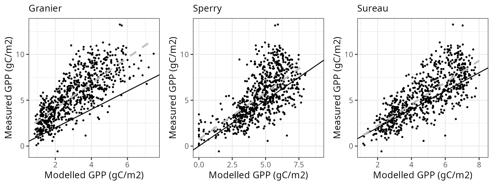

#### Soil water content (SWC.1)

    ## Error in data.frame(Dates = as.Date(d), Observed = NA, Modelled = sm[[var_mod]]): arguments imply differing number of rows: 0, 1

    ## Error in data.frame(..., check.names = FALSE): arguments imply differing number of rows: 4, 3

    ## Error: object 'df_all_SMC' not found

    ## Error: object 'df_all_SMC' not found

#### Transpiration per leaf area

| Site | Cohort | Mode | n | Bias | Bias.rel | MAE | MAE.rel | r | NSE | NSE.abs |
|:---|:---|:---|---:|---:|---:|---:|---:|---:|---:|---:|
| WOMBAT | T1_7431 | granier | 1035 | -0.1417501 | -34.78071 | 0.1507744 | 36.99499 | 0.9096005 | 0.4811424 | 0.2946822 |
| WOMBAT | T1_7431 | sperry | 1035 | -0.1389368 | -34.09043 | 0.1450798 | 35.59771 | 0.9291188 | 0.5612928 | 0.3213218 |
| WOMBAT | T1_7431 | sureau | 1035 | -0.1006258 | -24.69020 | 0.1482999 | 36.38783 | 0.9108201 | 0.5147453 | 0.3062578 |
| WOMBAT | T2_7526 | granier | 1035 | -0.1173446 | -25.93085 | 0.1439880 | 31.81853 | 0.9120013 | 0.6617901 | 0.4800668 |
| WOMBAT | T2_7526 | sperry | 1035 | -0.1703508 | -37.64420 | 0.1727077 | 38.16502 | 0.9442743 | 0.5867044 | 0.3763614 |
| WOMBAT | T2_7526 | sureau | 1035 | -0.1022853 | -22.60306 | 0.1425305 | 31.49645 | 0.9323598 | 0.7150339 | 0.4853297 |

## Euc-FACE

### General information

| Attribute | Value |
|:---|:---|
| Plot name | Euc-FACE |
| Country | Australia |
| SAPFLUXNET code | AUS_RIC_EUC_ELE |
| SAPFLUXNET contributor (affiliation) | Teresa Gimeno (CREAF) |
| FLUXNET/ICOS code | AU-Cum |
| FLUXNET/ICOS contributor (affiliation) | Elise Pendall (U. Western Sidney) |
| Latitude (º) | -33.61778 |
| Longitude (º) | 150.74028 |
| Elevation (m) | 23 |
| Slope (º) | 0 |
| Aspect (º) | 0 |
| Parent material |  |
| Soil texture | Sandy loam |
| MAT (ºC) | 17.6 |
| MAP (mm) | 899 |
| Forest stand | Eucalyptus trees in ambient (control) plots of a CO2 enrichment experiment |
| Stand LAI | 2 |
| Stand description DOI | 10.1111/1365-2435.12532 |
| Species simulated | Eucalyptus tereticornis |
| Species parameter table | SpParamsAU |
| Simulation period | 2012-2014 |
| Evaluation period | 2012-2014 |

### Model inputs

#### Vegetation

| Species                 | DBH | Height |   N | Z50 |  Z95 | LAI | Cover |
|:------------------------|----:|-------:|----:|----:|-----:|----:|------:|
| Eucalyptus tereticornis |  21 |   2200 | 800 | 200 | 3000 |   2 |    NA |
| Herbaceous layer        |  NA |     10 |  NA |  NA |   NA |  NA |    10 |

#### Soil

| widths |     clay |     sand |        om |       bd |       rfc | VG_theta_res | VG_theta_sat |
|-------:|---------:|---------:|----------:|---------:|----------:|-------------:|-------------:|
|    300 | 18.16667 | 61.86667 | 1.8700000 | 1.246667 |  6.566667 |         0.03 |          0.4 |
|    500 | 31.00000 | 52.46667 | 0.6566667 | 1.313333 | 20.000000 |         0.03 |          0.4 |
|    500 | 31.10000 | 52.73750 | 0.6912500 | 1.331250 | 20.000000 |         0.03 |          0.4 |
|   2700 | 30.60000 | 53.30000 | 0.5600000 | 1.350000 | 90.000000 |         0.03 |          0.4 |

#### Custom traits

| Species                 | Vmax298 | Jmax298 |    Al2As |
|:------------------------|--------:|--------:|---------:|
| Eucalyptus tereticornis |      91 |     159 | 6896.552 |

#### Custom control

||
||
||

#### Remarks

| Title | Remark |
|:---|:---|
| Soil | Taken from SoilGrids |
| Vegetation | No understory or secondary species considered. 10% Herbaceous cover |
| Weather | CO2 set to 390 ppm |
| Sapflow | Species-level Huber value used for scaling |
| Eddy covariance | Variables taken: LE_CORR and GPP_NT_VUT_REF |

### Macroclimate

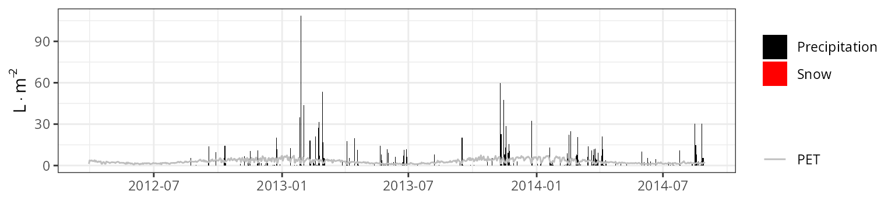

### Microclimate

### Runoff & deep drainage

### Evaluation results

#### Sensible heat turbulent flux

    ## Error in data.frame(Dates = as.Date(d), Observed = NA, Modelled = Hmod): arguments imply differing number of rows: 0, 1

    ## Error in data.frame(..., check.names = FALSE): arguments imply differing number of rows: 3, 2

    ## Error: object 'df_all_H' not found

    ## Error: object 'df_all_H' not found

#### Latent heat turbulent flux

    ## Error in data.frame(Dates = as.Date(d), Observed = NA, Modelled = LEmod): arguments imply differing number of rows: 0, 1

    ## Error in data.frame(..., check.names = FALSE): arguments imply differing number of rows: 3, 2

    ## Error: object 'df_all_LE' not found

    ## Error: object 'df_all_LE' not found

#### Gross primary productivity

    ## Error in rowSums(out$Plants$GrossPhotosynthesis): 'x' must be an array of at least two dimensions

    ## Error in data.frame(..., check.names = FALSE): arguments imply differing number of rows: 4, 3

    ## Error: object 'df_all_GPP' not found

    ## Error: object 'df_all_GPP' not found

#### Soil water content (SWC)

    ## Error in data.frame(Dates = as.Date(d), Observed = NA, Modelled = sm[[var_mod]]): arguments imply differing number of rows: 0, 1

    ## Error in data.frame(..., check.names = FALSE): arguments imply differing number of rows: 4, 3

    ## Error: object 'df_all_SMC' not found

    ## Error: object 'df_all_SMC' not found

#### Transpiration per leaf area

| Site | Cohort | Mode | n | Bias | Bias.rel | MAE | MAE.rel | r | NSE | NSE.abs |
|:---|:---|:---|---:|---:|---:|---:|---:|---:|---:|---:|
| EUCFACE | T1_7590 | granier | 708 | -0.3059868 | -47.08936 | 0.3179183 | 48.92554 | 0.7156483 | -0.7090373 | -0.4259406 |
| EUCFACE | T1_7590 | sperry | 708 | -0.1699725 | -26.15765 | 0.2011028 | 30.94840 | 0.7715523 | 0.1811446 | 0.0980053 |
| EUCFACE | T1_7590 | sureau | 708 | -0.1709932 | -26.31473 | 0.2502836 | 38.51700 | 0.6952598 | -0.1704686 | -0.1225826 |

#### Leaf water potential

    ## Error in if (df_site$Mode[[k]] != "granier") {: missing value where TRUE/FALSE needed

| Site | Cohort | WP | Mode | n | Bias | Bias.rel | MAE | MAE.rel | r | NSE | NSE.abs |
|:---|:---|:---|:---|---:|---:|---:|---:|---:|---:|---:|---:|
| EUCFACE | T1_7590 | Midday | sperry | 15 | 0.6268778 | 31.47533 | 0.7376916 | 37.03925 | 0.2071056 | -1.506711 | -0.5923862 |
| EUCFACE | T1_7590 | Midday | sureau | 15 | 0.8796616 | 44.16752 | 1.0785328 | 54.15278 | 0.0744972 | -3.932285 | -1.3281284 |
| EUCFACE | T1_7590 | Predawn | sperry | 8 | 0.1375796 | 21.37955 | 0.2778156 | 43.17188 | 0.3955593 | -1.394345 | -0.8812367 |
| EUCFACE | T1_7590 | Predawn | sureau | 8 | -0.2556126 | -39.72159 | 0.4358844 | 67.73540 | 0.1337131 | -9.443432 | -1.9516047 |

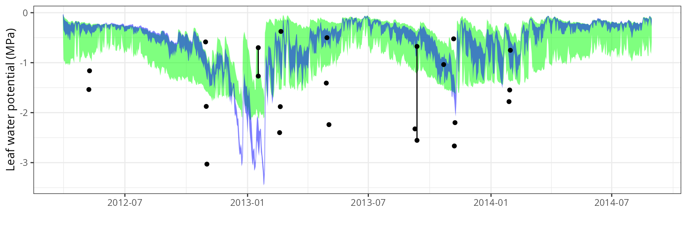

## Soroe

### General information

| Attribute | Value |
|:---|:---|
| Plot name | Soroe |
| Country | Denmark |
| SAPFLUXNET code |  |
| SAPFLUXNET contributor (affiliation) |  |
| FLUXNET/ICOS code | DK-Sor |
| FLUXNET/ICOS contributor (affiliation) | Andreas Ibrom (Technical University of Denmark) |
| Latitude (º) | 11.6446 |
| Longitude (º) | 55.4859 |
| Elevation (m) | 40 |
| Slope (º) | 0 |
| Aspect (º) | NA |
| Parent material |  |
| Soil texture |  |
| MAT (ºC) | 8.2 |
| MAP (mm) | 660 |
| Forest stand | European beech forest |
| Stand LAI | 4.5 |
| Stand description DOI | 10.1016/j.agrformet.2011.02.013 |
| Species simulated | Fagus sylvatica |
| Species parameter table | SpParamsFR |
| Simulation period | 2003-2006 |
| Evaluation period | 2003-2006 |

### Model inputs

#### Vegetation

| Species         |      DBH | Height |       N | Z50 | Z95 | LAI |
|:----------------|---------:|-------:|--------:|:----|:----|----:|
| Fagus sylvatica | 24.28232 |   2099 | 352.987 | NA  | NA  | 4.5 |

#### Soil

| widths |  clay |  sand |   om |   bd |  rfc |
|-------:|------:|------:|-----:|-----:|-----:|
|    400 | 15.27 | 58.73 | 5.42 | 1.28 | 7.48 |
|    200 | 19.20 | 55.70 | 2.18 | 1.58 | 6.10 |
|   3000 | 19.60 | 55.45 | 1.78 | 1.65 | 7.55 |

#### Custom traits

| Species         | Vmax298 | Jmax298 |
|:----------------|--------:|--------:|
| Fagus sylvatica |    94.5 |   159.9 |

#### Custom control

||
||
||

#### Remarks

| Title | Remark |
|:---|:---|
| Soil | Taken from SoilGrids |
| Vegetation | No understory |
| Weather | From V. saponaro |
| Sapflow | Not available |
| Soil moisture | Taken from FLUXNET |
| Eddy covariance | Variables H_F_MDS and LE_F_MDS for sensible and latent heat |

### Macroclimate

### Microclimate

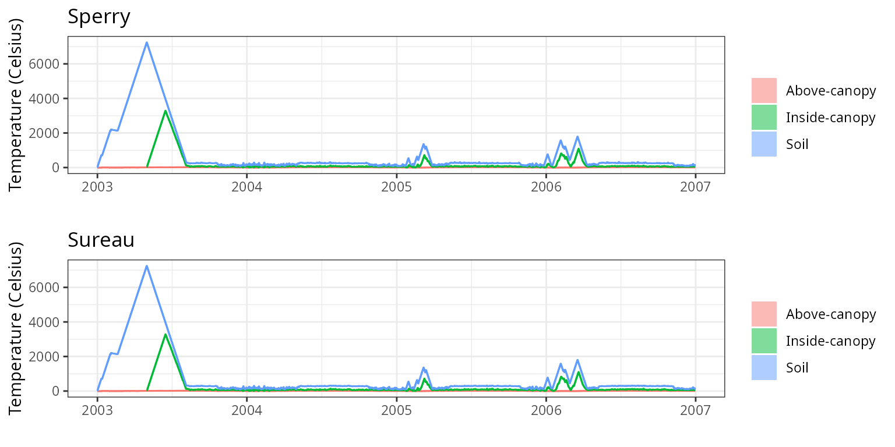

### Runoff & deep drainage

### Evaluation results

#### Sensible heat turbulent flux

    ## Error in data.frame(Dates = as.Date(d), Observed = NA, Modelled = Hmod): arguments imply differing number of rows: 0, 1

    ## Error in data.frame(..., check.names = FALSE): arguments imply differing number of rows: 3, 2

    ## Error: object 'df_all_H' not found

    ## Error: object 'df_all_H' not found

#### Latent heat turbulent flux

    ## Error in data.frame(Dates = as.Date(d), Observed = NA, Modelled = LEmod): arguments imply differing number of rows: 0, 1

    ## Error in data.frame(..., check.names = FALSE): arguments imply differing number of rows: 3, 2

    ## Error: object 'df_all_LE' not found

    ## Error: object 'df_all_LE' not found

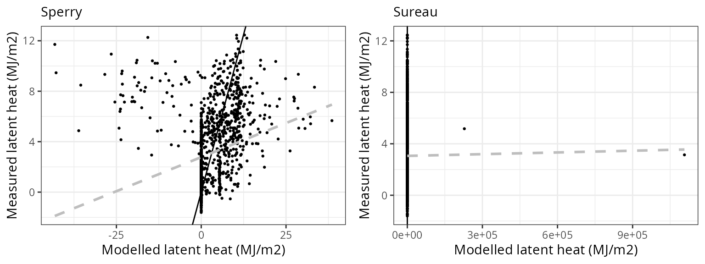

#### Gross primary productivity

    ## Error in rowSums(out$Plants$GrossPhotosynthesis): 'x' must be an array of at least two dimensions

    ## Error in data.frame(..., check.names = FALSE): arguments imply differing number of rows: 4, 3

    ## Error: object 'df_all_GPP' not found

    ## Error: object 'df_all_GPP' not found

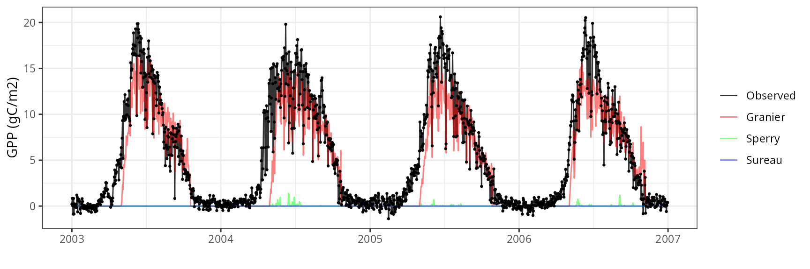

#### Soil water content (SWC)

    ## Error in data.frame(Dates = as.Date(d), Observed = NA, Modelled = sm[[var_mod]]): arguments imply differing number of rows: 0, 1

    ## Error in data.frame(..., check.names = FALSE): arguments imply differing number of rows: 4, 3

    ## Error: object 'df_all_SMC' not found

    ## Error: object 'df_all_SMC' not found

## Puéchabon

### General information

| Attribute | Value |
|:---|:---|
| Plot name | Puéchabon |
| Country | France |
| SAPFLUXNET code | FRA_PUE |
| SAPFLUXNET contributor (affiliation) | Jean-Marc Limousin (CEFE-CNRS) |
| FLUXNET/ICOS code | FR-Pue |
| FLUXNET/ICOS contributor (affiliation) | Jean-Marc Limousin (CEFE-CNRS) |
| Latitude (º) | 43.74 |
| Longitude (º) | 3.6 |
| Elevation (m) | 270 |
| Slope (º) | 0 |
| Aspect (º) | 0 |
| Parent material | Limestone |
| Soil texture | Silty clay loam |
| MAT (ºC) | 13.4 |
| MAP (mm) | 720 |
| Forest stand | Dense evergreen forest dominated by Q. ilex |
| Stand LAI | 2 |
| Stand description DOI | 10.1111/j.1365-2486.2009.01852.x |
| Species simulated | Quercus ilex, Buxus sempervirens |
| Species parameter table | SpParamsFR |
| Simulation period | 2004-2006 |
| Evaluation period | 2004-2006 |

### Model inputs

#### Vegetation

| Species            |    DBH |   Height |    N | Z50 |  Z95 | LAI | Cover |
|:-------------------|-------:|---------:|-----:|----:|-----:|----:|------:|
| Quercus ilex       | 9.1156 | 530.2222 | 1750 | 529 | 2287 | 2.0 |    NA |
| Buxus sempervirens |     NA | 200.0000 |   NA | 390 | 1470 | 0.2 |    13 |
| Herbaceous layer   |     NA |  20.0000 |   NA |  NA |   NA |  NA |    10 |

#### Soil

| widths | clay | sand |  om |   bd | rfc | VG_theta_sat | VG_theta_res |
|-------:|-----:|-----:|----:|-----:|----:|-------------:|-------------:|
|    100 |   39 |   26 |   6 | 1.45 |  75 |         0.27 |        0.015 |
|    200 |   39 |   26 |   4 | 1.45 |  75 |         0.27 |        0.015 |
|    200 |   39 |   26 |   3 | 1.45 |  75 |         0.27 |        0.015 |
|   1500 |   39 |   26 |   1 | 1.45 |  80 |         0.27 |        0.015 |
|   2500 |   39 |   26 |   1 | 1.45 |  90 |         0.27 |        0.015 |

#### Custom traits

| Species | SLA | VCleaf_P12 | VCleaf_P50 | VCleaf_P88 | VCleaf_slope | VCstem_P12 | VCstem_P50 | VCstem_P88 | VCstem_slope | VCroot_P12 | VCroot_P50 | VCroot_P88 | VCroot_slope | VCleaf_kmax | Kmax_stemxylem | LeafEPS | LeafPI0 | LeafAF | StemEPS | StemPI0 | StemAF | Gswmin | Gswmax | Gs_P50 | Gs_slope | Al2As |
|:---|---:|---:|---:|---:|---:|---:|---:|---:|---:|---:|---:|---:|---:|---:|---:|---:|---:|---:|---:|---:|---:|---:|---:|---:|---:|---:|
| Quercus ilex | 4.55 | -4.004731 | -5.25 | -6.495269 | 40 | -4.739642 | -6.4 | -8.060358 | 30 | -2.004731 | -3.25 | -4.495269 | 40 | 2.63 | 0.20 | 15 | -2.5 | 0.4 | 15 | -2.5 | 0.4 | 0.002 | 0.20 | -2.114188 | 44.70588 | 1540.671 |
| Buxus sempervirens | 5.19 | -5.004731 | -6.25 | -7.495269 | 40 | NA | NA | NA | NA | NA | NA | NA | NA | 2.00 | 0.15 | NA | NA | NA | NA | NA | NA | 0.002 | 0.18 | NA | NA | NA |

#### Custom control

||
||
||

#### Remarks

| Title      | Remark                              |
|:-----------|:------------------------------------|
| Soil       | Adjusted theta_res and theta_sat    |
| Vegetation | Using B. sempervirens as understory |

### Macroclimate

### Microclimate

### Runoff & deep drainage

### Evaluation results

#### Sensible heat turbulent flux

    ## Error in data.frame(Dates = as.Date(d), Observed = NA, Modelled = Hmod): arguments imply differing number of rows: 0, 1

    ## Error in data.frame(..., check.names = FALSE): arguments imply differing number of rows: 3, 2

    ## Error: object 'df_all_H' not found

    ## Error: object 'df_all_H' not found

#### Latent heat turbulent flux

    ## Error in data.frame(Dates = as.Date(d), Observed = NA, Modelled = LEmod): arguments imply differing number of rows: 0, 1

    ## Error in data.frame(..., check.names = FALSE): arguments imply differing number of rows: 3, 2

    ## Error: object 'df_all_LE' not found

    ## Error: object 'df_all_LE' not found

#### Gross primary productivity

    ## Error in rowSums(out$Plants$GrossPhotosynthesis): 'x' must be an array of at least two dimensions

    ## Error in data.frame(..., check.names = FALSE): arguments imply differing number of rows: 4, 3

    ## Error: object 'df_all_GPP' not found

    ## Error: object 'df_all_GPP' not found

#### Soil water content (SWC.2)

    ## Error in data.frame(Dates = as.Date(d), Observed = NA, Modelled = sm[[var_mod]]): arguments imply differing number of rows: 0, 1

    ## Error in data.frame(..., check.names = FALSE): arguments imply differing number of rows: 4, 3

    ## Error: object 'df_all_SMC' not found

    ## Error: object 'df_all_SMC' not found

#### Transpiration per leaf area

| Site | Cohort | Mode | n | Bias | Bias.rel | MAE | MAE.rel | r | NSE | NSE.abs |
|:---|:---|:---|---:|---:|---:|---:|---:|---:|---:|---:|
| FRAPUE | T1_2854 | granier | 1096 | -0.0818435 | -23.85896 | 0.1257926 | 36.67098 | 0.7740577 | 0.4531214 | 0.3050664 |
| FRAPUE | T1_2854 | sperry | 1096 | -0.0438887 | -12.79441 | 0.2810124 | 81.92054 | 0.2335627 | -2.0042843 | -0.5524357 |
| FRAPUE | T1_2854 | sureau | 1096 | -0.0645240 | -18.80999 | 0.1347261 | 39.27524 | 0.7959383 | 0.3627556 | 0.2557143 |

#### Leaf water potential

    ## Error in if (df_site$Mode[[k]] != "granier") {: missing value where TRUE/FALSE needed

| Site | Cohort | WP | Mode | n | Bias | Bias.rel | MAE | MAE.rel | r | NSE | NSE.abs |
|:---|:---|:---|:---|---:|---:|---:|---:|---:|---:|---:|---:|
| FRAPUE | T1_2854 | Midday | sperry | 14 | -0.7607598 | -25.36243 | 1.0579453 | 35.27009 | 0.1576664 | -3.5406235 | -1.1957091 |
| FRAPUE | T1_2854 | Midday | sureau | 28 | 0.4383139 | 14.04752 | 0.8599314 | 27.55993 | 0.6541764 | -0.9622805 | -0.4403996 |
| FRAPUE | T1_2854 | Predawn | sperry | 14 | -1.5965810 | -136.03429 | 1.6164152 | 137.72423 | 0.4569802 | -3.7935507 | -0.9391046 |
| FRAPUE | T1_2854 | Predawn | sureau | 28 | -0.5971095 | -40.82177 | 0.8364286 | 57.18297 | 0.7530155 | 0.2119242 | 0.1203657 |

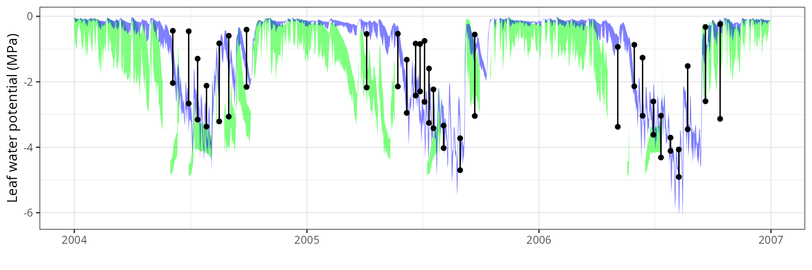

## Hesse

### General information

| Attribute | Value |
|:---|:---|
| Plot name | Hesse |
| Country | France |
| SAPFLUXNET code | FRA_HES_HE2_NON |
| SAPFLUXNET contributor (affiliation) | André Granier (INRAE) |
| FLUXNET/ICOS code | FR-Hes |
| FLUXNET/ICOS contributor (affiliation) | Matthias Cuntz (INRAE) |
| Latitude (º) | 48.6742 |
| Longitude (º) | 7.0647 |
| Elevation (m) | 300 |
| Slope (º) | 0 |
| Aspect (º) | 0 |
| Parent material |  |
| Soil texture | Silt loam |
| MAT (ºC) | 10 |
| MAP (mm) | 1003 |
| Forest stand | Naturally regenerated, managed beech forest |
| Stand LAI | 7 |
| Stand description DOI | 10.1051/forest:2008052 |
| Species simulated | Fagus sylvatica |
| Species parameter table | SpParamsFR |
| Simulation period | 2001-2003 |
| Evaluation period | 2001-2003 |

### Model inputs

#### Vegetation

| Species          |   DBH | Height |    N | Z50 |  Z95 | LAI | Cover |
|:-----------------|------:|-------:|-----:|----:|-----:|----:|------:|
| Fagus sylvatica  | 12.91 |   1300 | 3203 | 300 | 1200 |   7 |    NA |
| Herbaceous layer |    NA |     20 |   NA |  NA |   NA |  NA |     5 |

#### Soil

| widths | sand | clay |  om | rfc |   bd | VG_theta_sat |
|-------:|-----:|-----:|----:|----:|-----:|-------------:|
|    200 |    8 |   25 |   6 |   9 | 1.16 |         0.46 |
|    300 |    8 |   35 |   3 |  13 | 1.37 |         0.43 |
|    300 |    8 |   45 |   1 |  15 | 1.58 |         0.38 |
|    400 |    8 |   45 |   0 |  40 | 1.58 |         0.35 |
|   2100 |    8 |   45 |   0 |  90 | 1.58 |         0.30 |

#### Custom traits

| Species         |   Al2As |
|:----------------|--------:|
| Fagus sylvatica | 2076.12 |

#### Custom control

||
||
||

#### Remarks

| Title      | Remark                                      |
|:-----------|:--------------------------------------------|
| Soil       | VG_theta_sat modified                       |
| Vegetation | No woody understory but 5% herbaceous layer |
| Sapflow    | Scaling using species-level Huber value     |

### Macroclimate

### Microclimate

### Runoff & deep drainage

### Evaluation results

#### Sensible heat turbulent flux

    ## Error in data.frame(Dates = as.Date(d), Observed = NA, Modelled = Hmod): arguments imply differing number of rows: 0, 1

    ## Error in data.frame(..., check.names = FALSE): arguments imply differing number of rows: 3, 2

    ## Error: object 'df_all_H' not found

    ## Error: object 'df_all_H' not found

#### Latent heat turbulent flux

    ## Error in data.frame(Dates = as.Date(d), Observed = NA, Modelled = LEmod): arguments imply differing number of rows: 0, 1

    ## Error in data.frame(..., check.names = FALSE): arguments imply differing number of rows: 3, 2

    ## Error: object 'df_all_LE' not found

    ## Error: object 'df_all_LE' not found

#### Soil water content (SWC.1)

    ## Error in data.frame(Dates = as.Date(d), Observed = NA, Modelled = sm[[var_mod]]): arguments imply differing number of rows: 0, 1

    ## Error in data.frame(..., check.names = FALSE): arguments imply differing number of rows: 4, 3

    ## Error: object 'df_all_SMC' not found

    ## Error: object 'df_all_SMC' not found

#### Soil water content (SWC.2)

    ## Error in data.frame(Dates = as.Date(d), Observed = NA, Modelled = sm[[var_mod]]): arguments imply differing number of rows: 0, 1

    ## Error in data.frame(..., check.names = FALSE): arguments imply differing number of rows: 4, 3

    ## Error: object 'df_all_SMC' not found

    ## Error: object 'df_all_SMC' not found

#### Soil water content (SWC.3)

    ## Error in data.frame(Dates = as.Date(d), Observed = NA, Modelled = sm[[var_mod]]): arguments imply differing number of rows: 0, 1

    ## Error in data.frame(..., check.names = FALSE): arguments imply differing number of rows: 4, 3

    ## Error: object 'df_all_SMC' not found

    ## Error: object 'df_all_SMC' not found

#### Soil water content (SWC.4)

    ## Error in data.frame(Dates = as.Date(d), Observed = NA, Modelled = sm[[var_mod]]): arguments imply differing number of rows: 0, 1

    ## Error in data.frame(..., check.names = FALSE): arguments imply differing number of rows: 4, 3

    ## Error: object 'df_all_SMC' not found

    ## Error: object 'df_all_SMC' not found

#### Soil water content (SWC.5)

    ## Error in data.frame(Dates = as.Date(d), Observed = NA, Modelled = sm[[var_mod]]): arguments imply differing number of rows: 0, 1

    ## Error in data.frame(..., check.names = FALSE): arguments imply differing number of rows: 4, 3

    ## Error: object 'df_all_SMC' not found

    ## Error: object 'df_all_SMC' not found

#### Transpiration per leaf area

| Site | Cohort | Mode | n | Bias | Bias.rel | MAE | MAE.rel | r | NSE | NSE.abs |
|:---|:---|:---|---:|---:|---:|---:|---:|---:|---:|---:|
| FRAHES | T1_1396 | granier | 559 | -0.2117071 | -41.84626 | 0.2736146 | 54.08296 | 0.7249868 | 0.0798059 | 0.1572628 |
| FRAHES | T1_1396 | sperry | 559 | -0.5059165 | -100.00000 | 0.5059165 | 100.00000 | NA | -1.7363005 | -0.5582304 |
| FRAHES | T1_1396 | sureau | 559 | -0.5059165 | -100.00000 | 0.5059165 | 100.00000 | NA | -1.7363005 | -0.5582304 |

## Fontainebleau-Barbeau

### General information

| Attribute | Value |
|:---|:---|
| Plot name | Fontainebleau-Barbeau |
| Country | France |
| SAPFLUXNET code | FRA_FON |
| SAPFLUXNET contributor (affiliation) | Nicolas Delpierre (Univ. Paris-Sud) |
| FLUXNET/ICOS code | FR-Fon |
| FLUXNET/ICOS contributor (affiliation) | Nicolas Delpierre (Univ. Paris-Sud) |
| Latitude (º) | 48.47634 |
| Longitude (º) | 2.78014 |
| Elevation (m) | 105 |
| Slope (º) | 0 |
| Aspect (º) | 0 |
| Parent material | Millstone |
| Soil texture | Loam |
| MAT (ºC) | 11.2 |
| MAP (mm) | 697 |
| Forest stand | Mixed deciduous forest |
| Stand LAI | 6 |
| Stand description DOI | 10.1111/nph.13771 |
| Species simulated | Quercus petraea, Carpinus betulus |
| Species parameter table | SpParamsFR |
| Simulation period | 2006-2008 |
| Evaluation period | 2006-2008 |

### Model inputs

#### Vegetation

| Species          | DBH | Height |     N | Z50 | Z95 |  LAI |
|:-----------------|----:|-------:|------:|:----|:----|-----:|
| Quercus petraea  |  33 |   2800 | 220.8 | NA  | NA  | 4.74 |
| Carpinus betulus |  10 |    500 | 883.2 | NA  | NA  | 1.26 |

#### Soil

| widths |     clay |     sand |        om |       bd |      rfc |
|-------:|---------:|---------:|----------:|---------:|---------:|
|    300 | 24.13333 | 26.56667 | 3.6733330 | 1.286667 | 14.43333 |
|    600 | 30.48571 | 25.22857 | 0.6228571 | 1.504286 | 15.54286 |
|   1100 | 30.20000 | 25.64000 | 0.4720000 | 1.518000 | 80.00000 |
|   2500 | 29.90000 | 25.80000 | 0.4500000 | 1.520000 | 90.00000 |

#### Custom traits

| Species          |    Al2As |
|:-----------------|---------:|
| Quercus petraea  | 1075.267 |
| Carpinus betulus | 1075.267 |

#### Custom control

||
||
||

#### Remarks

| Title | Remark |
|:---|:---|
| Soil | Taken from SoilGrids with theta_sat and theta_res modified |
| Vegetation | Plantation |
| Weather | From fluxnet data |
| Sapflow | Sapwood area estimated from dbh for trees within missing data |
| Eddy covariance | Variables H_F_MDS and LE_F_MDS for sensible and latent heat |

### Macroclimate

### Microclimate

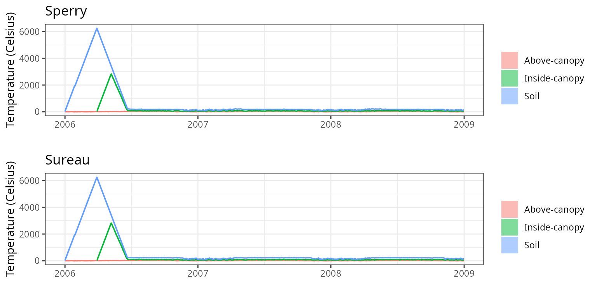

### Runoff & deep drainage

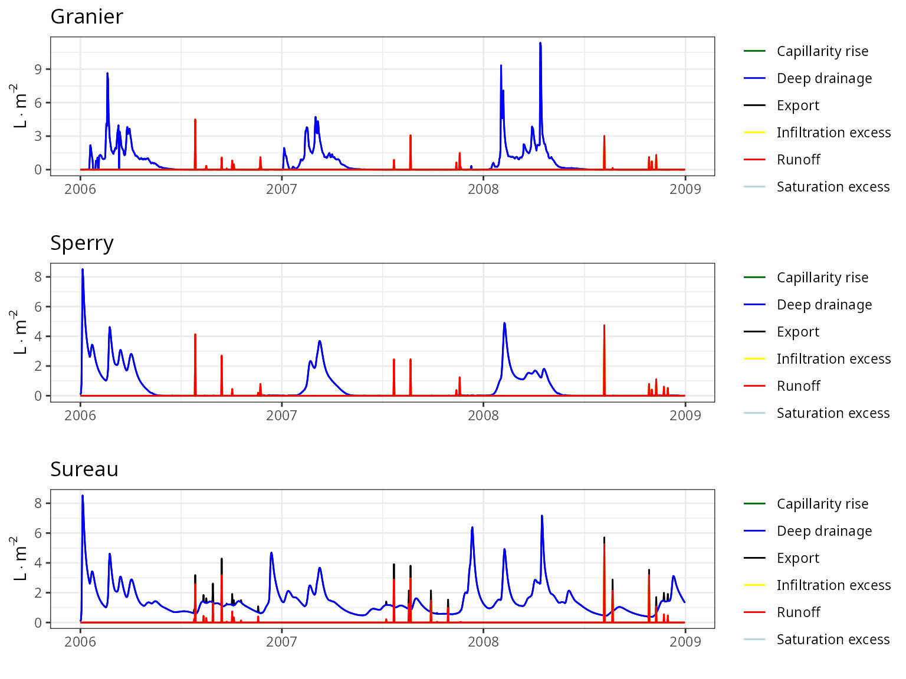

### Evaluation results

#### Sensible heat turbulent flux

    ## Error in data.frame(Dates = as.Date(d), Observed = NA, Modelled = Hmod): arguments imply differing number of rows: 0, 1

    ## Error in data.frame(..., check.names = FALSE): arguments imply differing number of rows: 3, 2

    ## Error: object 'df_all_H' not found

    ## Error: object 'df_all_H' not found

#### Latent heat turbulent flux

    ## Error in data.frame(Dates = as.Date(d), Observed = NA, Modelled = LEmod): arguments imply differing number of rows: 0, 1

    ## Error in data.frame(..., check.names = FALSE): arguments imply differing number of rows: 3, 2

    ## Error: object 'df_all_LE' not found

    ## Error: object 'df_all_LE' not found

#### Gross primary productivity

    ## Error in rowSums(out$Plants$GrossPhotosynthesis): 'x' must be an array of at least two dimensions

    ## Error in data.frame(..., check.names = FALSE): arguments imply differing number of rows: 4, 3

    ## Error: object 'df_all_GPP' not found

    ## Error: object 'df_all_GPP' not found

#### Transpiration per leaf area

| Site | Cohort | Mode | n | Bias | Bias.rel | MAE | MAE.rel | r | NSE | NSE.abs |
|:---|:---|:---|---:|---:|---:|---:|---:|---:|---:|---:|
| FONTAINEBLEAU | T1_2856 | granier | 740 | -0.2458481 | -50.864246 | 0.2473650 | 51.17808 | 0.8749491 | 8.756470e-02 | 0.1251816 |
| FONTAINEBLEAU | T1_2856 | sperry | 740 | -0.4111060 | -85.054929 | 0.4270885 | 88.36159 | 0.1713097 | -1.711092e+00 | -0.5104191 |
| FONTAINEBLEAU | T1_2856 | sureau | 740 | 90.6532317 | 18755.514694 | 91.6193594 | 18955.39970 | -0.0458421 | -4.950048e+07 | -323.0163149 |
| FONTAINEBLEAU | T2_730 | granier | 732 | -0.0132565 | -8.289367 | 0.0443122 | 27.70868 | 0.8441996 | 6.982369e-01 | 0.5276194 |
| FONTAINEBLEAU | T2_730 | sperry | 732 | 0.7195601 | 449.944719 | 0.7289074 | 455.78959 | 0.3603320 | -9.385169e+01 | -6.7703513 |
| FONTAINEBLEAU | T2_730 | sureau | 732 | -0.1599219 | -100.000000 | 0.1599219 | 100.00000 | NA | -2.027473e+00 | -0.7048110 |

## Font-Blanche

### General information

| Attribute | Value |
|:---|:---|
| Plot name | Font-Blanche |
| Country | France |
| SAPFLUXNET code |  |
| SAPFLUXNET contributor (affiliation) |  |
| FLUXNET/ICOS code | FR-Fbn |
| FLUXNET/ICOS contributor (affiliation) | Nicolas Martin-StPaul (INRAE) |
| Latitude (º) | 43.24 |
| Longitude (º) | 5.68 |
| Elevation (m) | 420 |
| Slope (º) | 0 |
| Aspect (º) | 0 |
| Parent material | Cretaceous limestone |
| Soil texture | Clay loam |
| MAT (ºC) | 13.5 |
| MAP (mm) | 722 |
| Forest stand | Mixed forest with P. halepensis and Q. ilex |
| Stand LAI | 2 |
| Stand description DOI | 10.1016/j.agrformet.2021.108472 |
| Species simulated | Quercus ilex, Pinus halepensis, Phillyrea latifolia |
| Species parameter table | SpParamsFR |
| Simulation period | 2014-2018 |
| Evaluation period | 2014-2018 |

### Model inputs

#### Vegetation

| Species             |       DBH |    Height |    N | Z50 |  Z95 |       LAI | Cover |
|:--------------------|----------:|----------:|-----:|----:|-----:|----------:|------:|
| Phillyrea latifolia |  2.587859 |  323.0000 | 1248 | 390 | 1470 | 0.0000000 |    NA |
| Pinus halepensis    | 26.759914 | 1195.7667 |  256 | 300 | 1200 | 0.9843761 |    NA |
| Quercus ilex        |  6.220031 |  495.5532 | 3104 | 500 | 2287 | 1.7156239 |    NA |
| Herbaceous layer    |        NA |   10.0000 |   NA |  NA |   NA |        NA |     5 |

#### Soil

| widths | clay | sand |  om |   bd | rfc |
|-------:|-----:|-----:|----:|-----:|----:|
|    300 |   39 |   26 |   6 | 1.45 |  50 |
|    700 |   39 |   26 |   3 | 1.45 |  65 |
|   1000 |   39 |   26 |   1 | 1.45 |  90 |
|   2500 |   39 |   26 |   1 | 1.45 |  95 |

#### Custom traits

| Species | VCstem_P12 | VCstem_P50 | VCstem_P88 | VCstem_slope | VCroot_P12 | VCroot_P50 | VCroot_P88 | VCleaf_kmax | LeafEPS | LeafPI0 | LeafAF | StemEPS | StemPI0 | StemAF | Gswmin | Gswmax | Gs_P50 | Gs_slope | Al2As |
|:---|---:|---:|---:|---:|---:|---:|---:|---:|---:|---:|---:|---:|---:|---:|---:|---:|---:|---:|---:|
| Phillyrea latifolia | -1.971750 | -6.50 | -11.028250 | 11 | NA | NA | NA | 3.00 | 12.38 | -2.13 | 0.5 | 12.38 | -2.13 | 0.4 | 0.002 | 0.2200 | -2.207094 | 89.41176 | NA |
| Pinus halepensis | -3.707158 | -4.79 | -5.872842 | 46 | -1 | -1.741565 | -2.301482 | 4.00 | 5.31 | -1.50 | 0.6 | 5.00 | -1.65 | 0.4 | 0.001 | 0.2175 | -1.871216 | 97.43590 | 631.000 |
| Quercus ilex | -4.739642 | -6.40 | -8.060358 | 30 | NA | NA | NA | 2.63 | 15.00 | -2.50 | 0.4 | 15.00 | -2.50 | 0.4 | 0.002 | 0.2200 | -2.114188 | 44.70588 | 1540.671 |

#### Custom control

||
||
||

#### Remarks

| Title      | Remark                        |
|:-----------|:------------------------------|
| Soil       | Equal to Puechabon            |
| Vegetation |                               |
| Weather    | Missing values for some dates |

### Macroclimate

### Microclimate

### Runoff & deep drainage

### Evaluation results

#### Sensible heat turbulent flux

    ## Error in data.frame(Dates = as.Date(d), Observed = NA, Modelled = Hmod): arguments imply differing number of rows: 0, 1

    ## Error in data.frame(..., check.names = FALSE): arguments imply differing number of rows: 3, 2

    ## Error: object 'df_all_H' not found

    ## Error: object 'df_all_H' not found

#### Latent heat turbulent flux

    ## Error in data.frame(Dates = as.Date(d), Observed = NA, Modelled = LEmod): arguments imply differing number of rows: 0, 1

    ## Error in data.frame(..., check.names = FALSE): arguments imply differing number of rows: 3, 2

    ## Error: object 'df_all_LE' not found

    ## Error: object 'df_all_LE' not found

#### Soil water content (SWC)

    ## Error in data.frame(Dates = as.Date(d), Observed = NA, Modelled = sm[[var_mod]]): arguments imply differing number of rows: 0, 1

    ## Error in data.frame(..., check.names = FALSE): arguments imply differing number of rows: 4, 3

    ## Error: object 'df_all_SMC' not found

    ## Error: object 'df_all_SMC' not found

#### Transpiration per leaf area

| Site | Cohort | Mode | n | Bias | Bias.rel | MAE | MAE.rel | r | NSE | NSE.abs |
|:---|:---|:---|---:|---:|---:|---:|---:|---:|---:|---:|
| FONBLA | T2_2631 | granier | 300 | 0.1666387 | 81.021726 | 0.1842212 | 89.57056 | 0.5172616 | -3.8339740 | -0.8616505 |
| FONBLA | T2_2631 | sperry | 300 | -0.0033812 | -1.643974 | 0.0704962 | 34.27607 | 0.7864860 | 0.3817768 | 0.2876000 |
| FONBLA | T2_2631 | sureau | 300 | 0.1571105 | 76.388989 | 0.2143290 | 104.20929 | 0.4403794 | -7.8039064 | -1.1659045 |
| FONBLA | T3_2854 | granier | 309 | -0.0163691 | -5.655087 | 0.0584433 | 20.19056 | 0.8998449 | 0.8004192 | 0.6018379 |
| FONBLA | T3_2854 | sperry | 309 | 0.1473393 | 50.901664 | 0.1711797 | 59.13788 | 0.9067961 | -0.4719543 | -0.1662112 |
| FONBLA | T3_2854 | sureau | 309 | -0.0030396 | -1.050108 | 0.0774652 | 26.76212 | 0.8943981 | 0.6323699 | 0.4722456 |

#### Leaf water potential

    ## Error in if (df_site$Mode[[k]] != "granier") {: missing value where TRUE/FALSE needed

| Site | Cohort | WP | Mode | n | Bias | Bias.rel | MAE | MAE.rel | r | NSE | NSE.abs |
|:---|:---|:---|:---|---:|---:|---:|---:|---:|---:|---:|---:|
| FONBLA | T2_2631 | Midday | sperry | 3 | 0.4784493 | 17.9343749 | 0.5173967 | 19.39429 | 0.9927048 | -6.5953079 | -1.7662792 |
| FONBLA | T2_2631 | Midday | sureau | 3 | 0.3546824 | 13.2950520 | 0.4872948 | 18.26594 | 0.9910873 | -4.7359338 | -1.6053386 |
| FONBLA | T2_2631 | Predawn | sperry | 3 | 0.1609549 | 8.2753153 | 0.5199023 | 26.73019 | 0.9766495 | -0.4778994 | -0.4622251 |
| FONBLA | T2_2631 | Predawn | sureau | 3 | -0.0480019 | -2.4679641 | 0.3789449 | 19.48303 | 0.9953903 | -0.0815382 | -0.0657826 |
| FONBLA | T3_2854 | Midday | sperry | 3 | 0.0119589 | 0.4382317 | 0.3800231 | 13.92593 | 0.9484634 | -0.0685059 | -0.1739844 |
| FONBLA | T3_2854 | Midday | sureau | 3 | 0.5025246 | 18.4149881 | 0.5629994 | 20.63109 | 0.9939351 | -2.0328857 | -0.7392431 |
| FONBLA | T3_2854 | Predawn | sperry | 3 | -0.2155732 | -14.2032101 | 0.2639521 | 17.39069 | 0.9938450 | 0.4478595 | 0.4036230 |
| FONBLA | T3_2854 | Predawn | sureau | 3 | -0.4181692 | -27.5514126 | 0.4495545 | 29.61926 | 0.9996811 | -0.2713647 | -0.0157298 |

## Collelongo

### General information

| Attribute                              | Value                              |
|:---------------------------------------|:-----------------------------------|
| Plot name                              | Collelongo                         |
| Country                                | Italy                              |
| SAPFLUXNET code                        |                                    |
| SAPFLUXNET contributor (affiliation)   |                                    |
| FLUXNET/ICOS code                      | IT-Col                             |
| FLUXNET/ICOS contributor (affiliation) | Giorgio Matteucci (IEIF CNR)       |
| Latitude (º)                           | 13.5881                            |
| Longitude (º)                          | 41.8494                            |
| Elevation (m)                          | 1560                               |
| Slope (º)                              | 19.29                              |
| Aspect (º)                             | 252                                |
| Parent material                        | Calcareous                         |
| Soil texture                           | Silt loam                          |
| MAT (ºC)                               | 6.3                                |
| MAP (mm)                               | 1180                               |
| Forest stand                           | European beech forest              |
| Stand LAI                              | 5.5                                |
| Stand description DOI                  | 10.1111/j.1365-2486.1996.tb00072.x |
| Species simulated                      | Fagus sylvatica                    |
| Species parameter table                | SpParamsFR                         |
| Simulation period                      | 2011-2013                          |
| Evaluation period                      | 2011-2013                          |

### Model inputs

#### Vegetation

| Species         |  DBH | Height |        N | Z50 | Z95 | LAI |  CR |
|:----------------|-----:|-------:|---------:|:----|:----|----:|----:|
| Fagus sylvatica | 20.2 | 1898.9 | 899.9668 | NA  | NA  | 5.5 | 0.5 |

#### Soil

| widths |     clay |  sand |    om |   bd |  rfc |
|-------:|---------:|------:|------:|-----:|-----:|
|    300 | 27.23333 | 32.50 | 3.000 | 1.37 | 17.4 |
|    700 | 30.90000 | 32.15 | 1.955 | 1.37 | 20.9 |
|   2000 | 31.20000 | 33.70 | 1.430 | 1.44 | 22.8 |

#### Custom traits

| Species         | Vmax298 | Jmax298 |
|:----------------|--------:|--------:|
| Fagus sylvatica |    94.5 |   159.9 |

#### Custom control

| freeDrainage |
|:-------------|
| FALSE        |

#### Remarks

| Title | Remark |
|:---|:---|
| Soil | Taken from SoilGrids |
| Vegetation | No understory |
| Weather | From V. saponaro |
| Sapflow | Not available |
| Eddy covariance | Variables H_F_MDS and LE_F_MDS for sensible and latent heat |

### Macroclimate

### Microclimate

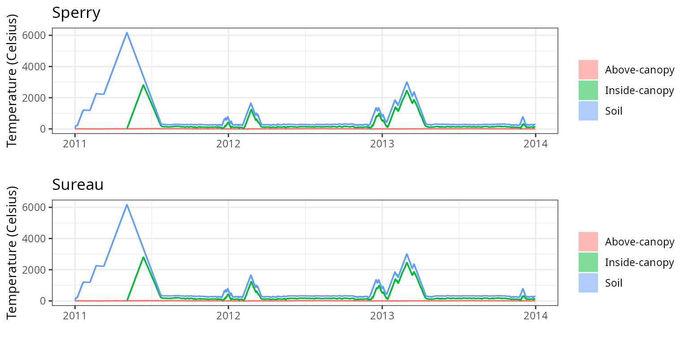

### Runoff & deep drainage

### Evaluation results

#### Sensible heat turbulent flux

    ## Error in data.frame(Dates = as.Date(d), Observed = NA, Modelled = Hmod): arguments imply differing number of rows: 0, 1

    ## Error in data.frame(..., check.names = FALSE): arguments imply differing number of rows: 3, 2

    ## Error: object 'df_all_H' not found

    ## Error: object 'df_all_H' not found

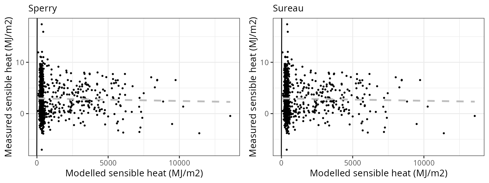

#### Latent heat turbulent flux

    ## Error in data.frame(Dates = as.Date(d), Observed = NA, Modelled = LEmod): arguments imply differing number of rows: 0, 1

    ## Error in data.frame(..., check.names = FALSE): arguments imply differing number of rows: 3, 2

    ## Error: object 'df_all_LE' not found

    ## Error: object 'df_all_LE' not found

#### Gross primary productivity

    ## Error in rowSums(out$Plants$GrossPhotosynthesis): 'x' must be an array of at least two dimensions

    ## Error in data.frame(..., check.names = FALSE): arguments imply differing number of rows: 4, 3

    ## Error: object 'df_all_GPP' not found

    ## Error: object 'df_all_GPP' not found

#### Soil water content (SWC)

    ## Error in data.frame(Dates = as.Date(d), Observed = NA, Modelled = sm[[var_mod]]): arguments imply differing number of rows: 0, 1

    ## Error in data.frame(..., check.names = FALSE): arguments imply differing number of rows: 4, 3

    ## Error: object 'df_all_SMC' not found

    ## Error: object 'df_all_SMC' not found

## Mitra

### General information

| Attribute | Value |
|:---|:---|
| Plot name | Mitra II |
| Country | Portugal |
| SAPFLUXNET code | PRT_MIT |
| SAPFLUXNET contributor (affiliation) | Teresa David (INIAV IP) |
| FLUXNET/ICOS code | PT-Mi1 |
| FLUXNET/ICOS contributor (affiliation) | Joao Santos Pereira |
| Latitude (º) | 38.54056 |
| Longitude (º) | -8.00028 |
| Elevation (m) | 235 |
| Slope (º) | 0 |
| Aspect (º) | 0 |
| Parent material | Granite |
| Soil texture | Sand |
| MAT (ºC) | 16.5 |
| MAP (mm) | 584 |
| Forest stand | Evergreen forest dominated by Quercus ilex subsp. rotundifolia |
| Stand LAI | 0.55 (trees) |
| Stand description DOI | 10.1093/treephys/27.6.793 |
| Species simulated | Quercus ilex |
| Species parameter table | SpParamsES |
| Simulation period | 2001-2003 |
| Evaluation period | 2001-2003 |

### Model inputs

#### Vegetation

| Species          |  DBH | Height |   N | Z50 |  Z95 |  LAI | Cover |
|:-----------------|-----:|-------:|----:|----:|-----:|-----:|------:|
| Quercus ilex     | 38.9 |    750 |  30 | 529 | 2287 | 0.55 |    NA |
| Herbaceous layer |   NA |     15 |  NA |  NA |   NA |   NA |   100 |

#### Soil

| widths |     clay | sand |   om |       bd |      rfc |
|-------:|---------:|-----:|-----:|---------:|---------:|
|    300 | 14.86667 | 58.4 | 2.92 | 1.463333 | 20.46667 |
|    700 | 15.05000 | 63.8 | 1.10 | 1.535000 | 21.65000 |
|   1000 | 14.70000 | 64.1 | 0.87 | 1.550000 | 80.00000 |
|   2000 | 14.70000 | 64.1 | 0.00 | 1.550000 | 90.00000 |

#### Custom traits

| Species | SLA | VCleaf_P12 | VCleaf_P50 | VCleaf_P88 | VCleaf_slope | VCstem_P12 | VCstem_P50 | VCstem_P88 | VCstem_slope | VCroot_P12 | VCroot_P50 | VCroot_P88 | VCroot_slope | VCleaf_kmax | Kmax_stemxylem | LeafEPS | LeafPI0 | LeafAF | StemEPS | StemPI0 | StemAF | Gswmin | Gswmax | Gs_P50 | Gs_slope | Al2As |
|:---|---:|---:|---:|---:|---:|---:|---:|---:|---:|---:|---:|---:|---:|---:|---:|---:|---:|---:|---:|---:|---:|---:|---:|---:|---:|---:|
| Quercus ilex | 4.55 | -4.004731 | -5.25 | -6.495269 | 40 | -4.739642 | -6.4 | -8.060358 | 30 | -2.004731 | -3.25 | -4.495269 | 40 | 2.63 | 0.2 | 15 | -2.5 | 0.4 | 15 | -2.5 | 0.4 | 0.002 | 0.2 | -2.114188 | 44.70588 | 1540.671 |

#### Custom control

||
||
||

#### Remarks

| Title                | Remark                                  |
|:---------------------|:----------------------------------------|
| Soil                 | Taken from SoilGrids                    |
| Vegetation           | No understory but 100% herbaceous cover |
| Soil moisture data   | Not available                           |
| Eddy covariance data | Not enough quality for evaluation       |

### Macroclimate

### Microclimate

### Runoff & deep drainage

### Evaluation results

#### Transpiration per leaf area

| Site | Cohort | Mode | n | Bias | Bias.rel | MAE | MAE.rel | r | NSE | NSE.abs |
|:---|:---|:---|---:|---:|---:|---:|---:|---:|---:|---:|
| MITRA | T1_394 | granier | 1060 | -0.6221568 | -60.08950 | 0.6345726 | 61.28865 | 0.8351585 | -1.1705383 | -0.6849225 |
| MITRA | T1_394 | sperry | 1060 | -0.1281138 | -12.37356 | 0.4068453 | 39.29417 | 0.8428604 | -0.0564714 | -0.0802592 |
| MITRA | T1_394 | sureau | 1060 | -0.4436160 | -42.84557 | 0.4595107 | 44.38072 | 0.8860309 | -0.1751699 | -0.2200966 |

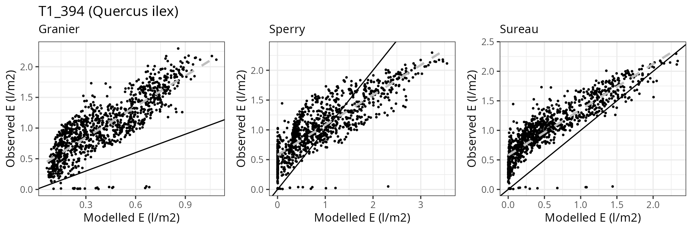

## Rinconada

### General information

| Attribute | Value |
|:---|:---|
| Plot name | Rinconada |
| Country | Spain |
| SAPFLUXNET code | ESP_RIN |
| SAPFLUXNET contributor (affiliation) | Virginia Hernandez-Santana (IRNAS-CSIC) |
| FLUXNET/ICOS code |  |
| FLUXNET/ICOS contributor (affiliation) |  |
| Latitude (º) | 40.600278 |
| Longitude (º) | -6.016667 |
| Elevation (m) | 1200 |
| Slope (º) | 10 |
| Aspect (º) | 0 |
| Parent material |  |
| Soil texture | Silty loam |
| MAT (ºC) | 10 |
| MAP (mm) | 1000 |
| Forest stand | Young, homogeneous, Quercus pyrenaica regrowth forest |
| Stand LAI | 3.4 |
| Stand description DOI | 10.1016/j.foreco.2008.03.004 |
| Species simulated | Quercus pyrenaica |
| Species parameter table | SpParamsES |
| Simulation period | 2006-2007 |
| Evaluation period | 2006-2007 |

### Model inputs

#### Vegetation

| Species           |  DBH | Height |    N | Z50 |  Z95 | LAI | Cover |
|:------------------|-----:|-------:|-----:|----:|-----:|----:|------:|
| Quercus pyrenaica | 11.7 |    740 | 1975 | 300 | 1500 | 3.4 |    NA |
| Herbaceous layer  |   NA |     10 |   NA |  NA |   NA |  NA |     5 |

#### Soil

| widths |  clay |     sand |    om |   bd |   rfc | VG_theta_sat | VG_theta_res |
|-------:|------:|---------:|------:|-----:|------:|-------------:|-------------:|
|    250 | 19.10 | 45.33333 | 4.000 | 1.48 | 10.00 |         0.35 |         0.03 |
|    250 | 23.95 | 41.60000 | 2.000 | 1.48 | 21.00 |         0.35 |         0.03 |
|    500 | 23.95 | 41.60000 | 1.315 | 1.48 | 24.85 |         0.35 |         0.03 |
|   1000 | 24.50 | 42.30000 | 0.820 | 1.51 | 60.00 |         0.35 |         0.03 |
|   2500 | 24.50 | 42.30000 | 0.000 | 1.56 | 85.00 |         0.35 |         0.03 |

#### Custom traits

| Species           | Kmax_stemxylem | VCleaf_kmax | Gswmin | Gswmax |    Al2As |
|:------------------|---------------:|------------:|-------:|-------:|---------:|
| Quercus pyrenaica |              1 |           4 |  0.003 |    0.3 | 4189.325 |

#### Custom control

||
||
||

#### Remarks

| Title | Remark |
|:---|:---|
| Soil | Taken from SoilGrids, with modification of theta_sat and theta_res |
| Vegetation | Understory not considered |
| Weather | Available weather complemented with interpolation |
| Sapflow | Sapflow scaling needs to be revised |

### Macroclimate

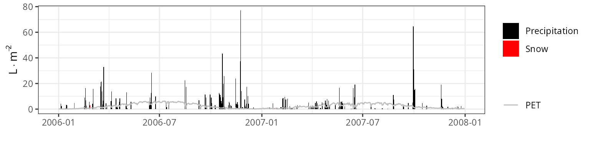

### Microclimate

### Runoff & deep drainage

### Evaluation results

#### Soil water content (SWC)

    ## Error in data.frame(Dates = as.Date(d), Observed = NA, Modelled = sm[[var_mod]]): arguments imply differing number of rows: 0, 1

    ## Error in data.frame(..., check.names = FALSE): arguments imply differing number of rows: 4, 3

    ## Error: object 'df_all_SMC' not found

    ## Error: object 'df_all_SMC' not found

#### Transpiration per leaf area

| Site | Cohort | Mode | n | Bias | Bias.rel | MAE | MAE.rel | r | NSE | NSE.abs |
|:---|:---|:---|---:|---:|---:|---:|---:|---:|---:|---:|
| ESPRIN | T1_402 | granier | 103 | 0.0684239 | 18.91182 | 0.0826196 | 22.83542 | 0.6632678 | -0.4536259 | -0.3948501 |
| ESPRIN | T1_402 | sperry | 103 | -0.0945417 | -26.13060 | 0.2172311 | 60.04099 | 0.0303429 | -7.9401076 | -2.6674679 |
| ESPRIN | T1_402 | sureau | 103 | -0.3618047 | -100.00000 | 0.3618047 | 100.00000 | NA | -18.7454913 | -5.1082735 |

#### Leaf water potential

    ## Error in if (df_site$Mode[[k]] != "granier") {: missing value where TRUE/FALSE needed

| Site | Cohort | WP | Mode | n | Bias | Bias.rel | MAE | MAE.rel | r | NSE | NSE.abs |
|:---|:---|:---|:---|---:|---:|---:|---:|---:|---:|---:|---:|
| ESPRIN | T1_402 | Midday | sperry | 15 | -6.169674e+00 | -3.901531e+02 | 6.169674e+00 | 3.901531e+02 | 0.5721158 | -1.276797e+02 | -1.337174e+01 |
| ESPRIN | T1_402 | Midday | sureau | 15 | -5.608683e+07 | -3.546776e+09 | 5.608683e+07 | 3.546776e+09 | NA | -1.057294e+16 | -1.306496e+08 |
| ESPRIN | T1_402 | Predawn | sperry | 15 | -7.350617e+00 | -1.835802e+03 | 7.350617e+00 | 1.835802e+03 | 0.4551408 | -1.476818e+03 | -4.451320e+01 |
| ESPRIN | T1_402 | Predawn | sureau | 15 | -5.608683e+07 | -1.400758e+10 | 5.608683e+07 | 1.400758e+10 | NA | -8.598230e+16 | -3.472758e+08 |

## Vallcebre (Barrol)

### General information

| Attribute | Value |
|:---|:---|
| Plot name | Vallcebre (Cal Barrol) |
| Country | Spain |
| SAPFLUXNET code | ESP_VAL_BAR |
| SAPFLUXNET contributor (affiliation) | Rafael Poyatos (CREAF) |
| FLUXNET/ICOS code |  |
| FLUXNET/ICOS contributor (affiliation) |  |
| Latitude (º) | 42.202933 |
| Longitude (º) | 1.820486 |
| Elevation (m) | 1102 |
| Slope (º) | 0 |
| Aspect (º) | 0 |
| Parent material | Limestone |
| Soil texture | Silty clay loam |
| MAT (ºC) | 9.3 |
| MAP (mm) | 603 |
| Forest stand | Semi-deciduous sub-Mediterranean oak forest |
| Stand LAI | 2.1 |
| Stand description DOI | 10.1093/treephys/27.4.537 |
| Species simulated | Quercus pubescens |
| Species parameter table | SpParamsES |
| Simulation period | 2004-2005 |
| Evaluation period | 2004-2005 |

### Model inputs

#### Vegetation

| Species            |      DBH | Height |   N | Z50 | Z95 | LAI | Cover |
|:-------------------|---------:|-------:|----:|:----|:----|----:|------:|
| Quercus pubescens  | 21.82917 | 1162.5 | 828 | NA  | NA  | 2.1 |    NA |
| Buxus sempervirens |       NA |  100.0 |  NA | NA  | NA  |  NA |    20 |
| Herbaceous layer   |       NA |   20.0 |  NA | NA  | NA  |  NA |     5 |

#### Soil

| widths | clay | sand | om  |   bd | rfc |
|-------:|-----:|-----:|:----|-----:|----:|
|    100 | 31.0 |  9.7 | NA  | 1.23 |   5 |
|    100 | 31.0 |  9.7 | NA  | 1.30 |  10 |
|    100 | 31.0 |  9.7 | NA  | 1.30 |  15 |
|    200 | 28.6 |  8.8 | NA  | 1.50 |  20 |
|   1000 | 28.6 |  8.8 | NA  | 1.50 |  70 |
|   2000 | 28.6 |  8.8 | NA  | 1.50 |  90 |

#### Custom traits

| Species            |    Al2As |
|:-------------------|---------:|
| Quercus pubescens  | 2342.065 |
| Buxus sempervirens |       NA |

#### Custom control

||
||
||

#### Remarks

| Title | Remark |
|:---|:---|
| Soil | Soil depth is 50 cm but additional rocky layers were added |
| Vegetation | Understory modelled using B. sempervirens |
| Weather | Missing values have been complemented with interpolated data |
| Sapflow | Sapflux density has been scaled to cohort level using measured plant Huber values |

### Macroclimate

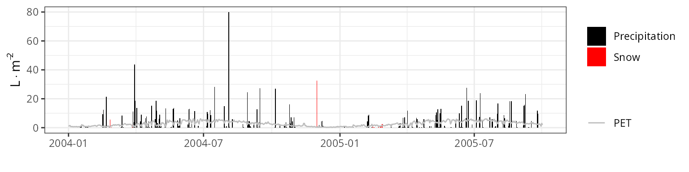

### Microclimate

### Runoff & deep drainage

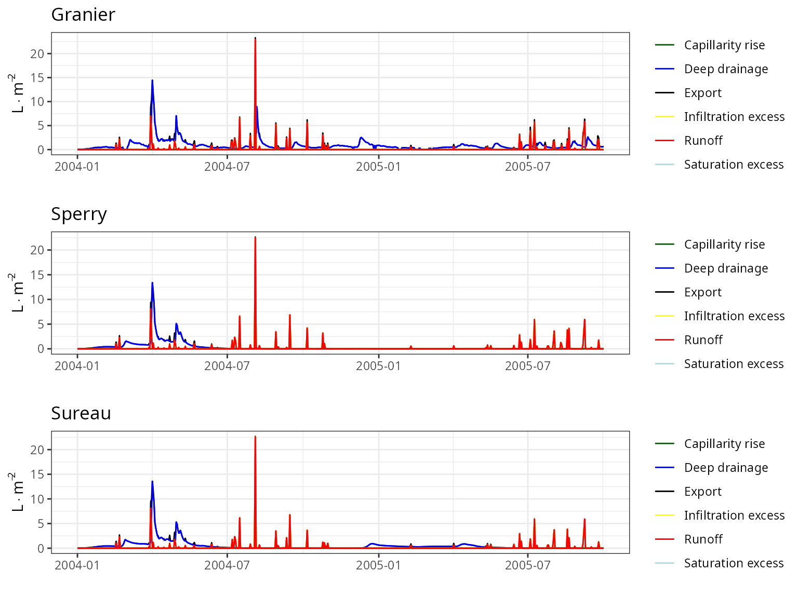

### Evaluation results

#### Soil water content (SWC.2)

    ## Error in data.frame(Dates = as.Date(d), Observed = NA, Modelled = sm[[var_mod]]): arguments imply differing number of rows: 0, 1

    ## Error in data.frame(..., check.names = FALSE): arguments imply differing number of rows: 4, 3

    ## Error: object 'df_all_SMC' not found

    ## Error: object 'df_all_SMC' not found

#### Transpiration per leaf area

| Site | Cohort | Mode | n | Bias | Bias.rel | MAE | MAE.rel | r | NSE | NSE.abs |
|:---|:---|:---|---:|---:|---:|---:|---:|---:|---:|---:|
| QVALLCEBRE | T1_400 | granier | 279 | -0.3429614 | -44.42992 | 0.3823034 | 49.52659 | 0.5788657 | -0.7041443 | -0.4478138 |
| QVALLCEBRE | T1_400 | sperry | 279 | 0.2708497 | 35.08800 | 0.3813270 | 49.40010 | 0.5858822 | -1.1519593 | -0.4441162 |
| QVALLCEBRE | T1_400 | sureau | 279 | 0.1520440 | 19.69697 | 0.3350921 | 43.41046 | 0.5796233 | -0.7247994 | -0.2690208 |

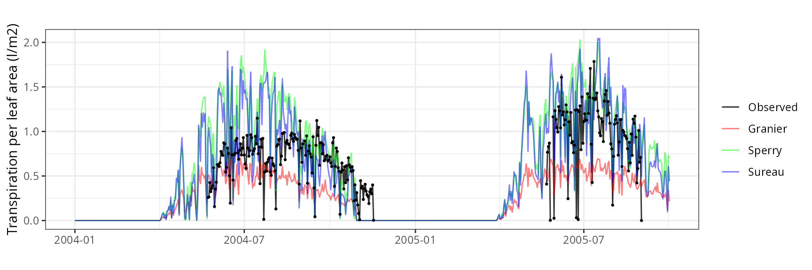

## Vallcebre (Sort)

### General information

| Attribute | Value |
|:---|:---|
| Plot name | Vallcebre (Cal Sort) |
| Country | Spain |
| SAPFLUXNET code | ESP_VAL_SOR |
| SAPFLUXNET contributor (affiliation) | Rafael Poyatos (CREAF) |
| FLUXNET/ICOS code |  |
| FLUXNET/ICOS contributor (affiliation) |  |
| Latitude (º) | 42.196053 |
| Longitude (º) | 1.813561 |
| Elevation (m) | 1257 |
| Slope (º) | 10 |
| Aspect (º) | 0 |
| Parent material | Limestone |
| Soil texture | Sandy clay loam |
| MAT (ºC) | 8.5 |
| MAP (mm) | 623 |
| Forest stand | Pinus sylvestris forest in a terraced area |
| Stand LAI | 2.4 |
| Stand description DOI | 10.5194/hess-9-493-2005 |
| Species simulated | Pinus sylvestris |
| Species parameter table | SpParamsES |
| Simulation period | 2003-2005 |
| Evaluation period | 2003-2005 |

### Model inputs

#### Vegetation

| Species            |  DBH |   Height |    N | Z50 | Z95 | LAI | Cover |
|:-------------------|-----:|---------:|-----:|:----|:----|----:|------:|
| Pinus sylvestris   | 16.2 | 1076.923 | 2165 | NA  | NA  | 2.4 |    NA |
| Buxus sempervirens |   NA |  100.000 |   NA | NA  | NA  |  NA |     5 |
| Herbaceous layer   |   NA |   20.000 |   NA | NA  | NA  |  NA |     5 |

#### Soil

| widths | clay | sand |  om |   bd | rfc |
|-------:|-----:|-----:|----:|-----:|----:|
|    100 |   22 |   59 |   4 | 1.18 |  10 |
|    100 |   21 |   60 |   3 | 1.28 |  15 |
|    100 |   20 |   61 |   2 | 1.38 |  19 |
|    350 |   18 |   62 |   1 | 1.48 |  20 |
|    350 |   18 |   62 |   0 | 1.50 |  50 |

#### Custom traits

| Species            |    Al2As |
|:-------------------|---------:|
| Pinus sylvestris   | 681.6332 |
| Buxus sempervirens |       NA |

#### Custom control

||
||
||

#### Remarks

| Title | Remark |
|:---|:---|
| Soil | Soil depth is 65 cm (30 + 35) but an additional layer of 35 cm is considered with 50% rocks |
| Vegetation | Understory modelled using B. sempervirens |
| Weather | Missing values have been complemented with interpolated data |
| Sapflow | Sapflux density has been scaled to cohort level using measured plant Huber values |

### Macroclimate

### Microclimate

### Runoff & deep drainage

### Evaluation results

#### Soil water content (SWC.2)

    ## Error in data.frame(Dates = as.Date(d), Observed = NA, Modelled = sm[[var_mod]]): arguments imply differing number of rows: 0, 1

    ## Error in data.frame(..., check.names = FALSE): arguments imply differing number of rows: 4, 3

    ## Error: object 'df_all_SMC' not found

    ## Error: object 'df_all_SMC' not found

#### Transpiration per leaf area

| Site | Cohort | Mode | n | Bias | Bias.rel | MAE | MAE.rel | r | NSE | NSE.abs |
|:---|:---|:---|---:|---:|---:|---:|---:|---:|---:|---:|
| PVALLCEBRE | T1_361 | granier | 733 | -0.4751063 | -64.11986 | 0.4896616 | 66.08423 | 0.7128155 | -0.6003174 | -0.2191701 |
| PVALLCEBRE | T1_361 | sperry | 733 | -0.3774654 | -50.94234 | 0.4027072 | 54.34895 | 0.7137062 | -0.1245449 | -0.0026691 |
| PVALLCEBRE | T1_361 | sureau | 733 | -0.4558566 | -61.52195 | 0.4801462 | 64.80005 | 0.6014946 | -0.5613990 | -0.1954786 |

## Prades

### General information

| Attribute | Value |
|:---|:---|
| Plot name | Prades (Tillar valley) |
| Country | Spain |
| SAPFLUXNET code | ESP_TIL_MIX |
| SAPFLUXNET contributor (affiliation) | Rafael Poyatos (CREAF) |
| FLUXNET/ICOS code |  |
| FLUXNET/ICOS contributor (affiliation) |  |
| Latitude (º) | 41.33263 |
| Longitude (º) | 1.014429 |
| Elevation (m) | 1018 |
| Slope (º) | 35 |
| Aspect (º) | 8.53 |
| Parent material | Fractured schist |
| Soil texture | Clay loam |
| MAT (ºC) | 10.5 |
| MAP (mm) | 651.274727491089 |
| Forest stand | Mixed forest with P. sylvestris (overstory) Q. ilex (midstory) |
| Stand LAI | 3.27 |
| Stand description DOI | 10.1111/nph.12278 |
| Species simulated | Quercus ilex, Pinus sylvestris |
| Species parameter table | SpParamsES |
| Simulation period | 2010-2013 |
| Evaluation period | 2010-2013 |

### Model inputs

#### Vegetation

| Species          |  DBH | Height |    N | Z50 |  Z95 |  LAI | Cover |
|:-----------------|-----:|-------:|-----:|----:|-----:|-----:|------:|
| Pinus sylvestris | 27.7 |   1424 |  257 | 300 | 1200 | 0.58 |    NA |
| Quercus ilex     |  8.4 |    500 | 2913 | 529 | 2287 | 2.69 |    NA |
| Herbaceous layer |   NA |     20 |   NA |  NA |   NA |   NA |    10 |

#### Soil

| widths | clay | sand |  om |  bd | rfc |
|-------:|-----:|-----:|----:|----:|----:|
|    300 |   21 |   47 |   4 | 1.5 |  45 |
|    700 |   19 |   48 |   4 | 1.5 |  70 |
|   1000 |   19 |   48 |   4 | 1.5 |  85 |
|   2500 |   19 |   48 |   4 | 1.5 |  90 |

#### Custom traits

| Species | VCleaf_P12 | VCleaf_P50 | VCleaf_P88 | VCleaf_slope | VCstem_P12 | VCstem_P50 | VCstem_P88 | VCstem_slope | VCroot_P12 | VCroot_P50 | VCroot_P88 | VCroot_slope | VCleaf_kmax | LeafEPS | LeafPI0 | LeafAF | StemEPS | StemPI0 | StemAF | Gswmin | Gswmax | Gs_P50 | Gs_slope | Al2As |
|:---|---:|---:|---:|---:|---:|---:|---:|---:|---:|---:|---:|---:|---:|---:|---:|---:|---:|---:|---:|---:|---:|---:|---:|---:|
| Pinus sylvestris | NA | NA | NA | NA | -0.9930548 | -3.2 | -5.406945 | 22.57 | -0.2474341 | -1.65 | -3.052566 | 35.51402 | 4.00 | 5.31 | -1.5 | 0.6 | 5 | -1.65 | 0.4 | 0.001 | 0.18 | -1.871216 | 97.43590 | 594.5372 |
| Quercus ilex | -4.004731 | -5.25 | -6.495269 | 40 | -4.7396415 | -6.4 | -8.060358 | 30.00 | -2.0047311 | -3.25 | -4.495269 | 40.00000 | 2.63 | 15.00 | -2.5 | 0.4 | 15 | -2.50 | 0.4 | 0.002 | 0.20 | -2.114188 | 44.70588 | 1387.0312 |

#### Custom control

||
||
||

#### Remarks

| Title      | Remark                                      |
|:-----------|:--------------------------------------------|
| Soil       | Additional rocky layer considered           |
| Vegetation | Understory not considered                   |
| Sapflow    | No scaling required (already per leaf area) |

### Macroclimate

### Microclimate

### Runoff & deep drainage

### Evaluation results

#### Soil water content (SWC)

    ## Error in data.frame(Dates = as.Date(d), Observed = NA, Modelled = sm[[var_mod]]): arguments imply differing number of rows: 0, 1

    ## Error in data.frame(..., check.names = FALSE): arguments imply differing number of rows: 4, 3

    ## Error: object 'df_all_SMC' not found

    ## Error: object 'df_all_SMC' not found

#### Transpiration per leaf area

| Site | Cohort | Mode | n | Bias | Bias.rel | MAE | MAE.rel | r | NSE | NSE.abs |
|:---|:---|:---|---:|---:|---:|---:|---:|---:|---:|---:|
| PRADES | T1_361 | granier | 1157 | 0.0492175 | 18.7432274 | 0.1584464 | 60.34019 | 0.6527672 | 0.1994840 | 0.1919765 |
| PRADES | T1_361 | sperry | 1157 | -0.1671737 | -63.6637855 | 0.1762032 | 67.10242 | 0.6495317 | -0.0154983 | 0.1014226 |
| PRADES | T1_361 | sureau | 1157 | -0.0011093 | -0.4224599 | 0.1359271 | 51.76430 | 0.7644063 | 0.3091780 | 0.3068174 |
| PRADES | T2_394 | granier | 908 | 0.0619715 | 37.4526153 | 0.0850859 | 51.42183 | 0.8328476 | 0.0922513 | 0.1604051 |
| PRADES | T2_394 | sperry | 908 | 0.2003130 | 121.0595630 | 0.2952601 | 178.44108 | 0.4468124 | -13.9366629 | -1.9135138 |
| PRADES | T2_394 | sureau | 908 | 0.1104204 | 66.7328160 | 0.1416889 | 85.62997 | 0.8109413 | -1.7751083 | -0.3981315 |

#### Leaf water potential

    ## Error in if (df_site$Mode[[k]] != "granier") {: missing value where TRUE/FALSE needed

| Site | Cohort | WP | Mode | n | Bias | Bias.rel | MAE | MAE.rel | r | NSE | NSE.abs |
|:---|:---|:---|:---|---:|---:|---:|---:|---:|---:|---:|---:|
| PRADES | T1_361 | Midday | sperry | 13 | -2.6313473 | -153.53271 | 2.7614695 | 161.12503 | 0.8484840 | -107.2701734 | -10.8817161 |
| PRADES | T1_361 | Midday | sureau | 13 | -0.5924877 | -34.57021 | 1.0442295 | 60.92825 | 0.8351514 | -19.2444701 | -3.4929841 |
| PRADES | T1_361 | Predawn | sperry | 13 | -2.8240228 | -236.07839 | 3.0012924 | 250.89750 | 0.8943752 | -64.7022515 | -7.4773567 |
| PRADES | T1_361 | Predawn | sureau | 13 | -0.7037766 | -58.83325 | 1.0879162 | 90.94597 | 0.9316014 | -10.4135967 | -2.0728941 |
| PRADES | T2_394 | Midday | sperry | 9 | -1.9078141 | -66.26729 | 2.1321562 | 74.05973 | 0.5441536 | -4.5826030 | -1.5065338 |
| PRADES | T2_394 | Midday | sureau | 9 | 0.5634273 | 19.57046 | 0.8948573 | 31.08257 | 0.9632963 | 0.0494185 | -0.0519821 |
| PRADES | T2_394 | Predawn | sperry | 9 | -1.7962535 | -85.02895 | 2.0161388 | 95.43763 | 0.7481450 | -2.9380831 | -1.2176109 |
| PRADES | T2_394 | Predawn | sureau | 9 | 0.2767893 | 13.10233 | 0.6622449 | 31.34857 | 0.9522929 | 0.6172810 | 0.2715772 |

## Can Balasc

### General information

| Attribute | Value |
|:---|:---|
| Plot name | Can Balasc |
| Country | Spain |
| SAPFLUXNET code | ESP_CAN |
| SAPFLUXNET contributor (affiliation) | Elisenda Sánchez-Costa (IDAEA-CSIC) |
| FLUXNET/ICOS code |  |
| FLUXNET/ICOS contributor (affiliation) |  |
| Latitude (º) | 41.43099 |
| Longitude (º) | 2.0736 |
| Elevation (m) | 270 |
| Slope (º) | 0.86 |
| Aspect (º) | 90 |
| Parent material | Shales and granite |
| Soil texture | Sandy loam |
| MAT (ºC) | 17 |
| MAP (mm) | 585 |
| Forest stand | Mixed forest dominated by Q. ilex |
| Stand LAI | 3.2 |
| Stand description DOI | 10.1016/j.agrformet.2015.03.012 |
| Species simulated | Quercus ilex, Quercus pubescens, Pinus halepensis, Arbutus unedo |
| Species parameter table | SpParamsES |
| Simulation period | 2011-2012 |
| Evaluation period | 2011-2012 |

### Model inputs

#### Vegetation

| Species                |  DBH |  Height |    N | Z50 |  Z95 |       LAI | Cover |
|:-----------------------|-----:|--------:|-----:|----:|-----:|----------:|------:|
| Arbutus unedo          |  9.6 |  810.00 |   76 | 390 | 1470 | 0.1402566 |    NA |
| Pinus halepensis       | 33.7 | 1710.00 |   53 | 300 | 1200 | 0.3854073 |    NA |
| Quercus pubescens      | 12.0 |  960.00 |  150 | 529 | 2287 | 0.3641975 |    NA |
| Quercus ilex           | 11.9 | 1020.00 | 1150 | 529 | 2287 | 2.3101386 |    NA |
| Arbutus unedo          |   NA |  174.00 |   NA |  NA |   NA |        NA |  4.83 |
| Phillyrea angustifolia |   NA |  153.33 |   NA |  NA |   NA |        NA |  7.25 |
| Pistacia lentiscus     |   NA |  118.33 |   NA |  NA |   NA |        NA | 13.50 |
| Quercus ilex           |   NA |   78.00 |   NA |  NA |   NA |        NA |  9.67 |
| Viburnum spp.          |   NA |  138.33 |   NA |  NA |   NA |        NA |  9.67 |
| Herbaceous layer       |   NA |   20.00 |   NA |  NA |   NA |        NA |  5.00 |

#### Soil

| widths |  clay | sand |   om |  bd | rfc |
|-------:|------:|-----:|-----:|----:|----:|
|    300 | 20.23 | 48.9 | 2.70 | 1.5 |  20 |
|    700 | 24.58 | 52.4 | 1.00 | 1.5 |  30 |
|   1000 | 27.66 | 45.6 | 0.61 | 1.5 |  85 |
|   2500 | 27.66 | 45.6 | 0.61 | 1.5 |  90 |

#### Custom traits

| Species | VCstem_P12 | VCstem_P50 | VCstem_P88 | VCstem_slope | VCroot_P12 | VCroot_P50 | VCroot_P88 | VCleaf_kmax | LeafEPS | LeafPI0 | LeafAF | StemEPS | StemPI0 | StemAF | Gswmin | Gswmax | Gs_P50 | Gs_slope | Al2As |
|:---|---:|---:|---:|---:|---:|---:|---:|---:|---:|---:|---:|---:|---:|---:|---:|---:|---:|---:|---:|
| Arbutus unedo | NA | NA | NA | NA | NA | NA | NA | NA | NA | NA | NA | NA | NA | NA | NA | NA | NA | NA | 1297.3893 |
| Pinus halepensis | -3.707158 | -4.79 | -5.872842 | 46 | -1 | -1.741565 | -2.301482 | 4.00 | 5.31 | -1.5 | 0.6 | 5 | -1.65 | 0.4 | 0.001 | 0.2175 | -1.871216 | 97.43590 | 631.1784 |
| Quercus pubescens | NA | NA | NA | NA | NA | NA | NA | NA | NA | NA | NA | NA | NA | NA | NA | NA | NA | NA | 1487.5004 |
| Quercus ilex | -4.739642 | -6.40 | -8.060358 | 30 | NA | NA | NA | 2.63 | 15.00 | -2.5 | 0.4 | 15 | -2.50 | 0.4 | 0.002 | 0.2200 | -2.114188 | 44.70588 | 1009.0124 |
| Phillyrea angustifolia | NA | NA | NA | NA | NA | NA | NA | NA | NA | NA | NA | NA | NA | NA | NA | NA | NA | NA | NA |
| Pistacia lentiscus | NA | NA | NA | NA | NA | NA | NA | NA | NA | NA | NA | NA | NA | NA | NA | NA | NA | NA | NA |
| Viburnum spp. | NA | NA | NA | NA | NA | NA | NA | NA | NA | NA | NA | NA | NA | NA | NA | NA | NA | NA | NA |

#### Custom control

||
||
||

#### Remarks

| Title | Remark |
|:---|:---|
| Soil | Soil description from local samples |
| Vegetation | Understory composed of multiple species |
| Sapflow | No scaling required (already per leaf area) but tree selection may be required |

### Macroclimate

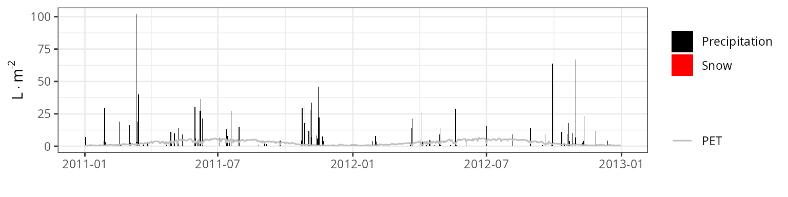

### Microclimate

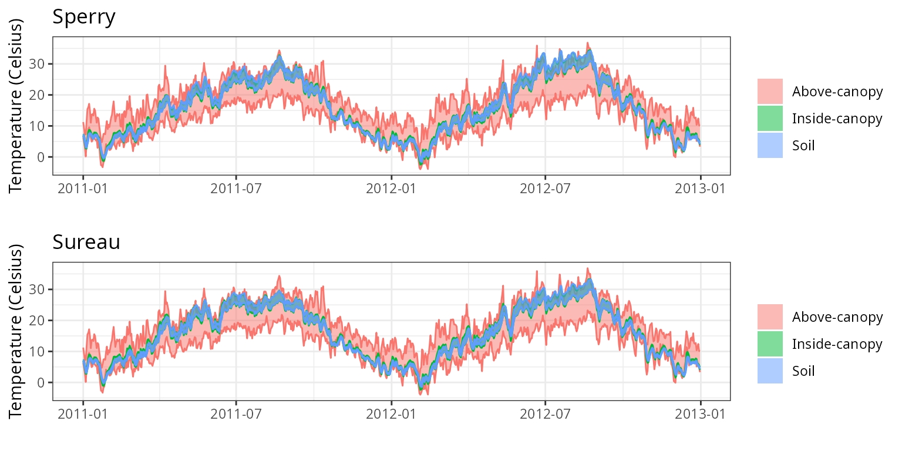

### Runoff & deep drainage

### Evaluation results

#### Soil water content (SWC)

    ## Error in data.frame(Dates = as.Date(d), Observed = NA, Modelled = sm[[var_mod]]): arguments imply differing number of rows: 0, 1

    ## Error in data.frame(..., check.names = FALSE): arguments imply differing number of rows: 4, 3

    ## Error: object 'df_all_SMC' not found

    ## Error: object 'df_all_SMC' not found

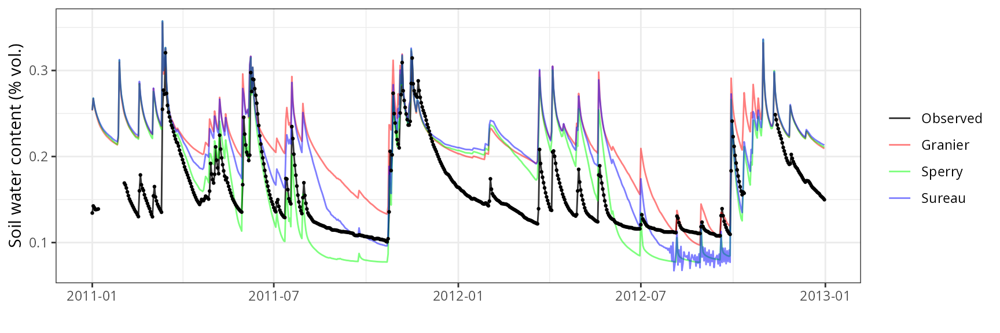

#### Transpiration per leaf area

| Site | Cohort | Mode | n | Bias | Bias.rel | MAE | MAE.rel | r | NSE | NSE.abs |
|:---|:---|:---|---:|---:|---:|---:|---:|---:|---:|---:|
| CANBALASC | T1_35 | granier | 644 | 0.0190200 | 6.401961 | 0.1222338 | 41.14270 | 0.7104228 | 0.1585963 | 0.1351475 |
| CANBALASC | T1_35 | sperry | 644 | -0.1081508 | -36.402505 | 0.1772191 | 59.65023 | 0.6727779 | -0.5818300 | -0.2538955 |
| CANBALASC | T1_35 | sureau | 644 | -0.0833083 | -28.040756 | 0.1652169 | 55.61041 | 0.5325312 | -0.3591860 | -0.1689752 |
| CANBALASC | T2_356 | granier | 611 | 0.1978144 | 76.277553 | 0.2662718 | 102.67484 | 0.2366570 | -4.0086109 | -0.9961643 |
| CANBALASC | T2_356 | sperry | 611 | -0.0722405 | -27.856045 | 0.1565422 | 60.36293 | 0.7306051 | -0.3763655 | -0.1735525 |
| CANBALASC | T2_356 | sureau | 611 | 0.1137660 | 43.868368 | 0.2903578 | 111.96244 | 0.1998277 | -5.1614136 | -1.1767301 |
| CANBALASC | T3_400 | granier | 679 | -0.1011840 | -25.517481 | 0.2312931 | 58.32956 | 0.3620810 | -0.6725705 | -0.3410041 |
| CANBALASC | T3_400 | sperry | 679 | -0.1046531 | -26.392352 | 0.3168409 | 79.90376 | 0.6032489 | -2.0168196 | -0.8369978 |
| CANBALASC | T3_400 | sureau | 679 | 0.0215137 | 5.425518 | 0.3750134 | 94.57420 | 0.2580938 | -3.3696721 | -1.1742730 |
| CANBALASC | T4_394 | granier | 644 | -0.0488733 | -16.633930 | 0.1177102 | 40.06246 | 0.7519443 | 0.5088036 | 0.3578063 |
| CANBALASC | T4_394 | sperry | 644 | 0.1074892 | 36.583741 | 0.2391250 | 81.38575 | 0.7111901 | -0.9104010 | -0.3045983 |
| CANBALASC | T4_394 | sureau | 644 | 0.0185712 | 6.320667 | 0.1525887 | 51.93327 | 0.6910585 | 0.1443864 | 0.1675194 |

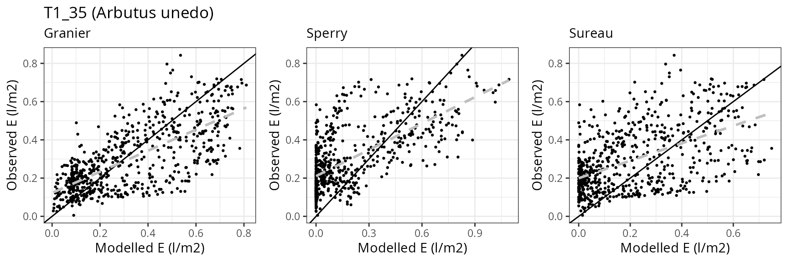

## Alto-Tajo Armallones

### General information

| Attribute | Value |
|:---|:---|
| Plot name | Alto Tajo (Armallones) |
| Country | Spain |
| SAPFLUXNET code | ESP_ALT_ARM |
| SAPFLUXNET contributor (affiliation) | Alicia Forner (MNCN-CSIC) |
| FLUXNET/ICOS code |  |
| FLUXNET/ICOS contributor (affiliation) |  |
| Latitude (º) | 40.7769 |
| Longitude (º) | -2.3283 |
| Elevation (m) | 1079 |
| Slope (º) | 25.64 |
| Aspect (º) | 270 |
| Parent material | Cretaceous and Jurassic limestone |
| Soil texture | Clay |
| MAT (ºC) | 10.1 |
| MAP (mm) | 495 |
| Forest stand | Sparse mixed forest dominated by three species |
| Stand LAI | 10.1007/S11258-014-0351-x |
| Stand description DOI | 1.09 |
| Species simulated | Pinus nigra, Quercus faginea, Quercus ilex |
| Species parameter table | SpParamsES |
| Simulation period | 2012-2013 |
| Evaluation period | 2012-2013 |

### Model inputs

#### Vegetation

| Species          |     DBH |    Height |         N | Z50 |  Z95 |       LAI | Cover |
|:-----------------|--------:|----------:|----------:|----:|-----:|----------:|------:|
| Pinus nigra      | 25.4720 | 1208.1085 |  94.36517 | 300 | 1200 | 0.2318096 |    NA |
| Quercus faginea  | 16.7450 |  752.6195 | 240.75280 | 529 | 2287 | 0.5673799 |    NA |
| Quercus ilex     | 22.3075 |  902.0182 |  90.43751 | 529 | 2287 | 0.2908105 |    NA |
| Herbaceous layer |      NA |   20.0000 |        NA |  NA |   NA |        NA |    10 |

#### Soil

| widths |    clay | sand |   om |       bd | rfc |
|-------:|--------:|-----:|-----:|---------:|----:|
|    300 | 21.8667 | 41.4 | 4.26 | 1.243333 |  45 |
|    700 | 23.8000 | 42.2 | 0.87 | 1.510000 |  65 |
|   1000 | 24.1000 | 41.7 | 0.55 | 1.560000 |  90 |
|   2500 | 24.1000 | 41.7 | 0.55 | 1.560000 |  95 |

#### Custom traits

| Species | VCleaf_P12 | VCleaf_P50 | VCleaf_P88 | VCleaf_slope | VCstem_P12 | VCstem_P50 | VCstem_P88 | VCstem_slope | VCroot_P12 | VCroot_P50 | VCroot_P88 | VCroot_slope | VCleaf_kmax | LeafEPS | LeafPI0 | LeafAF | StemEPS | StemPI0 | StemAF | Gswmin | Gswmax | Gs_P50 | Gs_slope | Al2As |
|:---|---:|---:|---:|---:|---:|---:|---:|---:|---:|---:|---:|---:|---:|---:|---:|---:|---:|---:|---:|---:|---:|---:|---:|---:|
| Pinus nigra | NA | NA | NA | NA | -0.9930548 | -3.2 | -5.406945 | 22.57 | -0.2474341 | -1.65 | -3.052566 | 35.51402 | NA | 5.31 | -1.5 | 0.6 | 5 | -1.65 | 0.4 | 0.001 | 0.18 | -1.871216 | 97.43590 | 1272 |
| Quercus faginea | -4.004731 | -5.25 | -6.495269 | 40 | -4.7396415 | -6.4 | -8.060358 | 30.00 | -2.0047311 | -3.25 | -4.495269 | 40.00000 | NA | 15.00 | -2.5 | 0.4 | 15 | -2.50 | 0.4 | 0.002 | 0.22 | -2.114188 | 44.70588 | 1488 |
| Quercus ilex | -4.004731 | -5.25 | -6.495269 | 40 | -4.7396415 | -6.4 | -8.060358 | 30.00 | -2.0047311 | -3.25 | -4.495269 | 40.00000 | 2.63 | 15.00 | -2.5 | 0.4 | 15 | -2.50 | 0.4 | 0.002 | 0.22 | -2.114188 | 44.70588 | 1541 |

#### Custom control

||
||
||

#### Remarks

| Title      | Remark                                  |
|:-----------|:----------------------------------------|
| Soil       | Taken from Soilgrids                    |
| Vegetation | Understory not considered               |
| Sapflow    | Scaling done using tree density and LAI |

### Macroclimate

### Microclimate

### Runoff & deep drainage

### Evaluation results

#### Soil water content (SWC)

    ## Error in data.frame(Dates = as.Date(d), Observed = NA, Modelled = sm[[var_mod]]): arguments imply differing number of rows: 0, 1

    ## Error in data.frame(..., check.names = FALSE): arguments imply differing number of rows: 4, 3

    ## Error: object 'df_all_SMC' not found

    ## Error: object 'df_all_SMC' not found

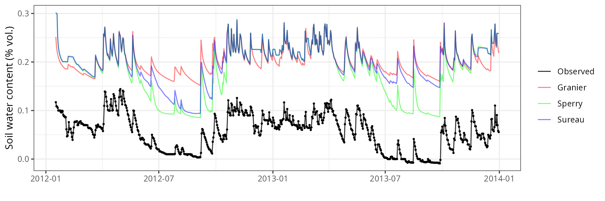

#### Transpiration per leaf area

| Site | Cohort | Mode | n | Bias | Bias.rel | MAE | MAE.rel | r | NSE | NSE.abs |
|:---|:---|:---|---:|---:|---:|---:|---:|---:|---:|---:|
| ESPALTARM | T1_357 | granier | 627 | -1.1530267 | -76.93483 | 1.1904728 | 79.43339 | 0.5152036 | -0.5270615 | -0.0047696 |
| ESPALTARM | T1_357 | sperry | 627 | -1.2489553 | -83.33559 | 1.2491133 | 83.34613 | 0.8298681 | -0.4970636 | -0.0542627 |
| ESPALTARM | T1_357 | sureau | 627 | -1.3108752 | -87.46715 | 1.4215948 | 94.85483 | 0.0654928 | -0.9151624 | -0.1998386 |
| ESPALTARM | T2_392 | granier | 537 | -1.2626613 | -73.44048 | 1.3024396 | 75.75411 | 0.8072240 | -0.6730840 | -0.1673612 |
| ESPALTARM | T2_392 | sperry | 537 | -0.6878325 | -40.00657 | 0.9474072 | 55.10428 | 0.6734741 | 0.1166209 | 0.1508501 |
| ESPALTARM | T2_392 | sureau | 537 | -1.0951525 | -63.69762 | 1.1303698 | 65.74597 | 0.8112555 | -0.2296442 | -0.0131371 |
| ESPALTARM | T3_394 | granier | 628 | -1.2873244 | -78.72585 | 1.2888552 | 78.81947 | 0.8074908 | -1.0212483 | -0.3345416 |
| ESPALTARM | T3_394 | sperry | 628 | -0.7581360 | -46.36353 | 0.7728455 | 47.26308 | 0.8819359 | 0.3272028 | 0.1997593 |
| ESPALTARM | T3_394 | sureau | 628 | -1.1280846 | -68.98760 | 1.1395783 | 69.69049 | 0.7706570 | -0.4987502 | -0.1799732 |

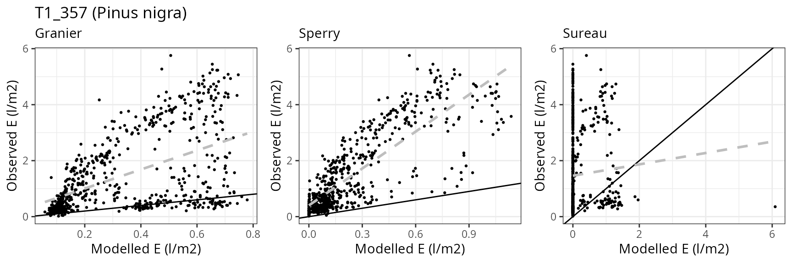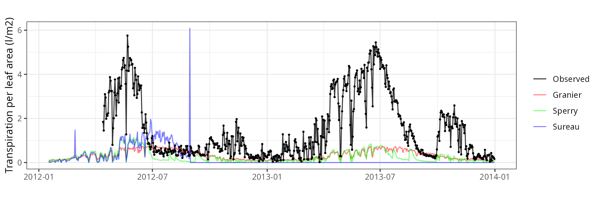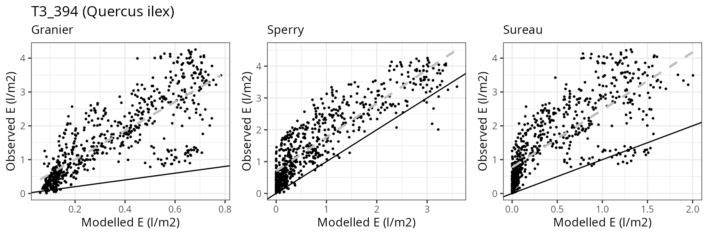

#### Leaf water potential

    ## Error in if (df_site$Mode[[k]] != "granier") {: missing value where TRUE/FALSE needed

| Site | Cohort | WP | Mode | n | Bias | Bias.rel | MAE | MAE.rel | r | NSE | NSE.abs |
|:---|:---|:---|:---|---:|---:|---:|---:|---:|---:|---:|---:|
| ESPALTARM | T1_357 | Midday | sperry | 4 | -1.8823586 | -106.57374 | 1.8823586 | 106.57374 | 0.9656991 | -65.7496237 | -5.0235475 |
| ESPALTARM | T1_357 | Midday | sureau | 4 | -9.6737939 | -547.70242 | 9.7926297 | 554.43056 | -0.1644799 | -1482.8693296 | -30.3364151 |
| ESPALTARM | T1_357 | Predawn | sperry | 4 | -1.0547426 | -94.17345 | 1.2096666 | 108.00594 | 0.9923175 | -8.3935183 | -1.7969169 |
| ESPALTARM | T1_357 | Predawn | sureau | 4 | -9.9608708 | -889.36347 | 10.1801008 | 908.93758 | -0.4264289 | -741.2011051 | -22.5378054 |
| ESPALTARM | T2_392 | Midday | sperry | 4 | -1.0172295 | -39.90113 | 1.0172295 | 39.90113 | 0.8774845 | -14.5855171 | -3.3401790 |
| ESPALTARM | T2_392 | Midday | sureau | 4 | 1.2711589 | 49.86159 | 1.3201147 | 51.78190 | 0.5719907 | -28.0893053 | -4.6324894 |
| ESPALTARM | T2_392 | Predawn | sperry | 4 | -1.2304261 | -166.41435 | 1.2510030 | 169.19737 | 0.8744093 | -9.0299375 | -1.9413738 |
| ESPALTARM | T2_392 | Predawn | sureau | 4 | -0.0813345 | -11.00044 | 0.4087554 | 55.28391 | 0.9654873 | -0.1054423 | 0.0389292 |
| ESPALTARM | T3_394 | Midday | sperry | 4 | -1.4191383 | -60.21271 | 1.4191383 | 60.21271 | 0.9946249 | -3.7665083 | -1.8015068 |
| ESPALTARM | T3_394 | Midday | sureau | 4 | 0.9311895 | 39.50950 | 0.9311895 | 39.50950 | 0.9066835 | -1.4801006 | -0.8382519 |
| ESPALTARM | T3_394 | Predawn | sperry | 4 | -0.8457113 | -74.14455 | 0.9629444 | 84.42252 | 0.8473820 | -0.5757565 | -0.1765644 |
| ESPALTARM | T3_394 | Predawn | sureau | 4 | 0.3340068 | 29.28279 | 0.3340068 | 29.28279 | 0.9968815 | 0.8629790 | 0.5918970 |

## Ronda

### General information

| Attribute | Value |
|:---|:---|
| Plot name | Ronda (Pilones) |
| Country | Spain |
| SAPFLUXNET code | ESP_RON_PIL |
| SAPFLUXNET contributor (affiliation) | Víctor Lechuga (UJaén) |
| FLUXNET/ICOS code |  |
| FLUXNET/ICOS contributor (affiliation) |  |
| Latitude (º) | 36.692881 |
| Longitude (º) | -5.019568 |
| Elevation (m) | 1734 |
| Slope (º) | 15 |
| Aspect (º) | 315 |
| Parent material |  |
| Soil texture | Silty loam |
| MAT (ºC) | 8.1 |
| MAP (mm) | 925 |
| Forest stand | Mixed gimnosperm forest dominated by Abies pinsapo |
| Stand LAI | 10.3390/f10121132 |
| Stand description DOI | NA |
| Species simulated | Abies pinsapo, Taxus baccata |
| Species parameter table | SpParamsES |
| Simulation period | 2011-2013 |
| Evaluation period | 2011-2013 |

### Model inputs

#### Vegetation

| Species          |  DBH | Height |   N | Z50 | Z95 | Cover |
|:-----------------|-----:|-------:|----:|:----|:----|------:|
| Abies pinsapo    | 15.3 |   1256 | 486 | NA  | NA  |    NA |
| Taxus baccata    | 15.0 |    630 |  15 | NA  | NA  |    NA |
| Herbaceous layer |   NA |     10 |  NA | NA  | NA  |    10 |

#### Soil

| widths |     clay |     sand |   om |       bd |      rfc | VG_theta_sat | VG_theta_res |
|-------:|---------:|---------:|-----:|---------:|---------:|-------------:|-------------:|
|    300 | 18.96667 | 44.46667 | 3.97 | 1.276667 | 19.46667 |         0.55 |          0.1 |
|    700 | 19.65000 | 45.20000 | 1.18 | 1.420000 | 40.00000 |         0.55 |          0.1 |
|   1000 | 20.10000 | 45.70000 | 0.65 | 1.480000 | 80.00000 |         0.55 |          0.1 |
|   2500 | 20.10000 | 45.70000 | 0.00 | 1.480000 | 90.00000 |         0.55 |          0.1 |

#### Custom traits

| Species       |    Al2As | LeafAngle |
|:--------------|---------:|----------:|
| Abies pinsapo | 2587.510 |        NA |
| Taxus baccata | 6790.546 |        30 |

#### Custom control

||
||
||

#### Remarks

| Title | Remark |
|:---|:---|
| Soil | Taken from SoilGrids with theta_sat and theta_res modified |
| Vegetation | LAI not available. Understory not considered except herbaceous layer |
| Weather | Complemented with interpolated weather |
| Sapflow | Species-level Huber value used for scaling. Revise scaling. |

### Macroclimate

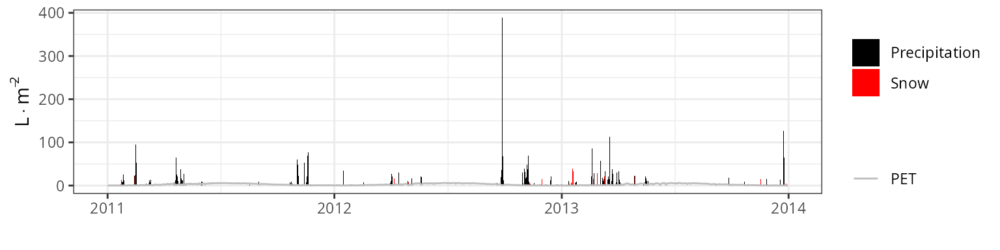

### Microclimate

### Runoff & deep drainage

### Evaluation results

#### Soil water content (SWC)

    ## Error in data.frame(Dates = as.Date(d), Observed = NA, Modelled = sm[[var_mod]]): arguments imply differing number of rows: 0, 1

    ## Error in data.frame(..., check.names = FALSE): arguments imply differing number of rows: 4, 3

    ## Error: object 'df_all_SMC' not found

    ## Error: object 'df_all_SMC' not found

#### Transpiration per leaf area

| Site | Cohort | Mode | n | Bias | Bias.rel | MAE | MAE.rel | r | NSE | NSE.abs |
|:---|:---|:---|---:|---:|---:|---:|---:|---:|---:|---:|
| RONDA | T1_2 | granier | 730 | -0.2039726 | -35.1064926 | 0.2451818 | 42.19916 | 0.7516074 | 0.1546505 | 0.1045173 |
| RONDA | T1_2 | sperry | 730 | 0.0061551 | 1.0593762 | 0.1776540 | 30.57670 | 0.7878721 | 0.5089785 | 0.3511505 |
| RONDA | T1_2 | sureau | 730 | 0.0003763 | 0.0647726 | 0.2374525 | 40.86885 | 0.7569577 | 0.1129686 | 0.1327471 |
| RONDA | T2_490 | granier | 712 | 0.3964500 | 132.5619150 | 0.4084152 | 136.56276 | 0.7604728 | -3.2999064 | -1.1761360 |
| RONDA | T2_490 | sperry | 712 | 0.3247356 | 108.5826296 | 0.3435079 | 114.85956 | 0.6873378 | -2.1907404 | -0.8302942 |
| RONDA | T2_490 | sureau | 712 | 0.4122786 | 137.8545851 | 0.4465293 | 149.30706 | 0.6606020 | -5.6737217 | -1.3792171 |

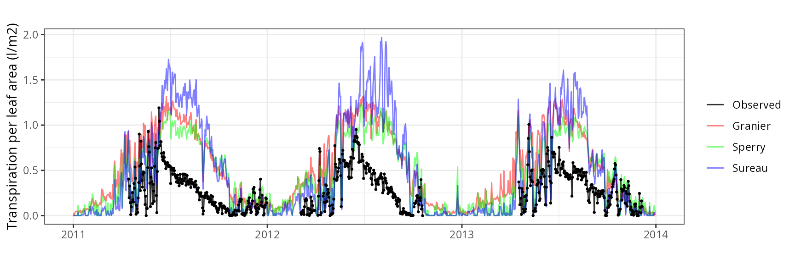

## Davos Seehornwald

### General information

| Attribute | Value |
|:---|:---|
| Plot name | Davos Seehornwald |
| Country | Switzerland |
| SAPFLUXNET code | CHE_DAV_SEE |
| SAPFLUXNET contributor (affiliation) | Roman Zweifel (WSL) |
| FLUXNET/ICOS code | CH-Dav |
| FLUXNET/ICOS contributor (affiliation) | Nina Buchmann (ETH) |
| Latitude (º) | 46.81668 |
| Longitude (º) | 9.856198 |
| Elevation (m) | 1650 |
| Slope (º) | 0 |
| Aspect (º) | 0 |
| Parent material |  |
| Soil texture | Loamy sand |
| MAT (ºC) | 3.8 |
| MAP (mm) | 840 |
| Forest stand | Subalpine coniferous (spruce) forest |
| Stand LAI | 3.9 |
| Stand description DOI | 10.1007/s10021-011-9481-3 |
| Species simulated | Picea abies |
| Species parameter table | SpParamsFR |
| Simulation period | 2009-2011 |
| Evaluation period | 2009-2011 |

### Model inputs

#### Vegetation

| Species     | DBH | Height |   N | Z50 | Z95 | LAI |
|:------------|----:|-------:|----:|:----|:----|----:|
| Picea abies |  20 |   2800 | 830 | NA  | NA  | 3.9 |

#### Soil

| widths |     clay |     sand |       om |       bd |      rfc |
|-------:|---------:|---------:|---------:|---------:|---------:|
|    300 | 13.53333 | 50.96667 | 9.176667 | 1.016667 | 12.73333 |
|    300 | 14.20000 | 51.80000 | 3.140000 | 1.300000 | 22.30000 |
|    400 | 15.30000 | 50.00000 | 3.530000 | 1.390000 | 23.90000 |
|   1000 | 15.20000 | 52.10000 | 3.550000 | 1.410000 | 80.00000 |
|   2500 | 15.20000 | 52.10000 | 3.550000 | 1.410000 | 90.00000 |

#### Custom traits

| Species     | Al2As |
|:------------|------:|
| Picea abies |  1975 |

#### Custom control

||
||
||

#### Remarks

| Title      | Remark                                        |
|:-----------|:----------------------------------------------|
| Soil       | Taken from SoilGrids                          |
| Vegetation | No understory or secondary species considered |
| Weather    | From fluxnet data                             |
| Sapflow    | Species-level Huber value used for scaling    |

### Macroclimate

### Microclimate

### Runoff & deep drainage

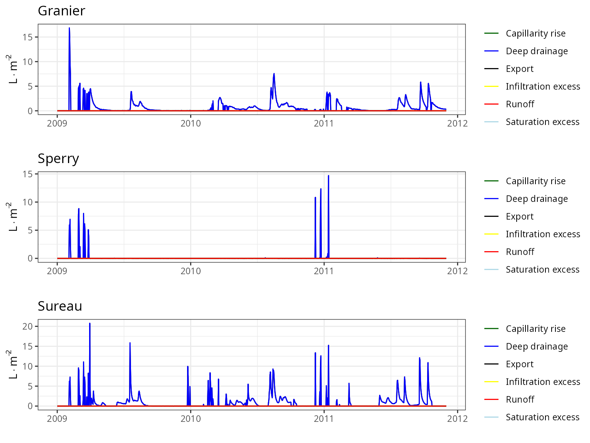

### Evaluation results

#### Sensible heat turbulent flux

    ## Error in data.frame(Dates = as.Date(d), Observed = NA, Modelled = Hmod): arguments imply differing number of rows: 0, 1

    ## Error in data.frame(..., check.names = FALSE): arguments imply differing number of rows: 3, 2

    ## Error: object 'df_all_H' not found

    ## Error: object 'df_all_H' not found

#### Latent heat turbulent flux

    ## Error in data.frame(Dates = as.Date(d), Observed = NA, Modelled = LEmod): arguments imply differing number of rows: 0, 1

    ## Error in data.frame(..., check.names = FALSE): arguments imply differing number of rows: 3, 2

    ## Error: object 'df_all_LE' not found

    ## Error: object 'df_all_LE' not found

#### Gross primary productivity

    ## Error in rowSums(out$Plants$GrossPhotosynthesis): 'x' must be an array of at least two dimensions

    ## Error in data.frame(..., check.names = FALSE): arguments imply differing number of rows: 4, 3

    ## Error: object 'df_all_GPP' not found

    ## Error: object 'df_all_GPP' not found

#### Soil water content (SWC.1)

    ## Error in data.frame(Dates = as.Date(d), Observed = NA, Modelled = sm[[var_mod]]): arguments imply differing number of rows: 0, 1

    ## Error in data.frame(..., check.names = FALSE): arguments imply differing number of rows: 4, 3

    ## Error: object 'df_all_SMC' not found

    ## Error: object 'df_all_SMC' not found

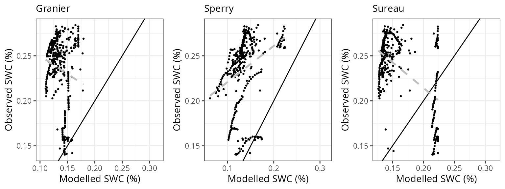

#### Soil water content (SWC.3)

    ## Error in data.frame(Dates = as.Date(d), Observed = NA, Modelled = sm[[var_mod]]): arguments imply differing number of rows: 0, 1

    ## Error in data.frame(..., check.names = FALSE): arguments imply differing number of rows: 4, 3

    ## Error: object 'df_all_SMC' not found

    ## Error: object 'df_all_SMC' not found

#### Transpiration per leaf area

| Site | Cohort | Mode | n | Bias | Bias.rel | MAE | MAE.rel | r | NSE | NSE.abs |
|:---|:---|:---|---:|---:|---:|---:|---:|---:|---:|---:|
| DAVOS | T1_2602 | granier | 364 | 0.0433762 | 34.11646 | 0.0651225 | 51.22050 | 0.8657599 | 0.6549379 | 0.4705638 |
| DAVOS | T1_2602 | sperry | 364 | 0.1443894 | 113.56594 | 0.1773161 | 139.46357 | 0.7204132 | -1.5699177 | -0.4415530 |
| DAVOS | T1_2602 | sureau | 364 | -0.0147769 | -11.62239 | 0.0722495 | 56.82608 | 0.7553116 | 0.5526946 | 0.4126222 |

## Lötschental

### General information

| Attribute | Value |
|:---|:---|
| Plot name | Lötschental |
| Country | Switzerland |
| SAPFLUXNET code | CHE_LOT_NOR |
| SAPFLUXNET contributor (affiliation) | Patrick Fonti (WSL) |
| FLUXNET/ICOS code |  |
| FLUXNET/ICOS contributor (affiliation) |  |
| Latitude (º) | 46.3918 |
| Longitude (º) | 7.7613 |
| Elevation (m) | 1300 |
| Slope (º) | 36.87 |
| Aspect (º) | 0 |
| Parent material | Calcareous |
| Soil texture | Loam |
| MAT (ºC) | 5 |
| MAP (mm) | 716 |
| Forest stand | Mixed evergreen Norway spruce and deciduous European larch forest |
| Stand LAI | 3 |
| Stand description DOI | 10.1016/j.agrformet.2012.08.002 |
| Species simulated | Picea abies, Larix decidua subsp. decidua |
| Species parameter table | SpParamsFR |
| Simulation period | 2013-2016 |
| Evaluation period | 2013-2016 |

### Model inputs

#### Vegetation

| Species                      |      DBH |   Height |        N | Z50 | Z95 |      LAI |
|:-----------------------------|---------:|---------:|---------:|:----|:----|---------:|
| Larix decidua subsp. decidua | 30.76667 | 1910.000 | 345.8887 | NA  | NA  | 1.417577 |
| Picea abies                  | 38.60000 | 1783.333 | 385.5873 | NA  | NA  | 1.580276 |

#### Soil

| widths | clay |     sand |       om |       bd | rfc | VG_theta_sat | VG_theta_res |
|-------:|-----:|---------:|---------:|---------:|----:|-------------:|-------------:|
|    100 | 23.2 | 42.13333 | 9.266667 | 1.083333 |  40 |         0.35 |         0.07 |
|    100 | 24.0 | 42.52000 | 5.220000 | 1.178000 |  40 |         0.40 |         0.10 |
|    200 | 23.3 | 43.70000 | 3.290000 | 1.273333 |  40 |         0.60 |         0.20 |
|    200 | 21.9 | 45.10000 | 2.550000 | 1.380000 |  45 |         0.32 |         0.10 |
|    400 | 22.2 | 47.40000 | 2.570000 | 1.450000 |  80 |         0.32 |         0.10 |
|   1000 | 22.8 | 46.10000 | 2.350000 | 1.490000 |  90 |         0.32 |         0.10 |
|   2000 | 22.8 | 46.10000 | 0.000000 | 1.490000 |  97 |         0.32 |         0.10 |

#### Custom traits

| Species                      | Kmax_stemxylem | Al2As | LeafAngle | LeafAngleSD |
|:-----------------------------|---------------:|------:|----------:|------------:|
| Larix decidua subsp. decidua |             20 |  3305 |        30 |          21 |
| Picea abies                  |             NA |  1975 |        42 |           2 |

#### Custom control

||
||
||

#### Remarks

| Title | Remark |
|:---|:---|
| Soil | Taken from SoilGrids with theta_sat and theta_res modified |
| Vegetation | Understory not considered. LAI not available |
| Weather | Complemented with weather station in the same valley for Radiation, Precipitation and WindSpeed (2013-2016); and all variables for 2016 |
| Soil moisture | Provided by A. Cabon |

### Macroclimate

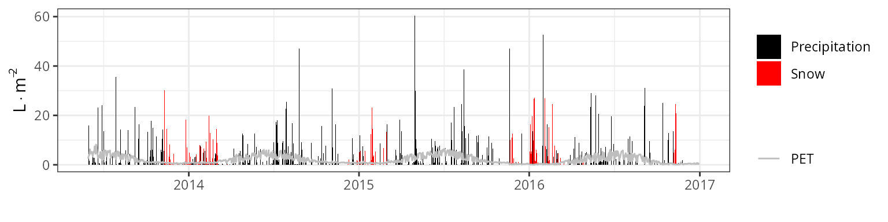

### Microclimate

### Runoff & deep drainage

### Evaluation results

#### Soil water content (SWC.1)

    ## Error in data.frame(Dates = as.Date(d), Observed = NA, Modelled = sm[[var_mod]]): arguments imply differing number of rows: 0, 1

    ## Error in data.frame(..., check.names = FALSE): arguments imply differing number of rows: 4, 3

    ## Error: object 'df_all_SMC' not found

    ## Error: object 'df_all_SMC' not found

#### Soil water content (SWC.3)

    ## Error in data.frame(Dates = as.Date(d), Observed = NA, Modelled = sm[[var_mod]]): arguments imply differing number of rows: 0, 1

    ## Error in data.frame(..., check.names = FALSE): arguments imply differing number of rows: 4, 3

    ## Error: object 'df_all_SMC' not found

    ## Error: object 'df_all_SMC' not found

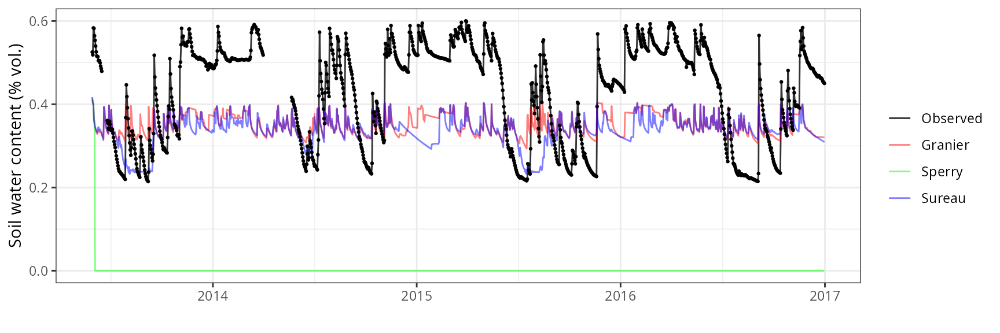

#### Soil water content (SWC.4)

    ## Error in data.frame(Dates = as.Date(d), Observed = NA, Modelled = sm[[var_mod]]): arguments imply differing number of rows: 0, 1

    ## Error in data.frame(..., check.names = FALSE): arguments imply differing number of rows: 4, 3

    ## Error: object 'df_all_SMC' not found

    ## Error: object 'df_all_SMC' not found

#### Transpiration per leaf area

| Site | Cohort | Mode | n | Bias | Bias.rel | MAE | MAE.rel | r | NSE | NSE.abs |
|:---|:---|:---|---:|---:|---:|---:|---:|---:|---:|---:|
| LOTSCHENTAL | T1_1956 | granier | 572 | -0.6039623 | -86.7662577 | 0.6116333 | 87.86829 | 0.4120099 | -1.5697464 | -0.5204192 |
| LOTSCHENTAL | T1_1956 | sperry | 572 | -0.6960797 | -100.0000000 | 0.6960797 | 100.00000 | NA | -2.2232712 | -0.7303389 |
| LOTSCHENTAL | T1_1956 | sureau | 572 | -0.4549944 | -65.3652704 | 0.5091861 | 73.15054 | 0.4158550 | -0.7870801 | -0.2657523 |
| LOTSCHENTAL | T2_2602 | granier | 695 | -0.1024756 | -37.7279849 | 0.1673835 | 61.62482 | 0.4913074 | 0.0073525 | 0.0938739 |
| LOTSCHENTAL | T2_2602 | sperry | 695 | -0.2670687 | -98.3254983 | 0.2705248 | 99.59791 | 0.0897168 | -1.5920365 | -0.4644792 |
| LOTSCHENTAL | T2_2602 | sureau | 695 | -0.0026150 | -0.9627351 | 0.1366533 | 50.31103 | 0.6188276 | 0.2519476 | 0.2602309 |

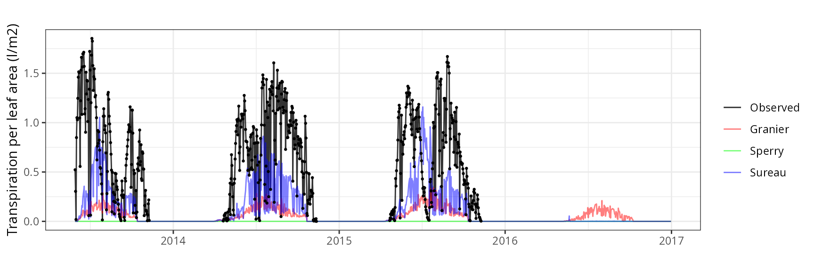

## Morgan-Monroe

### General information

| Attribute | Value |
|:---|:---|
| Plot name | Morgan-Mornoe |
| Country | USA |
| SAPFLUXNET code | USA_MOR_SF |
| SAPFLUXNET contributor (affiliation) | Koong Yi (Indiana University Bloomington) |
| FLUXNET/ICOS code | US-MMS |
| FLUXNET/ICOS contributor (affiliation) | Kim Novick (Indiana University) |
| Latitude (º) | 39.323011 |
| Longitude (º) | -86.413321 |
| Elevation (m) | 275 |
| Slope (º) | 0 |
| Aspect (º) | 0 |
| Parent material |  |
| Soil texture | Silty clay loam |
| MAT (ºC) | 12 |
| MAP (mm) | 1159 |
| Forest stand | Mixed temperate forest |
| Stand LAI | 5 |
| Stand description DOI |  |
| Species simulated | Acer saccharum, Liriodendron tulipifera, Quercus rubra, Quercus alba |
| Species parameter table | SpParamsUS |
| Simulation period | 2011-2013 |
| Evaluation period | 2011-2013 |

### Model inputs

#### Vegetation

| Species                 |   DBH | Height | N   | Z50 | Z95 |  LAI | Cover |
|:------------------------|------:|-------:|:----|:----|:----|-----:|------:|
| Acer saccharum          | 42.50 |   2700 | NA  | NA  | NA  | 1.25 |    NA |
| Liriodendron tulipifera | 62.75 |   2700 | NA  | NA  | NA  | 1.25 |    NA |
| Quercus rubra           | 44.60 |   2700 | NA  | NA  | NA  | 1.25 |    NA |
| Quercus alba            | 37.50 |   2700 | NA  | NA  | NA  | 1.25 |    NA |
| Herbaceous layer        |    NA |     20 | NA  | NA  | NA  |   NA |    10 |

#### Soil

| widths |  clay |      sand |    om |    bd |  rfc |
|-------:|------:|----------:|------:|------:|-----:|
|    300 | 24.70 |  8.166667 | 1.940 | 1.430 |  3.0 |
|    700 | 27.95 | 11.000000 | 0.265 | 1.645 |  4.3 |
|   1000 | 35.30 | 20.100000 | 0.180 | 1.740 | 75.0 |
|   2500 | 35.30 | 20.100000 | 0.000 | 1.740 | 95.0 |

#### Custom traits

| Species                 |    Al2As |
|:------------------------|---------:|
| Acer saccharum          | 7365.000 |
| Liriodendron tulipifera | 6658.333 |
| Quercus rubra           | 5730.000 |
| Quercus alba            | 6880.000 |

#### Custom control

||
||
||

#### Remarks

| Title         | Remark                                   |
|:--------------|:-----------------------------------------|
| Soil          | Taken from SoilGrids                     |
| Vegetation    | Understory not considered                |
| Weather       | Using FLUXNET weather                    |
| Soil moisture | Taken from FLUXNET data                  |
| Sapflow       | Scaling and tree selection to be revised |

### Macroclimate

### Microclimate

### Runoff & deep drainage

### Evaluation results

#### Sensible heat turbulent flux

    ## Error in data.frame(Dates = as.Date(d), Observed = NA, Modelled = Hmod): arguments imply differing number of rows: 0, 1

    ## Error in data.frame(..., check.names = FALSE): arguments imply differing number of rows: 3, 2

    ## Error: object 'df_all_H' not found

    ## Error: object 'df_all_H' not found

#### Latent heat turbulent flux

    ## Error in data.frame(Dates = as.Date(d), Observed = NA, Modelled = LEmod): arguments imply differing number of rows: 0, 1

    ## Error in data.frame(..., check.names = FALSE): arguments imply differing number of rows: 3, 2

    ## Error: object 'df_all_LE' not found

    ## Error: object 'df_all_LE' not found

#### Gross primary productivity

    ## Error in rowSums(out$Plants$GrossPhotosynthesis): 'x' must be an array of at least two dimensions

    ## Error in data.frame(..., check.names = FALSE): arguments imply differing number of rows: 4, 3

    ## Error: object 'df_all_GPP' not found

    ## Error: object 'df_all_GPP' not found

#### Soil water content (SWC)

    ## Error in data.frame(Dates = as.Date(d), Observed = NA, Modelled = sm[[var_mod]]): arguments imply differing number of rows: 0, 1

    ## Error in data.frame(..., check.names = FALSE): arguments imply differing number of rows: 4, 3

    ## Error: object 'df_all_SMC' not found

    ## Error: object 'df_all_SMC' not found

#### Transpiration per leaf area

| Site | Cohort | Mode | n | Bias | Bias.rel | MAE | MAE.rel | r | NSE | NSE.abs |
|:---|:---|:---|---:|---:|---:|---:|---:|---:|---:|---:|
| USAMORSF | T1_57 | granier | 159 | 0.1710568 | 97.18187 | 0.1710568 | 97.18187 | 0.4691369 | -8.971652 | -3.0662602 |
| USAMORSF | T1_57 | sperry | 159 | 0.4238982 | 240.82768 | 0.4397722 | 249.84611 | 0.1225056 | -136.783819 | -9.4540007 |
| USAMORSF | T1_57 | sureau | 159 | -0.1760172 | -100.00000 | 0.1760172 | 100.00000 | NA | -9.063758 | -3.1841758 |
| USAMORSF | T2_1644 | granier | 154 | 0.1092573 | 48.54284 | 0.1365711 | 60.67830 | 0.1994919 | -1.160739 | -0.6515981 |
| USAMORSF | T2_1644 | sperry | 154 | -0.0417615 | -18.55455 | 0.2440215 | 108.41831 | -0.0860125 | -6.084363 | -1.9510297 |
| USAMORSF | T2_1644 | sureau | 154 | -0.2250741 | -100.00000 | 0.2250741 | 100.00000 | NA | -4.220847 | -1.7218925 |
| USAMORSF | T3_2591 | granier | 119 | 0.2126944 | 161.81646 | 0.2126944 | 161.81646 | 0.2014337 | -40.748551 | -8.7534912 |
| USAMORSF | T3_2591 | sperry | 119 | -0.1310615 | -99.71073 | 0.1310615 | 99.71073 | -0.2861297 | -14.317325 | -5.0100666 |
| USAMORSF | T3_2591 | sureau | 119 | -0.1314418 | -100.00000 | 0.1314418 | 100.00000 | NA | -14.397289 | -5.0275024 |
| USAMORSF | T4_2536 | granier | 119 | 0.2619603 | 264.35815 | 0.2619603 | 264.35815 | 0.1636680 | -110.666245 | -15.4781404 |
| USAMORSF | T4_2536 | sperry | 119 | -0.0984025 | -99.30324 | 0.0984025 | 99.30324 | -0.2017966 | -14.626280 | -5.1898329 |
| USAMORSF | T4_2536 | sureau | 119 | -0.0990930 | -100.00000 | 0.0990930 | 100.00000 | NA | -14.829472 | -5.2332637 |

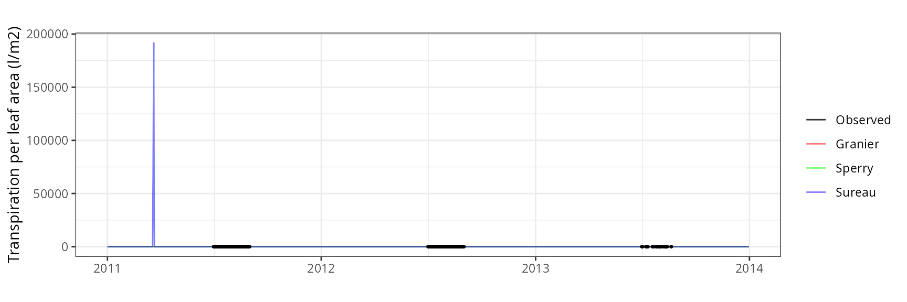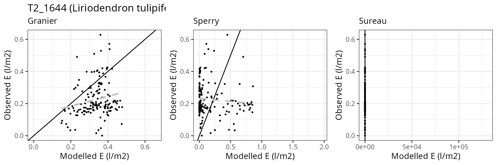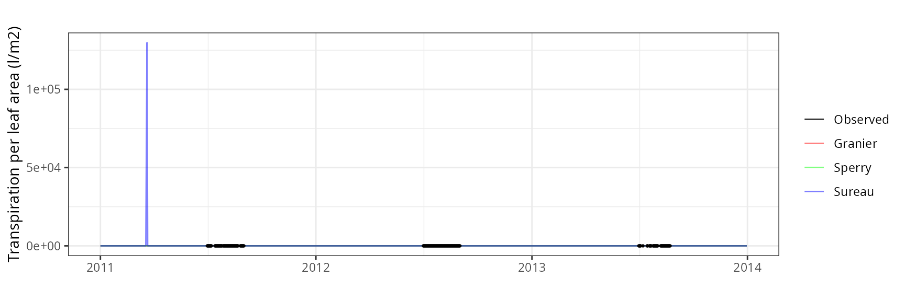

## Sevilleta

### General information

| Attribute | Value |
|:---|:---|
| Plot name | Sevilleta |
| Country | USA |
| SAPFLUXNET code | USA_PJS_P04_AMB |
| SAPFLUXNET contributor (affiliation) | William Pockman (University of New Mexico, USA) |
| FLUXNET/ICOS code |  |
| FLUXNET/ICOS contributor (affiliation) |  |
| Latitude (º) | 34.386389 |
| Longitude (º) | -106.529444 |
| Elevation (m) | 1911 |
| Slope (º) | 1 |
| Aspect (º) | 0 |
| Parent material |  |
| Soil texture | Sandy loam |
| MAT (ºC) | 12.7 |
| MAP (mm) | 311 |
| Forest stand | Mixed pine-juniper forest |
| Stand LAI | 0.71 |
| Stand description DOI | 10.1890/ES11-00369.1 |
| Species simulated | Pinus edulis, Juniperus monosperma |
| Species parameter table | SpParamsUS |
| Simulation period | 2010-2016 |
| Evaluation period | 2010-2016 |

### Model inputs

#### Vegetation

| Species              |   DBH | Height |   N | Z50 |  Z95 |       LAI | Cover |
|:---------------------|------:|-------:|----:|----:|-----:|----------:|------:|
| Pinus edulis         | 19.18 |  484.2 |  77 | 150 | 2500 | 0.0844801 |    NA |
| Juniperus monosperma | 32.66 |  379.2 | 273 | 150 | 2500 | 0.6244180 |    NA |
| Herbaceous layer     |    NA |   20.0 |  NA |  NA |   NA |        NA |     5 |

#### Soil

| widths |     clay |     sand |        om |    bd |  rfc | VG_theta_sat | VG_theta_res |
|-------:|---------:|---------:|----------:|------:|-----:|-------------:|-------------:|
|    100 | 18.66667 | 51.96667 | 1.3033333 | 1.450 | 18.6 |          0.2 |        0.001 |
|    100 | 22.68000 | 48.82000 | 1.1380000 | 1.502 | 40.0 |          0.2 |        0.001 |
|    200 | 24.50000 | 47.43333 | 0.8200000 | 1.530 | 50.0 |          0.2 |        0.001 |
|    300 | 23.18182 | 48.30909 | 0.4518182 | 1.550 | 55.0 |          0.2 |        0.001 |
|    300 | 21.80000 | 49.40000 | 0.2700000 | 1.550 | 65.0 |          0.2 |        0.001 |
|   1000 | 21.00000 | 51.90000 | 0.1600000 | 1.540 | 90.0 |          0.2 |        0.001 |
|   2500 | 21.00000 | 51.90000 | 0.0000000 | 1.540 | 95.0 |          0.2 |        0.001 |

#### Custom traits

| Species              | Kmax_stemxylem |    Al2As |
|:---------------------|---------------:|---------:|
| Pinus edulis         |           0.25 | 1872.270 |
| Juniperus monosperma |           0.25 | 2577.026 |

#### Custom control

||
||
||

#### Remarks

| Title      | Remark                                                     |
|:-----------|:-----------------------------------------------------------|
| Soil       | Taken from SoilGrids with theta_sat and theta_res modified |
| Vegetation | Understory not considered                                  |

### Macroclimate

### Microclimate

    ## Error in xy.coords(x, y, xlabel, ylabel, log): 'x' and 'y' lengths differ

### Runoff & deep drainage

    ## Error in plot.window(...): need finite 'xlim' values

### Evaluation results

#### Soil water content (SWC.2)

    ## Error in data.frame(Dates = as.Date(d), Observed = NA, Modelled = sm[[var_mod]]): arguments imply differing number of rows: 0, 1

| Site | Mode | n | Bias | Bias.rel | MAE | MAE.rel | r | NSE | NSE.abs |
|:---|:---|---:|---:|---:|---:|---:|---:|---:|---:|
| SEVILLETA | granier | 2178 | 0.002078 | 3.33171 | 0.0212112 | 34.0082 | 0.5898673 | 0.3287251 | 0.1994663 |
| SEVILLETA | sperry | 2178 | 0.002078 | 3.33171 | 0.0212112 | 34.0082 | 0.5898673 | 0.3287251 | 0.1994663 |
| NA | NA | 2178 | 0.002078 | 3.33171 | 0.0212112 | 34.0082 | 0.5898673 | 0.3287251 | 0.1994663 |

    ## Error in data.frame(Dates = as.Date(d), Observed = NA, Modelled = sm[[var_mod]]): arguments imply differing number of rows: 0, 1

    ## Error in data.frame(Dates = as.Date(d), Observed = NA, Modelled = sm[[var_mod]]): arguments imply differing number of rows: 0, 1

    ## Error in data.frame(Dates = as.Date(d), Observed = NA, Modelled = sm[[var_mod]]): arguments imply differing number of rows: 0, 1

    ## Error in data.frame(Dates = as.Date(d), Observed = NA, Modelled = sm[[var_mod]]): arguments imply differing number of rows: 0, 1

#### Soil water content (SWC.4)

    ## Error in data.frame(Dates = as.Date(d), Observed = NA, Modelled = sm[[var_mod]]): arguments imply differing number of rows: 0, 1

| Site | Mode | n | Bias | Bias.rel | MAE | MAE.rel | r | NSE | NSE.abs |
|:---|:---|---:|---:|---:|---:|---:|---:|---:|---:|
| SEVILLETA | granier | 2178 | 0.0243602 | 39.94145 | 0.030584 | 50.14622 | 0.0750284 | -2.749334 | -1.249642 |
| SEVILLETA | sperry | 2178 | 0.0243602 | 39.94145 | 0.030584 | 50.14622 | 0.0750284 | -2.749334 | -1.249642 |
| NA | NA | 2178 | 0.0243602 | 39.94145 | 0.030584 | 50.14622 | 0.0750284 | -2.749334 | -1.249642 |

    ## Error in data.frame(Dates = as.Date(d), Observed = NA, Modelled = sm[[var_mod]]): arguments imply differing number of rows: 0, 1

    ## Error in data.frame(Dates = as.Date(d), Observed = NA, Modelled = sm[[var_mod]]): arguments imply differing number of rows: 0, 1

    ## Error in data.frame(Dates = as.Date(d), Observed = NA, Modelled = sm[[var_mod]]): arguments imply differing number of rows: 0, 1

    ## Error in data.frame(Dates = as.Date(d), Observed = NA, Modelled = sm[[var_mod]]): arguments imply differing number of rows: 0, 1

#### Transpiration per leaf area

| Site | Cohort | Mode | n | Bias | Bias.rel | MAE | MAE.rel | r | NSE | NSE.abs |
|:---|:---|:---|---:|---:|---:|---:|---:|---:|---:|---:|
| SEVILLETA | T1_2222 | granier | 1787 | 0.4943358 | 313.9768 | 0.4946026 | 314.1463 | 0.2514512 | -21.435589 | -4.716608 |
| SEVILLETA | T2_1548 | granier | 1776 | 0.2305316 | 175.3820 | 0.2313366 | 175.9944 | 0.4977085 | -7.728738 | -2.179814 |

    ## Error in data.frame(Dates = as.Date(d), Observed = NA, Modelled = pt[, : arguments imply differing number of rows: 0, 1
