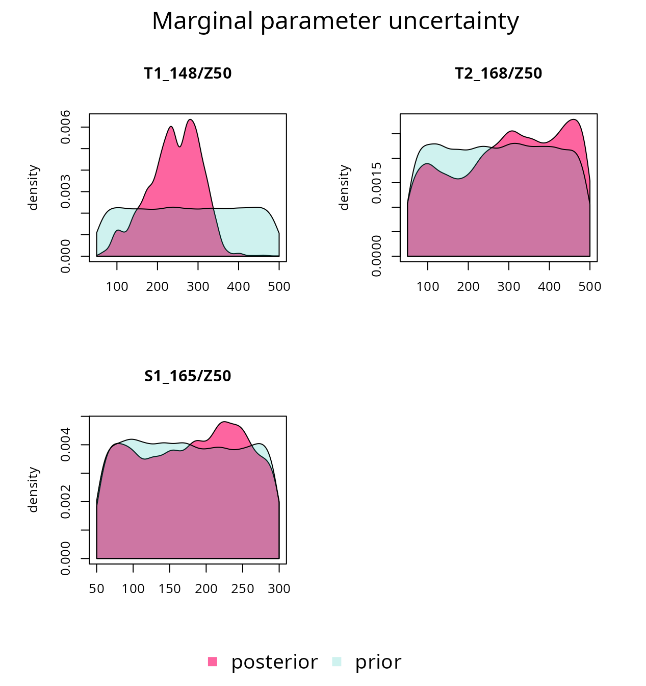
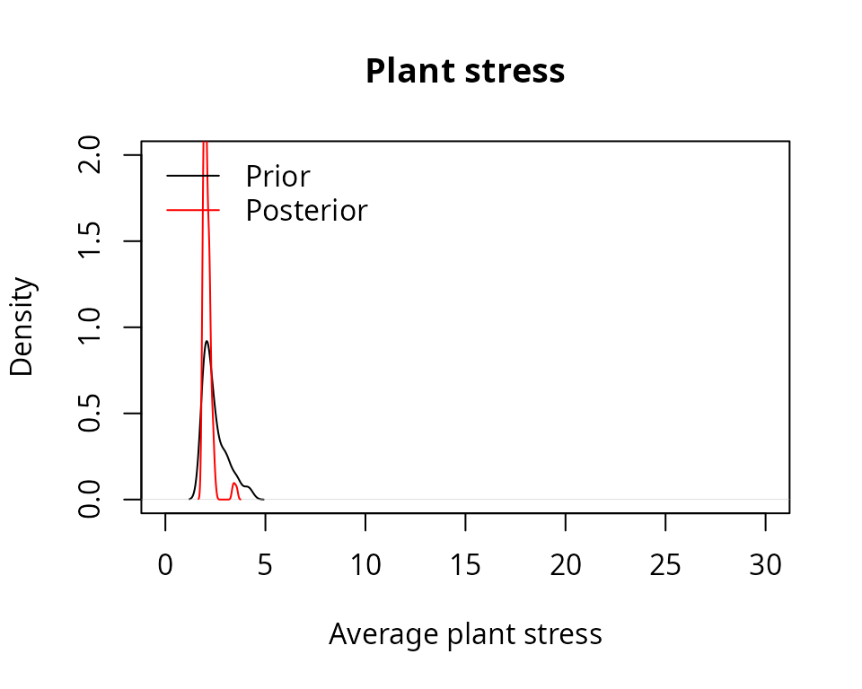

# Sensitivity analysis and calibration

## About this vignette

The present document shows how to conduct a sensitivity analyses and
calibration exercises on the simulation models included in package
`medfate`. The document is written assuming that the user is
familiarized with the basic water balance model (i.e. function `spwb`).
The aim of the exercises presented here are:

1.  To determine which
    [`spwb()`](https://emf-creaf.github.io/medfate/reference/spwb.md)
    model parameters are more influential in determining stand
    transpiration and plant drought stress.
2.  To determine which model parameters are more influential to
    determine model fit to soil water content dynamics.
3.  To reduce the uncertainty in parameters determining fine root
    distribution, given an observed data set of soil water content
    dynamics.

As an example data set we will use here the same data sets provided to
illustrate simulation functions in **medfate**. We begin by loading the
package and the example forest data:

``` r
library(medfate)
```

    ## Package 'medfate' [ver. 4.9.0]

``` r
data(exampleforest)
exampleforest
```

    ## $treeData
    ##            Species   DBH Height   N Z50  Z95
    ## 1 Pinus halepensis 37.55    800 168 100  300
    ## 2     Quercus ilex 14.60    660 384 300 1000
    ## 
    ## $shrubData
    ##             Species Height Cover Z50  Z95
    ## 1 Quercus coccifera     80  3.75 200 1000
    ## 
    ## attr(,"class")
    ## [1] "forest" "list"

We also load the species parameter table and the example weather
dataset:

``` r
data(SpParamsMED)
data(examplemeteo)
```

## Preparing model inputs

We will focus on three species/cohorts of the example data set:

``` r
PH_coh = paste0("T1_", SpParamsMED$SpIndex[SpParamsMED$Name=="Pinus halepensis"])
QI_coh = paste0("T2_", SpParamsMED$SpIndex[SpParamsMED$Name=="Quercus ilex"])
QC_coh = paste0("S1_", SpParamsMED$SpIndex[SpParamsMED$Name=="Quercus coccifera"])
```

The data set consists of a forest with two tree species (*Pinus
halepensis*/T1_148 and *Quercus ilex*/T2_168) and one shrub species
(*Quercus coccifera*/S1_165 or Kermes oak).

We first define a soil with four layers (default values of texture, bulk
density and rock content) and the species input parameters for
simulation function
[`spwb()`](https://emf-creaf.github.io/medfate/reference/spwb.md):

``` r
examplesoil <- defaultSoilParams(4)
x1 <- spwbInput(exampleforest,examplesoil, SpParamsMED, control = defaultControl())
```

Although it is not necessary, we make an initial call to the model
([`spwb()`](https://emf-creaf.github.io/medfate/reference/spwb.md)) with
the default parameter settings:

``` r
S1<-spwb(x1, examplemeteo, latitude = 41.82592, elevation = 100)
```

    ## Package 'meteoland' [ver. 2.2.4]

    ## Initial plant water content (mm): 4.69853
    ## Initial soil water content (mm): 290.875
    ## Initial snowpack content (mm): 0
    ## Performing daily simulations
    ## 
    ##  [Year 2001]:............
    ## 
    ## Final plant water content (mm): 4.69674
    ## Final soil water content (mm): 275.757
    ## Final snowpack content (mm): 0
    ## Change in plant water content (mm): -0.00178912
    ## Plant water balance result (mm): -0.00180604
    ## Change in soil water content (mm): -15.1184
    ## Soil water balance result (mm): -15.1184
    ## Change in snowpack water content (mm): 0
    ## Snowpack water balance result (mm): -7.10543e-15
    ## Water balance components:
    ##   Precipitation (mm) 513 Rain (mm) 462 Snow (mm) 51
    ##   Interception (mm) 83 Net rainfall (mm) 380
    ##   Infiltration (mm) 410 Infiltration excess (mm) 21 Saturation excess (mm) 0 Capillarity rise (mm) 0
    ##   Soil evaporation (mm) 25  Herbaceous transpiration (mm) 0 Woody plant transpiration (mm) 246
    ##   Plant extraction from soil (mm) 246  Plant water balance (mm) -0 Hydraulic redistribution (mm) 2
    ##   Runoff (mm) 21 Deep drainage (mm) 154

Function
[`spwb()`](https://emf-creaf.github.io/medfate/reference/spwb.md) will
be implicitly called multiple times in the sensitivity analyses and
calibration analyses that we will illustrate below.

## Sensitivity analysis

### Introduction and input factors

Model sensitivity analyses are used to investigate how variation in the
output of a numerical model can be attributed to variations of its
*input factors*. Input factors are elements that can be changed before
model execution and may affect its output. They can be model parameters,
initial values of state variables, boundary conditions or the input
forcing data (Pianosi et al. 2016).

According to Saltelli et al. (2016), there are three main purposes of
sensitivity analyses:

- *Ranking* aims at generating the ranking of the input factors
  according to their relative contribution to the output variability.
- *Screening* aims at identifying the input factors, if any, which have
  a negligible influence on the output variability.
- *Mapping* aims at determining the region of the input variability
  space that produces significant output values.

Here we will mostly interested in ranking parameters according to
different objectives. We will take as input factors three plant traits
(leaf area index, fine root distribution and the water potential
corresponding to a reduction in plant conductance) in the three plant
cohorts (species), and two soil factors (the rock fragment content of
soil layer 1 and 2). In total, eleven model parameters will be studied.
The following shows the initial values for plant trait parameters:

``` r
x1$above$LAI_live
```

    ## [1] 0.84874773 0.70557382 0.03062604

``` r
x1$below$Z50
```

    ## [1] 100 300 200

``` r
x1$paramsTransp$Psi_Extract
```

    ## [1] -0.9218219 -1.9726871 -2.1210726

``` r
x1$soil$rfc[1:2]
```

    ## [1] 25 45

In the following code we define a vector of parameter names (using
naming rules of function
[`modifyInputParams()`](https://emf-creaf.github.io/medfate/reference/modifyParams.md))
as well as the input variability space, defined by the minimum and
maximum parameter values:

``` r
#Parameter names of interest
parNames = c(paste0(PH_coh,"/LAI_live"), paste0(QI_coh,"/LAI_live"), paste0(QC_coh,"/LAI_live"),
             paste0(PH_coh,"/Z50"), paste0(QI_coh,"/Z50"), paste0(QC_coh,"/Z50"),
             paste0(PH_coh,"/Psi_Extract"), paste0(QI_coh,"/Psi_Extract"), paste0(QC_coh,"/Psi_Extract"),
             "rfc@1", "rfc@2")
parNames
```

    ##  [1] "T1_148/LAI_live"    "T2_168/LAI_live"    "S1_165/LAI_live"   
    ##  [4] "T1_148/Z50"         "T2_168/Z50"         "S1_165/Z50"        
    ##  [7] "T1_148/Psi_Extract" "T2_168/Psi_Extract" "S1_165/Psi_Extract"
    ## [10] "rfc@1"              "rfc@2"

``` r
#Parameter minimum and maximum values
parMin = c(0.1,0.1,0.1,
           100,100,50,
           -5,-5,-5,
           25,25)
parMax = c(2,2,2,
           500,500,300,
           -1,-1,-1,
           75,75)
```

### Model output functions

In sensitivity analyses, model output is summarized into a single
variable whose variation is to be analyzed. Pianosi et al. (2016)
distinguish two types of model output functions:

- *objective functions* (also called loss or cost functions), which are
  measures of model performance calculated by comparison of modelled and
  observed variables.
- *prediction functions*, which are scalar values that are provided to
  the model-user for their practical use, and that can be computed even
  in the absence of observations.

Here we will use examples of both kinds. First, we define a function
that, given a simulation result, calculates total transpiration (mm)
over the simulated period (one year):

``` r
sf_transp<-function(x) {sum(x$WaterBalance$Transpiration, na.rm=TRUE)}
sf_transp(S1)
```

    ## [1] 245.8917

Another prediction function can focus on plant drought stress. We define
a function that, given a simulation result, calculates the average
drought stress of plants (measured using the water stress index) over
the simulated period:

``` r
sf_stress<-function(x) {
  lai <- x$spwbInput$above$LAI_live
  lai_p <- lai/sum(lai)
  stress <- droughtStress(x, index="WSI", draw = F)
  mean(sweep(stress,2, lai_p, "*"), na.rm=T)
}
sf_stress(S1)
```

    ## [1] 3.014939

Sensitivity analysis requires model output functions whose parameters
are the input factors to be studied.
``` math
\begin{equation}
y = g(\mathbf{x}) = g(x_1, x_2, \dots, x_n)
\end{equation}
```
where $`y`$ is the output, $`g`$ is the output function and
$`\mathbf{x} = \{x_1, x_2, \dots, x_n\}`$ is the vector of parameter
input factors. Functions `of_transp` and `of_stress` take simulation
results as input, not values of input factors. Instead, we need to
define functions that take soil and plant trait values as input, run the
soil plant water balance model and return the desired prediction or
performance statistic. These functions can be generated using the
function factory
[`optimization_function()`](https://emf-creaf.github.io/medfate/reference/optimization.md).
The following code defines one of such functions focusing on total
transpiration:

``` r
of_transp<-optimization_function(parNames = parNames,
                                 x = x1,
                                 meteo = examplemeteo, 
                                 latitude = 41.82592, elevation = 100,
                                 summary_function = sf_transp)
```

Note that we provided all the data needed for simulations as input to
[`optimization_function()`](https://emf-creaf.github.io/medfate/reference/optimization.md),
as well as the names of the parameters to study and the function
`sf_transp`. The resulting object `of_transp` is a function itself,
which we can call with parameter values (or sets of parameter values) as
input:

``` r
of_transp(parMin)
```

    ## [1] 47.55251

``` r
of_transp(parMax)
```

    ## [1] 47.54563

It is important to understand the steps that are done when we call
`of_transp()`:

1.  The function `of_transp()` calls
    [`spwb()`](https://emf-creaf.github.io/medfate/reference/spwb.md)
    using all the parameters specified in its construction (i.e. in the
    call to the function factory), except for the input factors
    indicated in `parNames`, which are specified as input at the time of
    calling `of_transp()`.
2.  The result of soil plant water balance is then passed to function
    `sf_transp()` and the output of this last function is returned as
    output of `of_transp()`.

We can build a similar model output function, in this case focusing on
plant stress (note that the only difference in the call to the factory
is in the specification of `sf_stress` as summary function, instead of
`sf_transp`).

``` r
of_stress<-optimization_function(parNames = parNames,
                                 x = x1, 
                                 meteo = examplemeteo, 
                                 latitude = 41.82592, elevation = 100,
                                 summary_function = sf_stress)
of_stress(parMin)
```

    ## [1] 0.6596808

``` r
of_stress(parMax)
```

    ## [1] 4061.592

As mentioned above, another kind of output function can be the
evaluation of model performance. Here we will assume that performance in
terms of predictability of soil water content is desired; and use a data
set of ‘observed’ values (actually simulated values with gaussian error)
as reference:

``` r
data(exampleobs)
head(exampleobs)
```

    ##        dates       SWC       ETR  E_T1_148   E_T2_168 FMC_T1_148 FMC_T2_168
    ## 1 2001-01-01 0.2962333 1.9268816 0.1116097 0.11753707   125.7854   92.37503
    ## 2 2001-01-02 0.3159541 2.2816835 0.3249353 0.13893958   125.8402   92.48357
    ## 3 2001-01-03 0.3003183 0.8314027 0.2478905 0.15491876   125.6325   93.22082
    ## 4 2001-01-04 0.3071126 1.7637425 0.1188838 0.03248267   125.8408   94.41697
    ## 5 2001-01-05 0.3011500 2.0395763 0.3029751 0.17022440   125.8633   92.67986
    ## 6 2001-01-06 0.3218914 2.3144055 0.2238069 0.16316259   125.9310   92.75314
    ##     BAI_T1_148 BAI_T2_168    DI_T1_148 DI_T2_168
    ## 1 5.400075e-06          0 2.237862e-07         0
    ## 2 7.635458e-10          0 3.318207e-11         0
    ## 3 9.234631e-14          0 0.000000e+00         0
    ## 4 5.206642e-11          0 2.706335e-13         0
    ## 5 2.574299e-03          0 2.450483e-05         0
    ## 6 1.798663e-03          0 3.173236e-05         0

where soil water content dynamics is in column `SWC`. The model fit to
observed data can be measured using the Nash-Sutcliffe coefficient,
which we calculate for the initial run using function
[`evaluation_metric()`](https://emf-creaf.github.io/medfate/reference/evaluation.md):

``` r
evaluation_metric(S1, measuredData = exampleobs, type = "SWC", 
                  metric = "NSE")
```

    ## [1] 0.9264716

A call to
[`evaluation_metric()`](https://emf-creaf.github.io/medfate/reference/evaluation.md)
provides the coefficient given a model simulation result, but is not a
model output function as we defined above. Analogously to the measures
of total transpiration and average plant stress, we can use a function
factory to define a model output function that takes input factors as
inputs, runs the model and performs the evaluation:

``` r
of_eval<-optimization_evaluation_function(parNames = parNames,
                x = x1,
                meteo = examplemeteo, latitude = 41.82592, elevation = 100,
                measuredData = exampleobs, type = "SWC", 
                metric = "NSE")
```

Function `of_eval()` stores internally both the data needed for
conducting simulations and the data needed for evaluating simulation
results, so that we only need to provide values for the input factors:

``` r
of_eval(parMin)
```

    ## [1] 0.3322987

``` r
of_eval(parMax)
```

    ## [1] -54.59197

### Global sensitivity analyses

Sensitivity analysis is either referred to as *local* or *global*,
depending on variation of input factors is studied with respect to some
initial parameter set (local) or the whole space of input factors is
taken into account (global). Here we will conduct global sensitivity
analyses using package **sensitivity** (Ioss et al. 2020):

``` r
library(sensitivity)
```

    ## Registered S3 method overwritten by 'sensitivity':
    ##   method    from 
    ##   print.src dplyr

    ## 
    ## Attaching package: 'sensitivity'

    ## The following object is masked from 'package:medfate':
    ## 
    ##     extract

This package provides a suite of approaches to global sensitivity
analysis. Among them, we will follow the *Elementary Effect Test*
implemented in function
[`morris()`](https://rdrr.io/pkg/sensitivity/man/morris.html). We call
this function to analyze sensitivity of total transpiration simulated by
[`spwb()`](https://emf-creaf.github.io/medfate/reference/spwb.md) to
input factors (500 runs are done, so be patient):

``` r
sa_transp <- morris(of_transp, parNames, r = 50, 
             design = list(type = "oat", levels = 10, grid.jump = 3), 
             binf = parMin, bsup = parMax, scale=TRUE, verbose=FALSE)
```

Apart from indicating the sampling design to sample the input factor
space, the call to
[`morris()`](https://rdrr.io/pkg/sensitivity/man/morris.html) includes
the response model function (in our case `of_transp`), the parameter
names and parameter value boundaries (i.e. `parMin` and `parMax`).

``` r
print(sa_transp)
```

    ## 
    ## Call:
    ## morris(model = of_transp, factors = parNames, r = 50, design = list(type = "oat",     levels = 10, grid.jump = 3), binf = parMin, bsup = parMax,     scale = TRUE, verbose = FALSE)
    ## 
    ## Model runs: 600 
    ##                             mu     mu.star      sigma
    ## T1_148/LAI_live    153.6591445 162.6752000 84.4307909
    ## T2_168/LAI_live     95.3652583 107.8969236 62.7946309
    ## S1_165/LAI_live    146.7424176 152.7440550 72.7860722
    ## T1_148/Z50          -3.1140109   4.9123925 10.9257630
    ## T2_168/Z50          -1.0121568   2.3895855  8.0897898
    ## S1_165/Z50           0.1440795   0.4817739  0.9125476
    ## T1_148/Psi_Extract  -3.1010337   6.1051877 10.9368259
    ## T2_168/Psi_Extract  -2.6449397   3.5882482  5.8285725
    ## S1_165/Psi_Extract  -0.4657024   3.3910221  9.9270164
    ## rfc@1              -10.0489723  10.0489723 17.5544947
    ## rfc@2              -16.0083538  16.0112776 33.9905052

`mu.star` values inform about the mean of elementary effects of each
$`i`$ factor and can be used to rank all the input factors, whereas
`sigma` inform about the degree of interaction of the $`i`$-th factor
with others. According to the result of this sensitivity analysis, leaf
area index (`LAI_live`) parameters are the most relevant to determine
total transpiration, much more than fine root distribution (`Z50`), the
rock fragment content in the soil and the water potentials corresponding
to whole-plant conductance reduction (i.e. `Psi_Extract`).

``` r
plot(sa_transp, xlim=c(0,150))
```


We can run the same sensitivity analysis but focusing on the input
factors relevant for predicted plant drought stress (i.e. using
`of_stress` as model output function):

``` r
sa_stress <- morris(of_stress, parNames, r = 50, 
             design = list(type = "oat", levels = 10, grid.jump = 3), 
             binf = parMin, bsup = parMax, scale=TRUE, verbose=FALSE)
```

``` r
print(sa_stress)
```

    ## 
    ## Call:
    ## morris(model = of_stress, factors = parNames, r = 50, design = list(type = "oat",     levels = 10, grid.jump = 3), binf = parMin, bsup = parMax,     scale = TRUE, verbose = FALSE)
    ## 
    ## Model runs: 600 
    ##                            mu    mu.star     sigma
    ## T1_148/LAI_live    39.3701732 40.6280153 43.012050
    ## T2_168/LAI_live    24.2422700 24.2422700 28.709054
    ## S1_165/LAI_live    34.2099445 34.2099445 37.462036
    ## T1_148/Z50          1.7496071  3.5329408  8.654708
    ## T2_168/Z50          0.2240808  1.5457806  3.052235
    ## S1_165/Z50         -0.2410193  0.7326172  1.020798
    ## T1_148/Psi_Extract -0.9947753  4.5214926 14.289468
    ## T2_168/Psi_Extract -3.1169767  3.1169767  9.000830
    ## S1_165/Psi_Extract -1.0580752  1.0580752  1.693242
    ## rfc@1               8.2724188  8.2724188 11.264721
    ## rfc@2               3.2186280 11.1825579 24.324838

Again, LAI values parameters are the most relevant, but closely followed
by the water potentials corresponding to whole-plant conductance
reduction (i.e. `Psi_Extract`), which appear as more relevant than
parameters of fine root distribution (`Z50`) and rock fragment content
(`rfc`).

``` r
plot(sa_stress, xlim=c(0,300))
```


Finally, we can study the contribution of input factors to model
performance in terms of soil water content dynamics (i.e. using
`of_eval` as model output function):

``` r
sa_eval <- morris(of_eval, parNames, r = 50, 
             design = list(type = "oat", levels = 10, grid.jump = 3), 
             binf = parMin, bsup = parMax, scale=TRUE, verbose=FALSE)
```

``` r
print(sa_eval)
```

    ## 
    ## Call:
    ## morris(model = of_eval, factors = parNames, r = 50, design = list(type = "oat",     levels = 10, grid.jump = 3), binf = parMin, bsup = parMax,     scale = TRUE, verbose = FALSE)
    ## 
    ## Model runs: 600 
    ##                             mu    mu.star     sigma
    ## T1_148/LAI_live    -12.8813849 12.8813849 6.7216712
    ## T2_168/LAI_live     -7.1523876  7.2482813 4.3856065
    ## S1_165/LAI_live    -10.3023170 10.3023170 5.9723072
    ## T1_148/Z50           2.9462338  2.9655605 2.8234231
    ## T2_168/Z50           0.7120910  0.7132248 0.4806898
    ## S1_165/Z50           0.4317170  0.4401409 0.2578594
    ## T1_148/Psi_Extract   0.2343639  0.3865185 0.7713386
    ## T2_168/Psi_Extract   0.1737744  0.1996813 0.3235109
    ## S1_165/Psi_Extract   0.1981883  0.2465299 0.5361140
    ## rfc@1               -2.0935668  2.2512164 2.6786947
    ## rfc@2               -1.3197193  1.6729610 1.9113855

Contrary to the previous cases, the contribution of LAI parameters is
similar to that of parameters of fine root distribution (`Z50`), which
appear as more relevant than the water potentials corresponding to
whole-plant conductance reduction (i.e. `Psi_Extract`).

``` r
plot(sa_eval, xlim=c(0,15))
```


## Calibration

By model calibration we mean here the process of finding suitable
parameter values (or suitable parameter distributions) given a set of
observations. Hence, the idea is to optimize the correspondence between
model predictions and observations by changing model parameter values.

### Defining parameter space and objective function

To simplify our analysis and avoid problems of parameter
identifiability, we focus here on the calibration of parameter `Z50` of
fine root distribution. Below we redefine vectors `parNames`, `parMin`,
and `parMax`; and we specify a vector of initial values.

``` r
#Parameter names of interest
parNames = c(paste0(PH_coh,"/Z50"), paste0(QI_coh,"/Z50"), paste0(QC_coh,"/Z50"))
#Parameter minimum and maximum values
parMin = c(50,50,50)
parMax = c(500,500,300)
parIni = x1$below$Z50
```

In order to run calibration analyses we need to define an objective
function. Many evaluation metrics could be used but it is common
practice to use *likelihood functions* . We can use the function factory
`optimization_evaluation_function` and the ‘observed’ data to this aim,
but in this case we specify a log-likelihood with Gaussian error as the
evaluation metric for `of_eval()`.

``` r
of_eval<-optimization_evaluation_function(parNames = parNames,
                x = x1,
                meteo = examplemeteo, latitude = 41.82592, elevation = 100,
                measuredData = exampleobs, type = "SWC", 
                metric = "loglikelihood")
```

### Calibration by gradient search

Model calibration can be performed using a broad range of approaches.
Many of them - including simulated annealing, genetic algorithms,
gradient methods, etc. - focus on the maximization or minimization of
the objective function. To illustrate this common approach, we will use
function `optim` from package **stats**, which provides several
optimization methods. In particular we will use “L-BFGS-B”, which is the
“BFGS” quasi-Newton method published by Broyden, Fletcher, Goldfarb and
Shanno, modified by the inclusion of minimum and maximum boundaries. By
default, function `optim` performs the minimization of the objective
function (here `of_eval`), but we can specify a negative value for
control parameter `fnscale` to turn the process into a maximization of
maximum likelihood:

``` r
opt_cal = optim(parIni, of_eval, method = "L-BFGS-B",
                control = list(fnscale = -1), verbose = FALSE)
```

The calibration result is the following:

``` r
print(opt_cal)
```

    ## $par
    ## [1] 305.8826 110.5760 187.2690
    ## 
    ## $value
    ## [1] 909.4165
    ## 
    ## $counts
    ## function gradient 
    ##       25       25 
    ## 
    ## $convergence
    ## [1] 0
    ## 
    ## $message
    ## [1] "CONVERGENCE: REL_REDUCTION_OF_F <= FACTR*EPSMCH"

Note that the optimized parameters are relatively close to those of
`Z50` in the original `x1`.

``` r
cbind( x1$below[,"Z50", drop = FALSE], opt_cal$par)
```

    ##        Z50 opt_cal$par
    ## T1_148 100    305.8826
    ## T2_168 300    110.5760
    ## S1_165 200    187.2690

This occurs because these default values were used to generate the
‘observed’ data in `exampleobs`, which contains a small amount of
non-systematic error.

### Bayesian calibration

As an example of a more sophisticated model calibration, we will conduct
a Bayesian calibration analysis using package **BayesianTools** (Hartig
et al. 2019):

``` r
library(BayesianTools)
```

In a Bayesian analysis one evaluates how the uncertainty in model
parameters is changed (hopefully reduced) after observing some data,
because observed values do not have the same likelihood under all
regions of the parameter space. For a Bayesian analysis we need to
specify a (log)likelihood function and the prior distribution (i.e. the
initial uncertainty) of the input factors. The central object in the
**BayesianTools** package is the `BayesianSetup`. This class, created by
calls to
[`createBayesianSetup()`](https://rdrr.io/pkg/BayesianTools/man/createBayesianSetup.html),
contains the information about the model to be fit (likelihood), and the
priors for model parameters. In absence of previous data, we specify a
uniform distribution between the minimum and maximum values, which in
the **BayesianTools** package can be done using function
[`createUniformPrior()`](https://rdrr.io/pkg/BayesianTools/man/createUniformPrior.html):

``` r
prior <- createUniformPrior(parMin, parMax, parIni)
mcmc_setup <- createBayesianSetup(likelihood = of_eval, 
                                  prior = prior, 
                                  names = parNames)
```

Function
[`createBayesianSetup()`](https://rdrr.io/pkg/BayesianTools/man/createBayesianSetup.html)
automatically creates the posterior and various convenience functions
for the Markov Chain Monte Carlo (MCMC) samplers. The
[`runMCMC()`](https://rdrr.io/pkg/BayesianTools/man/runMCMC.html)
function is the main wrapper for all other implemented MCMC functions.
Here we call it with nine chains of 1000 iterations each.

``` r
mcmc_out <- runMCMC(
  bayesianSetup = mcmc_setup, 
  sampler = "DEzs",
  settings = list(iterations = 1000, nrChains = 9))
```

By default
[`runMCMC()`](https://rdrr.io/pkg/BayesianTools/man/runMCMC.html) uses
parallel computation, but the calibration process is nevertheless rather
slow.

A summary function is provided to inspect convergence results and
correlation between parameters:

``` r
summary(mcmc_out)
```

    ## Parameter values  241.786576775968 295.749078259277 177.667831744866

    ## Problem encountered in the calculation of the likelihood with parameter 241.786576775968295.749078259277177.667831744866
    ##  Error message wasError in eval(expr, envir): Index out of bounds: [index='Z100'].
    ## 
    ##  set result of the parameter evaluation to -Inf ParameterValues

    ## # # # # # # # # # # # # # # # # # # # # # # # # # 
    ## ## MCMC chain summary ## 
    ## # # # # # # # # # # # # # # # # # # # # # # # # # 
    ##  
    ## # MCMC sampler:  DEzs 
    ## # Nr. Chains:  27 
    ## # Iterations per chain:  334 
    ## # Rejection rate:  0.751 
    ## # Effective sample size:  673 
    ## # Runtime:  2212.486  sec. 
    ##  
    ## # Parameters
    ##              psf     MAP    2.5%  median   97.5%
    ## T1_148/Z50 1.037 306.754 101.883 245.343 345.003
    ## T2_168/Z50 1.034 109.695  59.929 306.980 490.651
    ## S1_165/Z50 1.036 179.784  57.204 182.498 294.762
    ## 
    ## ## DIC:  -Inf 
    ## ## Convergence 
    ##  Gelman Rubin multivariate psrf:  1.077 
    ##  
    ## ## Correlations 
    ##            T1_148/Z50 T2_168/Z50 S1_165/Z50
    ## T1_148/Z50      1.000     -0.801     -0.128
    ## T2_168/Z50     -0.801      1.000      0.066
    ## S1_165/Z50     -0.128      0.066      1.000

According to the Gelman-Rubin diagnostic, the convergence can be
accepted because the multivariate potential scale reduction factor was ≤
1.1. We can plot the Markov Chains and the posterior density
distribution of parameters that they generate using:

``` r
plot(mcmc_out)
```

 We
can also plot the marginal prior and posterior density distributions for
each parameter. In this case, we see a similar `Z50` distribution for
the two trees, which is more informative than the prior distribution. In
contrast, the posterior distribution of `Z50` for the kermes oak remains
as uncertain as the prior one. This happens because the LAI value of
kermes oak is low, so that it has small influence on soil water dynamics
regardless of its root distribution.

``` r
marginalPlot(mcmc_out, prior = T)
```



Plots can also be produced to display the correlation between parameter
values.

``` r
correlationPlot(mcmc_out)
```


Here it can be observed the large correlation between `Z50` of the two
tree cohorts. Since their LAI values are similar, a similar effect on
soil water depletion can be obtained to some extent by exchanging their
fine root distribution.

Posterior model prediction distributions can be obtained if we take
samples from the Markov chains and use them to perform simulations (here
we use sample size of 100 but a larger value is preferred).

``` r
s = getSample(mcmc_out, numSamples = 100)
head(s)
```

    ##      T1_148/Z50 T2_168/Z50 S1_165/Z50
    ## [1,]   217.9150  478.40434  258.52315
    ## [2,]   260.5909  213.55127  184.20214
    ## [3,]   243.8444  244.94568  233.38867
    ## [4,]   166.7885   73.53628  230.78928
    ## [5,]   313.5510  258.36418  216.23578
    ## [6,]   276.2950  276.41855   71.93304

To this aim, **medfate** includes function
[`multiple_runs()`](https://emf-creaf.github.io/medfate/reference/optimization.md)
that allows running a simulation model with a matrix of parameter
values. For example, the following code runs
[`spwb()`](https://emf-creaf.github.io/medfate/reference/spwb.md) with
all combinations of fine root distribution specified in `s`.

``` r
MS = multiple_runs(s, x = x1, meteo = examplemeteo,
                   latitude = 41.82592, elevation = 100, verbose = FALSE)
```

Function
[`multiple_runs()`](https://emf-creaf.github.io/medfate/reference/optimization.md)
determines the model to be called inspecting the class of `x` (here `x1`
is a `spwbInput`). Once we have conducted the simulations we can inspect
the posterior distribution of several prediction variables, for example
total transpiration:

``` r
plot(density(unlist(lapply(MS, sf_transp))), main = "Posterior transpiration", 
     xlab = "Total transpiration (mm)")
```


or average plant drought stress:

``` r
plot(density(unlist(lapply(MS, sf_stress))), 
     xlab = "Average plant stress", main="Posterior stress")
```

    ## Warning in max(lwp, na.rm = T): no non-missing arguments to max; returning -Inf
    ## Warning in max(lwp, na.rm = T): no non-missing arguments to max; returning -Inf
    ## Warning in max(lwp, na.rm = T): no non-missing arguments to max; returning -Inf
    ## Warning in max(lwp, na.rm = T): no non-missing arguments to max; returning -Inf
    ## Warning in max(lwp, na.rm = T): no non-missing arguments to max; returning -Inf
    ## Warning in max(lwp, na.rm = T): no non-missing arguments to max; returning -Inf


Finally, we can use object `prior` to generate another sample under the
prior parameter distribution, perform simulations:

``` r
s_prior = prior$sampler(100)
colnames(s_prior)<- parNames
MS_prior = multiple_runs(s_prior, x = x1, meteo = examplemeteo,
                         latitude = 41.82592, elevation = 100, verbose = FALSE)
```

and compare the prior prediction uncertainty with the posterior
prediction uncertainty for the same output variables:

``` r
plot(density(unlist(lapply(MS_prior, sf_transp))), main = "Transpiration", 
     xlab = "Total transpiration (mm)",
     xlim = c(100,200), ylim = c(0,6))
lines(density(unlist(lapply(MS, sf_transp))), col = "red")
legend("topleft", legend = c("Prior", "Posterior"), 
       col = c("black", "red"), lty=1, bty="n")
```


``` r
plot(density(unlist(lapply(MS_prior, sf_stress))), main = "Plant stress", 
     xlab = "Average plant stress",
     xlim = c(0,30), ylim = c(0,2))
```

    ## Warning in max(lwp, na.rm = T): no non-missing arguments to max; returning -Inf
    ## Warning in max(lwp, na.rm = T): no non-missing arguments to max; returning -Inf
    ## Warning in max(lwp, na.rm = T): no non-missing arguments to max; returning -Inf
    ## Warning in max(lwp, na.rm = T): no non-missing arguments to max; returning -Inf
    ## Warning in max(lwp, na.rm = T): no non-missing arguments to max; returning -Inf

``` r
lines(density(unlist(lapply(MS, sf_stress))), col = "red")
```

    ## Warning in max(lwp, na.rm = T): no non-missing arguments to max; returning -Inf
    ## Warning in max(lwp, na.rm = T): no non-missing arguments to max; returning -Inf
    ## Warning in max(lwp, na.rm = T): no non-missing arguments to max; returning -Inf
    ## Warning in max(lwp, na.rm = T): no non-missing arguments to max; returning -Inf
    ## Warning in max(lwp, na.rm = T): no non-missing arguments to max; returning -Inf
    ## Warning in max(lwp, na.rm = T): no non-missing arguments to max; returning -Inf

``` r
legend("topleft", legend = c("Prior", "Posterior"), col = c("black", "red"), lty=1, bty="n")
```



## References

- Pianosi, F., Beven, K., Freer, J., Hall, J.W., Rougier, J.,
  Stephenson, D.B., Wagener, T., 2016. Sensitivity analysis of
  environmental models: A systematic review with practical workflow.
  Environ. Model. Softw. 79, 214–232.
  <https://doi.org/10.1016/j.envsoft.2016.02.008>
- Bertrand Iooss, Sebastien Da Veiga, Alexandre Janon, Gilles Pujol,
  with contributions from Baptiste Broto, Khalid Boumhaout, Thibault
  Delage, Reda El Amri, Jana Fruth, Laurent Gilquin, Joseph Guillaume,
  Loic Le Gratiet, Paul Lemaitre, Amandine Marrel, Anouar Meynaoui,
  Barry L. Nelson, Filippo Monari, Roelof Oomen, Oldrich Rakovec,
  Bernardo Ramos, Olivier Roustant, Eunhye Song, Jeremy Staum, Roman
  Sueur, Taieb Touati and Frank Weber (2020). sensitivity: Global
  Sensitivity Analysis of Model Outputs. R package version 1.23.1.
  <https://CRAN.R-project.org/package=sensitivity>
- Florian Hartig, Francesco Minunno and Stefan Paul (2019).
  BayesianTools: General-Purpose MCMC and SMC Samplers and Tools for
  Bayesian Statistics. R package version 0.1.7.
  <https://CRAN.R-project.org/package=BayesianTools>
- Saltelli, A., Ratto, M., Andres, T., Campolongo, F., Cariboni, J.,
  Gatelli, D., Saisana, M., Tarantola, S., 2008. Global Sensitivity
  Analysis. The Primer. Wiley.
