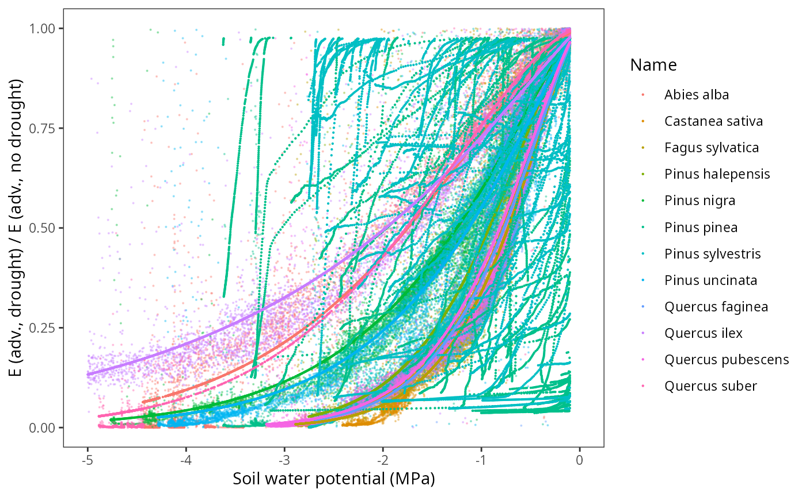
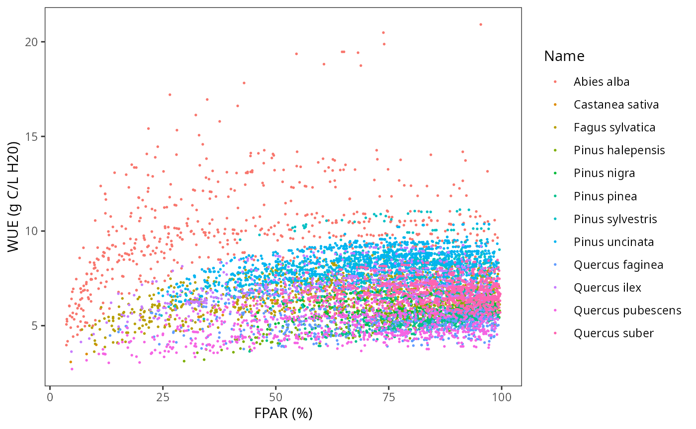
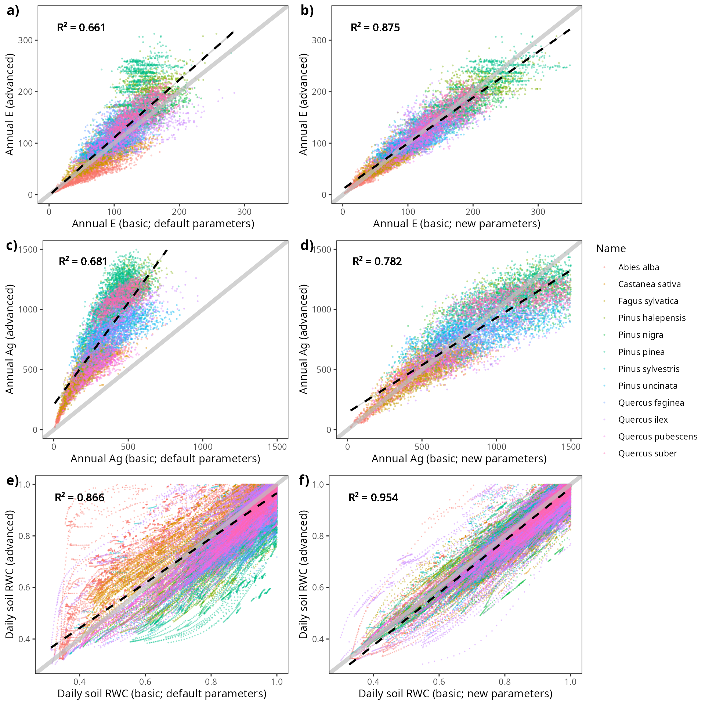

# Meta-modelling exercise

## Introduction

### Goal

This document presents a meta-modelling exercise between basic (under
Granier’s transpiration) and advanced (under Sperry’s transpiration
mode) versions of the soil plant water balance model. The goal is to
make transpiration and photosynthesis predictions produced by the basic
water balance model as similar as possible to those produced by the
advanced model which, given its greater process detail and physical
basis, is assumed to provide more realistic and accurate predictions
when appropriate functional traits are supplied. Such exercise was
included, among others, in De Cáceres et al. (2023).

The meta-modelling results should benefit not only water balance
simulations (function `spwb`) but also simulations of forest growth
(`growth`) and dynamics (`fordyn`). The results presented here were
obtained using **ver. 4.7.0** of medfate.

### Target parameters

The following parameters are used in the basic model, that cannot easily
be parameterized from available information (see
<https://emf-creaf.github.io/medfatebook/index.html>):

- `Tmax_LAI` and `Tmax_LAIsp`, which determine the ratio of maximum
  transpiration over potential evapotranspiration for a given LAI. An
  empirical function with these parameters was derived by Granier (1999)
  for European temperate forests, without distinguishing between forests
  dominated by different species.
- `Psi_Extract` and `Exp_Extract`, which determine the actual
  transpiration as a fraction of maximum transpiration, as a function of
  soil water potential for a given layer.
- `WUE`, which represents the daily water use efficiency (g C of gross
  assimilation / l H2O transpired) under conditions of VPD = 1kPa, high
  photosynthetically active radiation (PAR) and no air CO2 limitations.
- `WUE_par`, which specifies the dependency of WUE on PAR.
- `WUE_co2`, which specifies the dependency of WUE on air CO2
  concentration.
- `WUE_vpd`, which specifies the dependency of WUE on vapor pressure
  deficit (VPD).

As stated above, the general idea is to use simulation results issued by
the advanced water balance model to obtain appropriate species-level
estimates of the previous parameters, so that simulations with the basic
water balance model (which is faster) produce an output similar that of
the advanced model (which is slower). In the case of `Tmax_LAI` and
`Tmax_LAIsp` we aim to determine a species-specific factor that can be
used to modify the empirical coefficients obtained by Granier (1999).
Water use efficiency is an emergent property of the advanced water
balance model, depending on multiple parameters (hydraulics,
photosynthetic capacity, stomatal conductance, etc). We can thus
estimate `WUE` values (for \[CO2\] = 386) using simulations with high
light levels and no water deficit. The decrease of WUE for plant cohorts
in progressively shadier environments with respect to WUE under full
light can provide us with an estimate of `WUE_par`, which again will
depend on multiple plant traits. Finally, we can use additional
simulations of the complex model under increasing \[CO2\] values to
model the relationship between gross photosynthesis at a given \[CO2\]
compared to \[CO2\] = 386 for each species.

### Target species

The metamodelling procedure could be applied to any target species, but
we focused on twelve main tree species in Catalonia: *Abies alba*,
*Castanea sativa*, *Pinus halepensis*, *Pinus sylvestris*, *Pinus
nigra*, *Pinus uncinata*, *Pinus pinea*, *Quercus faginea*, *Quercus
ilex*, *Quercus pubescens*, *Quercus suber* and *Fagus sylvatica*. These
species are included in the species parameter table `SpParamsMED` from
package **medfate**.

For each of those species, we first revised the values of the most
important parameters in the advanced water balance model (parameters of
the hydraulic vulnerability curve are omitted as they should not be
relevant in simulations without soil water deficit):

| Name              |       SLA |    Al2As | VCleaf_kmax | Kmax_stemxylem |    Gswmax |  Vmax298 |   Jmax298 |
|:------------------|----------:|---------:|------------:|---------------:|----------:|---------:|----------:|
| Abies alba        |  7.768174 | 7194.245 |           6 |      1.3000000 | 0.2300000 | 58.08712 | 103.28235 |
| Castanea sativa   | 13.862317 | 5000.000 |           8 |      1.0000000 | 0.3500000 | 51.34505 |  93.03424 |
| Fagus sylvatica   | 18.320000 | 2076.120 |           8 |      0.9000000 | 0.3350000 | 94.50000 | 159.90000 |
| Pinus halepensis  |  5.140523 | 1317.523 |           4 |      0.1500000 | 0.2850000 | 72.19617 | 124.16865 |
| Pinus nigra       |  4.569508 | 1272.265 |           5 |      0.4100000 | 0.2366667 | 68.50296 | 118.76713 |
| Pinus pinea       |  4.207291 | 1615.509 |           4 |      0.2500000 | 0.2366667 | 72.42173 | 124.49715 |
| Pinus sylvestris  |  4.897943 | 1598.180 |           5 |      0.4500000 | 0.2366667 | 83.00000 | 143.00000 |
| Pinus uncinata    |  3.804390 | 1608.774 |           5 |      0.6895376 | 0.2366667 | 73.41275 | 125.93862 |
| Quercus pubescens | 11.800000 | 6031.582 |           6 |      0.7000000 | 0.2787500 | 57.33919 | 102.15484 |
| Quercus ilex      |  6.340000 | 3908.823 |           4 |      0.4000000 | 0.2007222 | 68.51600 | 118.78628 |
| Quercus faginea   |  8.328895 | 4189.325 |           6 |      0.7000000 | 0.2787500 | 71.21535 | 122.73836 |
| Quercus suber     |  8.656130 | 4189.325 |           4 |      0.4000000 | 0.2862500 | 70.27833 | 121.36913 |

Ideally, the transpiration and photosynthesis predictions of the
advanced water balance model should be evaluated with these
parameterization before using it as reference for the meta-modelling
study. Otherwise we could be biasing both models with inappropriate
parameter values. At present, the advance water balance model has been
evaluated using data from experimental plots in stands dominated by some
of the target species, but not others.

## Simulations for the meta-modelling exercise

### Forest, soil and weather inputs

We used forest plot data from the third edition of the Spanish National
Forest Inventory (IFN3). Forest plots were located in Catalonia and with
a minimum basal area of 5 $m^{2} \cdot ha^{- 1}$. For each target
species we randomly selected up to 50 forest plots where the species was
dominant (\> 50% in basal area). Plant records corresponding to species
different than the target species were excluded.

Like in other simulation exercises with IFN data, soil data was obtained
from SoilGrids from plot coordinates, with rock fragment contents
corrected according to the amount of surface stoniness recorded in the
field sampling. Daily weather data corresponding to year 2000 was
obtained by interpolation using package **meteoland** on the location of
each forest plot.

### Soil water balance simulations

For each target species, we ran the soil water balance model using
function `spwb` (actually, `spwb_spatial()` from package
**medfateland**) and either Granier’s or Sperry’s transpiration mode.
Simulations were conducted using `control$unlimitedSoilWater = TRUE` so
that transpiration and photosynthesis estimates did not include soil
water limitations (cohorts in the shade were still affected by the lower
PAR, however). For each plant cohort in each simulated plot we recorded
the percentage of PAR available to the plant cohort, the annual
transpiration and annual photosynthesis produced by each model.

Additional simulations with increasing carbon dioxide concentration were
conducted using the Sperry transpiration mode and
$\left\lbrack CO_{2} \right\rbrack$ values increasing from 350 ppm to
900 ppm. We also avoided soil water limitations using
`control$unlimitedSoilWater = TRUE`. For each plot we recorded the
annual gross photosynthesis per leaf area averaged across plant cohorts
using their LAI as weights.

## Transpiration ratio

We examined if there were systematic differences in annual transpiration
(E) between the two models. Such differences should be species-specific.
While the basic model has a single linear equation (from Granier) to
estimate the ratio maximum transpiration (Tmax) to potential
evapotranspiration (PET) from stand’s LAI and then divides plant
transpiration among plant cohorts, the advanced model estimates cohort
transpiration from a complex calculation involving several
species-specific functional traits. The ratio between cohort annual E
estimates from the two models could be used to scale the estimates of
Granier’s equation (or in other words, to scale its parameters).

The following plot displays the ratio between cohort annual E estimates
obtained using the basic and advanced models, where we use the
percentage of PAR of the plant cohort in the x-axis to show whether the
relationship changes between sunlit or shade cohorts:

It is evident that there are differences in the average ratio across
species and apparently this ratio does not change with the vertical
position of the cohort within the canopy. We can estimate
species-average ratios and use them to multiply the default coefficients
of Granier’s (1999) equation (default values for parameters
`Tmax_LAI = 0.134` and `Tmax_LAIsq = -0.006`).

| Name              |    n | E_ratio_mean | E_ratio_sd | E_ratio_se |  Tmax_LAI | Tmax_LAIsq |
|:------------------|-----:|-------------:|-----------:|-----------:|----------:|-----------:|
| Abies alba        | 1387 |    0.6621066 |  0.1569041 |  0.0042130 | 0.0887223 | -0.0039726 |
| Castanea sativa   | 1034 |    0.8540850 |  0.1757506 |  0.0054656 | 0.1144474 | -0.0051245 |
| Fagus sylvatica   | 1225 |    1.1567050 |  0.2250004 |  0.0064286 | 0.1549985 | -0.0069402 |
| Pinus halepensis  |  783 |    1.3954096 |  0.2296720 |  0.0082078 | 0.1869849 | -0.0083725 |
| Pinus nigra       |  992 |    1.1691691 |  0.1961093 |  0.0062265 | 0.1566687 | -0.0070150 |
| Pinus pinea       |  837 |    1.7054336 |  0.2460283 |  0.0085040 | 0.2285281 | -0.0102326 |
| Pinus sylvestris  | 1109 |    1.1743648 |  0.1918681 |  0.0057615 | 0.1573649 | -0.0070462 |
| Pinus uncinata    | 1510 |    1.1089369 |  0.2057106 |  0.0052938 | 0.1485975 | -0.0066536 |
| Quercus faginea   |  669 |    1.3353312 |  0.2515112 |  0.0097240 | 0.1789344 | -0.0080120 |
| Quercus ilex      |  840 |    0.9336025 |  0.2308113 |  0.0079637 | 0.1251027 | -0.0056016 |
| Quercus pubescens |  797 |    1.1658803 |  0.2277965 |  0.0080690 | 0.1562280 | -0.0069953 |
| Quercus suber     | 1058 |    1.1666327 |  0.1440836 |  0.0044297 | 0.1563288 | -0.0069998 |

## Relative transpiration function

Parameters `Psi_Extract` and `Exp_Extract` determine the actual
transpiration as a fraction of maximum transpiration, as a function of
soil water potential for a given layer. They are parameters of a Weibull
function. They can be estimated by fitting the Weibull function to the
ratio of transpiration values obtained in simulations with vs without
soil drought limitations (under Sperry’s transpiration mode) as a
function of soil water potential. This is illustrated in the figure
below for the different species:

## Water use efficiency (\[CO2\] = 386)

### Relationship between WUE and PAR

We estimated WUEg as the ratio between annual gross photosynthesis (Ag)
and annual transpiration (E), both estimated using the advanced
transpiration model. WUE values thus depend on the species identity (via
functional traits) and on plot environmental factors (e.g. climatic
conditions), as well as on the position of the plant within the canopy.
We then estimate the maximum PAR and maximum WUE across cohorts for each
plot, and calculate the relative WUE for each cohort as the ratio
between WUE and the plot maximum value.

We want to build a model of the relative WUE as a function of available
PAR, so that we can reduce species-level maximum WUE values for cohorts
in the shadow. To fit such model we need good estimates of relative WUE,
because this implies that the maximum WUE values correspond to high PAR.
With this aim, we focus on those records corresponding to plots/species
where at least 90% of PAR was available for at least one cohort of the
species in the plot.

Using this selection, we then draw the relationship between PAR and
WUEg: 

where we see that the relationship is species-specific. WUE is known to
decrease for parts of the canopy receiving less light (e.g. Medrano et
al. 2012). We can now plot relative WUE in relationship to FPAR:

Note that the relationship between relative WUE and PAR is less noisy
than the relationship between absolute WUE and FPAR. For each species,
we fit a non-linear model where relative WUE is a power function of
FPAR:

We now draw again the previous plot with the species-specific fitted
relationships, i.e. relative WUEg as a function of FPAR:

Note that there are substantial differences in the decay coefficients
among species.

### Relationship between WUE and VPD

## Dependency of photosynthesis on \[CO2\]

The parameter `WUE_co2`, which specifies the dependency of WUE on air
CO2 concentration is estimated by fitting a non-linear function on the
ratio of photosynthesis under a given
$\left\lbrack CO_{2} \right\rbrack$ value over the photosynthesis at
$\left\lbrack CO_{2} \right\rbrack = 386$ ppm:

## Meta-modelling parameters

The table containing the five parameters estimated via meta-modelling is
the following:

| Name              |  Tmax_LAI | Tmax_LAIsq | Psi_Extract | Exp_Extract |      WUE |   WUE_par |   WUE_co2 |    WUE_vpd |
|:------------------|----------:|-----------:|------------:|------------:|---------:|----------:|----------:|-----------:|
| Abies alba        | 0.0887223 | -0.0039726 |  -1.7470147 |    1.479139 | 8.536401 | 0.1540396 | 0.0043216 | -0.3781743 |
| Castanea sativa   | 0.1144474 | -0.0051245 |  -0.7786090 |    1.398753 | 8.215770 | 0.1070242 | 0.0024625 | -0.4673612 |
| Fagus sylvatica   | 0.1549985 | -0.0069402 |  -0.7291183 |    1.404854 | 9.420308 | 0.1542946 | 0.0021851 | -0.4061310 |
| Pinus halepensis  | 0.1869849 | -0.0083725 |  -0.9218219 |    1.504542 | 8.525550 | 0.5239136 | 0.0025863 | -0.2647169 |
| Pinus nigra       | 0.1566687 | -0.0070150 |  -1.2504241 |    1.299411 | 7.924382 | 0.1553481 | 0.0028494 | -0.4368847 |
| Pinus sylvestris  | 0.1573649 | -0.0070462 |  -1.1850580 |    1.325987 | 8.678368 | 0.1708214 | 0.0030029 | -0.4128647 |
| Pinus pinea       | 0.2285281 | -0.0102326 |  -0.9649847 |    1.491201 | 7.156091 | 0.5190786 | 0.0028180 | -0.3578795 |
| Pinus uncinata    | 0.1485975 | -0.0066536 |  -1.1278875 |    1.247934 | 6.725716 | 0.1355138 | 0.0039610 | -0.2947655 |
| Quercus faginea   | 0.1789344 | -0.0080120 |  -0.7696372 |    1.390459 | 8.570752 | 0.1549808 | 0.0018383 | -0.5006765 |
| Quercus ilex      | 0.1251027 | -0.0056016 |  -1.9726871 |    1.149052 | 8.968208 | 0.1412266 | 0.0024131 | -0.5664879 |
| Quercus pubescens | 0.1562280 | -0.0069953 |  -0.8145007 |    1.422054 | 8.787211 | 0.1491588 | 0.0018327 | -0.5140889 |
| Quercus suber     | 0.1563288 | -0.0069998 |  -1.7650814 |    1.607616 | 9.659193 | 0.1498707 | 0.0019227 | -0.6104881 |

## Evaluation of the effect of the new parameters

Here we evaluated whether the estimated parameters indeed increased the
similarity of transpiration (E) and gross photosynthesis (Ag) estimates
between the two models. To this aim we ran again the basic water balance
model on all the forest plots but using the estimated parameters instead
of the default values.

The following plots show the effect of the new parameters on annual E
and annual Ag for plant cohorts of the plots included in the study:

## Meta-modelling results for other datasets

The same procedure has been used to estimate Granier’s parameters in the
case of the species parameter table `SpParamsES`, intended to be used
for simulations across Spain and distributed using package
**traits4models**. In this case, additional tree species are included,
because they are often found in Spain but only seldom in Catalonia. The
table containing the five parameters estimated via meta-modelling for
`SpParamsES` is the following:

| Name                           |  Tmax_LAI | Tmax_LAIsq | Psi_Extract | Exp_Extract |       WUE |   WUE_par |   WUE_co2 |    WUE_vpd |
|:-------------------------------|----------:|-----------:|------------:|------------:|----------:|----------:|----------:|-----------:|
| Abies alba                     | 0.0684435 | -0.0030646 |  -2.4117055 |    2.461163 | 10.647473 | 0.0811000 | 0.0028847 | -0.2621558 |
| Castanea sativa                | 0.2299171 | -0.0102948 |  -1.9151784 |    1.349133 |  3.965938 | 0.0467476 | 0.0025497 | -0.4813172 |
| Eucalyptus globulus            | 0.0659329 | -0.0029522 |  -1.4106981 |    1.735249 | 12.834954 | 0.0549993 | 0.0024851 | -0.6650331 |
| Fagus sylvatica                | 0.1144470 | -0.0051245 |  -1.5738184 |    1.531656 |  8.818881 | 0.1841914 | 0.0026525 | -0.1814368 |
| Pinus halepensis               | 0.1295697 | -0.0058016 |  -0.7735734 |   15.117308 | 10.317889 | 0.2443110 | 0.0021391 | -0.5279217 |
| Pinus nigra                    | 0.1459258 | -0.0065340 |  -1.6659657 |    1.508367 |  7.668740 | 0.1291524 | 0.0030264 | -0.5033021 |
| Pinus radiata                  | 0.1069460 | -0.0047886 |  -2.1503247 |    2.210450 |  8.540821 | 0.1262097 | 0.0036643 | -0.4628498 |
| Pinus sylvestris               | 0.1111574 | -0.0049772 |  -1.5467955 |    2.732215 |  9.214660 | 0.1591069 | 0.0029310 | -0.4333924 |
| Pinus pinaster                 | 0.1666719 | -0.0074629 |  -2.0637003 |    2.105126 |  6.748020 | 0.0912319 | 0.0021488 | -0.5235613 |
| Pinus pinea                    | 0.1546601 | -0.0069251 |  -0.9565976 |    4.622511 |  9.290184 | 0.2249189 | 0.0021377 | -0.5952773 |
| Pinus uncinata                 | 0.1288259 | -0.0057683 |  -2.0344815 |    1.786279 |  7.495838 | 0.1162167 | 0.0036965 | -0.1908863 |
| Quercus faginea                | 0.2115261 | -0.0094713 |  -1.4969646 |    1.870994 |  5.837077 | 0.0612326 | 0.0017731 | -0.4780129 |
| Quercus ilex ssp. ballota      | 0.2364658 | -0.0105880 |  -2.4340139 |    1.436129 |  4.857045 | 0.0586140 | 0.0020683 | -0.5387930 |
| Quercus robur                  | 0.2503725 | -0.0112107 |  -1.6676263 |    2.611057 |  6.057327 | 0.0981019 | 0.0021505 | -0.5196672 |
| Quercus pubescens (Q. humilis) | 0.3373001 | -0.0151030 |  -1.7699035 |    2.541723 |  5.071709 | 0.0369368 | 0.0014863 | -0.3892295 |
| Quercus suber                  | 0.3953411 | -0.0177018 |  -2.7236054 |    2.564987 |  4.399153 | 0.1167523 | 0.0017575 | -0.5164312 |

## References

- De Cáceres M, Molowny-Horas R, Cabon A, Martínez-Vilalta J, Mencuccini
  M, García-Valdés R, Nadal-Sala D, Sabaté S, Martin-StPaul N, Morin X,
  D’Adamo F, Batllori E, Améztegui A (2023) MEDFATE 2.9.3: A
  trait-enabled model to simulate Mediterranean forest function and
  dynamics at regional scales. Geoscientific Model Development 16,
  3165–3201 (<https://doi.org/10.5194/gmd-16-3165-2023>).

- Medrano, H., A. Pou, M. Tomás, S. Martorell, J. Gulias, J. Flexas,
  and J. M. Escalona. 2012. Average daily light interception determines
  leaf water use efficiency among different canopy locations in
  grapevine. Agricultural Water Management 114:4–10.
