# Advanced water and energy balance

## About this vignette

This document describes how to run a water and energy balance model that
uses a more detailed approach for hydraulics and stomatal regulation
described in De Cáceres et al. (2021) and Ruffault et al. (2022). We
recommend reading vignette [*Basic water
balance*](https://emf-creaf.github.io/medfate/articles/runmodels/BasicWaterBalance.html)
before this one for a more accessible introduction to soil water balance
modelling. This vignette is meant to teach users to run the simulation
model within R. All the details of the model design and formulation can
be found at the
[medfatebook](https://emf-creaf.github.io/medfatebook/index.html).

## Preparing model inputs

Model inputs are explained in greater detail in vignettes
[*Understanding model
inputs*](https://emf-creaf.github.io/medfate/articles/intro/UnderstandingInputs.html)
and [*Preparing model
inputs*](https://emf-creaf.github.io/medfate/articles/intro/PreparingInputs.html).
Here we only review the different steps required to run function
[`spwb()`](https://emf-creaf.github.io/medfate/reference/spwb.md).

### Soil, vegetation, meteorology and species data

Soil information needs to be entered as a `data frame` with soil layers
in rows and physical attributes in columns. Soil physical attributes can
be initialized to default values, for a given number of layers, using
function
[`defaultSoilParams()`](https://emf-creaf.github.io/medfate/reference/defaultSoilParams.md):

``` r

examplesoil <- defaultSoilParams(4)
examplesoil
```

    ##   widths clay sand om nitrogen ph  bd rfc
    ## 1    300   25   25 NA       NA NA 1.5  25
    ## 2    700   25   25 NA       NA NA 1.5  45
    ## 3   1000   25   25 NA       NA NA 1.5  75
    ## 4   2000   25   25 NA       NA NA 1.5  95

As explained in the package overview, models included in `medfate` were
primarily designed to be ran on **forest inventory plots**. Here we use
the example object provided with the package:

``` r

data(exampleforest)
exampleforest
```

    ## $treeData
    ##            Species   DBH Height   N Z50  Z95
    ## 1 Pinus halepensis 37.55    800 168 100  300
    ## 2     Quercus ilex 14.60    660 384 300 1000
    ## 
    ## $shrubData
    ##             Species Height Cover Z50  Z95
    ## 1 Quercus coccifera     80  3.75 200 1000
    ## 
    ## attr(,"class")
    ## [1] "forest" "list"

Importantly, a data frame with daily weather for the period to be
simulated is required. Here we use the default data frame included with
the package:

``` r

data(examplemeteo)
head(examplemeteo)
```

    ##        dates MinTemperature MaxTemperature Precipitation MinRelativeHumidity
    ## 1 2001-01-01     -0.5934215       6.287950      4.869109            65.15411
    ## 2 2001-01-02     -2.3662458       4.569737      2.498292            57.43761
    ## 3 2001-01-03     -3.8541036       2.661951      0.000000            58.77432
    ## 4 2001-01-04     -1.8744860       3.097705      5.796973            66.84256
    ## 5 2001-01-05      0.3288287       7.551532      1.884401            62.97656
    ## 6 2001-01-06      0.5461322       7.186784     13.359801            74.25754
    ##   MaxRelativeHumidity Radiation WindSpeed
    ## 1           100.00000  12.89251  2.000000
    ## 2            94.71780  13.03079  7.662544
    ## 3            94.66823  16.90722  2.000000
    ## 4            95.80950  11.07275  2.000000
    ## 5           100.00000  13.45205  7.581347
    ## 6           100.00000  12.84841  6.570501

Finally, simulations in `medfate` require a data frame with species
parameter values, which we load using defaults for Catalonia (NE Spain):

``` r

data("SpParamsMED")
```

### Simulation control

Apart from data inputs, the behaviour of simulation models is controlled
using a set of global parameters. The default parameterization is
obtained using function
[`defaultControl()`](https://emf-creaf.github.io/medfate/reference/defaultControl.md):

``` r

control <- defaultControl("Sperry")
```

To use the advanced water balance model we must change the values of
`transpirationMode` to switch from `"Granier"` to either `"Sperry"` or
`"Sureau"`.

Since we will be inspecting subdaily results, we need to set the flag to
obtain subdaily output:

``` r

control$subdailyResults <- TRUE
```

### Water balance input object

A last object is needed before calling simulation functions, called
`spwbInput`. It consists in the compilation of aboveground, belowground
parameters and the specification of additional parameter values for each
plant cohort. This is done by calling function
[`spwbInput()`](https://emf-creaf.github.io/medfate/reference/modelInput.md):

``` r

x <- spwbInput(exampleforest, examplesoil, SpParamsMED, control)
```

The `spwbInput` object for advanced water and energy balance is similar
to that of simple water balance simulations, but contains more elements.
Information about the cohort species is found in element `cohorts`,
i.e. the cohort code, the species index and species name:

``` r

x$cohorts
```

    ##         SP              Name
    ## T1_148 148  Pinus halepensis
    ## T2_168 168      Quercus ilex
    ## S1_165 165 Quercus coccifera

Element `soil` contains soil layer parameters and state variables
(moisture and temperature):

``` r

x$soil
```

    ##   widths sand clay      usda om nitrogen ph  bd rfc  macro     Ksat VG_alpha
    ## 1    300   25   25 Silt loam NA       NA NA 1.5  25 0.0485 5401.471 89.16112
    ## 2    700   25   25 Silt loam NA       NA NA 1.5  45 0.0485 5401.471 89.16112
    ## 3   1000   25   25 Silt loam NA       NA NA 1.5  75 0.0485 5401.471 89.16112
    ## 4   2000   25   25 Silt loam NA       NA NA 1.5  95 0.0485 5401.471 89.16112
    ##       VG_n VG_theta_res VG_theta_sat W Temp
    ## 1 1.303861        0.041     0.423715 1   NA
    ## 2 1.303861        0.041     0.423715 1   NA
    ## 3 1.303861        0.041     0.423715 1   NA
    ## 4 1.303861        0.041     0.423715 1   NA

As an aside, the columns in `x$soil` that were not present in the input
data frame `examplesoil` are created by an internal call to a soil
initialization function called
[`soil()`](https://emf-creaf.github.io/medfate/reference/soil.md).

Element `canopy` contains state variables within the canopy:

``` r

x$canopy
```

    ##    zlow zmid  zup LAIlive LAIexpanded LAIdead LAImistletoe Tair Cair VPair
    ## 1     0   50  100      NA          NA      NA           NA   NA   NA    NA
    ## 2   100  150  200      NA          NA      NA           NA   NA   NA    NA
    ## 3   200  250  300      NA          NA      NA           NA   NA   NA    NA
    ## 4   300  350  400      NA          NA      NA           NA   NA   NA    NA
    ## 5   400  450  500      NA          NA      NA           NA   NA   NA    NA
    ## 6   500  550  600      NA          NA      NA           NA   NA   NA    NA
    ## 7   600  650  700      NA          NA      NA           NA   NA   NA    NA
    ## 8   700  750  800      NA          NA      NA           NA   NA   NA    NA
    ## 9   800  850  900      NA          NA      NA           NA   NA   NA    NA
    ## 10  900  950 1000      NA          NA      NA           NA   NA   NA    NA
    ## 11 1000 1050 1100      NA          NA      NA           NA   NA   NA    NA
    ## 12 1100 1150 1200      NA          NA      NA           NA   NA   NA    NA
    ## 13 1200 1250 1300      NA          NA      NA           NA   NA   NA    NA
    ## 14 1300 1350 1400      NA          NA      NA           NA   NA   NA    NA
    ## 15 1400 1450 1500      NA          NA      NA           NA   NA   NA    NA
    ## 16 1500 1550 1600      NA          NA      NA           NA   NA   NA    NA
    ## 17 1600 1650 1700      NA          NA      NA           NA   NA   NA    NA
    ## 18 1700 1750 1800      NA          NA      NA           NA   NA   NA    NA
    ## 19 1800 1850 1900      NA          NA      NA           NA   NA   NA    NA
    ## 20 1900 1950 2000      NA          NA      NA           NA   NA   NA    NA
    ## 21 2000 2050 2100      NA          NA      NA           NA   NA   NA    NA
    ## 22 2100 2150 2200      NA          NA      NA           NA   NA   NA    NA
    ## 23 2200 2250 2300      NA          NA      NA           NA   NA   NA    NA
    ## 24 2300 2350 2400      NA          NA      NA           NA   NA   NA    NA
    ## 25 2400 2450 2500      NA          NA      NA           NA   NA   NA    NA
    ## 26 2500 2550 2600      NA          NA      NA           NA   NA   NA    NA
    ## 27 2600 2650 2700      NA          NA      NA           NA   NA   NA    NA
    ## 28 2700 2750 2800      NA          NA      NA           NA   NA   NA    NA

Canopy temperature, water vapour pressure and $`CO_2`$ concentration are
state variables needed for canopy energy balance. If the canopy energy
balance assumes a single canopy layer, the same values will be assumed
through the canopy. Variation of within-canopy state variables is
modelled if a multi-canopy energy balance is used (see control parameter
`multiLayerBalance`).

As you may already known, element `above` contains the aboveground
structure data that we already know:

``` r

x$above
```

    ##          H        CR   LAI_live LAI_expanded LAI_dead LAI_mistletoe Age ObsID
    ## T1_148 800 0.6605196 0.84874773   0.84874773        0             0  NA  <NA>
    ## T2_168 660 0.6055642 0.70557382   0.70557382        0             0  NA  <NA>
    ## S1_165  80 0.8032817 0.03062604   0.03062604        0             0  NA  <NA>

Belowground parameters can be seen in `below`:

``` r

x$below
```

    ##        Z50  Z95 Z100 poolProportions
    ## T1_148 100  300   NA      0.53550523
    ## T2_168 300 1000   NA      0.44517171
    ## S1_165 200 1000   NA      0.01932306

and in `belowLayers`:

``` r

x$belowLayers
```

    ## $V
    ##                1          2           3            4
    ## T1_148 0.9498377 0.04811006 0.001774047 0.0002781442
    ## T2_168 0.5008953 0.45059411 0.040648313 0.0078622840
    ## S1_165 0.6799879 0.27379114 0.035676316 0.0105446776
    ## 
    ## $L
    ##               1        2        3        4
    ## T1_148 2086.448 1307.358 2073.244 4045.856
    ## T2_168 1817.571 2100.346 2410.127 4285.194
    ## S1_165 1085.030 1380.808 2170.587 4146.637
    ## 
    ## $VGrhizo_kmax
    ##               1          2          3          4
    ## T1_148 12670486   641770.5   23665.14   3710.341
    ## T2_168 36121247 32493859.1 2931286.80 566975.780
    ## S1_165 10941459  4405482.2  574055.73 169670.901
    ## 
    ## $VCroot_kmax
    ##               1         2           3            4
    ## T1_148 2.889971 0.2336108 0.005432084 0.0004364266
    ## T2_168 1.568929 1.2213562 0.096017469 0.0104454169
    ## S1_165 2.407779 0.7618041 0.063148057 0.0097699999
    ## 
    ## $Wpool
    ##        1 2 3 4
    ## T1_148 1 1 1 1
    ## T2_168 1 1 1 1
    ## S1_165 1 1 1 1
    ## 
    ## $RhizoPsi
    ##             1      2      3      4
    ## T1_148 -0.033 -0.033 -0.033 -0.033
    ## T2_168 -0.033 -0.033 -0.033 -0.033
    ## S1_165 -0.033 -0.033 -0.033 -0.033
    ## 
    ## $RHOP
    ## $RHOP$T1_148
    ##                 1          2          3          4
    ## T1_148 0.53550523 0.53550523 0.53550523 0.53550523
    ## T2_168 0.44517171 0.44517171 0.44517171 0.44517171
    ## S1_165 0.01932306 0.01932306 0.01932306 0.01932306
    ## 
    ## $RHOP$T2_168
    ##                 1          2          3          4
    ## T1_148 0.53550523 0.53550523 0.53550523 0.53550523
    ## T2_168 0.44517171 0.44517171 0.44517171 0.44517171
    ## S1_165 0.01932306 0.01932306 0.01932306 0.01932306
    ## 
    ## $RHOP$S1_165
    ##                 1          2          3          4
    ## T1_148 0.53550523 0.53550523 0.53550523 0.53550523
    ## T2_168 0.44517171 0.44517171 0.44517171 0.44517171
    ## S1_165 0.01932306 0.01932306 0.01932306 0.01932306

The `spwbInput`object also includes cohort parameter values for several
kinds of traits. For example, plant anatomy parameters are described in
`paramsAnatomy`:

``` r

x$paramsAnatomy
```

    ##        Hmed    Al2As      SLA LeafWidth LeafDensity WoodDensity FineRootDensity
    ## T1_148  850 1317.523 5.140523 0.1384772   0.2982842   0.6077016       0.2982842
    ## T2_168  500 3908.823 6.340000 1.7674359   0.4893392   0.9008264       0.4893392
    ## S1_165   80 4189.325 4.980084 1.3761085   0.3709679   0.4389106       0.3709679
    ##        conduit2sapwood      SRL RLD     r635
    ## T1_148       0.9236406 3172.572  10 1.964226
    ## T2_168       0.6238125 4398.812  10 1.805872
    ## S1_165       0.6238125 4398.812  10 2.289452

Parameters related to plant transpiration and photosynthesis can be seen
in `paramsTranspiration`:

``` r

x$paramsTranspiration
```

    ##             Gswmin    Gswmax  Vmax298  Jmax298 Kmax_stemxylem Kmax_rootxylem
    ## T1_148 0.003086667 0.2850000 72.19617 124.1687           0.15           0.60
    ## T2_168 0.004473333 0.2007222 68.51600 118.7863           0.40           1.60
    ## S1_165 0.010455247 0.2830167 62.78100 118.4486           0.29           1.16
    ##        VCleaf_kmax VCleafapo_kmax VCleaf_slope VCleaf_P50  VCleaf_c  VCleaf_d
    ## T1_148    4.000000        8.00000    133.86620  -2.303772 11.137050 -2.380849
    ## T2_168    4.000000        8.00000     19.14428  -1.964085  1.339370 -2.582279
    ## S1_165    9.579077       19.15815     25.47382  -2.663333  2.254991 -3.133381
    ##        kleaf_symp VCstem_kmax VCstem_slope VCstem_P50  VCstem_c  VCstem_d
    ## T1_148    8.00000    1.339563     68.30291  -5.139633 12.709999 -5.290000
    ## T2_168    8.00000    1.620936     14.60786  -6.964747  3.560000 -7.720000
    ## S1_165   19.15815    4.599269     12.31134  -6.980000  3.095442 -7.857378
    ##        VCroot_kmax VCroot_slope VCroot_P50  VCroot_c  VCroot_d VGrhizo_kmax
    ## T1_148    3.129450    103.96607  -2.966325 11.137050 -3.065569     13339632
    ## T2_168    2.896748     22.32794  -1.684034  1.339370 -2.214081     72113368
    ## S1_165    3.242501     31.37100  -1.173000  1.402489 -1.523324     16090667
    ##        Plant_kmax   FR_leaf   FR_stem   FR_root
    ## T1_148  0.7598454 0.1899614 0.5672339 0.2428047
    ## T2_168  0.8249857 0.2062464 0.5089563 0.2847972
    ## S1_165  1.5867376 0.1656462 0.3449978 0.4893561

Parameters related to pressure-volume curves and water storage capacity
of leaf and stem organs are in `paramsWaterStorage`:

``` r

x$paramsWaterStorage
```

    ##           maxFMC maxMCleaf maxMCstem   LeafPI0   LeafEPS LeafAF     Vleaf
    ## T1_148 126.03063  151.9063  99.19498 -1.591429  8.918571 0.3525 0.5258525
    ## T2_168  93.15304  131.4346  45.64970 -1.483333 19.260000 0.1700 0.2199087
    ## S1_165  96.53441   47.3984 134.64052 -2.370000 17.230000 0.2400 0.4108968
    ##          StemPI0   StemEPS    StemAF Vsapwood
    ## T1_148 -2.008039 13.256355 0.9236406 6.099723
    ## T2_168 -3.227438 46.420610 0.6238125 1.260913
    ## S1_165 -1.305868  6.297155 0.6238125 1.036819

Finally, remember that one can play with plant-specific parameters for
soil water balance (instead of using species-level values) by modifying
manually the parameter values in this object.

## Static analysis of sub-models

Before using the advanced water and energy balance model, is important
to understand the parameters that influence the different sub-models.
Package `medfate` provides low-level functions corresponding to
sub-models (light extinction, hydraulics, transpiration,
photosynthesis…). In addition, there are several high-level plotting
functions that allow examining several aspects of these processes.

### Vulnerability curves

Given a `spwbInput` object, we can use function
[`hydraulics_vulnerabilityCurvePlot()`](https://emf-creaf.github.io/medfate/reference/hydraulics_conductancefunctions.md)
to inspect **vulnerability curves** (i.e. how hydraulic conductance of a
given segment changes with the water potential) for each plant cohort
and each of the different segments of the soil-plant hydraulic network:
rhizosphere, roots, stems and leaves:

``` r

hydraulics_vulnerabilityCurvePlot(x, type="leaf")
```

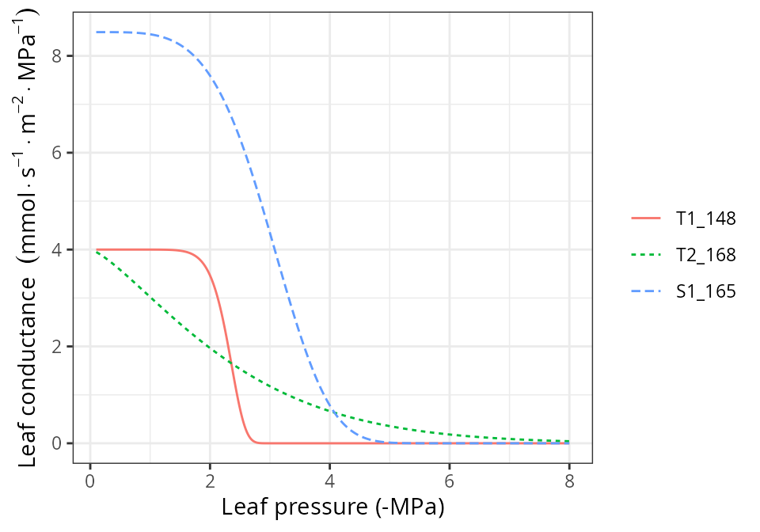

``` r

hydraulics_vulnerabilityCurvePlot(x, type="stem")
```

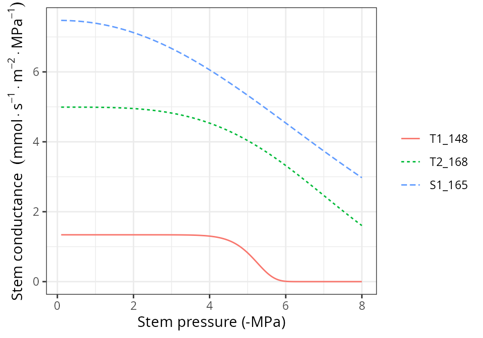

``` r

hydraulics_vulnerabilityCurvePlot(x, type="root")
```

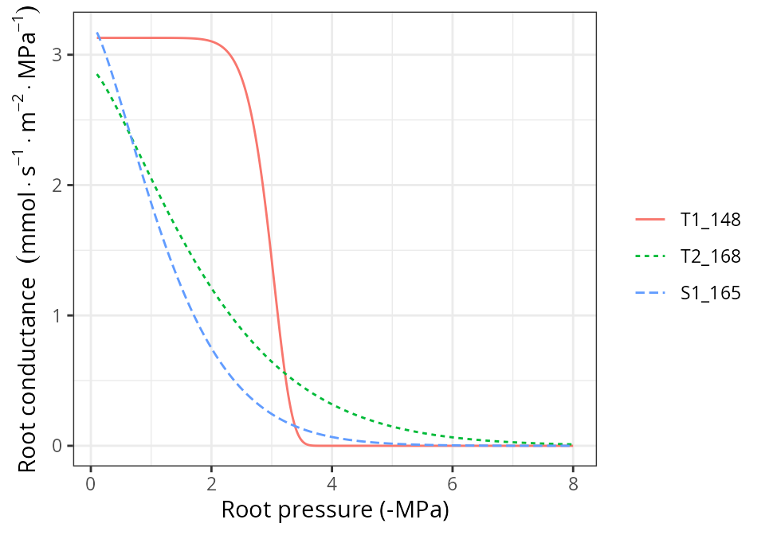

``` r

hydraulics_vulnerabilityCurvePlot(x, examplesoil, type="rhizo")
```

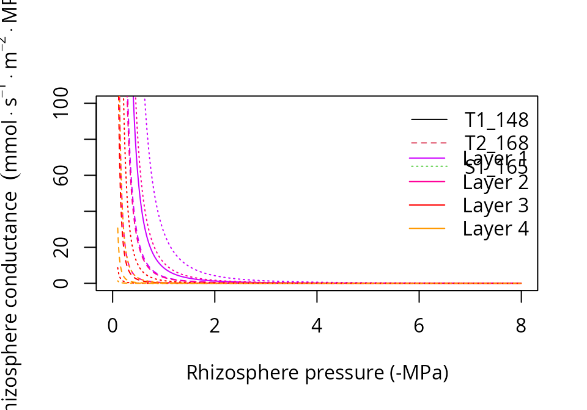

The maximum values and shape of vulnerability curves for leaves and
stems are regulated by parameters in `paramsTranspiration`. Roots have
vulnerability curve parameters in the same data frame, but maximum
conductance values need to be specified for each soil layer and are
given in `belowLayers$VCroot_kmax`. Note that the last call to
[`hydraulics_vulnerabilityCurvePlot()`](https://emf-creaf.github.io/medfate/reference/hydraulics_conductancefunctions.md)
includes a `soil` object. This is because the van Genuchten parameters
that define the shape of the vulnerability curve for the rhizosphere are
stored in this object. Maximum conductance values in the rhizosphere are
given in `belowLayers$VGrhizo_kmax`.

### Supply functions

The vulnerability curves conforming the hydraulic network are used in
the model to build the **supply function**, which relates water flow
(i.e. transpiration) with the drop of water potential along the whole
hydraulic pathway. The supply function contains not only these two
variables, but also the water potential of intermediate nodes in the the
hydraulic network. Function
[`hydraulics_supplyFunctionPlot()`](https://emf-creaf.github.io/medfate/reference/hydraulics_supplyfunctions.md)
can be used to inspect any of this variables:

``` r

hydraulics_supplyFunctionPlot(x, type="E")
```

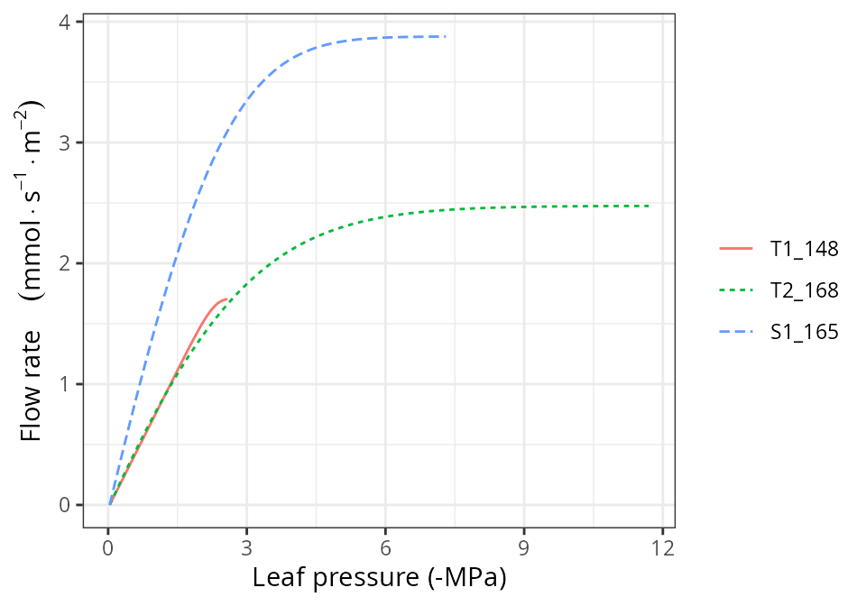

``` r

hydraulics_supplyFunctionPlot(x, type="ERhizo")
```

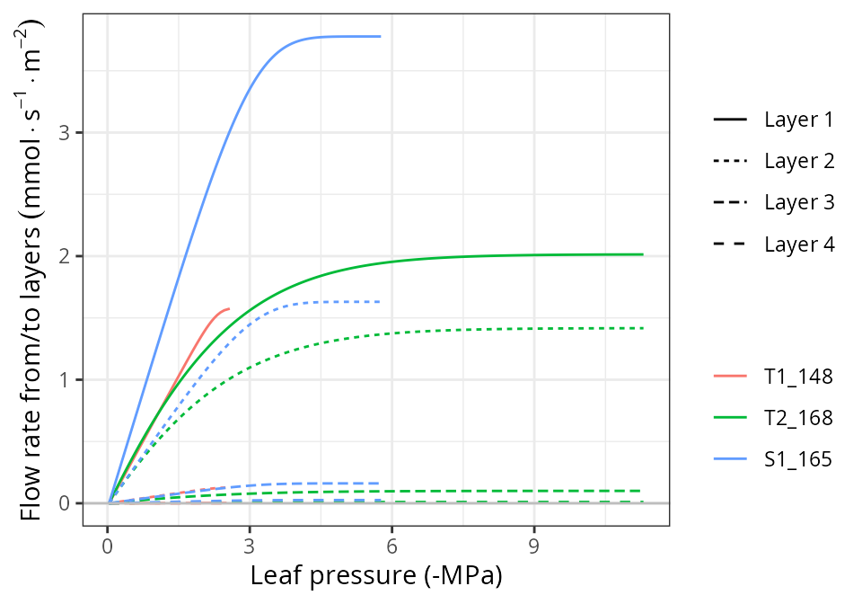

``` r

hydraulics_supplyFunctionPlot(x, type="dEdP")
```

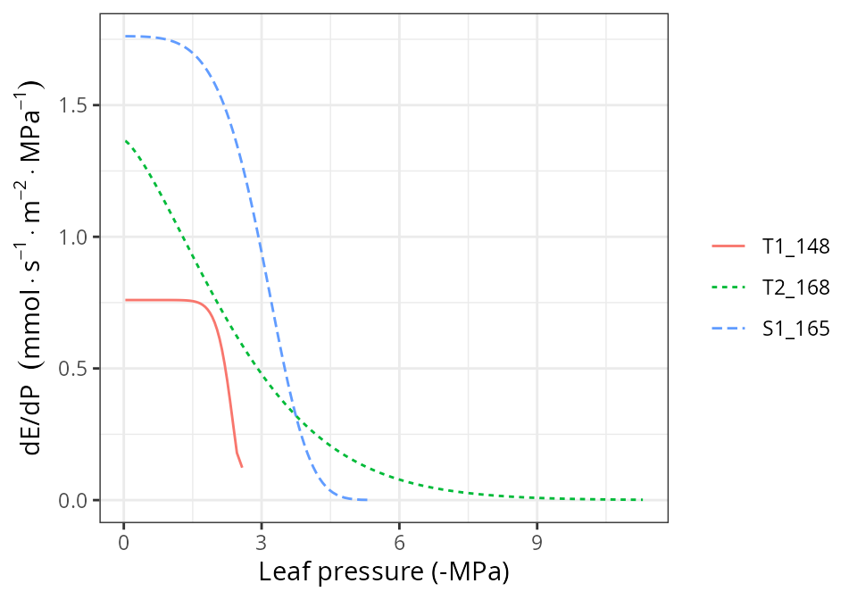

``` r

hydraulics_supplyFunctionPlot(x, type="StemPsi")
```

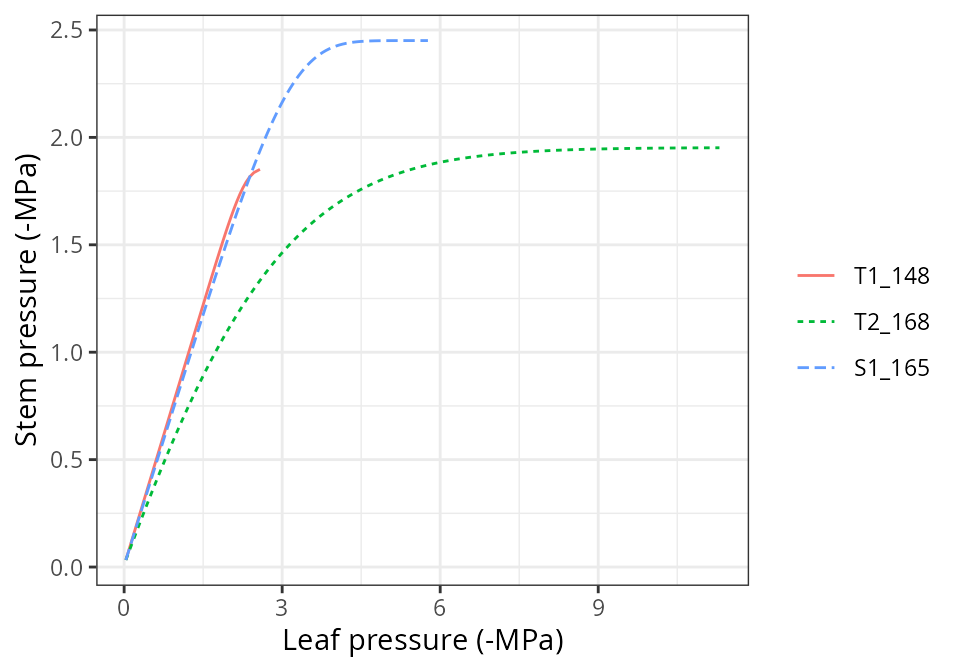

Calls to
[`hydraulics_supplyFunctionPlot()`](https://emf-creaf.github.io/medfate/reference/hydraulics_supplyfunctions.md)
always need both a `spwbInput` object and a `soil` object. The soil
moisture state (i.e. its water potential) is the starting point for the
calculation of the supply function, so different curves will be obtained
for different values of soil moisture.

### Pressure volume curves

``` r

moisture_pressureVolumeCurvePlot(x, segment="leaf", fraction="symplastic")
```

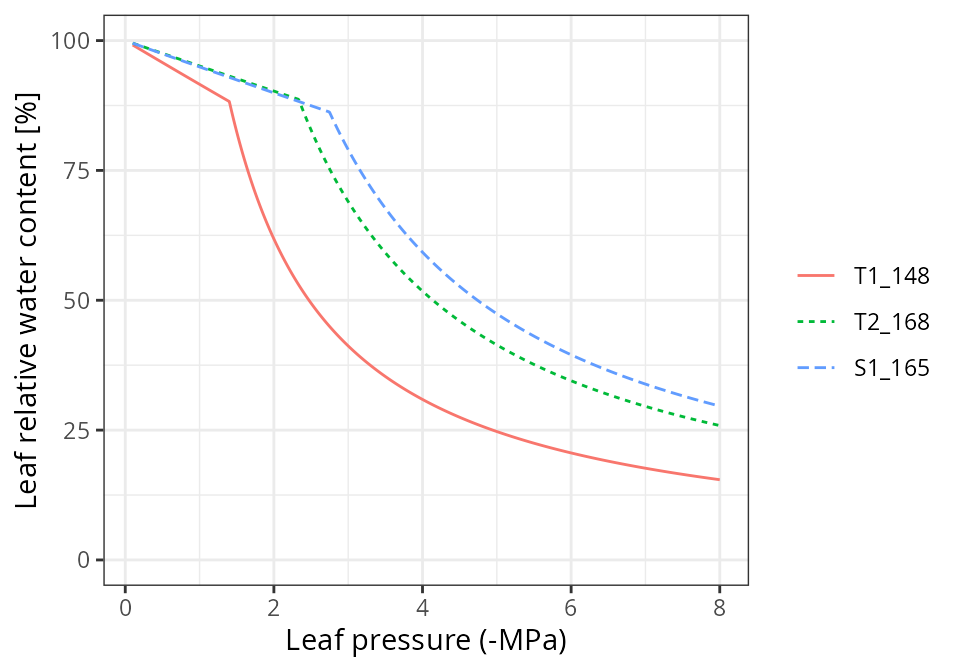

``` r

moisture_pressureVolumeCurvePlot(x, segment="leaf", fraction="apoplastic")
```

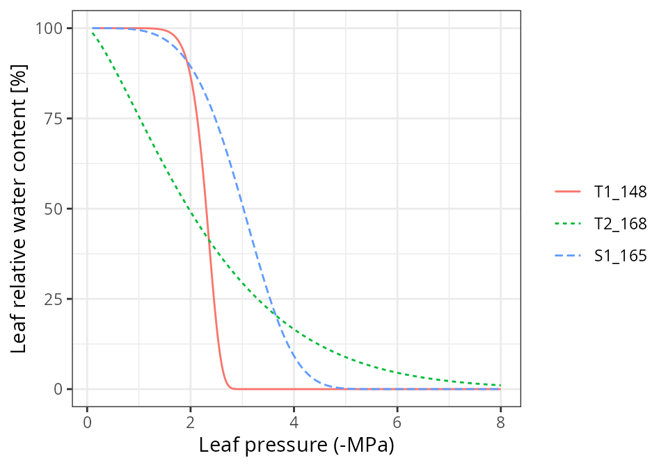

``` r

moisture_pressureVolumeCurvePlot(x, segment="stem", fraction="symplastic")
```

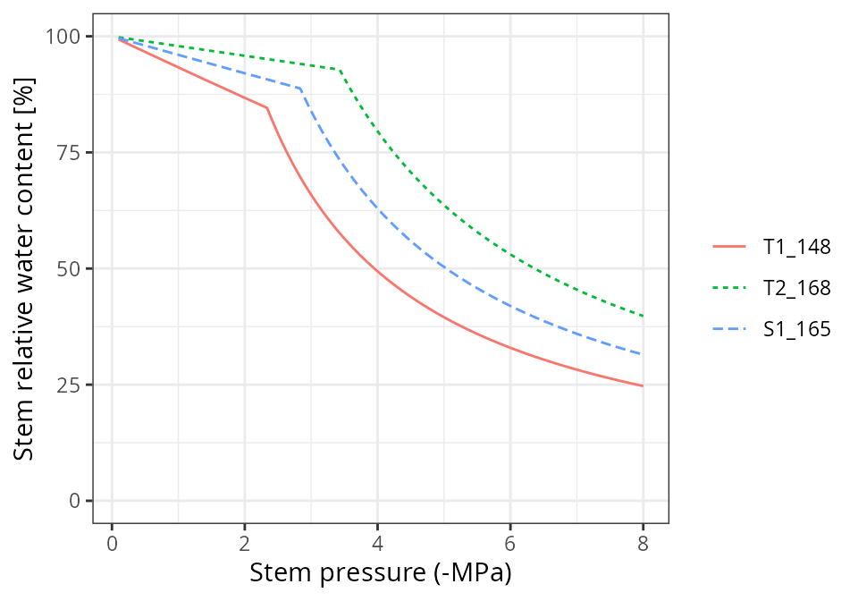

``` r

moisture_pressureVolumeCurvePlot(x, segment="stem", fraction="apoplastic")
```

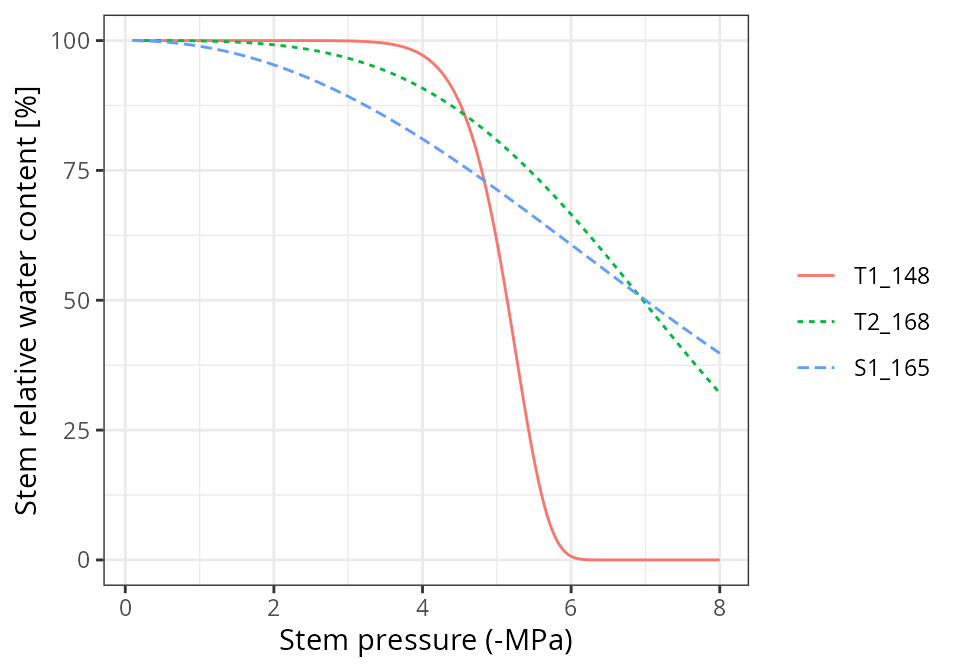

## Water balance for a single day

### Running the model

Soil water balance simulations will normally span periods of several
months or years, but since the model operates at a daily and subdaily
temporal scales, it is possible to perform soil water balance for one
day only. This is done using function
[`spwb_day()`](https://emf-creaf.github.io/medfate/reference/spwb_day.md).
In the following code we select the same day as before from the
meteorological input data and perform soil water balance for that day
only:

``` r

date <- examplemeteo$dates[d]
meteovec <- unlist(examplemeteo[d,])
sd1<-spwb_day(x, date, meteovec, 
              latitude = 41.82592, elevation = 100, slope= 0, aspect = 0)
```

The output of
[`spwb_day()`](https://emf-creaf.github.io/medfate/reference/spwb_day.md)
is a list with several elements:

``` r

names(sd1)
```

    ##  [1] "cohorts"            "topography"         "weather"           
    ##  [4] "WaterBalance"       "EnergyBalance"      "Soil"              
    ##  [7] "Stand"              "Plants"             "SunlitLeaves"      
    ## [10] "ShadeLeaves"        "RhizoPsi"           "ExtractionInst"    
    ## [13] "PlantsInst"         "RadiationInputInst" "SunlitLeavesInst"  
    ## [16] "ShadeLeavesInst"    "LightExtinction"    "LWRExtinction"     
    ## [19] "CanopyTurbulence"

### Water balance output

Element `WaterBalance` contains the soil water balance flows of the day
(precipitation, infiltration, transpiration, …)

``` r

sd1$WaterBalance
```

    ##                     PET                    Rain                    Snow 
    ##                3.902334                0.000000                0.000000 
    ##                 NetRain                Snowmelt                   Runon 
    ##                0.000000                0.000000                0.000000 
    ##            Infiltration      InfiltrationExcess        SaturationExcess 
    ##                0.000000                0.000000                0.000000 
    ##                  Runoff            DeepDrainage         CapillarityRise 
    ##                0.000000                0.000000                0.000000 
    ##         SoilEvaporation       HerbTranspiration         PlantExtraction 
    ##                0.500000                0.000000                0.680527 
    ##           Transpiration  MistletoeTranspiration HydraulicRedistribution 
    ##                0.680527                0.000000                0.000000

And `Soil` contains water evaporated from each soil layer, water
transpired from each soil layer and the final soil water potential:

``` r

sd1$Soil
```

    ##           Psi HerbTranspiration HydraulicInput HydraulicOutput PlantExtraction
    ## 1 -0.03547406                 0              0    0.5404200653    0.5404200653
    ## 2 -0.03317569                 0              0    0.1307384652    0.1307384652
    ## 3 -0.03301746                 0              0    0.0084578463    0.0084578463
    ## 4 -0.03300470                 0              0    0.0009106336    0.0009106336

### Soil and canopy energy balance

Element `EnergyBalance` contains subdaily variation in atmosphere,
canopy and soil temperatures, as well as canopy and soil energy balance
components.

``` r

names(sd1$EnergyBalance)
```

    ## [1] "Temperature"         "SoilTemperature"     "CanopyEnergyBalance"
    ## [4] "SoilEnergyBalance"   "TemperatureLayers"   "VaporPressureLayers"

Package `medfate` provides a `plot` function for objects of class
`spwb_day` that can be used to inspect the results of the simulation. We
use this function to display subdaily dynamics in plant, soil and canopy
variables. For example, we can use it to display temperature variations
(only the temperature of the topmost soil layer is drawn):

``` r

plot(sd1, type = "Temperature")
```

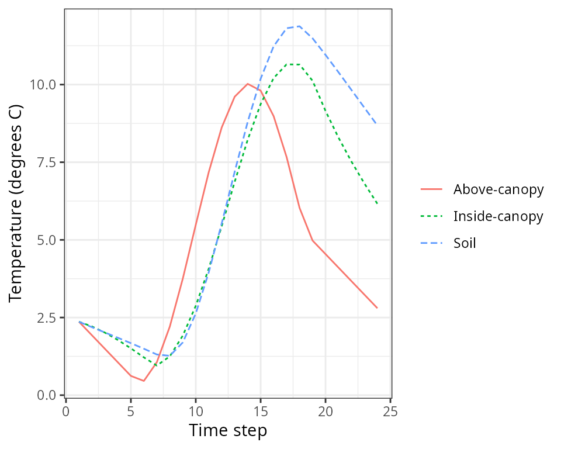

``` r

plot(sd1, type = "CanopyEnergyBalance")
```

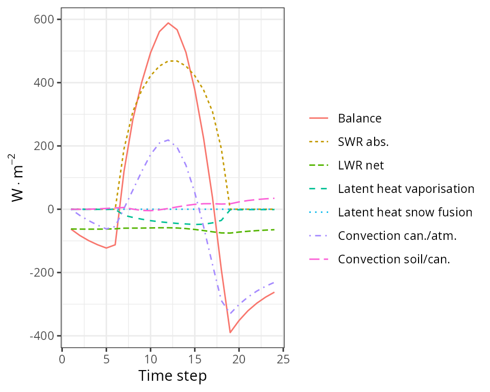

``` r

plot(sd1, type = "SoilEnergyBalance")
```

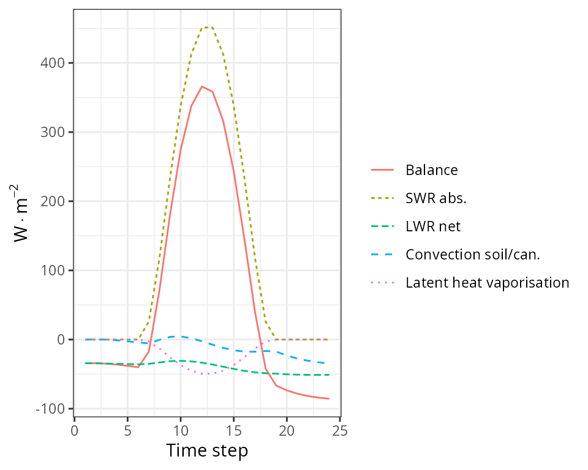

### Plant output

Element `Plants` contains output values by plant cohort. Several output
variables can be inspected in this element.

``` r

sd1$Plants
```

    ##               LAI    LAIlive     FPAR Extraction Transpiration
    ## T1_148 0.84874773 0.84874773 92.18285 0.44347753    0.44347753
    ## T2_168 0.70557382 0.70557382 72.36365 0.22466295    0.22466295
    ## S1_165 0.03062604 0.03062604 44.32407 0.01238653    0.01238653
    ##        MistletoeTranspiration GrossPhotosynthesis NetPhotosynthesis    RootPsi
    ## T1_148                      0          2.10100907        1.98855192 -0.3982251
    ## T2_168                      0          1.70171423        1.59570118 -0.3353606
    ## S1_165                      0          0.06684344        0.06292794 -0.3759137
    ##           StemPsi LeafPLC      StemPLC LeafPsiMin  LeafPsiMax      dEdP
    ## T1_148 -1.2513865       0 5.363683e-09 -1.5379962 -0.03981994 0.5124482
    ## T2_168 -0.8559196       0 2.122211e-04 -1.1346709 -0.04019180 0.5277405
    ## S1_165 -0.6029081       0 1.941646e-04 -0.7151737 -0.04188680 1.0418297
    ##                DDS   StemRWC   LeafRWC      LFMC  WaterBalance
    ## T1_148 0.001485752 0.9972121 0.9585427 122.68872 -1.360674e-17
    ## T2_168 0.052883138 0.9973894 0.9832457  91.88045  3.111660e-17
    ## S1_165 0.027877097 0.9880834 0.9891112  95.40533 -1.053709e-18

While `Plants` contains one value per cohort and variable that
summarizes the whole simulated day, information by disaggregated by time
step can be accessed in `PlantsInst`. Moreover, we can use function
[`plot.spwb_day()`](https://emf-creaf.github.io/medfate/reference/plot.spwb_day.md)
to draw plots of sub-daily variation per species of plant transpiration
per ground area (L·m$`^{-2}`$), transpiration per leaf area (also in
L·m$`^{-2}`$), plant net photosynthesis (in g C·m$`^{-2}`$), and plant
water potential (in MPa):

``` r

plot(sd1, type = "PlantTranspiration", bySpecies = T)
```

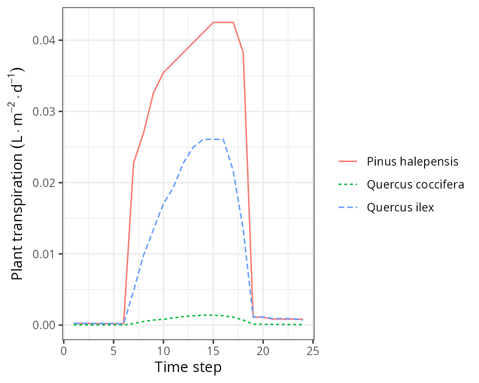

``` r

plot(sd1, type = "TranspirationPerLeaf", bySpecies = T)
```

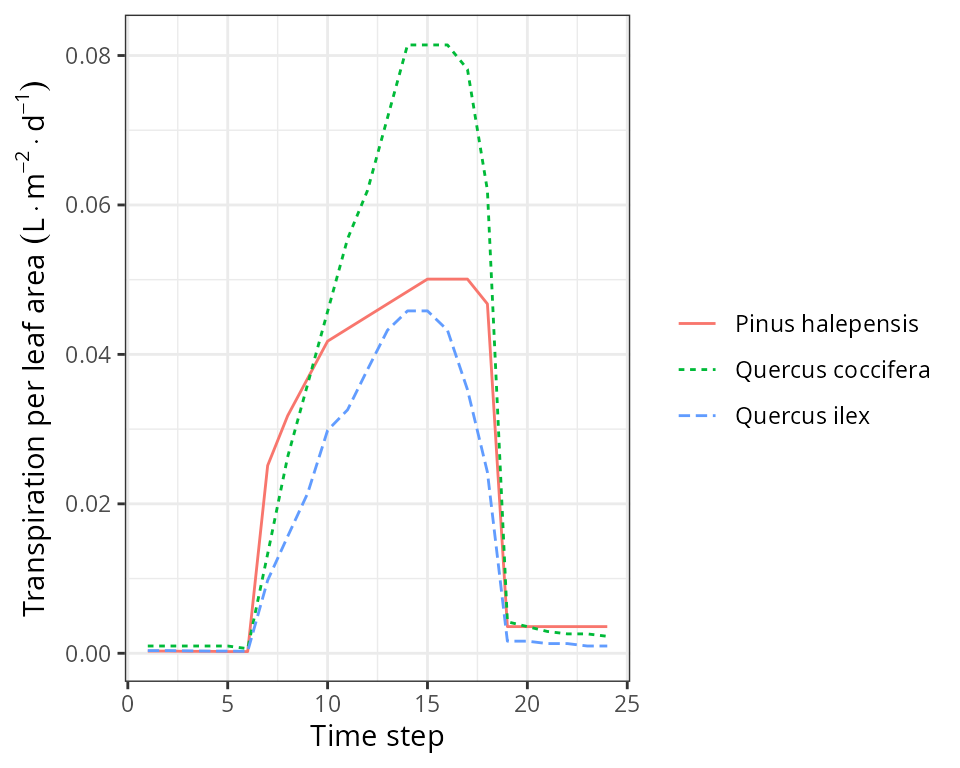

``` r

plot(sd1, type = "NetPhotosynthesis", bySpecies = T)
```

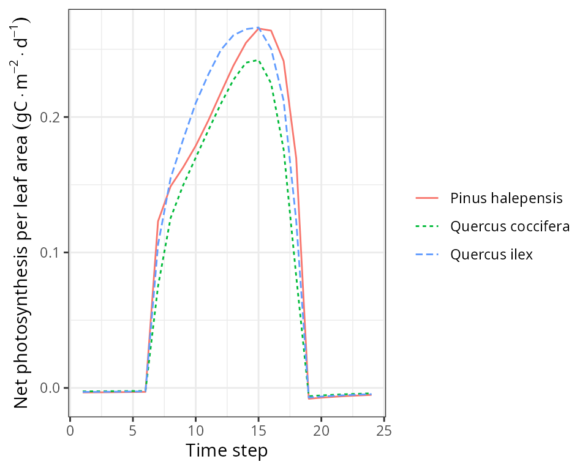

``` r

plot(sd1, type = "LeafPsiAverage", bySpecies = T)
```

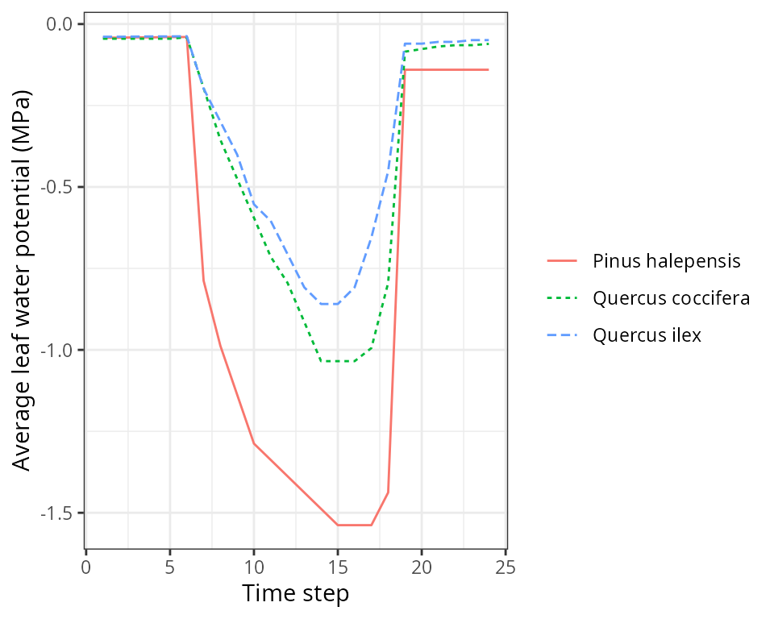

### Output for sunlit and shade leaves

The model distinguishes between sunlit and shade leaves for stomatal
regulation. Static properties of sunlit and shade leaves, for each
cohort, can be accessed via:

``` r

sd1$SunlitLeaves
```

    ##        LeafPsiMin  LeafPsiMax      GSWMin     GSWMax  TempMin  TempMax
    ## T1_148  -1.638418 -0.03981994 0.002242641 0.27954459 1.274590 12.15507
    ## T2_168  -1.593485 -0.04199022 0.003269167 0.07459518 1.272433 17.38666
    ## S1_165  -1.122060 -0.04703362 0.007561899 0.09612847 1.267823 17.32529

``` r

sd1$ShadeLeaves
```

    ##        LeafPsiMin  LeafPsiMax      GSWMin     GSWMax   TempMin  TempMax
    ## T1_148 -1.4377825 -0.03981994 0.002250491 0.28344103 0.9133647 10.28258
    ## T2_168 -0.7284531 -0.04019180 0.003263123 0.08637017 0.5326568 10.27049
    ## S1_165 -0.5152537 -0.04188680 0.007626981 0.10681154 0.6721882 10.19263

Instantaneous values are also stored for sunlit and shade leaves. We can
also use the `plot` function for objects of class `spwb_day` to draw
instantaneous variations in temperature for sunlit and shade leaves:

``` r

plot(sd1, type = "LeafTemperature", bySpecies=TRUE)
```

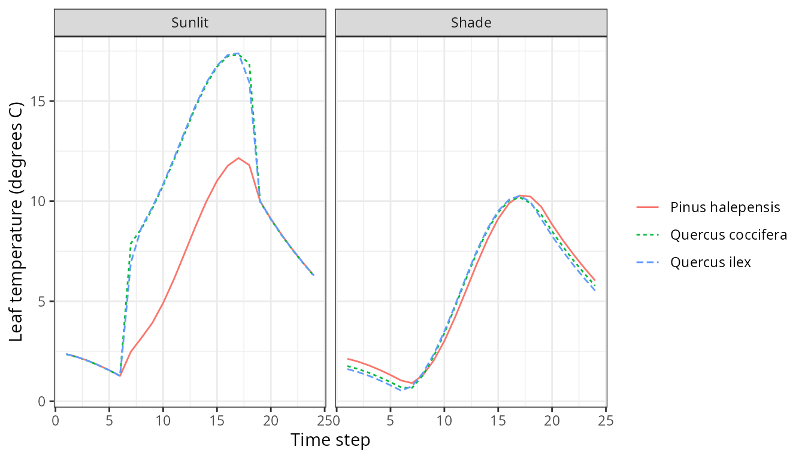

Note that sunlit leaves of some species reach temperatures higher than
the canopy. We can also plot variations in instantaneous gross and net
photosynthesis rates:

``` r

plot(sd1, type = "LeafGrossPhotosynthesis", bySpecies=TRUE)
```

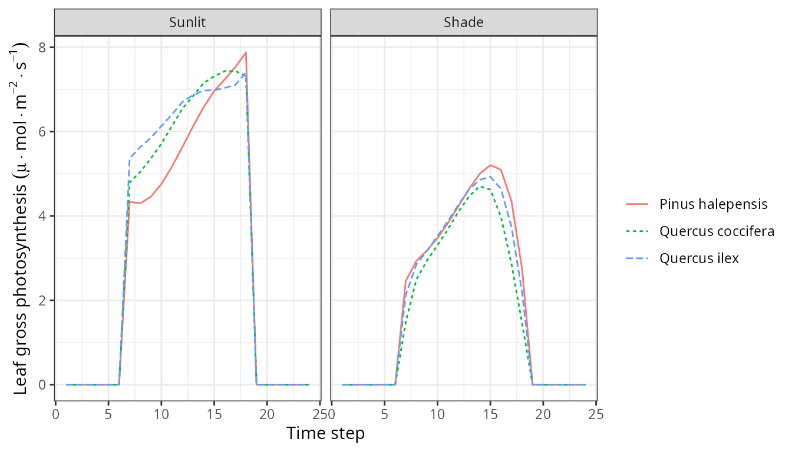

``` r

plot(sd1, type = "LeafNetPhotosynthesis", bySpecies=TRUE)
```

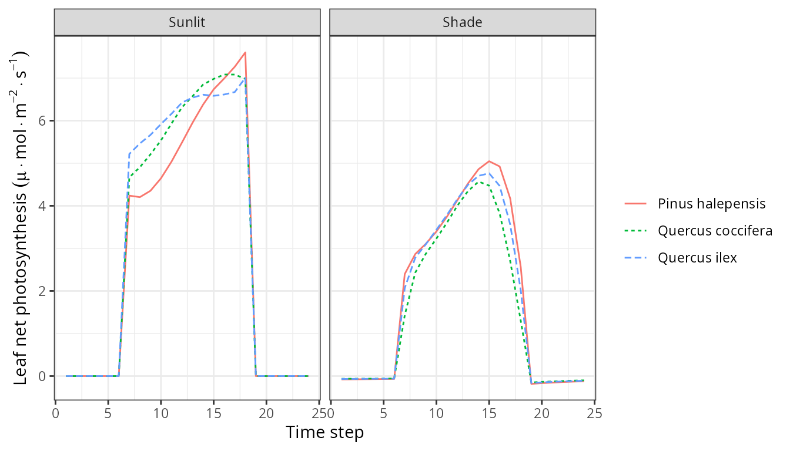

Or variations in stomatal conductance:

``` r

plot(sd1, type = "LeafStomatalConductance", bySpecies=TRUE)
```

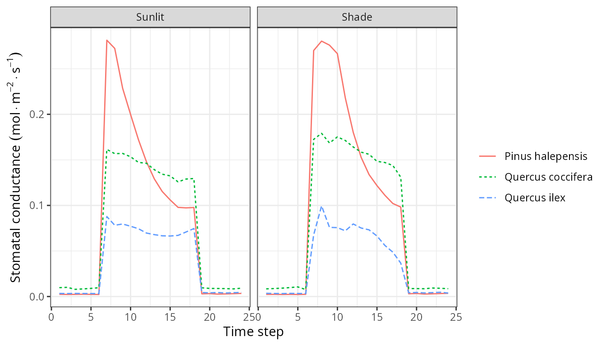

Or variations in vapour pressure deficit:

``` r

plot(sd1, type = "LeafVPD", bySpecies=TRUE)
```

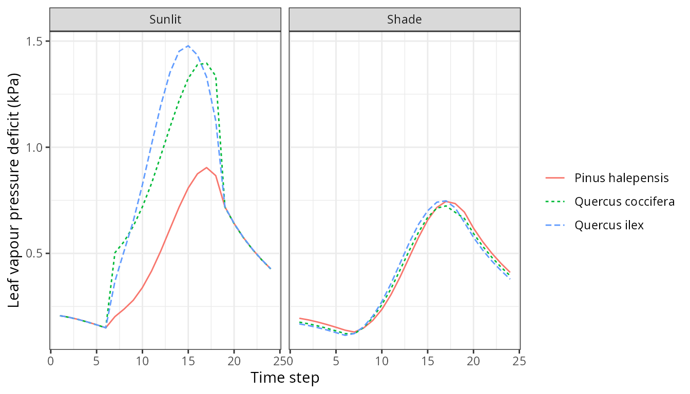

Or variations in leaf water potential:

``` r

plot(sd1, type = "LeafPsi", bySpecies=TRUE)
```

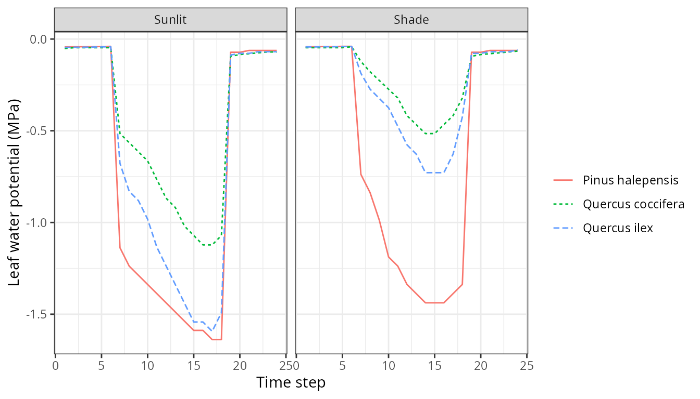

``` r

plot(sd1, type = "LeafCi", bySpecies=TRUE)
```

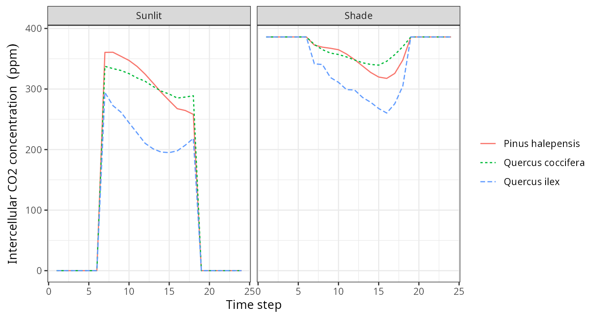

``` r

plot(sd1, type = "LeafIntrinsicWUE", bySpecies=TRUE)
```

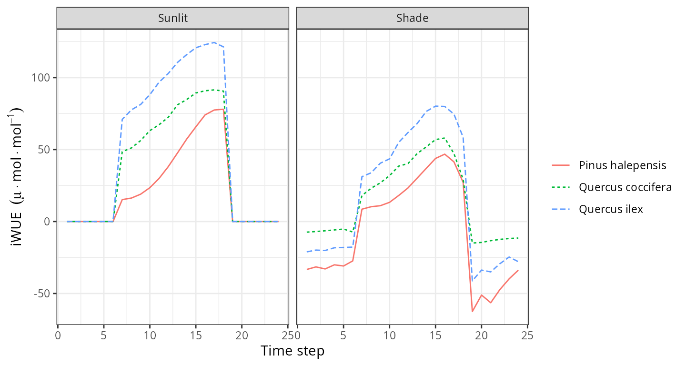

## Water balance for multiple days

### Running the model

Users will often use function
[`spwb()`](https://emf-creaf.github.io/medfate/reference/spwb.md) to run
the soil water balance model for several days. This function requires
the `spwbInput` object, the `soil` object and the meteorological data
frame. However, running
[`spwb_day()`](https://emf-creaf.github.io/medfate/reference/spwb_day.md)
modified the input objects. In particular, the soil moisture at the end
of the simulation was:

``` r

x$soil$W
```

    ## [1] 0.9847387 0.9988793 0.9998883 0.9999699

And the temperature of soil layers:

``` r

x$soil$Temp
```

    ## [1] 8.104258 3.161447 2.383659 2.363290

We can also see the current state of canopy variables:

``` r

x$canopy
```

    ##    zlow zmid  zup    LAIlive LAIexpanded LAIdead LAImistletoe     Tair Cair
    ## 1     0   50  100 0.03062604  0.03062604       0            0 5.695522  386
    ## 2   100  150  200 0.00000000  0.00000000       0            0 5.695522  386
    ## 3   200  250  300 0.06200693  0.06200693       0            0 5.695522  386
    ## 4   300  350  400 0.29933459  0.29933459       0            0 5.695522  386
    ## 5   400  450  500 0.43266592  0.43266592       0            0 5.695522  386
    ## 6   500  550  600 0.41005056  0.41005056       0            0 5.695522  386
    ## 7   600  650  700 0.24368578  0.24368578       0            0 5.695522  386
    ## 8   700  750  800 0.10657777  0.10657777       0            0 5.695522  386
    ## 9   800  850  900 0.00000000  0.00000000       0            0 5.695522  386
    ## 10  900  950 1000 0.00000000  0.00000000       0            0 5.695522  386
    ## 11 1000 1050 1100 0.00000000  0.00000000       0            0 5.695522  386
    ## 12 1100 1150 1200 0.00000000  0.00000000       0            0 5.695522  386
    ## 13 1200 1250 1300 0.00000000  0.00000000       0            0 5.695522  386
    ## 14 1300 1350 1400 0.00000000  0.00000000       0            0 5.695522  386
    ## 15 1400 1450 1500 0.00000000  0.00000000       0            0 5.695522  386
    ## 16 1500 1550 1600 0.00000000  0.00000000       0            0 5.695522  386
    ## 17 1600 1650 1700 0.00000000  0.00000000       0            0 5.695522  386
    ## 18 1700 1750 1800 0.00000000  0.00000000       0            0 5.695522  386
    ## 19 1800 1850 1900 0.00000000  0.00000000       0            0 5.695522  386
    ## 20 1900 1950 2000 0.00000000  0.00000000       0            0 5.695522  386
    ## 21 2000 2050 2100 0.00000000  0.00000000       0            0 5.695522  386
    ## 22 2100 2150 2200 0.00000000  0.00000000       0            0 5.695522  386
    ## 23 2200 2250 2300 0.00000000  0.00000000       0            0 5.695522  386
    ## 24 2300 2350 2400 0.00000000  0.00000000       0            0 5.695522  386
    ## 25 2400 2450 2500 0.00000000  0.00000000       0            0 5.695522  386
    ## 26 2500 2550 2600 0.00000000  0.00000000       0            0 5.695522  386
    ## 27 2600 2650 2700 0.00000000  0.00000000       0            0 5.695522  386
    ## 28 2700 2750 2800 0.00000000  0.00000000       0            0 5.695522  386
    ##        VPair
    ## 1  0.5170718
    ## 2  0.5170718
    ## 3  0.5170718
    ## 4  0.5170718
    ## 5  0.5170718
    ## 6  0.5170718
    ## 7  0.5170718
    ## 8  0.5170718
    ## 9  0.5170718
    ## 10 0.5170718
    ## 11 0.5170718
    ## 12 0.5170718
    ## 13 0.5170718
    ## 14 0.5170718
    ## 15 0.5170718
    ## 16 0.5170718
    ## 17 0.5170718
    ## 18 0.5170718
    ## 19 0.5170718
    ## 20 0.5170718
    ## 21 0.5170718
    ## 22 0.5170718
    ## 23 0.5170718
    ## 24 0.5170718
    ## 25 0.5170718
    ## 26 0.5170718
    ## 27 0.5170718
    ## 28 0.5170718

We simply use function
[`resetInputs()`](https://emf-creaf.github.io/medfate/reference/resetInputs.md)
to reset state variables to their default values, so that the new
simulation is not affected by the end state of the previous simulation:

``` r

resetInputs(x)
x$soil$W
```

    ## [1] 1 1 1 1

``` r

x$soil$Temp
```

    ## [1] NA NA NA NA

``` r

x$canopy
```

    ##    zlow zmid  zup    LAIlive LAIexpanded LAIdead LAImistletoe Tair Cair VPair
    ## 1     0   50  100 0.03062604  0.03062604       0            0   NA   NA    NA
    ## 2   100  150  200 0.00000000  0.00000000       0            0   NA   NA    NA
    ## 3   200  250  300 0.06200693  0.06200693       0            0   NA   NA    NA
    ## 4   300  350  400 0.29933459  0.29933459       0            0   NA   NA    NA
    ## 5   400  450  500 0.43266592  0.43266592       0            0   NA   NA    NA
    ## 6   500  550  600 0.41005056  0.41005056       0            0   NA   NA    NA
    ## 7   600  650  700 0.24368578  0.24368578       0            0   NA   NA    NA
    ## 8   700  750  800 0.10657777  0.10657777       0            0   NA   NA    NA
    ## 9   800  850  900 0.00000000  0.00000000       0            0   NA   NA    NA
    ## 10  900  950 1000 0.00000000  0.00000000       0            0   NA   NA    NA
    ## 11 1000 1050 1100 0.00000000  0.00000000       0            0   NA   NA    NA
    ## 12 1100 1150 1200 0.00000000  0.00000000       0            0   NA   NA    NA
    ## 13 1200 1250 1300 0.00000000  0.00000000       0            0   NA   NA    NA
    ## 14 1300 1350 1400 0.00000000  0.00000000       0            0   NA   NA    NA
    ## 15 1400 1450 1500 0.00000000  0.00000000       0            0   NA   NA    NA
    ## 16 1500 1550 1600 0.00000000  0.00000000       0            0   NA   NA    NA
    ## 17 1600 1650 1700 0.00000000  0.00000000       0            0   NA   NA    NA
    ## 18 1700 1750 1800 0.00000000  0.00000000       0            0   NA   NA    NA
    ## 19 1800 1850 1900 0.00000000  0.00000000       0            0   NA   NA    NA
    ## 20 1900 1950 2000 0.00000000  0.00000000       0            0   NA   NA    NA
    ## 21 2000 2050 2100 0.00000000  0.00000000       0            0   NA   NA    NA
    ## 22 2100 2150 2200 0.00000000  0.00000000       0            0   NA   NA    NA
    ## 23 2200 2250 2300 0.00000000  0.00000000       0            0   NA   NA    NA
    ## 24 2300 2350 2400 0.00000000  0.00000000       0            0   NA   NA    NA
    ## 25 2400 2450 2500 0.00000000  0.00000000       0            0   NA   NA    NA
    ## 26 2500 2550 2600 0.00000000  0.00000000       0            0   NA   NA    NA
    ## 27 2600 2650 2700 0.00000000  0.00000000       0            0   NA   NA    NA
    ## 28 2700 2750 2800 0.00000000  0.00000000       0            0   NA   NA    NA

Now we are ready to call function
[`spwb()`](https://emf-creaf.github.io/medfate/reference/spwb.md):

``` r

S <- spwb(x, examplemeteo, latitude = 41.82592, elevation = 100)
```

    ## Initial plant water content (mm): 6.71035
    ## Initial soil water content (mm): 290.875
    ## Initial snowpack content (mm): 0
    ## Performing daily simulations
    ## 
    ##  [Year 2001]:............
    ## 
    ## Final plant water content (mm): 6.70544
    ## Final soil water content (mm): 274.676
    ## Final snowpack content (mm): 0
    ## Change in plant water content (mm): -0.00491043
    ## Plant water balance result (mm): 7.67535e-16
    ## Change in soil water content (mm): -16.1991
    ## Soil water balance result (mm): -16.1991
    ## Change in snowpack water content (mm): 0
    ## Snowpack water balance result (mm): -7.10543e-15
    ## Water balance components:
    ##   Precipitation (mm) 513 Rain (mm) 462 Snow (mm) 51
    ##   Interception (mm) 83 Net rainfall (mm) 379
    ##   Infiltration (mm) 412 Infiltration excess (mm) 18 Saturation excess (mm) 0 Capillarity rise (mm) 0
    ##   Soil evaporation (mm) 24  Herbaceous transpiration (mm) 0  Woody plant transpiration (mm) 233  Mistletoe transpiration (mm) 0
    ##   Plant extraction from soil (mm) 233  Plant water balance (mm) 0 Hydraulic redistribution (mm) 3
    ##   Runoff (mm) 18 Deep drainage (mm) 172

Function
[`spwb()`](https://emf-creaf.github.io/medfate/reference/spwb.md)
returns an object of class *spwb*. If we inspect its elements, we
realize that the output is arranged differently than in
[`spwb_day()`](https://emf-creaf.github.io/medfate/reference/spwb_day.md):

``` r

names(S)
```

    ##  [1] "latitude"      "topography"    "weather"       "spwbInput"    
    ##  [5] "spwbOutput"    "WaterBalance"  "EnergyBalance" "Temperature"  
    ##  [9] "Soil"          "Snow"          "Stand"         "Plants"       
    ## [13] "SunlitLeaves"  "ShadeLeaves"   "subdaily"

In particular, element `spwbInput` contains a copy of the input
parameters that were used to run the model:

``` r

names(S$spwbInput)
```

    ##  [1] "control"                 "soil"                   
    ##  [3] "snowpack"                "canopy"                 
    ##  [5] "herbLAI"                 "herbLAImax"             
    ##  [7] "cohorts"                 "above"                  
    ##  [9] "below"                   "belowLayers"            
    ## [11] "paramsPhenology"         "paramsAnatomy"          
    ## [13] "paramsInterception"      "paramsTranspiration"    
    ## [15] "paramsWaterStorage"      "internalPhenology"      
    ## [17] "internalWater"           "internalLAIDistribution"
    ## [19] "internalFCCS"            "version"

As before, `WaterBalance` contains water balance components, but in this
case in form of a data frame with days in rows:

``` r

head(S$WaterBalance)
```

    ##                  PET Precipitation      Rain Snow    NetRain Snowmelt
    ## 2001-01-01 0.8828475      4.869109  4.869109    0  3.6000026        0
    ## 2001-01-02 1.6375337      2.498292  2.498292    0  1.2454970        0
    ## 2001-01-03 1.3017026      0.000000  0.000000    0  0.0000000        0
    ## 2001-01-04 0.5690790      5.796973  5.796973    0  4.5381440        0
    ## 2001-01-05 1.6760567      1.884401  1.884401    0  0.8222806        0
    ## 2001-01-06 1.2077028     13.359801 13.359801    0 11.9109817        0
    ##            Infiltration InfiltrationExcess SaturationExcess Runoff DeepDrainage
    ## 2001-01-01    3.6000026                  0                0      0    3.1157436
    ## 2001-01-02    1.2454970                  0                0      0    0.6581688
    ## 2001-01-03    0.0000000                  0                0      0    0.0000000
    ## 2001-01-04    4.5381440                  0                0      0    3.5038817
    ## 2001-01-05    0.8222806                  0                0      0    0.2299350
    ## 2001-01-06   11.9109817                  0                0      0    4.1214138
    ##            CapillarityRise Evapotranspiration Interception SoilEvaporation
    ## 2001-01-01               0          1.7533652     1.269106       0.4776452
    ## 2001-01-02               0          1.8401228     1.252795       0.5000000
    ## 2001-01-03               0          0.8799984     0.000000       0.5000000
    ## 2001-01-04               0          1.4130929     1.258829       0.1462039
    ## 2001-01-05               0          1.6824488     1.062121       0.5000000
    ## 2001-01-06               0          1.9271179     1.448819       0.4734759
    ##            HerbTranspiration PlantExtraction Transpiration
    ## 2001-01-01                 0     0.006613704   0.006613704
    ## 2001-01-02                 0     0.087328144   0.087328144
    ## 2001-01-03                 0     0.379998350   0.379998350
    ## 2001-01-04                 0     0.008060070   0.008060070
    ## 2001-01-05                 0     0.120327997   0.120327997
    ## 2001-01-06                 0     0.004823168   0.004823168
    ##            MistletoeTranspiration HydraulicRedistribution
    ## 2001-01-01                      0            0.000000e+00
    ## 2001-01-02                      0            0.000000e+00
    ## 2001-01-03                      0            0.000000e+00
    ## 2001-01-04                      0            0.000000e+00
    ## 2001-01-05                      0            0.000000e+00
    ## 2001-01-06                      0            5.749409e-06

Elements `Plants` is itself a list with several elements that contain
daily output results by plant cohorts, for example leaf minimum (midday)
water potentials are:

``` r

head(S$Plants$LeafPsiMin)
```

    ##               T1_148     T2_168     S1_165
    ## 2001-01-01 -1.252507 -0.6918245 -0.3902716
    ## 2001-01-02 -1.364606 -0.6019164 -0.3961110
    ## 2001-01-03 -1.327241 -0.7658794 -0.4527413
    ## 2001-01-04 -1.219864 -0.6063790 -0.3488650
    ## 2001-01-05 -1.395529 -0.6851459 -0.4326132
    ## 2001-01-06 -1.346010 -0.6349741 -0.3831818

### Plotting and summarizing results

Package `medfate` also provides a `plot` function for objects of class
`spwb`. It can be used to show the meteorological input. Additionally,
it can also be used to draw soil and plant variables. In the code below
we draw water fluxes, soil water potentials, plant transpiration and
plant (mid-day) water potential:

``` r

plot(S, type="Evapotranspiration")
```

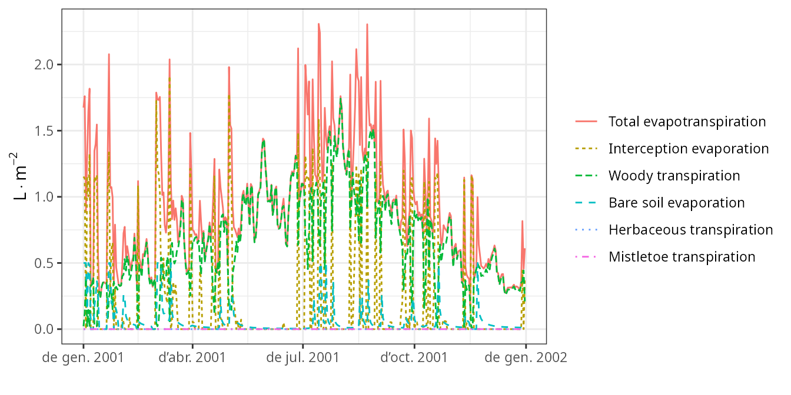

``` r

plot(S, type="SoilPsi", bySpecies = TRUE)
```

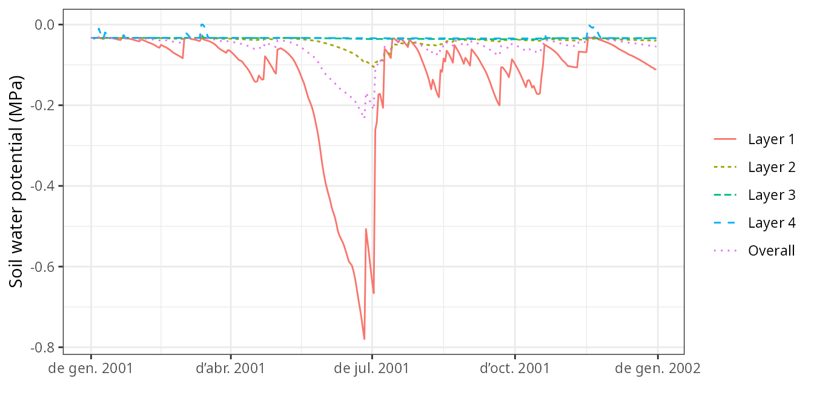

``` r

plot(S, type="PlantTranspiration", bySpecies = TRUE)
```

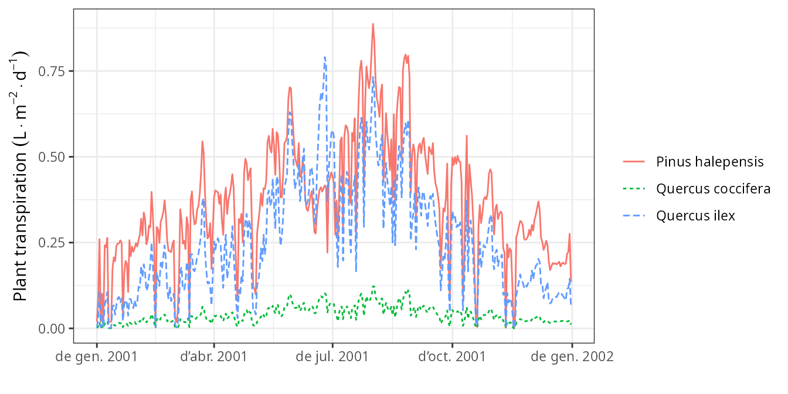

``` r

plot(S, type="LeafPsiMin", bySpecies = TRUE)
```

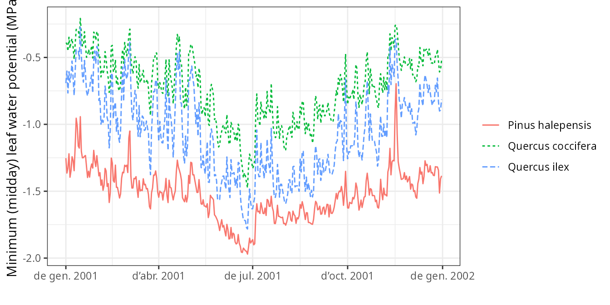

Alternatively, one can interactively create plots using function
`shinyplot`, e.g.:

``` r

shinyplot(S)
```

While the simulation model uses daily steps, users may be interested in
outputs at larger time scales. The package provides a `summary` for
objects of class `spwb`. This function can be used to summarize the
model’s output at different temporal steps (i.e. weekly, annual, …). For
example, to obtain the water balance by months one can use:

``` r

summary(S, freq="months",FUN=mean, output="WaterBalance")
```

    ##                 PET Precipitation       Rain      Snow    NetRain   Snowmelt
    ## 2001-01-01 1.011397    2.41127383 1.87415609 0.5371177 1.40082592 0.42235503
    ## 2001-02-01 2.278646    0.17855109 0.08778069 0.0907704 0.03830413 0.19831578
    ## 2001-03-01 2.368035    2.41917349 2.41917349 0.0000000 1.98241650 0.01762496
    ## 2001-04-01 3.086567    0.63056064 0.29195973 0.3386009 0.14714336 0.33860091
    ## 2001-05-01 3.662604    0.76337345 0.76337345 0.0000000 0.59589515 0.00000000
    ## 2001-06-01 5.265359    0.21959509 0.21959509 0.0000000 0.16400406 0.00000000
    ## 2001-07-01 4.443053    3.27810591 3.27810591 0.0000000 2.87125513 0.00000000
    ## 2001-08-01 4.463242    1.92222891 1.92222891 0.0000000 1.59138259 0.00000000
    ## 2001-09-01 3.453891    1.30651303 1.30651303 0.0000000 1.07683791 0.00000000
    ## 2001-10-01 2.405506    1.33598175 1.33598175 0.0000000 1.08372293 0.00000000
    ## 2001-11-01 1.716591    2.20566281 1.47764599 0.7280168 1.35115693 0.72801682
    ## 2001-12-01 1.608082    0.05046181 0.05046181 0.0000000 0.02201960 0.00000000
    ##            Infiltration InfiltrationExcess SaturationExcess     Runoff
    ## 2001-01-01    1.8231810         0.00000000                0 0.00000000
    ## 2001-02-01    0.2366199         0.00000000                0 0.00000000
    ## 2001-03-01    2.0000415         0.00000000                0 0.00000000
    ## 2001-04-01    0.4857443         0.00000000                0 0.00000000
    ## 2001-05-01    0.5958952         0.00000000                0 0.00000000
    ## 2001-06-01    0.1640041         0.00000000                0 0.00000000
    ## 2001-07-01    2.6141496         0.25710553                0 0.25710553
    ## 2001-08-01    1.5682255         0.02315708                0 0.02315708
    ## 2001-09-01    1.0768379         0.00000000                0 0.00000000
    ## 2001-10-01    1.0068235         0.07689940                0 0.07689940
    ## 2001-11-01    1.8488346         0.23033916                0 0.23033916
    ## 2001-12-01    0.0220196         0.00000000                0 0.00000000
    ##            DeepDrainage CapillarityRise Evapotranspiration Interception
    ## 2001-01-01   1.49871749               0          0.8816013   0.47333016
    ## 2001-02-01   0.03687470               0          0.5482125   0.04947656
    ## 2001-03-01   1.30548204               0          1.0273188   0.43675699
    ## 2001-04-01   0.04336173               0          0.7747488   0.14481637
    ## 2001-05-01   0.24951185               0          1.0117276   0.16747830
    ## 2001-06-01   0.00000000               0          0.8981391   0.05559103
    ## 2001-07-01   0.23547195               0          1.4934577   0.40685078
    ## 2001-08-01   0.36325849               0          1.5037516   0.33084632
    ## 2001-09-01   0.22929189               0          1.0319852   0.22967512
    ## 2001-10-01   0.39312561               0          0.9282724   0.25225882
    ## 2001-11-01   1.24673221               0          0.5908320   0.12648906
    ## 2001-12-01   0.00000000               0          0.4260358   0.02844221
    ##            SoilEvaporation HerbTranspiration PlantExtraction Transpiration
    ## 2001-01-01      0.17994554                 0       0.2283255     0.2283255
    ## 2001-02-01      0.04956741                 0       0.4491686     0.4491686
    ## 2001-03-01      0.12706604                 0       0.4634958     0.4634958
    ## 2001-04-01      0.02759026                 0       0.6023422     0.6023422
    ## 2001-05-01      0.04570348                 0       0.7985458     0.7985458
    ## 2001-06-01      0.00533589                 0       0.8372122     0.8372122
    ## 2001-07-01      0.09509194                 0       0.9915150     0.9915150
    ## 2001-08-01      0.04608449                 0       1.1268208     1.1268208
    ## 2001-09-01      0.05998664                 0       0.7423235     0.7423235
    ## 2001-10-01      0.05296336                 0       0.6230503     0.6230503
    ## 2001-11-01      0.06464538                 0       0.3996976     0.3996976
    ## 2001-12-01      0.01874525                 0       0.3788484     0.3788484
    ##            MistletoeTranspiration HydraulicRedistribution
    ## 2001-01-01                      0            3.511848e-07
    ## 2001-02-01                      0            6.561172e-05
    ## 2001-03-01                      0            3.437299e-04
    ## 2001-04-01                      0            1.705950e-03
    ## 2001-05-01                      0            4.505652e-03
    ## 2001-06-01                      0            8.248157e-02
    ## 2001-07-01                      0            1.085489e-02
    ## 2001-08-01                      0            6.401960e-04
    ## 2001-09-01                      0            1.051290e-03
    ## 2001-10-01                      0            5.130013e-04
    ## 2001-11-01                      0            5.381450e-04
    ## 2001-12-01                      0            5.043425e-04

Parameter `output` is used to indicate the element of the `spwb` object
for which we desire summaries. Similarly, it is possible to calculate
the average stress of plant cohorts by months:

``` r

summary(S, freq="months",FUN=mean, output="PlantStress")
```

    ##                  T1_148     T2_168     S1_165
    ## 2001-01-01 0.0002350139 0.01946412 0.01100044
    ## 2001-02-01 0.0007903553 0.03427363 0.01944327
    ## 2001-03-01 0.0009980932 0.03878040 0.02211232
    ## 2001-04-01 0.0016225108 0.04631889 0.02821344
    ## 2001-05-01 0.0059033736 0.06469220 0.04055806
    ## 2001-06-01 0.1612775672 0.09917545 0.12562729
    ## 2001-07-01 0.0214616143 0.08550870 0.06644184
    ## 2001-08-01 0.0062108924 0.08720194 0.05601644
    ## 2001-09-01 0.0028379138 0.06123814 0.03659198
    ## 2001-10-01 0.0021008802 0.04929730 0.02807352
    ## 2001-11-01 0.0006347958 0.02959528 0.01697744
    ## 2001-12-01 0.0007214252 0.02987667 0.01784526

The `summary` function can be also used to aggregate the output by
species. In this case, the values of plant cohorts belonging to the same
species will be averaged using LAI values as weights. For example, we
may average the daily drought stress across cohorts of the same species
(here there is only one cohort by species, so this does not modify the
output):

``` r

head(summary(S, freq="day", output="PlantStress", bySpecies = TRUE))
```

    ##            Pinus halepensis Quercus coccifera Quercus ilex
    ## 2001-01-01     1.209185e-04       0.009813020   0.02041134
    ## 2001-01-02     2.520003e-04       0.009882830   0.01735411
    ## 2001-01-03     2.622076e-04       0.012982072   0.02566990
    ## 2001-01-04     8.532759e-05       0.009339052   0.01767261
    ## 2001-01-05     3.107924e-04       0.010235342   0.01838860
    ## 2001-01-06     1.908540e-04       0.008676991   0.01588826

Or we can combine the aggregation by species with a temporal aggregation
(here monthly averages):

``` r

summary(S, freq="month", FUN = mean, output="PlantStress", bySpecies = TRUE)
```

    ##            Pinus halepensis Quercus coccifera Quercus ilex
    ## 2001-01-01     0.0002350139        0.01100044   0.01946412
    ## 2001-02-01     0.0007903553        0.01944327   0.03427363
    ## 2001-03-01     0.0009980932        0.02211232   0.03878040
    ## 2001-04-01     0.0016225108        0.02821344   0.04631889
    ## 2001-05-01     0.0059033736        0.04055806   0.06469220
    ## 2001-06-01     0.1612775672        0.12562729   0.09917545
    ## 2001-07-01     0.0214616143        0.06644184   0.08550870
    ## 2001-08-01     0.0062108924        0.05601644   0.08720194
    ## 2001-09-01     0.0028379138        0.03659198   0.06123814
    ## 2001-10-01     0.0021008802        0.02807352   0.04929730
    ## 2001-11-01     0.0006347958        0.01697744   0.02959528
    ## 2001-12-01     0.0007214252        0.01784526   0.02987667

## References

- De Cáceres M, Mencuccini M, Martin-StPaul N, Limousin JM, Coll L,
  Poyatos R, Cabon A, Granda V, Forner A, Valladares F, Martínez-Vilalta
  J (2021) Unravelling the effect of species mixing on water use and
  drought stress in holm oak forests: a modelling approach. Agricultural
  and Forest Meteorology 296
  (<https://doi.org/10.1016/j.agrformet.2020.108233>).

- Ruffault J, Pimont F, Cochard H, Dupuy JL, Martin-StPaul N (2022)
  SurEau-Ecos v2.0: a trait-based plant hydraulics model for simulations
  of plant water status and drought-induced mortality at the ecosystem
  level. Geoscientific Model Development 15, 5593-5626
  (<https://doi.org/10.5194/gmd-15-5593-2022>).
