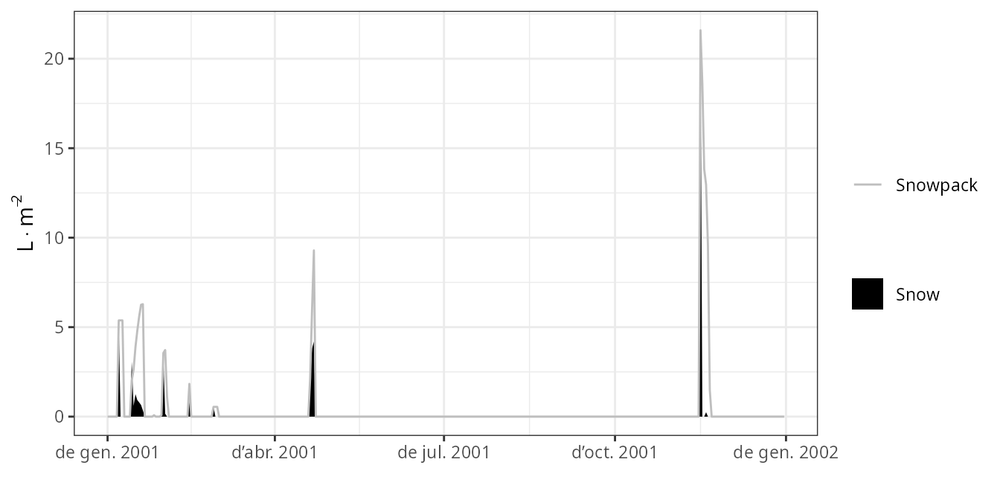
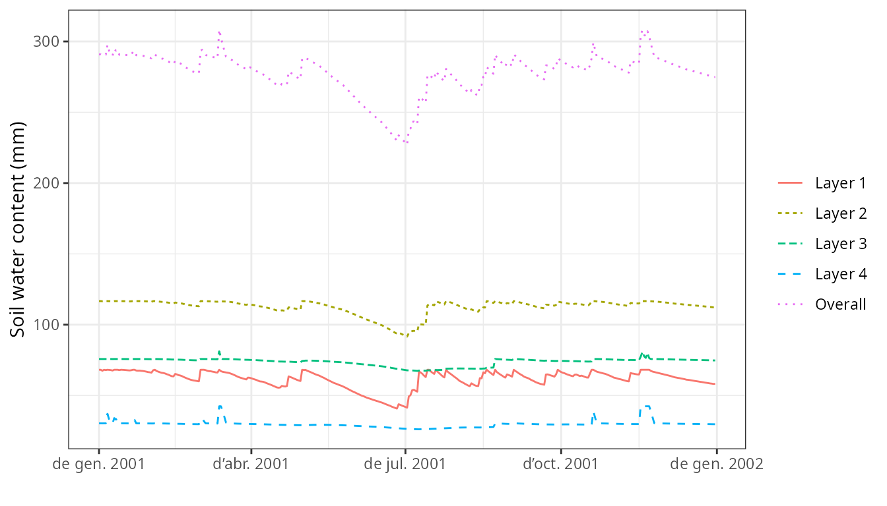
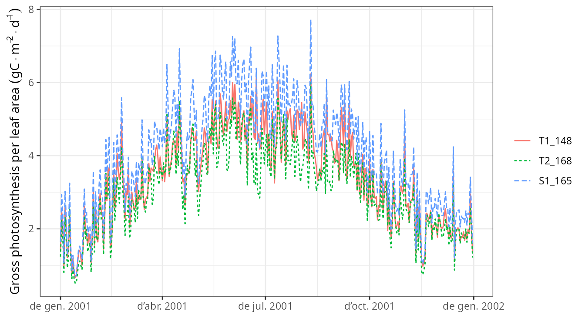
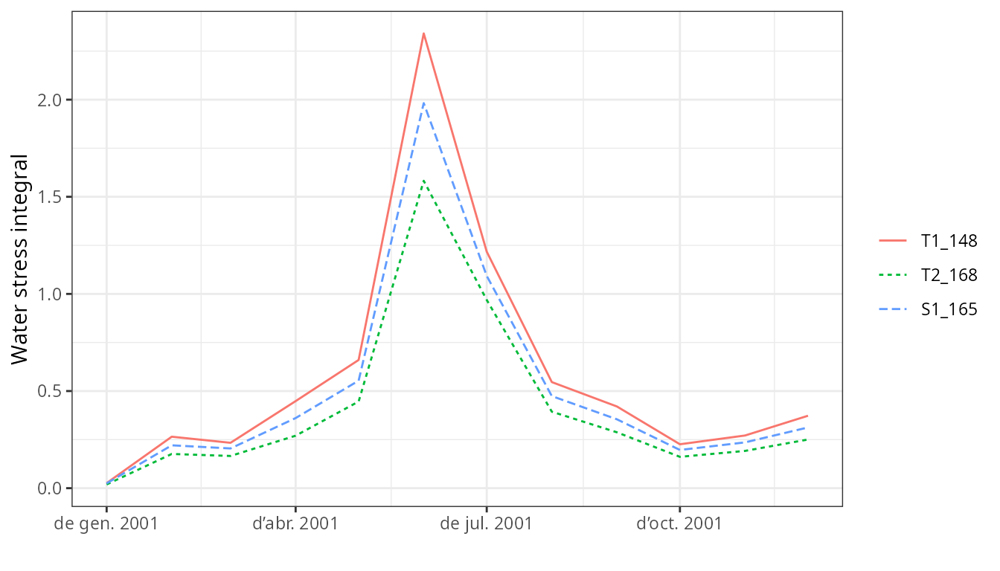

# Basic water balance

## About this vignette

The present document describes how to run the soil plant water balance
model described in De Cáceres et al. (2015) using package `medfate`. The
document illustrates how to prepare the inputs, use the simulation
functions and inspect the outputs. All the details of the model design
and formulation can be found at the
[medfatebook](https://emf-creaf.github.io/medfatebook/index.html).
Because it introduces many basic features of simulations with package
`medfate`, this document should be read before addressing advanced
topics of water balance simulations or growth simulations.

## Preparing model inputs

Model inputs are explained in greater detail in vignettes
[*Understanding model
inputs*](https://emf-creaf.github.io/medfate/articles/intro/UnderstandingInputs.html)
and [*Preparing model
inputs*](https://emf-creaf.github.io/medfate/articles/intro/PreparingInputs.html).
Here we only review the different steps required to run function
[`spwb()`](https://emf-creaf.github.io/medfate/reference/spwb.md).

### Soil, vegetation, meteorology and species data

Soil information needs to be entered as a `data frame` with soil layers
in rows and physical attributes in columns. Soil physical attributes can
be initialized to default values, for a given number of layers, using
function
[`defaultSoilParams()`](https://emf-creaf.github.io/medfate/reference/defaultSoilParams.md):

``` r
examplesoil <- defaultSoilParams(4)
examplesoil
```

    ##   widths clay sand om nitrogen  bd rfc
    ## 1    300   25   25 NA       NA 1.5  25
    ## 2    700   25   25 NA       NA 1.5  45
    ## 3   1000   25   25 NA       NA 1.5  75
    ## 4   2000   25   25 NA       NA 1.5  95

As explained in the package overview, models included in `medfate` were
primarily designed to be ran on **forest inventory plots**. Here we use
the example object provided with the package:

``` r
data(exampleforest)
exampleforest
```

    ## $treeData
    ##            Species   DBH Height   N Z50  Z95
    ## 1 Pinus halepensis 37.55    800 168 100  300
    ## 2     Quercus ilex 14.60    660 384 300 1000
    ## 
    ## $shrubData
    ##             Species Height Cover Z50  Z95
    ## 1 Quercus coccifera     80  3.75 200 1000
    ## 
    ## attr(,"class")
    ## [1] "forest" "list"

Importantly, a data frame with daily weather for the period to be
simulated is required. Here we use the default data frame included with
the package:

``` r
data(examplemeteo)
head(examplemeteo)
```

    ##        dates MinTemperature MaxTemperature Precipitation MinRelativeHumidity
    ## 1 2001-01-01     -0.5934215       6.287950      4.869109            65.15411
    ## 2 2001-01-02     -2.3662458       4.569737      2.498292            57.43761
    ## 3 2001-01-03     -3.8541036       2.661951      0.000000            58.77432
    ## 4 2001-01-04     -1.8744860       3.097705      5.796973            66.84256
    ## 5 2001-01-05      0.3288287       7.551532      1.884401            62.97656
    ## 6 2001-01-06      0.5461322       7.186784     13.359801            74.25754
    ##   MaxRelativeHumidity Radiation WindSpeed
    ## 1           100.00000  12.89251  2.000000
    ## 2            94.71780  13.03079  7.662544
    ## 3            94.66823  16.90722  2.000000
    ## 4            95.80950  11.07275  2.000000
    ## 5           100.00000  13.45205  7.581347
    ## 6           100.00000  12.84841  6.570501

Finally, simulations in `medfate` require a data frame with species
parameter values, which we load using defaults for Catalonia (NE Spain):

``` r
data("SpParamsMED")
```

### Simulation control

Apart from data inputs, the behaviour of simulation models can be
controlled using a set of global parameters. The default
parameterization is obtained using function
[`defaultControl()`](https://emf-creaf.github.io/medfate/reference/defaultControl.md):

``` r
control <- defaultControl("Granier")
```

Some parameters deserve explanation here:

1.  Console output can be turned off by setting `verbose = FALSE`.
2.  The soil water retention curves can be switched between Saxton’s and
    Van Genuchten’s using parameter `soilFunctions`.
3.  The complexity of the soil water balance calculations will be very
    different if we set `transpirationMode = "Sperry"` or
    `transpirationMode = "Sureau"`, instead of
    `transpirationMode = "Granier"`.

### Water balance input object

A last object is needed before calling simulation functions, called
`spwbInput`. It consists in the compilation of aboveground and
belowground parameters and the specification of additional parameter
values for each plant cohort. The object can be generated using function
[`spwbInput()`](https://emf-creaf.github.io/medfate/reference/modelInput.md):

``` r
x <- spwbInput(exampleforest, examplesoil, SpParamsMED, control)
```

Different parameter variables will be drawn depending on the value of
`transpirationMode`. For the basic water balance model
(`transpirationMode = "Granier"`), relatively few parameters are needed.
All the input information for forest data and species parameter values
can be inspected by accessing the different elements of this object,
whose names are.

``` r
names(x)
```

    ##  [1] "control"                 "soil"                   
    ##  [3] "snowpack"                "canopy"                 
    ##  [5] "herbLAI"                 "herbLAImax"             
    ##  [7] "cohorts"                 "above"                  
    ##  [9] "below"                   "belowLayers"            
    ## [11] "paramsPhenology"         "paramsAnatomy"          
    ## [13] "paramsInterception"      "paramsTranspiration"    
    ## [15] "paramsWaterStorage"      "internalPhenology"      
    ## [17] "internalWater"           "internalLAIDistribution"
    ## [19] "internalFCCS"            "version"

Finally, note that users can set cohort-specific parameters for soil
water balance (instead of using species-level values) by modifying
manually the parameter values in this object. Since some parameters may
be coordinated by design, however, it is better to use specific package
functions for this purpose.

## Executing the soil water balance model

### Water balance for a single day

Soil water balance simulations will normally span periods of several
months or years, but since the model operates at a daily temporal scale,
it is possible to perform soil water balance for one day only. This is
done using function
[`spwb_day()`](https://emf-creaf.github.io/medfate/reference/spwb_day.md).
In the following code we select day 100 from the meteorological input
data and perform soil water balance for that day only:

``` r
d <- 100
date <- examplemeteo$dates[d]
meteovec <- unlist(examplemeteo[d,])
sd1<-spwb_day(x, date, meteovec,  
             latitude = 41.82592, elevation = 100, slope= 0, aspect = 0)
```

    ## Package 'meteoland' [ver. 2.2.4]

Function
[`spwb_day()`](https://emf-creaf.github.io/medfate/reference/spwb_day.md)
is most useful when working with the complex transpiration model. This
is why so many meteorological variables are required. The output of
[`spwb_day()`](https://emf-creaf.github.io/medfate/reference/spwb_day.md)
is a list with five elements:

``` r
names(sd1)
```

    ## [1] "cohorts"      "topography"   "weather"      "WaterBalance" "Soil"        
    ## [6] "Stand"        "Plants"

- **cohorts**: Table with the species code and species name of each
  cohort.
- **WaterBalance**: Contains the soil water balance flows
  (precipitation, infiltration, transpiration, …)
- **Soil**: Contains output values by soil layer (i.e. water evaporated
  from each soil layer, water transpired from each soil layer and the
  final soil water potential).
- **Stand**: A list with stand LAI (expanded and dead leaves), canopy
  water retention capacity and the proportion of light (SWR or PAR)
  reaching the ground.
- **Plants**: Contains output values by plant cohort (i.e. LAI values,
  transpiration, water potential, drought stress index, …).

``` r
sd1
```

    ## $cohorts
    ##         SP              Name
    ## T1_148 148  Pinus halepensis
    ## T2_168 168      Quercus ilex
    ## S1_165 165 Quercus coccifera
    ## 
    ## $topography
    ## elevation     slope    aspect 
    ##       100         0         0 
    ## 
    ## $weather
    ##        tday        prec        tmin        tmax       rhmin       rhmax 
    ##   6.2323731   0.0000000   0.3881289  10.0320962  42.0207334  82.3036989 
    ##         rad        wind        Catm        Patm         pet        rint 
    ##  28.7201692   3.3228840 386.0000000          NA   3.9023342   1.5000000 
    ## 
    ## $WaterBalance
    ##                     PET                    Rain                    Snow 
    ##               3.9023342               0.0000000               0.0000000 
    ##                 NetRain                Snowmelt                   Runon 
    ##               0.0000000               0.0000000               0.0000000 
    ##            Infiltration      InfiltrationExcess        SaturationExcess 
    ##               0.0000000               0.0000000               0.0000000 
    ##                  Runoff            DeepDrainage         CapillarityRise 
    ##               0.0000000               0.0000000               0.0000000 
    ##         SoilEvaporation       HerbTranspiration         PlantExtraction 
    ##               0.5000000               0.0000000               0.8996836 
    ##           Transpiration HydraulicRedistribution 
    ##               0.8996836               0.0000000 
    ## 
    ## $Soil
    ##           Psi HerbTranspiration HydraulicInput HydraulicOutput PlantExtraction
    ## 1 -0.03587845                 0              0     0.703516265     0.703516265
    ## 2 -0.03323977                 0              0     0.178256444     0.178256444
    ## 3 -0.03303089                 0              0     0.014956372     0.014956372
    ## 4 -0.03301525                 0              0     0.002954471     0.002954471
    ## 
    ## $Stand
    ##         LAI     LAIherb     LAIlive LAIexpanded     LAIdead          Cm 
    ##    1.584948    0.000000    1.584948    1.584948    0.000000    1.216848 
    ##  LgroundPAR  LgroundSWR 
    ##   43.636170   54.102798 
    ## 
    ## $Plants
    ##               LAI    LAIlive     FPAR AbsorbedSWRFraction Extraction
    ## T1_148 0.84874773 0.84874773 92.18285           35.076344 0.55258221
    ## T2_168 0.70557382 0.70557382 72.36365           30.444383 0.32034759
    ## S1_165 0.03062604 0.03062604 44.32407            2.366131 0.02675376
    ##        Transpiration GrossPhotosynthesis PlantPsi         DDS   StemRWC
    ## T1_148    0.55258221           3.7143297   -0.033 0.004613739 0.9998350
    ## T2_168    0.32034759           2.9300190   -0.033 0.006282261 0.9997500
    ## S1_165    0.02675376           0.1635903   -0.033 0.003088161 0.9983684
    ##          LeafRWC      LFMC      StemPLC      LeafPLC WaterBalance
    ## T1_148 0.9979679 125.86544 0.000000e+00 0.000000e+00 0.000000e+00
    ## T2_168 0.9986797  93.05186 3.681226e-09 2.905929e-03 0.000000e+00
    ## S1_165 0.9987207  96.38420 4.394058e-08 3.473351e-05 3.469447e-18
    ## 
    ## attr(,"class")
    ## [1] "spwb_day" "list"

### Water balance for multiple days

Most often, users will use function
[`spwb()`](https://emf-creaf.github.io/medfate/reference/spwb.md) to run
the soil water balance model. This function requires the `spwbInput`
object and the meteorological data frame. However, function
[`spwb_day()`](https://emf-creaf.github.io/medfate/reference/spwb_day.md)
by default modifies the state variables of the input objects. In
particular, the values of soil moisture are now:

``` r
x$soil$W
```

    ## [1] 0.9823464 0.9984719 0.9998026 0.9999025

We simply reset state variables to their default values so that new
simulations are not affected by the end state of the previous
simulation:

``` r
resetInputs(x)
x$soil$W
```

    ## [1] 1 1 1 1

Now we are ready to call function
[`spwb()`](https://emf-creaf.github.io/medfate/reference/spwb.md):

``` r
S <- spwb(x, examplemeteo, latitude = 41.82592, elevation = 100)
```

    ## Initial plant water content (mm): 4.69853
    ## Initial soil water content (mm): 290.875
    ## Initial snowpack content (mm): 0
    ## Performing daily simulations
    ## 
    ##  [Year 2001]:............
    ## 
    ## Final plant water content (mm): 4.69674
    ## Final soil water content (mm): 275.757
    ## Final snowpack content (mm): 0
    ## Change in plant water content (mm): -0.00178912
    ## Plant water balance result (mm): -0.00180604
    ## Change in soil water content (mm): -15.1184
    ## Soil water balance result (mm): -15.1184
    ## Change in snowpack water content (mm): 0
    ## Snowpack water balance result (mm): -7.10543e-15
    ## Water balance components:
    ##   Precipitation (mm) 513 Rain (mm) 462 Snow (mm) 51
    ##   Interception (mm) 83 Net rainfall (mm) 380
    ##   Infiltration (mm) 410 Infiltration excess (mm) 21 Saturation excess (mm) 0 Capillarity rise (mm) 0
    ##   Soil evaporation (mm) 25  Herbaceous transpiration (mm) 0 Woody plant transpiration (mm) 246
    ##   Plant extraction from soil (mm) 246  Plant water balance (mm) -0 Hydraulic redistribution (mm) 2
    ##   Runoff (mm) 21 Deep drainage (mm) 154

Function
[`spwb()`](https://emf-creaf.github.io/medfate/reference/spwb.md)
returns an object of class with the same name, actually a list:

``` r
class(S)
```

    ## [1] "spwb" "list"

If we inspect its elements, we realize that the output is arranged
differently than in
[`spwb_day()`](https://emf-creaf.github.io/medfate/reference/spwb_day.md):

``` r
names(S)
```

    ##  [1] "latitude"     "topography"   "weather"      "spwbInput"    "spwbOutput"  
    ##  [6] "WaterBalance" "Soil"         "Snow"         "Stand"        "Plants"

In particular, element `spwbInput` contains a copy of the input
parameters that were used to run the model:

``` r
names(S$spwbInput)
```

    ##  [1] "control"                 "soil"                   
    ##  [3] "snowpack"                "canopy"                 
    ##  [5] "herbLAI"                 "herbLAImax"             
    ##  [7] "cohorts"                 "above"                  
    ##  [9] "below"                   "belowLayers"            
    ## [11] "paramsPhenology"         "paramsAnatomy"          
    ## [13] "paramsInterception"      "paramsTranspiration"    
    ## [15] "paramsWaterStorage"      "internalPhenology"      
    ## [17] "internalWater"           "internalLAIDistribution"
    ## [19] "internalFCCS"            "version"

As before, `WaterBalance` contains water balance components, but in this
case in form of a data frame with days in rows:

``` r
head(S$WaterBalance)
```

    ##                  PET Precipitation      Rain Snow    NetRain Snowmelt
    ## 2001-01-01 0.8828475      4.869109  4.869109    0  3.6000026        0
    ## 2001-01-02 1.6375337      2.498292  2.498292    0  1.2465550        0
    ## 2001-01-03 1.3017026      0.000000  0.000000    0  0.0000000        0
    ## 2001-01-04 0.5690790      5.796973  5.796973    0  4.5392067        0
    ## 2001-01-05 1.6760567      1.884401  1.884401    0  0.8232431        0
    ## 2001-01-06 1.2077028     13.359801 13.359801    0 11.9122560        0
    ##            Infiltration InfiltrationExcess SaturationExcess Runoff DeepDrainage
    ## 2001-01-01    3.6000026                  0                0      0    2.9188167
    ## 2001-01-02    1.2465550                  0                0      0    0.3694012
    ## 2001-01-03    0.0000000                  0                0      0    0.0000000
    ## 2001-01-04    4.5392067                  0                0      0    3.4543368
    ## 2001-01-05    0.8232431                  0                0      0    0.1420391
    ## 2001-01-06   11.9122560                  0                0      0    4.1214138
    ##            CapillarityRise Evapotranspiration Interception SoilEvaporation
    ## 2001-01-01               0          1.9502921     1.269106       0.4776452
    ## 2001-01-02               0          2.1288904     1.251737       0.5000000
    ## 2001-01-03               0          0.7998058     0.000000       0.5000000
    ## 2001-01-04               0          1.5428303     1.257766       0.1540330
    ## 2001-01-05               0          1.9471677     1.061158       0.5000000
    ## 2001-01-06               0          2.0611808     1.447545       0.3355142
    ##            HerbTranspiration PlantExtraction Transpiration
    ## 2001-01-01                 0       0.2035406     0.2035406
    ## 2001-01-02                 0       0.3771538     0.3771538
    ## 2001-01-03                 0       0.2998058     0.2998058
    ## 2001-01-04                 0       0.1310311     0.1310311
    ## 2001-01-05                 0       0.3860093     0.3860093
    ## 2001-01-06                 0       0.2781219     0.2781219
    ##            HydraulicRedistribution
    ## 2001-01-01                       0
    ## 2001-01-02                       0
    ## 2001-01-03                       0
    ## 2001-01-04                       0
    ## 2001-01-05                       0
    ## 2001-01-06                       0

Element `Plants` is in turn a list with several dataframes with plant
output variables, for example plant water potentials are in:

``` r
head(S$Plants$PlantPsi)
```

    ##                 T1_148      T2_168      S1_165
    ## 2001-01-01 -0.03300000 -0.03300000 -0.03300000
    ## 2001-01-02 -0.03300000 -0.03300000 -0.03300000
    ## 2001-01-03 -0.03300000 -0.03300000 -0.03300000
    ## 2001-01-04 -0.03464604 -0.03390328 -0.03419979
    ## 2001-01-05 -0.03300000 -0.03300000 -0.03300000
    ## 2001-01-06 -0.03344937 -0.03323705 -0.03332187

## Inspecting model outputs

### Plots

Package `medfate` provides a simple `plot` function for objects of class
`spwb`. It can be used to show meteorological inputs, snow dynamics, and
different components of the water balance:

``` r
plot(S, type = "PET_Precipitation")
```


``` r
plot(S, type = "Snow")
```



``` r
plot(S, type = "Export")
```


``` r
plot(S, type = "Evapotranspiration")
```


Function `plot` is also allows displaying soil moisture dynamics by
layer, which can be done in four different ways (the first two only
imply a change in axis units):

``` r
plot(S, type="SoilTheta")
```


``` r
plot(S, type="SoilRWC")
```


``` r
plot(S, type="SoilPsi")
```


``` r
plot(S, type="SoilVol")
```



Finally, the same function can also be used to draw the dynamics of
plant variables by cohorts, such as transpiration, gross photosynthesis
or water potential:

``` r
plot(S, type="Transpiration")
```


``` r
plot(S, type="GrossPhotosynthesis")
```



``` r
plot(S, type="PlantPsi")
```


Finally, one can interactively create plots using function `shinyplot`,
e.g.:

``` r
shinyplot(S)
```

### Extracting output

Simulation outputs in form of lists have a nested structure that is not
easy to handle. Functions are provided to extract model outputs as
`data.frame` objects. The following code extracts daily series of
stand-level variables, including their units:

``` r
extract(S, "forest", addunits = TRUE) |>
  tibble::as_tibble()
```

    ## # A tibble: 365 × 29
    ##    date           PET Precipitation    Rain   Snow NetRain Snowmelt Infiltration
    ##    <date>     [L/m^2]       [L/m^2] [L/m^2] [L/m^… [L/m^2]  [L/m^2]      [L/m^2]
    ##  1 2001-01-01   0.883          4.87    4.87   0      3.60      0           3.60 
    ##  2 2001-01-02   1.64           2.50    2.50   0      1.25      0           1.25 
    ##  3 2001-01-03   1.30           0       0      0      0         0           0    
    ##  4 2001-01-04   0.569          5.80    5.80   0      4.54      0           4.54 
    ##  5 2001-01-05   1.68           1.88    1.88   0      0.823     0           0.823
    ##  6 2001-01-06   1.21          13.4    13.4    0     11.9       0          11.9  
    ##  7 2001-01-07   0.637          5.38    0      5.38   0         0           0    
    ##  8 2001-01-08   0.832          0       0      0      0         0           0    
    ##  9 2001-01-09   1.98           0       0      0      0         0           0    
    ## 10 2001-01-10   0.829          5.12    5.12   0      3.85      5.38        9.23 
    ## # ℹ 355 more rows
    ## # ℹ 21 more variables: InfiltrationExcess [L/m^2], SaturationExcess [L/m^2],
    ## #   Runoff [L/m^2], DeepDrainage [L/m^2], CapillarityRise [L/m^2],
    ## #   Evapotranspiration [L/m^2], Interception [L/m^2], SoilEvaporation [L/m^2],
    ## #   HerbTranspiration [L/m^2], PlantExtraction [L/m^2], Transpiration [L/m^2],
    ## #   HydraulicRedistribution [L/m^2], LAI [m^2/m^2], LAIherb [m^2/m^2],
    ## #   LAIlive [m^2/m^2], LAIexpanded [m^2/m^2], LAIdead [m^2/m^2], Cm [L/m^2], …

And a similar code can be used to daily series of cohort-level
variables:

``` r
extract(S, "cohort", addunits = TRUE) |>
  tibble::as_tibble()
```

    ## # A tibble: 1,095 × 17
    ##    date       cohort species               LAI LAIlive FPAR AbsorbedSWRFraction
    ##    <date>     <chr>  <chr>            [m^2/m^… [m^2/m…  [%]               <dbl>
    ##  1 2001-01-01 T1_148 Pinus halepensis    0.849   0.849 92.2                35.1
    ##  2 2001-01-02 T1_148 Pinus halepensis    0.849   0.849 92.2                35.1
    ##  3 2001-01-03 T1_148 Pinus halepensis    0.849   0.849 92.2                35.1
    ##  4 2001-01-04 T1_148 Pinus halepensis    0.849   0.849 92.2                35.1
    ##  5 2001-01-05 T1_148 Pinus halepensis    0.849   0.849 92.2                35.1
    ##  6 2001-01-06 T1_148 Pinus halepensis    0.849   0.849 92.2                35.1
    ##  7 2001-01-07 T1_148 Pinus halepensis    0.849   0.849 92.2                35.1
    ##  8 2001-01-08 T1_148 Pinus halepensis    0.849   0.849 92.2                35.1
    ##  9 2001-01-09 T1_148 Pinus halepensis    0.849   0.849 92.2                35.1
    ## 10 2001-01-10 T1_148 Pinus halepensis    0.849   0.849 92.2                35.1
    ## # ℹ 1,085 more rows
    ## # ℹ 10 more variables: Transpiration [L/m^2], GrossPhotosynthesis [L/m^2],
    ## #   PlantPsi [MPa], LeafPLC <dbl>, StemPLC <dbl>, PlantWaterBalance [L/m^2],
    ## #   LeafRWC [%], StemRWC [%], LFMC [%], PlantStress <dbl>

### Temporal summaries

While the simulation model uses daily steps, users will normally be
interested in outputs at larger time scales. The package provides a
`summary` for objects of class `spwb`. This function can be used to
summarize the model’s output at different temporal steps (i.e. weekly,
annual, …). For example, to obtain the water balance by months one can
use:

``` r
summary(S, freq="months",FUN=mean, output="WaterBalance")
```

    ##                 PET Precipitation       Rain      Snow    NetRain   Snowmelt
    ## 2001-01-01 1.011397    2.41127383 1.87415609 0.5371177 1.40120651 0.42235503
    ## 2001-02-01 2.278646    0.17855109 0.08778069 0.0907704 0.03835896 0.19831578
    ## 2001-03-01 2.368035    2.41917349 2.41917349 0.0000000 1.98304212 0.01762496
    ## 2001-04-01 3.086567    0.63056064 0.29195973 0.3386009 0.14741810 0.33860091
    ## 2001-05-01 3.662604    0.76337345 0.76337345 0.0000000 0.59623344 0.00000000
    ## 2001-06-01 5.265359    0.21959509 0.21959509 0.0000000 0.16455140 0.00000000
    ## 2001-07-01 4.443053    3.27810591 3.27810591 0.0000000 2.87554032 0.00000000
    ## 2001-08-01 4.463242    1.92222891 1.92222891 0.0000000 1.59489059 0.00000000
    ## 2001-09-01 3.453891    1.30651303 1.30651303 0.0000000 1.07927347 0.00000000
    ## 2001-10-01 2.405506    1.33598175 1.33598175 0.0000000 1.08638953 0.00000000
    ## 2001-11-01 1.716591    2.20566281 1.47764599 0.7280168 1.35248327 0.72801682
    ## 2001-12-01 1.608082    0.05046181 0.05046181 0.0000000 0.02233029 0.00000000
    ##            Infiltration InfiltrationExcess SaturationExcess     Runoff
    ## 2001-01-01   1.82356154         0.00000000                0 0.00000000
    ## 2001-02-01   0.23667474         0.00000000                0 0.00000000
    ## 2001-03-01   2.00066707         0.00000000                0 0.00000000
    ## 2001-04-01   0.48601901         0.00000000                0 0.00000000
    ## 2001-05-01   0.59623344         0.00000000                0 0.00000000
    ## 2001-06-01   0.16455140         0.00000000                0 0.00000000
    ## 2001-07-01   2.59325677         0.28228355                0 0.28228355
    ## 2001-08-01   1.55098292         0.04390767                0 0.04390767
    ## 2001-09-01   1.07927347         0.00000000                0 0.00000000
    ## 2001-10-01   0.97501674         0.11137279                0 0.11137279
    ## 2001-11-01   1.83141672         0.24908336                0 0.24908336
    ## 2001-12-01   0.02233029         0.00000000                0 0.00000000
    ##            DeepDrainage CapillarityRise Evapotranspiration Interception
    ## 2001-01-01   1.48207845               0          0.8850559   0.47294958
    ## 2001-02-01   0.01046944               0          0.6337716   0.04942173
    ## 2001-03-01   1.20313654               0          1.1017577   0.43613137
    ## 2001-04-01   0.00000000               0          0.8643740   0.14454162
    ## 2001-05-01   0.01356856               0          1.0769430   0.16714001
    ## 2001-06-01   0.00000000               0          1.2023932   0.05504369
    ## 2001-07-01   0.00000000               0          1.4939308   0.40256559
    ## 2001-08-01   0.37421004               0          1.4061615   0.32733832
    ## 2001-09-01   0.11888156               0          1.0726557   0.22723956
    ## 2001-10-01   0.50793620               0          0.8749360   0.24959222
    ## 2001-11-01   1.29497473               0          0.5706336   0.12516272
    ## 2001-12-01   0.00000000               0          0.4123250   0.02813152
    ##            SoilEvaporation HerbTranspiration PlantExtraction Transpiration
    ## 2001-01-01     0.179200380                 0       0.2329059     0.2329059
    ## 2001-02-01     0.060767696                 0       0.5235822     0.5235822
    ## 2001-03-01     0.121492673                 0       0.5441337     0.5441337
    ## 2001-04-01     0.014028528                 0       0.7058039     0.7058039
    ## 2001-05-01     0.072397399                 0       0.8374056     0.8374056
    ## 2001-06-01     0.005627396                 0       1.1417221     1.1417221
    ## 2001-07-01     0.094869183                 0       0.9964960     0.9964960
    ## 2001-08-01     0.066166878                 0       1.0126563     1.0126563
    ## 2001-09-01     0.061459100                 0       0.7839570     0.7839570
    ## 2001-10-01     0.078480298                 0       0.5468634     0.5468634
    ## 2001-11-01     0.055471676                 0       0.3899992     0.3899992
    ## 2001-12-01     0.019592901                 0       0.3646006     0.3646006
    ##            HydraulicRedistribution
    ## 2001-01-01            0.0009587257
    ## 2001-02-01            0.0000000000
    ## 2001-03-01            0.0013117670
    ## 2001-04-01            0.0000000000
    ## 2001-05-01            0.0013099579
    ## 2001-06-01            0.0000143473
    ## 2001-07-01            0.0418662977
    ## 2001-08-01            0.0047464680
    ## 2001-09-01            0.0016706598
    ## 2001-10-01            0.0042797261
    ## 2001-11-01            0.0009171897
    ## 2001-12-01            0.0000000000

Parameter `output` is used to indicate the element of the `spwb` object
for which we desire summaries. Similarly, it is possible to calculate
the average stress of plant cohorts by months:

``` r
summary(S, freq="months",FUN=mean, output="PlantStress")
```

    ##                 T1_148      T2_168      S1_165
    ## 2001-01-01 0.004784526 0.006375245 0.003156632
    ## 2001-02-01 0.006985942 0.007642733 0.004081034
    ## 2001-03-01 0.006470491 0.007313595 0.003850444
    ## 2001-04-01 0.012155169 0.010372283 0.006135056
    ## 2001-05-01 0.010542298 0.009410390 0.005449125
    ## 2001-06-01 0.070664646 0.031500404 0.025113737
    ## 2001-07-01 0.021951608 0.014002860 0.009283859
    ## 2001-08-01 0.008735273 0.008585625 0.004782823
    ## 2001-09-01 0.008335547 0.008376971 0.004625986
    ## 2001-10-01 0.006289725 0.007260573 0.003797446
    ## 2001-11-01 0.006906538 0.007549637 0.004024817
    ## 2001-12-01 0.009766188 0.009101858 0.005187575

The `summary` function can be also used to aggregate the output by
species. In this case, the values of plant cohorts belonging to the same
species will be averaged using LAI values as weights. For example, we
may average the daily drought stress across cohorts of the same species
(here there is only one cohort by species, so this does not modify the
output):

``` r
head(summary(S, freq="day", output="PlantStress", bySpecies = TRUE))
```

    ##            Pinus halepensis Quercus coccifera Quercus ilex
    ## 2001-01-01      0.004613739       0.003088161  0.006282261
    ## 2001-01-02      0.004613739       0.003088161  0.006282261
    ## 2001-01-03      0.004613739       0.003088161  0.006282261
    ## 2001-01-04      0.004963434       0.003234673  0.006479608
    ## 2001-01-05      0.004613739       0.003088161  0.006282261
    ## 2001-01-06      0.004708365       0.003127313  0.006333979

Or we can combine the aggregation by species with a temporal aggregation
(here monthly averages):

``` r
summary(S, freq="month", FUN = mean, output="PlantStress", bySpecies = TRUE)
```

    ##            Pinus halepensis Quercus coccifera Quercus ilex
    ## 2001-01-01      0.004784526       0.003156632  0.006375245
    ## 2001-02-01      0.006985942       0.004081034  0.007642733
    ## 2001-03-01      0.006470491       0.003850444  0.007313595
    ## 2001-04-01      0.012155169       0.006135056  0.010372283
    ## 2001-05-01      0.010542298       0.005449125  0.009410390
    ## 2001-06-01      0.070664646       0.025113737  0.031500404
    ## 2001-07-01      0.021951608       0.009283859  0.014002860
    ## 2001-08-01      0.008735273       0.004782823  0.008585625
    ## 2001-09-01      0.008335547       0.004625986  0.008376971
    ## 2001-10-01      0.006289725       0.003797446  0.007260573
    ## 2001-11-01      0.006906538       0.004024817  0.007549637
    ## 2001-12-01      0.009766188       0.005187575  0.009101858

### Specific output functions

The package provides some functions to extract or transform specific
outputs from soil plant water balance simulations. In particular,
function
[`droughtStress()`](https://emf-creaf.github.io/medfate/reference/droughtStress.md)
allows calculating several plant stress indices, such as the number of
days with drought stress \> 0.5 or the maximum drought stress:

``` r
droughtStress(S, index = "NDD", freq = "years", draw=FALSE)
```

    ##            T1_148 T2_168 S1_165
    ## 2001-01-01      0      0      0

``` r
droughtStress(S, index = "MDS", freq = "years", draw=FALSE)
```

    ##               T1_148     T2_168     S1_165
    ## 2001-01-01 0.1458674 0.05379281 0.04740426

As the general summary function,
[`droughtStress()`](https://emf-creaf.github.io/medfate/reference/droughtStress.md)
allows calculating stress indices at several temporal scales. For
example the water stress index (integral of water potential values) can
be calculated and drawn for every month:

``` r
droughtStress(S, index = "WSI", freq = "months", draw=TRUE)
```



Another specific summary function is
[`waterUseEfficiency()`](https://emf-creaf.github.io/medfate/reference/waterUseEfficiency.md).
This is most useful with advanced water and energy balance modeling, but
for simple water balance it calculates the ratio between photosynthesis
and transpiration at the desired scale. In this case it is equal to the
value of the input species parameter `WUE`:

``` r
waterUseEfficiency(S, type = "Stand Ag/E", freq = "months", draw=FALSE)
```

    ##            Stand Ag/E
    ## 2001-01-01  10.152148
    ## 2001-02-01   8.237233
    ## 2001-03-01   9.035177
    ## 2001-04-01   8.836441
    ## 2001-05-01   8.275038
    ## 2001-06-01   6.400107
    ## 2001-07-01   7.025931
    ## 2001-08-01   6.303971
    ## 2001-09-01   7.475163
    ## 2001-10-01   7.674516
    ## 2001-11-01   8.754985
    ## 2001-12-01   8.434249

## References

- De Cáceres M, Martínez-Vilalta J, Coll L, Llorens P, Casals P, Poyatos
  R, Pausas JG, Brotons L. (2015) Coupling a water balance model with
  forest inventory data to predict drought stress: the role of forest
  structural changes vs. climate changes. Agricultural and Forest
  Meteorology 213: 77-90
  (<https://doi.org/10.1016/j.agrformet.2015.06.012>).
