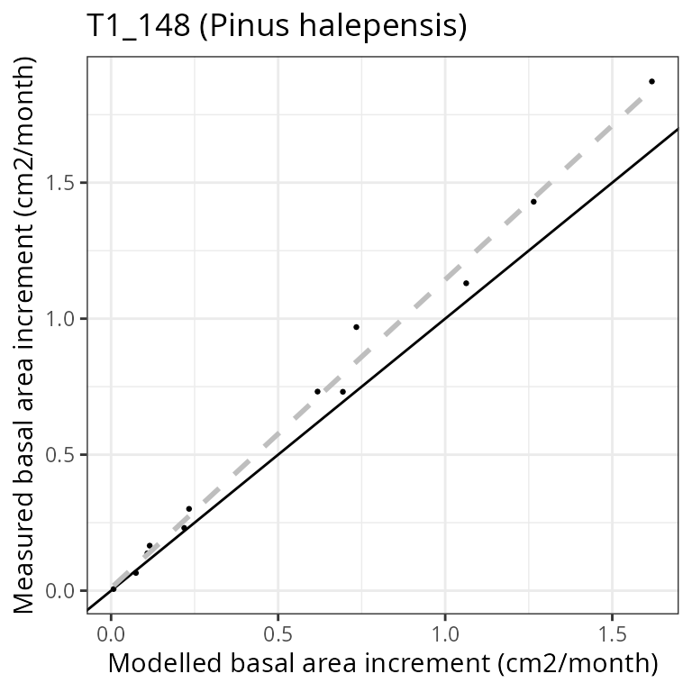

# Forest growth

## About this vignette

This document describes how to run the growth model of `medfate`,
described in De Cáceres et al. (2023) and implemented in function
[`growth()`](https://emf-creaf.github.io/medfate/reference/growth.md).
All the details of the model design and formulation can be found at the
corresponding chapters of the [medfate
book](https://emf-creaf.github.io/medfatebook/index.html).

Because the forest growth model builds on the water balance model, the
reader is assumed here to be familiarized with
[`spwb()`](https://emf-creaf.github.io/medfate/reference/spwb.md). If
not, we recommend reading vignette [*Basic water
balance*](https://emf-creaf.github.io/medfate/articles/runmodels/BasicWaterBalance.html)
before this one.

## Preparing model inputs

Model inputs are explained in greater detail in vignettes
[*Understanding model
inputs*](https://emf-creaf.github.io/medfate/articles/intro/UnderstandingInputs.html)
and [*Preparing model
inputs*](https://emf-creaf.github.io/medfate/articles/intro/PreparingInputs.html).
Here we briefly review the different steps required to run function
[`growth()`](https://emf-creaf.github.io/medfate/reference/growth.md).

### Soil, vegetation, meteorology and species data

Soil physical characteristics needs to be specified using a `data frame`
with soil layers in rows and physical attributes in columns. Soil
physical attributes can be initialized to default values, for a given
number of layers, using function
[`defaultSoilParams()`](https://emf-creaf.github.io/medfate/reference/defaultSoilParams.md):

``` r
examplesoil <- defaultSoilParams(4)
examplesoil
```

    ##   widths clay sand om nitrogen  bd rfc
    ## 1    300   25   25 NA       NA 1.5  25
    ## 2    700   25   25 NA       NA 1.5  45
    ## 3   1000   25   25 NA       NA 1.5  75
    ## 4   2000   25   25 NA       NA 1.5  95

As explained in the package overview, models included in `medfate` were
primarily designed to be ran on **forest inventory plots**. Here we use
the example forest object provided with the package:

``` r
data(exampleforest)
exampleforest
```

    ## $treeData
    ##            Species   N   DBH Height Z50  Z95
    ## 1 Pinus halepensis 168 37.55    800 100  600
    ## 2     Quercus ilex 384 14.60    660 300 1000
    ## 
    ## $shrubData
    ##             Species Cover Height Z50  Z95
    ## 1 Quercus coccifera  3.75     80 200 1000
    ## 
    ## $herbCover
    ## [1] 10
    ## 
    ## $herbHeight
    ## [1] 20
    ## 
    ## $seedBank
    ## [1] Species Percent
    ## <0 rows> (or 0-length row.names)
    ## 
    ## attr(,"class")
    ## [1] "forest" "list"

Importantly, a data frame with daily weather for the period to be
simulated is required. Here we use the default data frame included with
the package:

``` r
data(examplemeteo)
head(examplemeteo)
```

    ##        dates MinTemperature MaxTemperature Precipitation MinRelativeHumidity
    ## 1 2001-01-01     -0.5934215       6.287950      4.869109            65.15411
    ## 2 2001-01-02     -2.3662458       4.569737      2.498292            57.43761
    ## 3 2001-01-03     -3.8541036       2.661951      0.000000            58.77432
    ## 4 2001-01-04     -1.8744860       3.097705      5.796973            66.84256
    ## 5 2001-01-05      0.3288287       7.551532      1.884401            62.97656
    ## 6 2001-01-06      0.5461322       7.186784     13.359801            74.25754
    ##   MaxRelativeHumidity Radiation WindSpeed
    ## 1           100.00000  12.89251  2.000000
    ## 2            94.71780  13.03079  7.662544
    ## 3            94.66823  16.90722  2.000000
    ## 4            95.80950  11.07275  2.000000
    ## 5           100.00000  13.45205  7.581347
    ## 6           100.00000  12.84841  6.570501

The weather variables required by the
[`growth()`](https://emf-creaf.github.io/medfate/reference/growth.md)
function depend on the complexity of the water balance simulations
underlying growth (i.e. on the control parameter `transpirationMode`,
see below).

Finally, all simulations in `medfate` require a data frame with species
parameter values, for which we load using defaults for Catalonia (NE
Spain):

``` r
data("SpParamsMED")
```

### Simulation control

Apart from data inputs, the behaviour of simulation models can be
controlled using a set of global parameters. The default
parameterization is obtained using function
[`defaultControl()`](https://emf-creaf.github.io/medfate/reference/defaultControl.md):

``` r
control = defaultControl("Granier")
```

Here we will run growth simulations using the basic water balance model
(i.e. `transpirationMode = "Granier"`). The complexity of the soil water
balance calculations can be changed by using `"Sperry"` as input to
[`defaultControl()`](https://emf-creaf.github.io/medfate/reference/defaultControl.md).

### Growth input object

A last object, called `growthInput`, needs to be created before calling
the simulation function. This is analogous to `spwbInput` and consists
in the compilation of soil and cohort-level parameters needed for
simulations. The object can be obtained by using function
[`growthInput()`](https://emf-creaf.github.io/medfate/reference/modelInput.md):

``` r
x <- growthInput(exampleforest, examplesoil, SpParamsMED, control)
```

All the input information for forest data and species parameter values
can be inspected by printing different elements of the input object,
whose names are:

``` r
names(x)
```

    ##  [1] "control"                     "soil"                       
    ##  [3] "snowpack"                    "canopy"                     
    ##  [5] "herbLAI"                     "herbLAImax"                 
    ##  [7] "cohorts"                     "above"                      
    ##  [9] "below"                       "belowLayers"                
    ## [11] "paramsPhenology"             "paramsAnatomy"              
    ## [13] "paramsInterception"          "paramsTranspiration"        
    ## [15] "paramsWaterStorage"          "paramsGrowth"               
    ## [17] "paramsMortalityRegeneration" "paramsAllometries"          
    ## [19] "internalPhenology"           "internalWater"              
    ## [21] "internalLAIDistribution"     "internalCarbon"             
    ## [23] "internalAllocation"          "internalMortality"          
    ## [25] "internalFCCS"                "version"

As with `spwbInput` objects, information about the cohort species is
found in element `cohorts` (i.e. code, species and name):

``` r
x$cohorts
```

    ##         SP              Name
    ## T1_148 148  Pinus halepensis
    ## T2_168 168      Quercus ilex
    ## S1_165 165 Quercus coccifera

Element `above` contains the above-ground structure data that we already
know, but with an additional columns that describes the estimated
initial amount of *sapwood area*:

``` r
x$above
```

    ##         SP        N   DBH Cover   H        CR          SA   LAI_live
    ## T1_148 148 168.0000 37.55    NA 800 0.6605196 383.4520992 0.84874773
    ## T2_168 168 384.0000 14.60    NA 660 0.6055642  47.0072886 0.70557382
    ## S1_165 165 749.4923    NA  3.75  80 0.8032817   0.9753929 0.03062604
    ##        LAI_expanded LAI_dead LAI_nocomp    Loading Age ObsID
    ## T1_148   0.84874773        0 1.29720268 0.32447403  NA  <NA>
    ## T2_168   0.70557382        0 1.01943205 0.20102636  NA  <NA>
    ## S1_165   0.03062604        0 0.04412896 0.01407945  NA  <NA>

Elements starting with `params*` contain cohort-specific model
parameters. Some of them were already presented in previous vignettes
([*Basic water
balance*](https://emf-creaf.github.io/medfate/articles/runmodels/BasicWaterBalance.html)
and [*Advanced water/energy
balance*](https://emf-creaf.github.io/medfate/articles/runmodels/AdvancedWaterEnergyBalance.html)).
An important set of new cohort-specific parameters for the forest growth
model are `paramsGrowth`:

``` r
x$paramsGrowth
```

    ##           RERleaf RERsapwood  RERfineroot CCleaf CCsapwood CCfineroot
    ## T1_148 0.01210607   5.15e-05 0.0009610199 1.5905      1.47        1.3
    ## T2_168 0.01757808   5.15e-05 0.0072846640 1.4300      1.47        1.3
    ## S1_165 0.02647746   5.15e-05 0.0072846640 1.5320      1.47        1.3
    ##        RGRleafmax RGRsapwoodmax RGRcambiummax RGRfinerootmax SRsapwood
    ## T1_148       0.09            NA   0.002628095            0.1  0.000135
    ## T2_168       0.09            NA   0.002500000            0.1  0.000135
    ## S1_165       0.09         0.002            NA            0.1  0.000135
    ##         SRfineroot      RSSG fHDmin fHDmax     WoodC
    ## T1_148 0.001897231 0.3725000     80    160 0.4979943
    ## T2_168 0.001897231 0.9500000     40    100 0.4740096
    ## S1_165 0.001897231 0.7804035     NA     NA 0.4749178

which includes maximum growth rates, senescence rates and maintenance
respiration rages. Another important set of parameters is given in
`paramsAllometries`:

``` r
x$paramsAllometries
```

    ##              Afbt     Bfbt        Cfbt      Aash     Bash      Absh      Bbsh
    ## T1_148 0.07607828 1.462411 -0.02280106        NA       NA        NA        NA
    ## T2_168 0.07848713 1.497670 -0.01470000 1.8574862 1.885548 0.5238830 0.7337293
    ## S1_165         NA       NA          NA 0.1305509 2.408443 0.5147731 0.5311554
    ##        BTsh     Acr   B1cr     B2cr         B3cr     C1cr     C2cr       Acw
    ## T1_148   NA 1.99500 -0.649 -0.02000 -0.000120000 -0.00400 -0.15900 0.6415296
    ## T2_168    2 1.98539 -0.552 -0.01386 -0.000110736 -0.00685 -0.20101 0.5681897
    ## S1_165    2      NA     NA       NA           NA       NA       NA        NA
    ##           Bcw       Abt       Bbt
    ## T1_148 0.7310 0.5535741 1.1848613
    ## T2_168 0.7974 0.5622245 0.9626839
    ## S1_165     NA        NA        NA

Note that in the previous models, allometries were already used to
estimate above-ground structural parameters, but these were static
during simulations.

Elements starting with `internal*` contain state variables required to
keep track of plant status. For example, the metabolic and storage
carbon levels can be seen in `internalCarbon`:

``` r
x$internalCarbon
```

    ##        sugarLeaf starchLeaf sugarSapwood starchSapwood
    ## T1_148 0.4029239 0.00925123    0.5738487      3.201897
    ## T2_168 0.3585751 0.00925123    1.0741383      3.100817
    ## S1_165 0.7223526 0.00925123    0.2857655      2.654773

and `internalAllocation` stores the carbon allocation targets:

``` r
x$internalAllocation
```

    ##        allocationTarget leafAreaTarget sapwoodAreaTarget fineRootBiomassTarget
    ## T1_148         1317.523     50.5206982       383.4520992            1381.89095
    ## T2_168         3908.823     18.3743183        47.0072886             546.69314
    ## S1_165         4189.325      0.4086238         0.9753929              10.58569
    ##        crownBudPercent
    ## T1_148             100
    ## T2_168             100
    ## S1_165             100

Additional `internal*` elements are `internalMortality`, used to keep
track of dead individuals; and `internalRings`, which stores state
variables used to model sink limitations on wood formation.

## Executing the growth model

Having all the input information we are ready to call function
[`growth()`](https://emf-creaf.github.io/medfate/reference/growth.md),
which has the same parameter names as
[`spwb()`](https://emf-creaf.github.io/medfate/reference/spwb.md):

``` r
G1<-growth(x, examplemeteo, latitude = 41.82592, elevation = 100)
```

    ## Package 'meteoland' [ver. 2.2.4]

    ## Initial plant cohort biomass (g/m2): 5068.34
    ## Initial plant water content (mm): 4.73001
    ## Initial soil water content (mm): 290.875
    ## Initial snowpack content (mm): 0
    ## Performing daily simulations
    ## 
    ##  Year 2001:............
    ## 
    ## Final plant biomass (g/m2): 5256.04
    ## Change in plant biomass (g/m2): 187.703
    ## Plant biomass balance result (g/m2): 187.703
    ## Plant biomass balance components:
    ##   Structural balance (g/m2) 104 Labile balance (g/m2) 92
    ##   Plant individual balance (g/m2) 196 Mortality loss (g/m2) 8
    ## Final plant water content (mm): 4.73772
    ## Final soil water content (mm): 274.838
    ## Final snowpack content (mm): 0
    ## Change in plant water content (mm): 0.00771124
    ## Plant water balance result (mm): -0.00124258
    ## Change in soil water content (mm): -16.0372
    ## Soil water balance result (mm): -16.0372
    ## Change in snowpack water content (mm): 0
    ## Snowpack water balance result (mm): 0
    ## Water balance components:
    ##   Precipitation (mm) 513 Rain (mm) 462 Snow (mm) 51
    ##   Interception (mm) 92 Net rainfall (mm) 370
    ##   Infiltration (mm) 400 Infiltration excess (mm) 21 Saturation excess (mm) 0 Capillarity rise (mm) 0
    ##   Soil evaporation (mm) 26  Herbaceous transpiration (mm) 14 Woody plant transpiration (mm) 247
    ##   Plant extraction from soil (mm) 247  Plant water balance (mm) -0 Hydraulic redistribution (mm) 3
    ##   Runoff (mm) 21 Deep drainage (mm) 130

At the end of daily simulations, the
[`growth()`](https://emf-creaf.github.io/medfate/reference/growth.md)
function displays information regarding the carbon and water balance,
which is mostly useful to check that balances are closed.

Function
[`growth()`](https://emf-creaf.github.io/medfate/reference/growth.md)
returns an object of class with the same name, actually a list:

``` r
class(G1)
```

    ## [1] "growth" "list"

If we inspect its elements, we realize that some of them are the same as
returned by
[`spwb()`](https://emf-creaf.github.io/medfate/reference/spwb.md):

``` r
names(G1)
```

    ##  [1] "latitude"            "topography"          "weather"            
    ##  [4] "growthInput"         "growthOutput"        "WaterBalance"       
    ##  [7] "CarbonBalance"       "BiomassBalance"      "Soil"               
    ## [10] "Snow"                "Stand"               "Plants"             
    ## [13] "LabileCarbonBalance" "PlantBiomassBalance" "PlantStructure"     
    ## [16] "GrowthMortality"

Some elements are common with the output of
[`spwb()`](https://emf-creaf.github.io/medfate/reference/spwb.md). In
particular, `growthInput` contains a copy of the input object, whereas
`growthOutput` contains the same object, but with values of state
variables at the end of simulation. The new list elements, with respect
to the output of function
[`spwb()`](https://emf-creaf.github.io/medfate/reference/spwb.md), are
`LabileCarbonBalance` (components of the labile carbon balance),
`PlantBiomassBalance` (plant- and cohort-level biomass balance),
`PlantStructure` (daily series of structural variables) and
`GrowthMortality` (daily growth and mortality rates).

## Inspecting model outputs

Users can extract, summarize or inspect the output of
[`growth()`](https://emf-creaf.github.io/medfate/reference/growth.md)
simulations as done for simulations with
[`spwb()`](https://emf-creaf.github.io/medfate/reference/spwb.md).

### Extracting output

Function
[`extract()`](https://emf-creaf.github.io/medfate/reference/extract.md)
allow extracting model outputs in form of data frame:

``` r
extract(G1, "forest", addunits = TRUE) |>
  tibble::as_tibble()
```

    ## # A tibble: 365 × 38
    ##    date           PET Precipitation    Rain   Snow NetRain Snowmelt Infiltration
    ##    <date>     [L/m^2]       [L/m^2] [L/m^2] [L/m^… [L/m^2]  [L/m^2]      [L/m^2]
    ##  1 2001-01-01   0.883          4.87    4.87   0      3.42      0           3.42 
    ##  2 2001-01-02   1.64           2.50    2.50   0      1.07      0           1.07 
    ##  3 2001-01-03   1.30           0       0      0      0         0           0    
    ##  4 2001-01-04   0.569          5.80    5.80   0      4.36      0           4.36 
    ##  5 2001-01-05   1.68           1.88    1.88   0      0.754     0           0.754
    ##  6 2001-01-06   1.21          13.4    13.4    0     11.7       0          11.7  
    ##  7 2001-01-07   0.637          5.38    0      5.38   0         0           0    
    ##  8 2001-01-08   0.832          0       0      0      0         0           0    
    ##  9 2001-01-09   1.98           0       0      0      0         0           0    
    ## 10 2001-01-10   0.829          5.12    5.12   0      3.67      5.38        9.05 
    ## # ℹ 355 more rows
    ## # ℹ 30 more variables: InfiltrationExcess [L/m^2], SaturationExcess [L/m^2],
    ## #   Runoff [L/m^2], DeepDrainage [L/m^2], CapillarityRise [L/m^2],
    ## #   Evapotranspiration [L/m^2], Interception [L/m^2], SoilEvaporation [L/m^2],
    ## #   HerbTranspiration [L/m^2], PlantExtraction [L/m^2], Transpiration [L/m^2],
    ## #   HydraulicRedistribution [L/m^2], LAI [m^2/m^2], LAIherb [m^2/m^2],
    ## #   LAIlive [m^2/m^2], LAIexpanded [m^2/m^2], LAIdead [m^2/m^2], Cm [L/m^2], …

These data frames are easy handle in R or can be written into text files
for post-processing with other programs.

### Plots

Several plots are available, in addition to all the plots that were
available to display the results of
[`spwb()`](https://emf-creaf.github.io/medfate/reference/spwb.md)
simulations. Some of them are illustrated in the following subsections:

To inspect components of the plant carbon balance we can first display
daily gross photosynthesis expressed as the carbon fixation relative to
dry biomass:

``` r
plot(G1, "GrossPhotosynthesis", bySpecies = T)
```


Then we can draw the maintenance respiration costs (which include the
sum of leaf, sapwood and fine root respiration) in the same units:

``` r
plot(G1, "MaintenanceRespiration", bySpecies = T)
```

 Finally we
can display the daily negative or positive balance of the plant storage,
which determines changes in plant carbon pools:

``` r
plot(G1, "LabileCarbonBalance", bySpecies = T)
```


Carbon assimilation and respiration rates define the dynamics of stored
carbon. The most important storage compartment is sapwood starch, whose
dynamics can be shown using:

``` r
plot(G1, "StarchSapwood", bySpecies = T)
```


Leaf and sapwood area dynamics arising from the interplay between growth
and senescence of tissues can be inspected using:

``` r
plot(G1, "LeafArea", bySpecies = T)
```


``` r
plot(G1, "SapwoodArea", bySpecies = T)
```

 Even if one
year is a short period for tree growth, we can display the resulting
dynamics in diameter at breast height (DBH) or plant height:

``` r
plot(G1, "DBH", bySpecies = T)
```

    ## Warning: Removed 365 rows containing missing values or values outside the scale range
    ## (`geom_line()`).


``` r
plot(G1, "Height", bySpecies = T)
```


### Interactive plots

Finally, recall that one can interactively create plots using function
`shinyplot`, e.g.:

``` r
shinyplot(G1)
```

## Growth evaluation

Evaluation of growth simulations will normally imply the comparison of
predicted vs observed basal area increment (BAI) or diameter increment
at a given temporal resolution.

Here, we illustrate the evaluation functions included in the package
using a fake data set, consisting on the predicted values and some added
error.

``` r
data(exampleobs)
```

Normally growth evaluations will be at annual scale, but here we only
have one year of simulated growth. Assuming we want to evaluate the
predictive capacity of the model in terms of monthly basal area
increment for the pine cohort, we can plot the relationship between
observed and predicted values using function
[`evaluation_plot()`](https://emf-creaf.github.io/medfate/reference/evaluation.md):

``` r
evaluation_plot(G1, exampleobs, "BAI", cohort = "T1_148", 
                temporalResolution = "month", plotType = "scatter")
```

    ## `geom_smooth()` using formula = 'y ~ x'



And the following would help us quantifying the strength of the
relationship:

``` r
evaluation_stats(G1, exampleobs, "BAI", cohort = "T1_148", 
                 temporalResolution = "month")
```

    ##            n         Bias     Bias.rel          MAE      MAE.rel            r 
    ##  12.00000000  -0.08492907 -13.11733354   0.08673336  13.39600715   0.99599738 
    ##          NSE      NSE.abs 
    ##   0.95658526   0.82534198

The observed data set is fake and the evaluation is unrealistically
good. For illustrative purposes, we also compare diameter increment
values, here drawing the observed and predicted time series together:

``` r
evaluation_plot(G1, exampleobs, "DI", cohort = "T1_148", 
                temporalResolution = "day")
```


Again, actual comparisons will be done at coarser temporal resolution.
For convenience, function
[`shinyplot()`](https://emf-creaf.github.io/medfate/reference/shinyplot.md)
also accepts an observed data frame as second argument, which allows
performing model evaluation interactively:

``` r
shinyplot(G1, exampleobs)
```

## References

- De Cáceres M, Molowny-Horas R, Cabon A, Martínez-Vilalta J, Mencuccini
  M, García-Valdés R, Nadal-Sala D, Sabaté S, Martin-StPaul N, Morin X,
  D’Adamo F, Batllori E, Améztegui A (2023) MEDFATE 2.9.3: A
  trait-enabled model to simulate Mediterranean forest function and
  dynamics at regional scales. Geoscientific Model Development 16:
  3165-3201 (<https://doi.org/10.5194/gmd-16-3165-2023>).
