# Soil and plant water balances at Font-Blanche

## Introduction

### About this vignette

This document describes how to run the water balance model on a forest
plot at Font-Blanche (France), using the R function
[`spwb()`](https://emf-creaf.github.io/medfate/reference/spwb.md)
included in package `medfate`. The document indicates how to prepare the
model inputs, use the model simulation function, evaluate the
predictions against available observations and inspect the outputs.

### About the Font-Blanche research forest

The Font-Blanche research forest, located in southeastern France
(43º14′27″ N 5°40′45″ E, 420 m elevation), is composed of a top strata
of *Pinus halepensis* (Aleppo pine) reaching about 12 m, a lower strata
of *Quercus ilex* (holm oak), reaching about 6 m, and an understorey
strata dominated by *Quercus coccifera* but including other species such
as *Phillyrea latifolia*. It is spatially heterogeneous: not all trees
in each strata are contiguous, so trees from the lower stratas are
partially exposed to direct light. The forest grows on rocky and shallow
soils that have a low retention capacity and are of Jurassic limestone
origin. The climate is Mediterranean, with a water stress period in
summer, cold or mild winters and most precipitation occurring between
September and May. The experimental site, which is dedicated to study
forest carbon and water cycles, has an enclosed area of 80×80 m (Simioni
et al. 2013) but our specific plot is a quadrat of dimensions 25x25 m.

## Model inputs

Any forest water balance model needs information on **climate**,
**vegetation** and **soils** of the forest stand to be simulated.
Moreover, since the soil water balance in `medfate` differentiates
between species, **species-specific parameters** are also needed. Since
FontBlanche is one of the sites used for evaluating the model, and much
of the data can be found in Moreno et al. (2021). We can use a data list
`fb` with all the necessary inputs:

``` r

fb <- readRDS(paste0("~/OneDrive/mcaceres_work/model_development/medfate_evaluation/StandLevelEvaluation/data/input/FONBLA/FONBLA_", as.character(packageVersion("medfate")), ".rds"))
```

### Soil

We require information on the physical attributes of soil in
Font-Blanche, namely *soil depth*, *texture*, *bulk density* and *rock
fragment content*. Soil information needs to be entered as a
`data frame` with soil layers in rows and physical attributes in
columns. The model accepts one to five soil layers with arbitrary
widths. Because soil properties vary strongly at fine spatial scales,
ideally soil physical attributes should be measured on samples taken at
the forest stand to be simulated. For those users lacking such data,
soil properties modelled at larger scales are available via
soilgrids.org (see function `soilgridsParams()`). In our case soil
physical attributes are already defined in the data bundled for
FontBlanche:

``` r

spar <- fb$soilData
print(spar)
```

    ##   widths clay sand om   bd rfc
    ## 1    300   39   26  6 1.45  50
    ## 2    700   39   26  3 1.45  65
    ## 3   1000   39   26  1 1.45  90
    ## 4   2500   39   26  1 1.45  95

The soil input for function
[`spwb()`](https://emf-creaf.github.io/medfate/reference/spwb.md) is
actually an object of class `soil` that is created using a function with
the same name:

``` r

fb_soil <- soil(spar)
```

The [`print()`](https://rdrr.io/r/base/print.html) function for objects
`soil` provides a lot of information on soil physical properties and
water capacity:

``` r

print(fb_soil)
```

    ##   widths sand clay      usda om nitrogen ph   bd rfc   macro     Ksat VG_alpha
    ## 1    300   26   39 Clay loam  6       NA NA 1.45  50 0.07387 7232.425 44.14586
    ## 2    700   26   39 Clay loam  3       NA NA 1.45  65 0.07387 3481.917 61.34088
    ## 3   1000   26   39 Clay loam  1       NA NA 1.45  90 0.07387 1879.187 76.38182
    ## 4   2500   26   39 Clay loam  1       NA NA 1.45  95 0.07387 1879.187 76.38182
    ##       VG_n VG_theta_res VG_theta_sat W Temp
    ## 1 1.254346        0.041    0.4388377 1   NA
    ## 2 1.273896        0.041    0.4388377 1   NA
    ## 3 1.287757        0.041    0.4388377 1   NA
    ## 4 1.287757        0.041    0.4388377 1   NA

The soil object is also used to store the moisture degree of each soil
layer. In particular, `W` contains the state variable that represents
moisture content - the proportion of moisture **relative to field
capacity** - which is by default initialized to 1 for each layer:

``` r

fb_soil$W
```

    ## [1] 1 1 1 1

### Species parameters

Simulation models in `medfate` require a data frame with species
parameter values. The package provides a default data set of parameter
values for a number of Mediterranean species occurring in Spain (rows),
resulting from bibliographic search, fit to empirical data or
expert-based guesses:

``` r

data("SpParamsMED")
```

However, sometimes one may wish to override species defaults with custom
values. In the case of FontBlanche there is a table of preferred
parameters:

``` r

fb$customParams
```

    ##               Species GrowthForm Hmax Hmed  SLA Kmax_stemxylem LeafEPS LeafPI0
    ## 1 Phillyrea latifolia Tree/Shrub   NA   NA   NA             NA   12.38   -2.13
    ## 2    Pinus halepensis       Tree   NA   NA   NA           0.15    5.31   -1.50
    ## 3        Quercus ilex       Tree 1240  450 4.55           0.40   15.00   -2.50
    ##   LeafAF StemEPS StemPI0 StemAF    Al2As
    ## 1    0.5   12.38   -2.13    0.4       NA
    ## 2    0.6    5.00   -1.65    0.4  631.000
    ## 3    0.4   15.00   -2.50    0.4 1540.671

We can use function
[`modifySpParams()`](https://emf-creaf.github.io/medfate/reference/modifyParams.md)
to replace the values of parameters for the desired traits, leaving the
rest unaltered:

``` r

SpParamsFB <- modifySpParams(traits4models::SpParamsFR, fb$customParams)
SpParamsFB
```

    ##                     Name SpIndex        AcceptedName             Species
    ## 2574 Phillyrea latifolia    2573 Phillyrea latifolia Phillyrea latifolia
    ## 2631    Pinus halepensis    2630    Pinus halepensis    Pinus halepensis
    ## 2853        Quercus ilex    2853        Quercus ilex        Quercus ilex
    ##          Genus   Family    Order      Group GrowthForm     LifeForm LeafShape
    ## 2574 Phillyrea Oleaceae Lamiales Angiosperm Tree/Shrub Phanerophyte     Broad
    ## 2631     Pinus Pinaceae  Pinales Gymnosperm       Tree Phanerophyte    Needle
    ## 2853   Quercus Fagaceae  Fagales Angiosperm       Tree Phanerophyte     Broad
    ##      LeafSize      PhenologyType DispersalType Hmed      Hmax Dmax Z50
    ## 2574   Medium oneflush-evergreen    vertebrate 1500  850.7389   NA  NA
    ## 2631    Small oneflush-evergreen          wind 2000 2200.0000   NA  NA
    ## 2853   Medium oneflush-evergreen    vertebrate  450 1240.0000  200  NA
    ##            Z95 fHDmin fHDmax       a_ash    b_ash     a_bsh     b_bsh    a_btsh
    ## 2574  746.1321     NA     NA 0.008047873 2.865021 0.2502494 0.7300031 0.3105815
    ## 2631 7500.0000     NA     NA          NA       NA        NA        NA        NA
    ## 2853 7000.0000     NA     NA 1.857486249 1.885548 0.5238830 0.7337293 0.7327147
    ##         b_btsh cr BTsh      a_fbt    b_fbt       c_fbt a_cr b_1cr b_2cr b_3cr
    ## 2574 0.7509837 NA   NA         NA       NA          NA   NA    NA    NA    NA
    ## 2631        NA NA   NA 0.07607828 1.462411 -0.02280106   NA    NA    NA    NA
    ## 2853 0.7375770 NA   NA 0.07848713 1.497670 -0.00309341   NA    NA    NA    NA
    ##      c_1cr c_2cr      a_cw  b_cw      a_bt      b_bt LeafDuration t0gdd Sgdd
    ## 2574    NA    NA        NA    NA        NA        NA     2.500000    NA   NA
    ## 2631    NA    NA 0.6415296 0.731 0.5535741 1.1848613     2.083333    NA   NA
    ## 2853    NA    NA        NA    NA 0.5622245 0.9626839     2.000000    NA   NA
    ##      Tbgdd Ssen Phsen Tbsen xsen ysen     SLA LeafDensity WoodDensity
    ## 2574    NA   NA    NA    NA   NA   NA 5.40000     0.56000        0.70
    ## 2631    NA   NA    NA    NA   NA   NA 4.99002     0.28812        0.60
    ## 2853    NA   NA    NA    NA   NA   NA 4.55000     0.66500        0.89
    ##      FineRootDensity conduit2sapwood     r635   pDead    Al2As Ar2Al LeafWidth
    ## 2574              NA              NA 1.917579      NA 1698.950    NA      0.40
    ## 2631              NA              NA 1.964226 0.00050  631.000    NA      0.10
    ## 2853              NA              NA 1.805872 0.00026 1540.671    NA      1.63
    ##           SRL RLD   maxFMC   minFMC  Ptlp LeafPI0 LeafEPS LeafAF StemPI0
    ## 2574 902.1171  NA 106.2825 41.20000    NA   -2.13   12.38    0.5   -2.13
    ## 2631       NA  NA 122.1644 53.74550 -2.20   -1.50    5.31    0.6   -1.65
    ## 2853 735.7025  NA 109.2304 58.66087 -3.09   -2.50   15.00    0.4   -2.50
    ##      StemEPS StemAF  SAV HeatContent LeafLigninPercent WoodLigninPercent
    ## 2574   12.38    0.4   NA    17146.03                NA                NA
    ## 2631    5.00    0.4 6050    22150.00                NA                NA
    ## 2853   15.00    0.4 4050    19300.00                NA                NA
    ##      FineRootLigninPercent LeafAngle LeafAngleSD ClumpingIndex gammaSWR
    ## 2574                    NA  35.14508    18.87379            NA       NA
    ## 2631                    NA        NA          NA            NA       NA
    ## 2853                    NA  36.00819    20.15953            NA       NA
    ##      alphaSWR kPAR  g Tmax_LAI Tmax_LAIsq Psi_Extract Exp_Extract WUE WUE_par
    ## 2574       NA   NA NA       NA         NA          NA          NA  NA      NA
    ## 2631       NA   NA NA       NA         NA          NA          NA  NA      NA
    ## 2853       NA   NA NA       NA         NA          NA          NA  NA      NA
    ##      WUE_co2 WUE_vpd       Gswmin     Gswmax Gsw_Toptim_Jarvis Gsw_Tsens_Jarvis
    ## 2574      NA      NA 0.0039671810 0.45220000                NA               NA
    ## 2631      NA      NA 0.0006655459 0.04554533                NA               NA
    ## 2853      NA      NA 0.0028095533 0.21575000                NA               NA
    ##      Gsw_AC_slope_Baldocchi Gsw_P50_Baldocchi Gsw_slope_Baldocchi VCleaf_kmax
    ## 2574                     NA                NA                  NA          NA
    ## 2631                     NA                NA                  NA          NA
    ## 2853                     NA                NA                  NA    9.276068
    ##      VCleaf_P12 VCleaf_P50 VCleaf_P88 VCleaf_slope Kmax_stemxylem VCstem_P12
    ## 2574         NA         NA         NA           NA      0.4083769   -3.06267
    ## 2631         NA         NA         NA           NA      0.1500000   -4.50000
    ## 2853         NA       -3.5         NA           NA      0.4000000   -4.30000
    ##      VCstem_P50 VCstem_P88 VCstem_slope Kmax_rootxylem VCroot_P12 VCroot_P50
    ## 2574      -6.55  -12.17000     8.344927       1.889495   -3.12248      -5.30
    ## 2631      -5.14   -6.24103    43.652321       0.890000   -0.51103      -0.88
    ## 2853      -6.88   -7.90000    21.111111       0.470000   -0.43456      -2.39
    ##      VCroot_P88 VCroot_slope  Vmax298  Jmax298   Nleaf Nsapwood Nfineroot
    ## 2574   -7.47752     17.45105       NA       NA 15.7000     2.53        NA
    ## 2631   -1.24897    102.98940       NA       NA 11.7940       NA  12.90000
    ## 2853   -7.03000     11.52311 39.44837 93.30728 13.9021     5.63   2.45857
    ##       WoodC RERleaf RERsapwood RERfineroot CCleaf CCsapwood CCfineroot
    ## 2574     NA      NA         NA          NA   1.63        NA         NA
    ## 2631 0.4981      NA         NA          NA     NA        NA         NA
    ## 2853 0.4751      NA         NA          NA   1.43        NA         NA
    ##      RGRleafmax RGRsapwoodmax RGRcambiummax RGRfinerootmax RGRbud SRsapwood
    ## 2574         NA            NA            NA             NA     NA        NA
    ## 2631         NA            NA            NA             NA     NA        NA
    ## 2853         NA            NA            NA             NA     NA        NA
    ##      SRfineroot RSSG MortalityBaselineRate SurvivalModelStep SurvivalB0
    ## 2574         NA   NA                    NA                NA         NA
    ## 2631         NA 1.35                    NA                NA         NA
    ## 2853         NA 3.02                    NA                NA         NA
    ##      SurvivalB1 SeedProductionHeight SeedProductionDiameter  SeedMass
    ## 2574         NA                   NA                     NA   31.5244
    ## 2631         NA                   NA                     NA   19.6100
    ## 2853         NA                   NA               10.64702 3225.8100
    ##      SeedLongevity DispersalDistance DispersalShape ProbRecr MinTempRecr
    ## 2574            NA                NA             NA       NA          NA
    ## 2631            10                NA             NA       NA          NA
    ## 2853            NA                NA             NA       NA          NA
    ##      MinMoistureRecr MinFPARRecr RecrAge RecrTreeDBH RecrTreeHeight
    ## 2574              NA          NA      NA          NA             NA
    ## 2631              NA          NA      NA          NA             NA
    ## 2853              NA          NA      NA          NA             NA
    ##      RecrShrubHeight RecrTreeDensity RecrShrubCover RespFire RespDist RespClip
    ## 2574              NA              NA             NA       NA       NA       NA
    ## 2631              NA              NA             NA       NA       NA       NA
    ## 2853              NA              NA             NA       NA       NA       NA
    ##      IngrowthTreeDensity IngrowthTreeDBH
    ## 2574                  NA              NA
    ## 2631                  NA              NA
    ## 2853                  NA              NA

Note that the function returns a subset of rows for the species
mentioned in `customParams`. Not all parameters are needed for the soil
water balance model. The user can find parameter definitions in the help
page of this data set. However, to fully understand the role of
parameters in the model, the user should read the details of model
design and formulation (<http://emf-creaf.github.io/medfate>).

### Vegetation

Models included in `medfate` were primarily designed to be ran on
**forest inventory plots**. In this kind of data, the vegetation of a
sampled area is described in terms of woody plants (trees and shrubs)
along with their size and species identity. Forest plots in `medfate`
are assumed to be in a format that follows closely the Spanish forest
inventory. Each forest plot is represented in an object of class
`forest`, a list that contains several elements. Among them, the most
important items are two data frames, `treeData` (for trees) and
`shrubData` for shrubs:

``` r

fb_forest <- emptyforest()
fb_forest
```

    ## $treeData
    ## [1] Species DBH     Height  N       Z50     Z95    
    ## <0 rows> (or 0-length row.names)
    ## 
    ## $shrubData
    ## [1] Species Height  Cover   Z50     Z95    
    ## <0 rows> (or 0-length row.names)
    ## 
    ## attr(,"class")
    ## [1] "forest" "list"

Trees are expected to be primarily described in terms of species,
diameter (DBH) and height, whereas shrubs are described in terms of
species, percent cover and mean height. In our case, we will for
simplicity avoid shrubs and concentrate on the main three tree species
in the Font-Blanche forest plot: *Phillyrea latifolia* (code 142),
*Pinus halepensis* (Alepo pine, code 148), and *Quercus ilex* (holm oak;
code 168). In order to run the model, one has to prepare a data table
like this one, already prepared for Font-Blanche:

``` r

fb$treeData
```

    ##               Species       DBH    Height    N Z50  Z95       LAI
    ## 1 Phillyrea latifolia  2.587859  323.0000 1248 200 1500 0.2238497
    ## 2    Pinus halepensis 26.759914 1195.7667  256 200  800 1.0767397
    ## 3        Quercus ilex  6.220031  495.5532 3104 300 2000 1.3994106

Trees have been grouped by species, so DBH and height values are means
(in cm), and `N` indicates the number of trees in each category. Package
`medfate` allows separating trees by size, but for simplicity we do not
distinguish here between tree sizes within each species. Columns `Z50`
and `Z95` indicate the depths (in mm) corresponding to cumulative 50%
and 95% of fine roots, respectively.

In order to use this data, we need to replace the part corresponding to
trees into the forest object that we created before:

``` r

fb_forest$treeData <- fb$treeData
fb_forest
```

    ## $treeData
    ##               Species       DBH    Height    N Z50  Z95       LAI
    ## 1 Phillyrea latifolia  2.587859  323.0000 1248 200 1500 0.2238497
    ## 2    Pinus halepensis 26.759914 1195.7667  256 200  800 1.0767397
    ## 3        Quercus ilex  6.220031  495.5532 3104 300 2000 1.3994106
    ## 
    ## $shrubData
    ## [1] Species Height  Cover   Z50     Z95    
    ## <0 rows> (or 0-length row.names)
    ## 
    ## attr(,"class")
    ## [1] "forest" "list"

Because the forest plot format is rather specific, `medfate` also allows
starting in an alternative way using two data frames, one with
**aboveground** information (i.e. the leave area and size of plants) and
the other with **belowground** information (i.e. root distribution). The
aboveground data frame does not distinguish between trees and shrubs. It
includes, for each plant cohort to be considered in rows, its *species
identity*, *height*, *leaf area index* (LAI) and *crown ratio*. While
users can build their input data themselves, we use internal function
[`forest2aboveground()`](https://emf-creaf.github.io/medfate/reference/forest2aboveground.md)
on the object `fb_forest` to show how should the data look like:

``` r

fb_above <- forest2aboveground(fb_forest, SpParamsFB)
fb_above
```

    ##           SP    N       DBH Cover         H        CR  LAI_live LAI_expanded
    ## T1_2573 2573 1248  2.587859    NA  323.0000 0.5510653 0.2238497    0.2238497
    ## T2_2630 2630  256 26.759914    NA 1195.7667 0.6001765 1.0767397    1.0767397
    ## T3_2853 2853 3104  6.220031    NA  495.5532 0.6059123 1.3994106    1.3994106
    ##         LAI_dead LAI_nocomp LAI_mistletoe Age ObsID
    ## T1_2573        0  0.2238497             0  NA  <NA>
    ## T2_2630        0  1.0767397             0  NA  <NA>
    ## T3_2853        0  1.3994106             0  NA  <NA>

Note that the call to
[`forest2aboveground()`](https://emf-creaf.github.io/medfate/reference/forest2aboveground.md)
included species parameters, because species-specific parameter values
are needed to calculate leaf area from tree diameters or shrub cover
using allometric relationships. Columns `N`, `DBH` and `Cover` are
required for simulating growth, but not for soil water balance, which
only requires columns `SP`, `H` (in cm), `CR` (i.e. the crown ratio),
`LAI_live`, `LAI_expanded` and `LAI_dead`. Here plant cohorts are given
unique codes that tell us whether they correspond to trees or shrubs. In
practice, the user only needs to worry to calculate the values for
`LAI_live`. `LAI_live` and `LAI_expanded` can contain the same LAI
values, and `LAI_dead` is normally zero.

We see that at Font-Blanche holm oaks (code 68) represent most of the
total leaf area. On the other hand, pines are taller than oaks.
`medfate` assumes that leaf distribution follows a truncated normal
curve between the crown base height and the total height. This can be
easily inspected using function
[`vprofile_leafAreaDensity()`](https://emf-creaf.github.io/medfate/reference/vprofile_leafAreaDensity.md):

``` r

vprofile_leafAreaDensity(fb_forest, SpParamsFB, byCohorts = T, bySpecies = T)
```

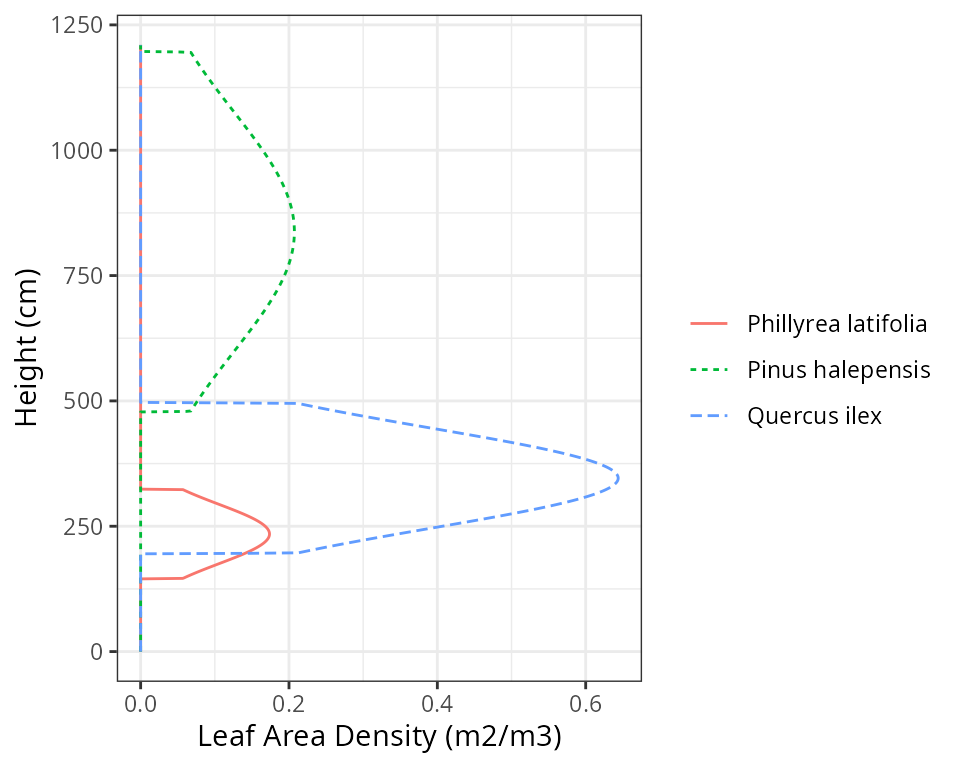

Regarding **belowground** information, the usuer should supply a matrix
describing for each plant cohort, the proportion of fine roots in each
soil layer. As before, we use internal function
[`forest2belowground()`](https://emf-creaf.github.io/medfate/reference/forest2aboveground.md)
on the object `fb_forest` to show how should the data look like:

``` r

fb_below <- forest2belowground(fb_forest, fb_soil, SpParamsFB)
fb_below
```

    ##                 1         2          3           4
    ## T1_2573 0.6505881 0.2719302 0.05418875 0.023292883
    ## T2_2630 0.7035917 0.2658370 0.02440189 0.006169504
    ## T3_2853 0.5075225 0.3714797 0.08507611 0.035921747

In our case, these proportions were implicitly specified in parameters
`Z50` and `Z95`. In fact, these values describe a continuous
distribution of fine roots along depth, which can be displayed using
function
[`vprofile_rootDistribution()`](https://emf-creaf.github.io/medfate/reference/vprofile_leafAreaDensity.md):

``` r

vprofile_rootDistribution(fb_forest, SpParamsFB, bySpecies = T)
```

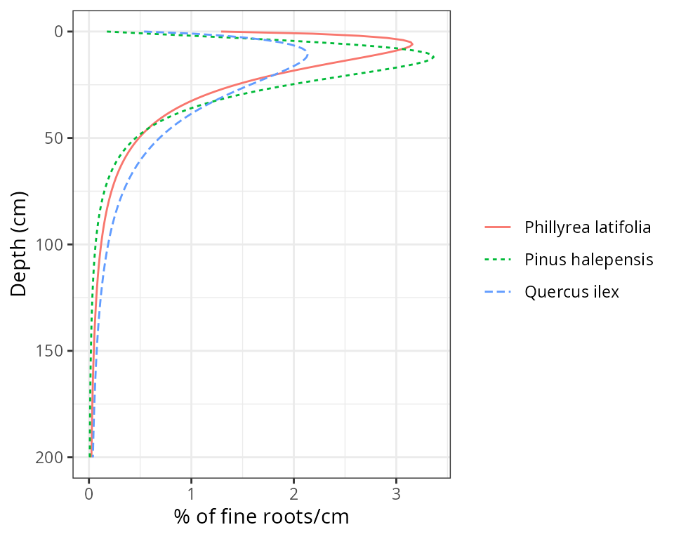

Note that in Font-Blanche we set that the root system of Aleppo pines
(*Pinus halepensis*) would be more superficial than that of the other
two species. Moreover, holm oak trees are the ones who extend their
roots down to deepest soil layers.

### Meteorology

Water balance simulations of function
[`spwb()`](https://emf-creaf.github.io/medfate/reference/spwb.md)
require **daily weather** inputs. The weather variables that are
required depend on the complexity of the soil water balance model we are
using. In the simplest case, only **mean temperature**,
**precipitation** and **potential evapo-transpiration (PET)** is
required, but the more complex simulation model also requires radiation,
wind speed, min/max temparature and relative humitidy. Here we already
have a data frame with the daily meteorology measured at Font-Blanche
for year 2014:

``` r

fb_meteo <- fb$meteoData
head(fb_meteo)
```

    ##        dates MeanTemperature MinTemperature MaxTemperature MeanRelativeHumidity
    ## 1 2014-01-01        7.661856       5.988889       8.960000             87.78224
    ## 2 2014-01-02        9.525431       7.958333      11.550000             96.40669
    ## 3 2014-01-03        9.482417       8.176111      11.762220             93.05705
    ## 4 2014-01-04       10.016813       6.313000      11.010000             96.31667
    ## 5 2014-01-05        6.619919       4.766000       9.060555             57.77938
    ## 6 2014-01-06        8.923008       6.793889      12.329440             64.40477
    ##   MinRelativeHumidity MaxRelativeHumidity WindSpeed Precipitation Radiation
    ## 1            80.37265            98.48404  2.317495      0.000000 1.5050178
    ## 2            84.22588           100.00000  2.407691      0.000000 2.6173102
    ## 3            79.93501           100.00000  1.950114      0.000000 3.9089762
    ## 4            90.14023           100.00000  3.596797      2.590674 0.4753025
    ## 5            48.92043            65.71329  7.310334      0.000000 8.6224570
    ## 6            51.31975            74.46718  2.301697      0.000000 6.7835715

Simulation models in `medfate` have been designed to work along with
data generated from package `meteoland` (De Cáceres et al. 2018), which
specifies conventions for variable names and units. The user is strongly
recommended to resort to this package to obtain suitable weather input
for soil water balance simulations (see
<http://emf-creaf.github.io/meteoland>).

### Simulation control

Apart from data inputs, the behavior of simulation models can be
controlled using a set of **global parameters**. The default global
parameter values are obtained using function
[`defaultControl()`](https://emf-creaf.github.io/medfate/reference/defaultControl.md):

``` r

fb_control <- defaultControl(transpirationMode = "Sureau")
fb_control$subdailyResults <- TRUE
```

Where the following changes are set to control parameters:

1.  Transpiration is set `transpirationMode = "Sureau"`, which implies a
    greater complexity of plant hydraulics and energy balance
    calculations.
2.  Subdaily results generated by the model are kept.

### Water balance input object

A last step is needed before calling simulation functions. It consists
in the compilation of all aboveground and belowground parameters and the
specification of additional parameter values for each plant cohort, such
as their light extinction coefficient or their response to drought. If
one has a `forest` object, the `spwbInput` object can be generated in
directly from it, avoiding the need to explicitly build `fb_above` and
`fb_below` data frames:

``` r

fb_x <- spwbInput(fb_forest, fb_soil, SpParamsFB, fb_control)
```

Different species parameter variables will be drawn from `SpParamsMED`
depending on the value of `transpirationMode`. For the simple water
balance model, relatively few parameters are needed. All the input
information for forest data and species parameter values can be
inspected by printing the input object.

Finally, note that one can play with plant-specific parameters for soil
water balance (instead of using species-level values) by using function
[`modifyCohortParams()`](https://emf-creaf.github.io/medfate/reference/modifyParams.md).

## Running the model

Function
[`spwb()`](https://emf-creaf.github.io/medfate/reference/spwb.md)
requires two main objects as input:

- A `spwbInput` object with forest and soil parameters (`fb_x` in our
  case).
- A data frame with daily meteorology for the study period (`fb_meteo`
  in our case).

Now we are ready to call function
[`spwb()`](https://emf-creaf.github.io/medfate/reference/spwb.md):

``` r

fb_SWB <- spwb(fb_x, fb_meteo, elevation = 420, latitude = 43.24083)
```

    ## Initial plant water content (mm): 35.1976
    ## Initial soil water content (mm): 213.886
    ## Initial snowpack content (mm): 0
    ## Performing daily simulations
    ## 
    ##  [Year 2014]:............
    ##  [Year 2015]:............
    ##  [Year 2016]:............
    ##  [Year 2017]:............
    ##  [Year 2018]:............
    ## 
    ## Final plant water content (mm): 34.2098
    ## Final soil water content (mm): 249.829
    ## Final snowpack content (mm): 0
    ## Change in plant water content (mm): -0.987846
    ## Plant water balance result (mm): -7.81401
    ## Change in soil water content (mm): 35.9435
    ## Soil water balance result (mm): 35.9435
    ## Change in snowpack water content (mm): 0
    ## Snowpack water balance result (mm): 0
    ## Water balance components:
    ##   Precipitation (mm) 3638 Rain (mm) 3638 Snow (mm) 1
    ##   Interception (mm) 602 Net rainfall (mm) 3036
    ##   Infiltration (mm) 2711 Infiltration excess (mm) 325 Saturation excess (mm) 386 Capillarity rise (mm) 0
    ##   Soil evaporation (mm) 125  Herbaceous transpiration (mm) 0  Woody plant transpiration (mm) 1267  Mistletoe transpiration (mm) 0
    ##   Plant extraction from soil (mm) 1259  Plant water balance (mm) -8 Hydraulic redistribution (mm) 88
    ##   Runoff (mm) 711 Deep drainage (mm) 906

Console output provides the water balance totals for the period
considered, which may span several years. The output of function
[`spwb()`](https://emf-creaf.github.io/medfate/reference/spwb.md) is an
object of class with the same name, actually a list:

``` r

class(fb_SWB)
```

    ## [1] "spwb" "list"

If we inspect its elements, we realize that there are several
components:

``` r

names(fb_SWB)
```

    ##  [1] "latitude"      "topography"    "weather"       "spwbInput"    
    ##  [5] "spwbOutput"    "WaterBalance"  "EnergyBalance" "Temperature"  
    ##  [9] "Soil"          "Snow"          "Stand"         "Plants"       
    ## [13] "SunlitLeaves"  "ShadeLeaves"   "subdaily"

For example, `WaterBalance` contains water balance components in form of
a data frame with days in rows:

``` r

head(fb_SWB$WaterBalance)
```

    ##                  PET Precipitation     Rain Snow   NetRain Snowmelt
    ## 2014-01-01 0.6209989      0.000000 0.000000    0 0.0000000        0
    ## 2014-01-02 0.5671238      0.000000 0.000000    0 0.0000000        0
    ## 2014-01-03 0.5418115      0.000000 0.000000    0 0.0000000        0
    ## 2014-01-04 0.6072565      2.590674 2.590674    0 0.6850663        0
    ## 2014-01-05 2.0447148      0.000000 0.000000    0 0.0000000        0
    ## 2014-01-06 0.9330456      0.000000 0.000000    0 0.0000000        0
    ##            Infiltration InfiltrationExcess SaturationExcess Runoff DeepDrainage
    ## 2014-01-01    0.0000000                  0                0      0    0.0000000
    ## 2014-01-02    0.0000000                  0                0      0    0.0000000
    ## 2014-01-03    0.0000000                  0                0      0    0.0000000
    ## 2014-01-04    0.6850663                  0                0      0    0.1625981
    ## 2014-01-05    0.0000000                  0                0      0    0.0000000
    ## 2014-01-06    0.0000000                  0                0      0    0.0000000
    ##            CapillarityRise Evapotranspiration Interception SoilEvaporation
    ## 2014-01-01               0          0.2397383     0.000000       0.2151227
    ## 2014-01-02               0          0.2109763     0.000000       0.1964596
    ## 2014-01-03               0          0.2246855     0.000000       0.1876911
    ## 2014-01-04               0          2.0794743     1.905607       0.1738434
    ## 2014-01-05               0          0.6088972     0.000000       0.2720512
    ## 2014-01-06               0          0.4067718     0.000000       0.1506879
    ##            HerbTranspiration PlantExtraction Transpiration
    ## 2014-01-01                 0    0.0234958654  2.461560e-02
    ## 2014-01-02                 0    0.0144841256  1.451666e-02
    ## 2014-01-03                 0    0.0357446869  3.699441e-02
    ## 2014-01-04                 0   -0.0002881792  2.363583e-05
    ## 2014-01-05                 0    0.3205647267  3.368460e-01
    ## 2014-01-06                 0    0.2588755913  2.560838e-01
    ##            MistletoeTranspiration HydraulicRedistribution
    ## 2014-01-01                      0            0.0000000000
    ## 2014-01-02                      0            0.0007454833
    ## 2014-01-03                      0            0.0019187108
    ## 2014-01-04                      0            0.0056911327
    ## 2014-01-05                      0            0.0000000000
    ## 2014-01-06                      0            0.0000000000

## Comparing results with observations

Before examining the results of the model, it is important to compare
its predictions against observed data, if available. The following
observations are available from the experimental forest plot for year
2014:

- Stand total evapotranspiration estimated using an Eddy-covariance flux
  tower.
- Soil moisture content of the first 0-30 cm layer.
- Cohort transpiration estimates derived from sapflow measurements
  for Q. ilex and P. halepensis.
- Pre-dawn and midday leaf water potentials for Q. ilex and P.
  halepensis.

We first load the measured data into the workspace and filter for the
dates used in the simulation:

``` r

fb_observed <- fb$measuredData
fb_observed <- fb_observed[fb_observed$dates %in% fb_meteo$dates,]
row.names(fb_observed) <- fb_observed$dates
head(fb_observed)
```

    ##                 dates       SWC E_T2_2630 E_T2_2630_err E_T3_2853 E_T3_2853_err
    ## 2014-01-01 2014-01-01 0.5813407        NA            NA        NA            NA
    ## 2014-01-02 2014-01-02 0.6507478        NA            NA        NA            NA
    ## 2014-01-03 2014-01-03 0.6224243        NA            NA        NA            NA
    ## 2014-01-04 2014-01-04        NA        NA            NA        NA            NA
    ## 2014-01-05 2014-01-05 0.6285134        NA            NA        NA            NA
    ## 2014-01-06 2014-01-06 0.6035415        NA            NA        NA            NA
    ##            PD_T2_2630 PD_T2_2630_err PD_T3_2853 PD_T3_2853_err MD_T2_2630
    ## 2014-01-01         NA             NA         NA             NA         NA
    ## 2014-01-02         NA             NA         NA             NA         NA
    ## 2014-01-03         NA             NA         NA             NA         NA
    ## 2014-01-04         NA             NA         NA             NA         NA
    ## 2014-01-05         NA             NA         NA             NA         NA
    ## 2014-01-06         NA             NA         NA             NA         NA
    ##            MD_T2_2630_err MD_T3_2853 MD_T3_2853_err LE  H
    ## 2014-01-01             NA         NA             NA NA NA
    ## 2014-01-02             NA         NA             NA NA NA
    ## 2014-01-03             NA         NA             NA NA NA
    ## 2014-01-04             NA         NA             NA NA NA
    ## 2014-01-05             NA         NA             NA NA NA
    ## 2014-01-06             NA         NA             NA NA NA

### Stand evapotranspiration

Package `medfate` contains several functions to assist the evaluation of
model results. We can first compare the observed vs modelled latent
heat. We can plot the two time series:

``` r

evaluation_plot(fb_SWB, fb_observed, type = "LE", plotType="dynamics")+
  theme(legend.position = c(0.8,0.85))
```

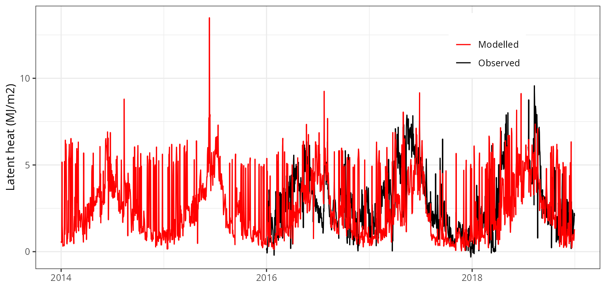

The relationship can be shown in a scatter plot:

``` r

evaluation_plot(fb_SWB, fb_observed, type = "LE", plotType="scatter")
```

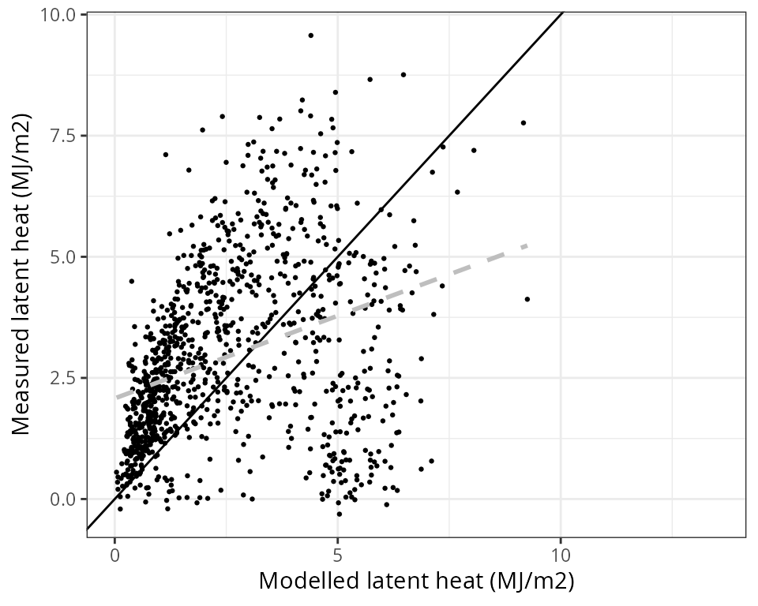 Where we see
that the model tends to underestimate total evapotranspiration during
seasons with low evaporative demand. Function
[`evaluation_stats()`](https://emf-creaf.github.io/medfate/reference/evaluation.md)
allows us to generate evaluation statistics:

``` r

evaluation_stats(fb_SWB, fb_observed, type = "LE")
```

    ##            n         Bias     Bias.rel          MAE      MAE.rel            r 
    ## 1026.0000000   -0.4274115  -14.5773869    1.7199366   58.6605177    0.3427529 
    ##          NSE      NSE.abs 
    ##   -0.3749055   -0.1370847

### Soil moisture

We can compare observed vs modelled soil moisture content in a similar
way as we did for total evapotranspiration:

``` r

evaluation_plot(fb_SWB, fb_observed, type = "SWC", plotType="dynamics")
```

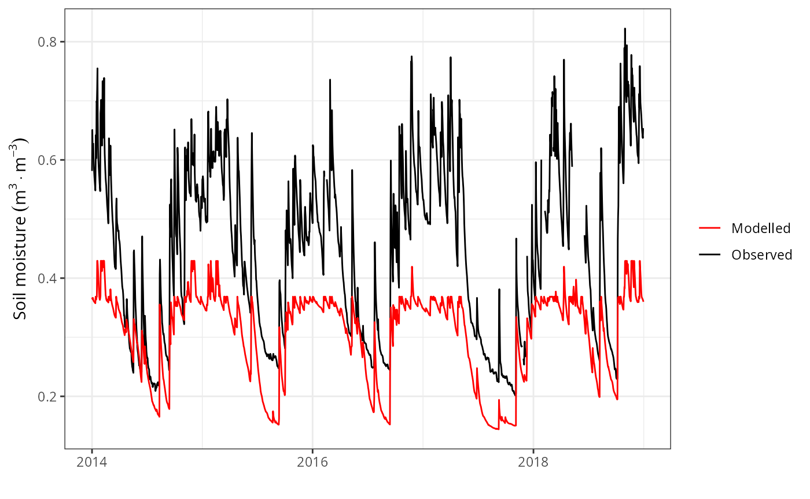

As before, we can generate a scatter plot:

``` r

evaluation_plot(fb_SWB, fb_observed, type = "SWC", plotType="scatter")
```

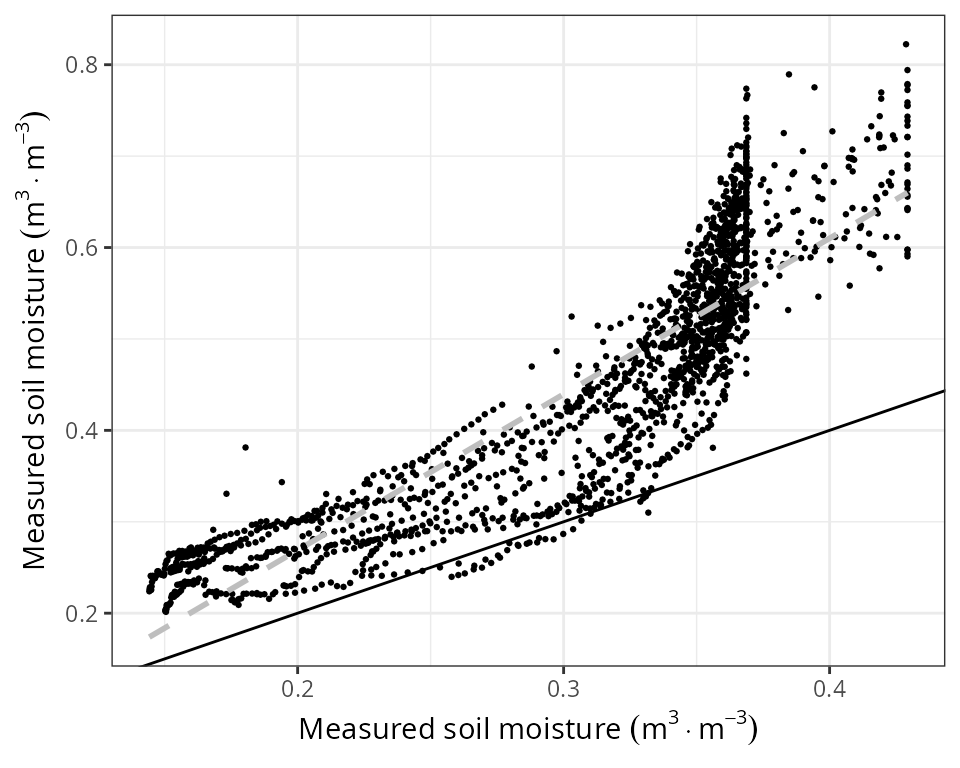

or examine evaluation statistics:

``` r

evaluation_stats(fb_SWB, fb_observed, type = "SWC")
```

    ##            n         Bias     Bias.rel          MAE      MAE.rel            r 
    ## 1760.0000000   -0.1420810  -31.8801328    0.1424712   31.9676839    0.8913395 
    ##          NSE      NSE.abs 
    ##   -0.2796730   -0.1146689

### Plant transpiration

The following plots display the observed and predicted transpiration
dynamics for *Pinus halepensis* and *Quercus ilex*:

``` r

g1<-evaluation_plot(fb_SWB, fb_observed, 
                            cohort = "T2_2630",
                            type="E", plotType = "dynamics")+
  theme(legend.position = c(0.85,0.83))
g2<-evaluation_plot(fb_SWB, fb_observed, 
                            cohort = "T3_2853",
                            type="E", plotType = "dynamics")+
  theme(legend.position = c(0.85,0.83))
plot_grid(g1, g2, ncol=1)
```

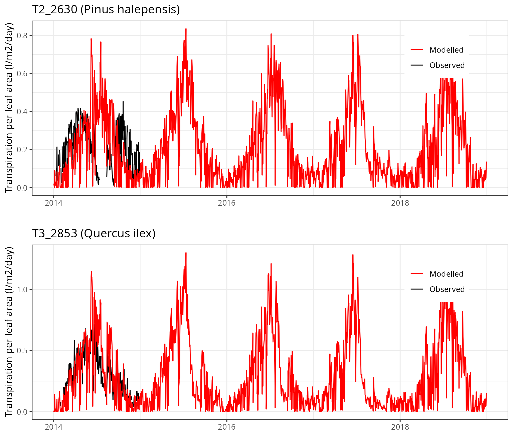

In general, the agreement is quite good, but the model seems to
overestimate the transpiration of *P. halepensis* in early summer and
after the first drought period. The transpiration of *Q. ilex* seems
also overestimated in spring and autumn. We can also inspect the
evaluation statistics for both species using:

``` r

evaluation_stats(fb_SWB, fb_observed, cohort = "T2_2630", type="E")
```

    ##             n          Bias      Bias.rel           MAE       MAE.rel 
    ## 300.000000000   0.001491717   0.725290535   0.142204289  69.141416160 
    ##             r           NSE       NSE.abs 
    ##   0.199848101  -1.510694087  -0.437047523

``` r

evaluation_stats(fb_SWB, fb_observed, cohort = "T3_2853", type="E")
```

    ##           n        Bias    Bias.rel         MAE     MAE.rel           r 
    ## 309.0000000   0.0449784  15.5388023   0.1096709  37.8882996   0.8480511 
    ##         NSE     NSE.abs 
    ##   0.1539461   0.2528349

### Leaf water potentials

Finally, we can compare observed with predicted water potentials. In
this case measurements are available for three dates, but they include
the standard deviation of several measurements.

``` r

g1<-evaluation_plot(fb_SWB, fb_observed, 
                            cohort = "T2_2630",
                            type="WP", plotType = "dynamics")+
  theme(legend.position = c(0.85,0.23))
g2<-evaluation_plot(fb_SWB, fb_observed, 
                            cohort = "T3_2853",
                            type="WP", plotType = "dynamics")+
  theme(legend.position = c(0.85,0.23))
plot_grid(g1, g2, ncol=1)
```

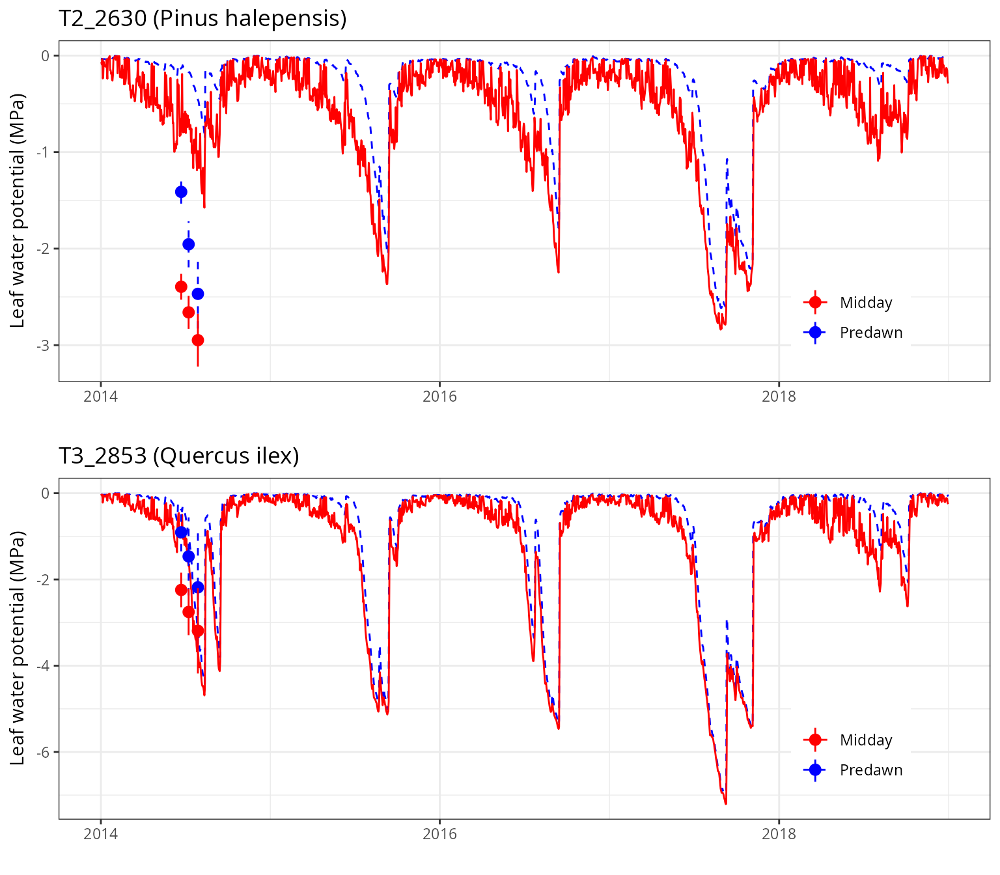

The model seems to overestimate water potentials (i.e. it predicts less
negative values than those observed) for P. halepensis during the
drought season.

## Drawing plots

Package `medfate` provides a simple `plot` function for objects of class
`spwb`. Here we will use this function to display the seasonal variation
predicted by the model, as well as the variation at higher temporal
resolution within four different selected 3-day periods that we define
here:

``` r

d1 = seq(as.Date("2014-03-01"), as.Date("2014-03-03"), by="day")
d2 = seq(as.Date("2014-06-01"), as.Date("2014-06-03"), by="day")
d3 = seq(as.Date("2014-08-01"), as.Date("2014-08-03"), by="day")
d4 = seq(as.Date("2014-10-01"), as.Date("2014-10-03"), by="day")
```

### Meteorological input and input/output water flows

Function [`plot()`](https://rdrr.io/r/graphics/plot.default.html) can be
used to show the meteorological input:

``` r

plot(fb_SWB, type = "PET_Precipitation")
```

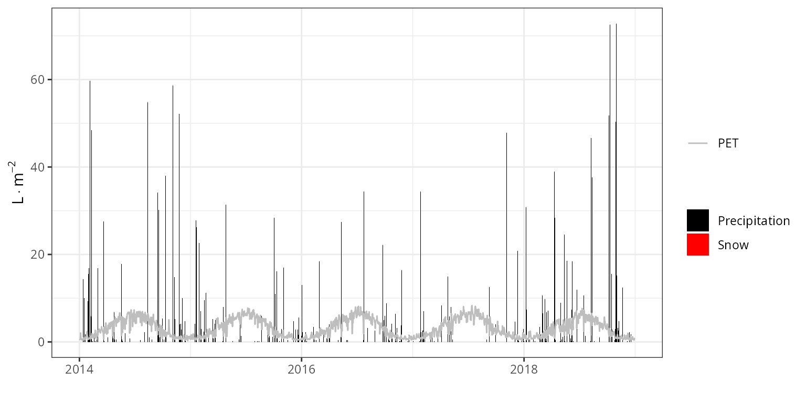 It is apparent
the climatic drought period between april and august 2014. This should
have an impact on soil moisture and plant stress.

If we are interested in forest hydrology, we can plot the amount of
water that the model predicts to leave the forest via surface runoff or
drainage to lower water compartments.

``` r

plot(fb_SWB, type = "Export")
```

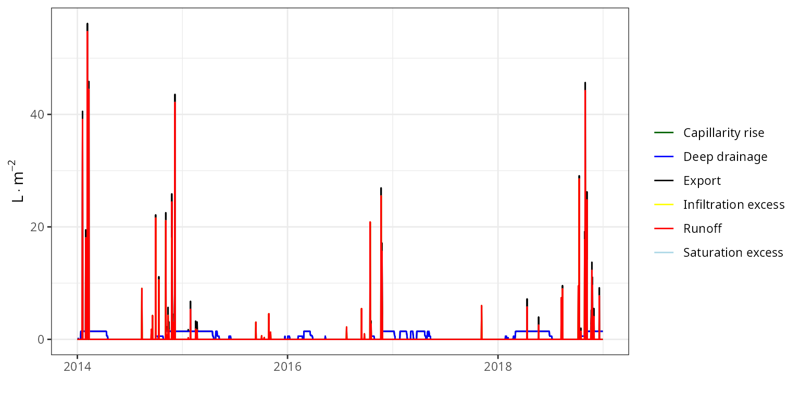 As expected,
water exported from the forest plot was only relevant for the autumn and
winter periods. Note also that the model predicts some runoff during
convective storms during autumn, whereas winter events occur when the
soil is already full, so that most exported water is assumed to be lost
via deep drainage. One can also display the evapotranspiration flows,
which we do in the following plot that also combines the two previous:

``` r

g1<-plot(fb_SWB)+scale_x_date(date_breaks = "1 month", date_labels = "%m")+theme(legend.position = "none")
g2<-plot(fb_SWB, "Evapotranspiration")+scale_x_date(date_breaks = "1 month", date_labels = "%m")+theme(legend.position = c(0.13,0.73))
g3<-plot(fb_SWB, "Export")+scale_x_date(date_breaks = "1 month", date_labels = "%m")+theme(legend.position = c(0.35,0.60))
plot_grid(g1,g2, g3, ncol=1, rel_heights = c(0.4,1,0.6))
```

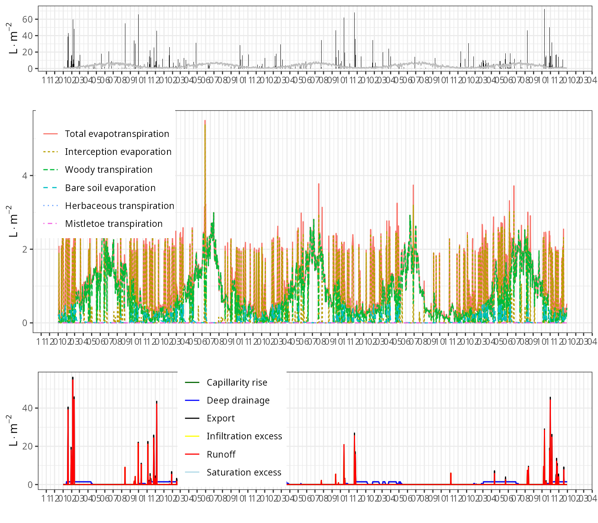

### Soil moisture dynamics and hydraulic redistribution

It is also useful to plot the dynamics of soil state variables by layer,
such as the percentage of moisture in relation to field capacity:

``` r

plot(fb_SWB, type="SoilTheta")
```

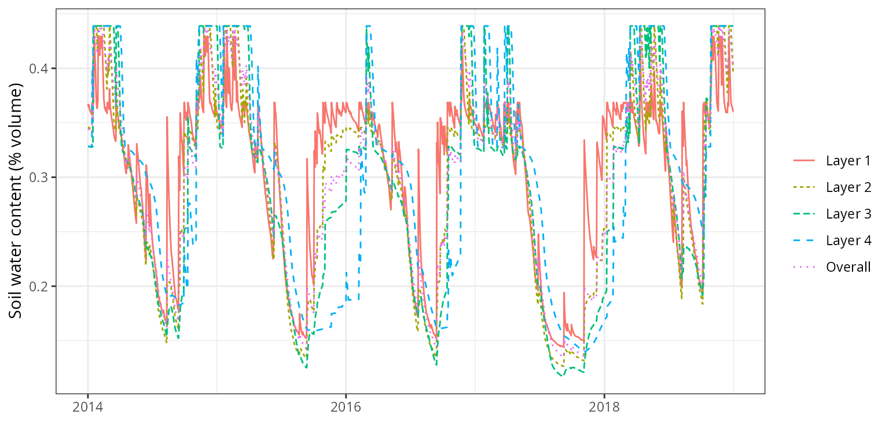 Note that the
model predicts soil drought to occur earlier in the season for the first
three layers (0-200 cm) whereas the bottom layer dries out much more
slowly. At this point is important to mention that the water balance
model incorporates. We can also display the dynamics of the
corresponding soil layer water potentials:

``` r

plot(fb_SWB, type="SoilPsi")
```

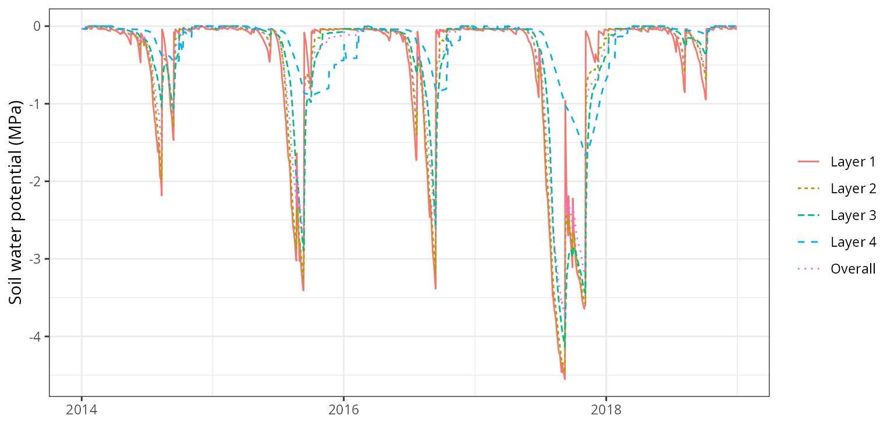 or draw a
composite plot including absolute soil water volume:

``` r

g1<-plot(fb_SWB)+scale_x_date(date_breaks = "1 month", date_labels = "%m")+theme(legend.position = "none")
g2<-plot(fb_SWB, "SoilVol")+scale_x_date(date_breaks = "1 month", date_labels = "%m")+theme(legend.position = c(0.08,0.65))
g3<-plot(fb_SWB, "SoilPsi")+scale_x_date(date_breaks = "1 month", date_labels = "%m")+theme(legend.position = c(0.08,0.5))
plot_grid(g1, g2,  g3, rel_heights = c(0.4,0.8,0.8), ncol=1)
```

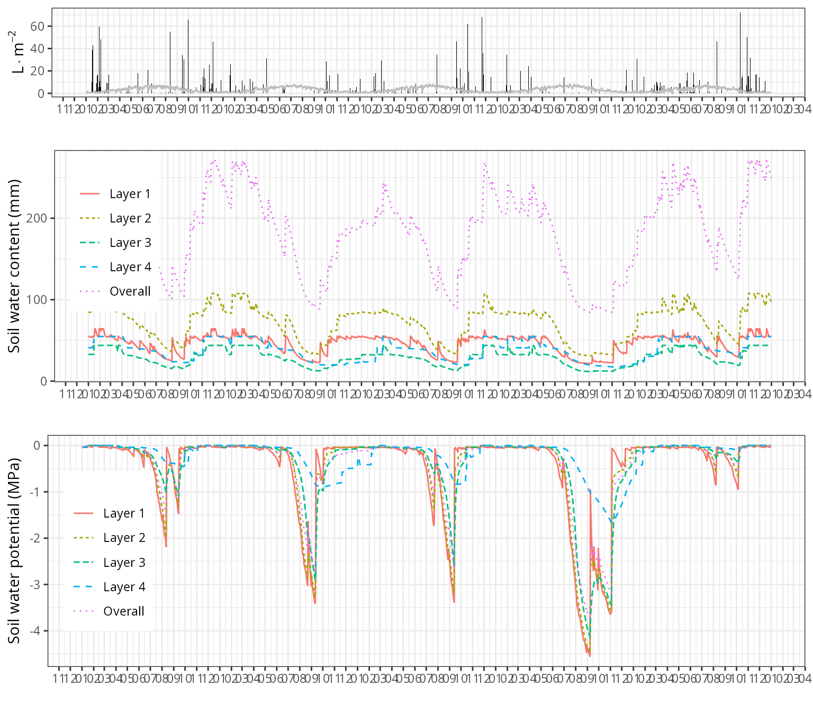

### Root water uptake and hydraulic redistribution

The following composite plot shows the daily root water uptake (or
release) from different soil layers, and the daily amount of water
entering soil layers due to hydraulic redistribution:

``` r

g1<-plot(fb_SWB, "SoilPsi")+scale_x_date(date_breaks = "1 month", date_labels = "%m")+theme(legend.position = "none")+ylab("Soil wp (MPa)")
g2<-plot(fb_SWB, "PlantExtraction")+scale_x_date(date_breaks = "1 month", date_labels = "%m")+theme(legend.position = c(0.08,0.68))
g3<-plot(fb_SWB, "HydraulicRedistribution")+scale_x_date(date_breaks = "1 month", date_labels = "%m")+theme(legend.position = c(0.08,0.5))
plot_grid(g1, g2,  g3, rel_heights = c(0.4,0.8,0.8), ncol=1)
```

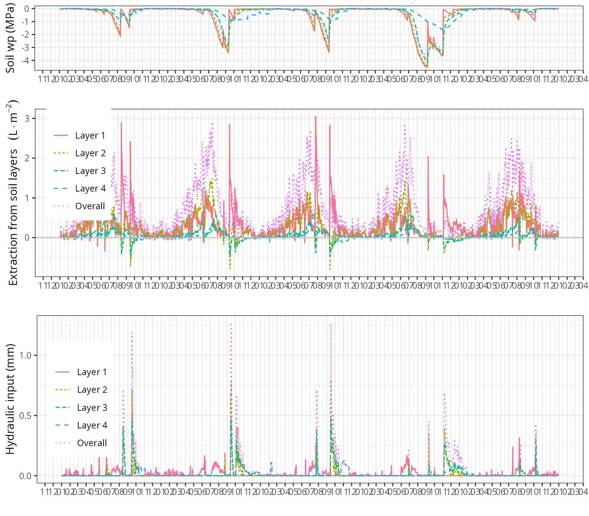

If we create a composite plot including subdaily water uptake/release
patterns, we can further understand the redistribution flows created by
the model during different periods:

``` r

g0<-plot(fb_SWB, "PlantExtraction")+scale_x_date(date_breaks = "1 month", date_labels = "%m")+theme(legend.position = c(0.08,0.68))
g1<-plot(fb_SWB, "PlantExtraction", subdaily = T, dates = d1)+scale_x_datetime(date_breaks = "1 day",  date_labels = "%m/%d")+theme(legend.position = "none")+ylim(c(-0.05,0.13))
g2<-plot(fb_SWB, "PlantExtraction", subdaily = T, dates = d2)+scale_x_datetime(date_breaks = "1 day",  date_labels = "%m/%d")+theme(legend.position = "none")+ylab("")+ylim(c(-0.05,0.13))
g3<-plot(fb_SWB, "PlantExtraction", subdaily = T, dates = d3)+scale_x_datetime(date_breaks = "1 day",  date_labels = "%m/%d")+theme(legend.position = "none")+ylab("")+ylim(c(-0.05,0.13))
g4<-plot(fb_SWB, "PlantExtraction", subdaily = T, dates = d4)+scale_x_datetime(date_breaks = "1 day",  date_labels = "%m/%d")+theme(legend.position = "none")+ylab("")+ylim(c(-0.05,0.13))
plot_grid(g0,plot_grid(g1, g2, g3, g4, ncol=4),ncol=1)
```

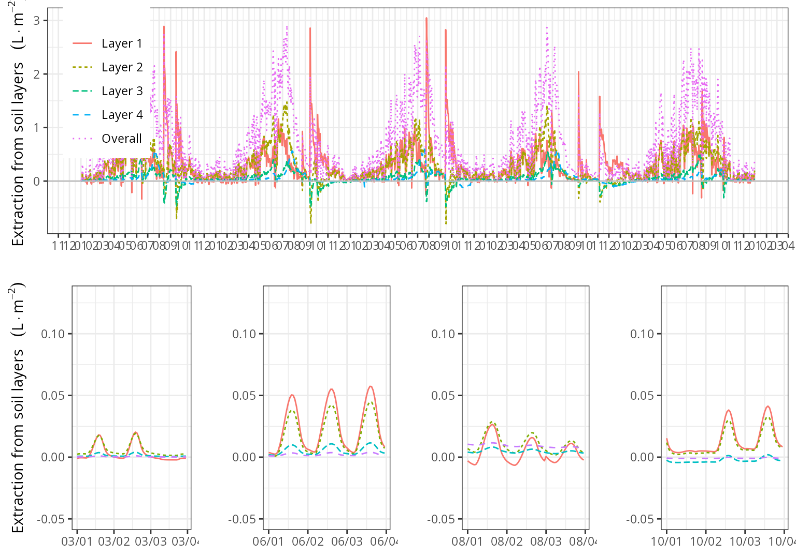

### Plant transpiration

We can use function
[`plot()`](https://rdrr.io/r/graphics/plot.default.html) to display the
seasonal dynamics of cohort-level variables, such as plant transpiration
per leaf area:

``` r

par(mar=c(5,5,1,1))
plot(fb_SWB, type="TranspirationPerLeaf", bySpecies = T)
```

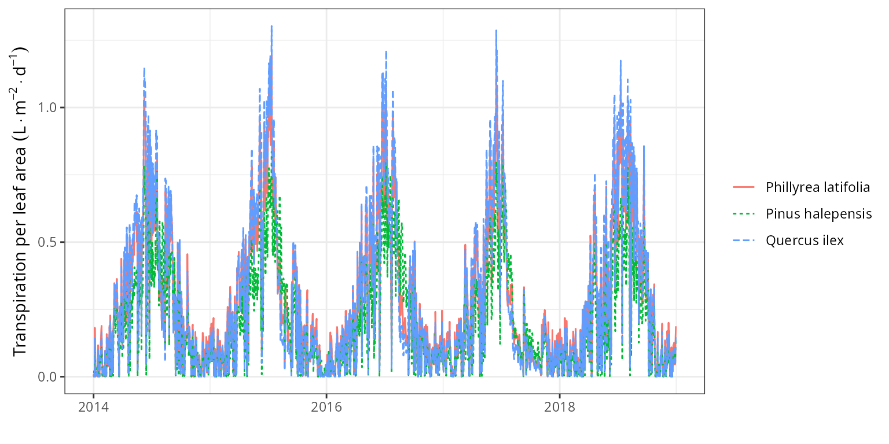 Where we can
observe that some species transpire more than others due to their
vertical position within the canopy.

``` r

g1<-plot(fb_SWB)+scale_x_date(date_breaks = "1 month", date_labels = "%m")+theme(legend.position = "none")
g2<-plot(fb_SWB, "TranspirationPerLeaf", bySpecies = T)+scale_x_date(date_breaks = "1 month", date_labels = "%m")+theme(legend.position = c(0.1,0.75))
g21<-plot(fb_SWB, "LeafTranspiration", subdaily = T, dates = d1)+scale_x_datetime(date_breaks = "1 day",  date_labels = "%m/%d")+theme(legend.position = "none")+ylim(c(0,0.32))
g22<-plot(fb_SWB, "LeafTranspiration", subdaily = T, dates = d2)+scale_x_datetime(date_breaks = "1 day",  date_labels = "%m/%d")+theme(legend.position = "none")+ylab("")+ylim(c(0,0.32))
g23<-plot(fb_SWB, "LeafTranspiration", subdaily = T, dates = d3)+scale_x_datetime(date_breaks = "1 day",  date_labels = "%m/%d")+theme(legend.position = "none")+ylab("")+ylim(c(0,0.32))
g24<-plot(fb_SWB, "LeafTranspiration", subdaily = T, dates = d4)+scale_x_datetime(date_breaks = "1 day",  date_labels = "%m/%d")+theme(legend.position = "none")+ylab("")+ylim(c(0,0.32))
plot_grid(g1, g2,  
          plot_grid(g21,g22,g23,g24, ncol=4), 
          ncol=1, rel_heights = c(0.4,0.8,0.8))
```

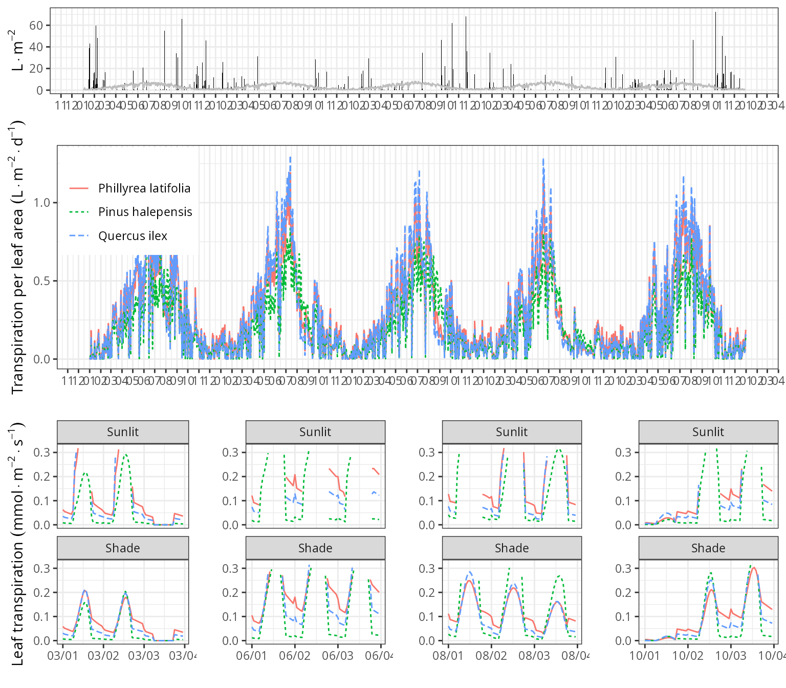

### Plant stress

In the model, reduction of (whole-plant) plant transpiration is what
used to define drought stress, which depends on the species identity:

``` r

plot(fb_SWB, type="PlantStress", bySpecies = T)
```

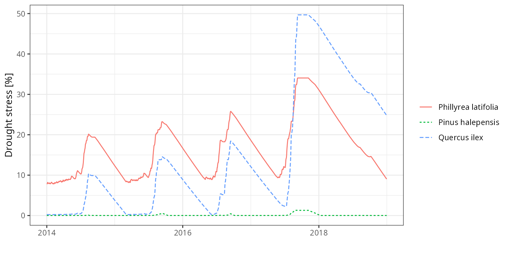

To examine the impact of drought on plants, one can inspect the
whole-plant conductance (from which the stress index is derived) or the
stem percent loss of conductance derived from embolism, as we do in the
following composite plot:

``` r

g1<-plot(fb_SWB)+scale_x_date(date_breaks = "1 month", date_labels = "%m")+theme(legend.position = "none")
g2<-plot(fb_SWB, "SoilPlantConductance", bySpecies = T)+scale_x_date(date_breaks = "1 month", date_labels = "%m")+
  ylab(expression(paste("Soil-plant conductance ",(mmol%.%m^{-2}%.%s^{-1}))))+
  theme(legend.position = "none")
g3<-plot(fb_SWB, "StemPLC", bySpecies = T)+scale_x_date(date_breaks = "1 month", date_labels = "%m")+theme(legend.position = c(0.2,0.75))
plot_grid(g1, g2,g3,                          
          ncol=1, rel_heights = c(0.4,0.8,0.8))
```

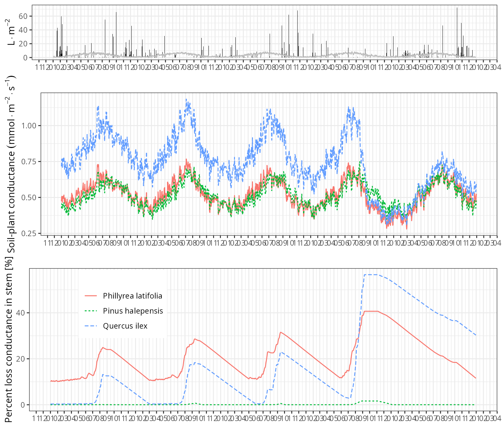

### Leaf water potentials

``` r

g1<-plot(fb_SWB)+scale_x_date(date_breaks = "1 month", date_labels = "%m")+theme(legend.position = "none")
g2<-plot(fb_SWB, "LeafPsiRange", bySpecies = T)+scale_x_date(date_breaks = "1 month", date_labels = "%m")+theme(legend.position = c(0.1,0.25)) + ylab("Leaf water potential (MPa)")
g21<-plot(fb_SWB, "LeafPsi", subdaily = T, dates = d1)+scale_x_datetime(date_breaks = "1 day",  date_labels = "%m/%d")+theme(legend.position = "none")+ylim(c(-7,0))
g22<-plot(fb_SWB, "LeafPsi", subdaily = T, dates = d2)+scale_x_datetime(date_breaks = "1 day",  date_labels = "%m/%d")+theme(legend.position = "none")+ylab("")+ylim(c(-7,0))
g23<-plot(fb_SWB, "LeafPsi", subdaily = T, dates = d3)+scale_x_datetime(date_breaks = "1 day",  date_labels = "%m/%d")+theme(legend.position = "none")+ylab("")+ylim(c(-7,0))
g24<-plot(fb_SWB, "LeafPsi", subdaily = T, dates = d4)+scale_x_datetime(date_breaks = "1 day",  date_labels = "%m/%d")+theme(legend.position = "none")+ylab("")+ylim(c(-7,0))
plot_grid(g1, g2,                          
          plot_grid(g21,g22,g23,g24, ncol=4), 
          ncol=1, rel_heights = c(0.4,0.8,0.8))
```

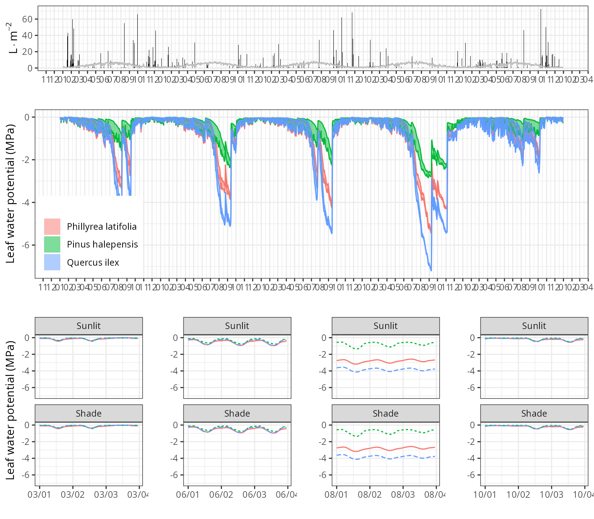

### Stomatal conductance

``` r

g1<-plot(fb_SWB)+scale_x_date(date_breaks = "1 month", date_labels = "%m")+theme(legend.position = "none")
g2<-plot(fb_SWB, "GSWMax_SL", bySpecies = T)+scale_x_date(date_breaks = "1 month", date_labels = "%m")+theme(legend.position = c(0.5,0.74))+ylab("Sunlit leaf stomatal conductance")+ylim(c(0,0.3))
g21<-plot(fb_SWB, "LeafStomatalConductance", subdaily = T, dates = d1)+scale_x_datetime(date_breaks = "1 day",  date_labels = "%m/%d")+theme(legend.position = "none")+ylim(c(0,0.2))
g22<-plot(fb_SWB, "LeafStomatalConductance", subdaily = T, dates = d2)+scale_x_datetime(date_breaks = "1 day",  date_labels = "%m/%d")+theme(legend.position = "none")+ylab("")+ylim(c(0,0.2))
g23<-plot(fb_SWB, "LeafStomatalConductance", subdaily = T, dates = d3)+scale_x_datetime(date_breaks = "1 day",  date_labels = "%m/%d")+theme(legend.position = "none")+ylab("")+ylim(c(0,0.2))
g24<-plot(fb_SWB, "LeafStomatalConductance", subdaily = T, dates = d4)+scale_x_datetime(date_breaks = "1 day",  date_labels = "%m/%d")+theme(legend.position = "none")+ylab("")+ylim(c(0,0.2))
plot_grid(g1, g2,
          plot_grid(g21,g22,g23,g24, ncol=4),
          ncol=1, rel_heights = c(0.4,0.8,0.8))
```

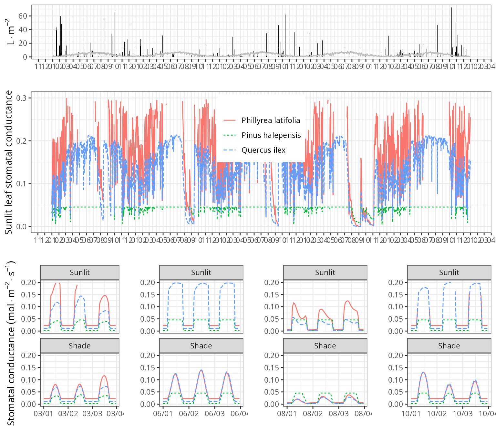

## Generating output summaries

While the water balance model operates at daily and sub-daily steps,
users will normally be interested in outputs at larger time scales. The
package provides a `summary` for objects of class `spwb`. This function
can be used to summarize the model’s output at different temporal steps
(i.e. weekly, monthly or annual). For example, to obtain the average
soil moisture and water potentials by months one can use:

``` r

summary(fb_SWB, freq="months",FUN=sum, output="WaterBalance")
```

    ##                  PET Precipitation      Rain Snow      NetRain Snowmelt
    ## 2014-01-01  27.03414     205.04814 205.04814  0.0 182.21891426      0.0
    ## 2014-02-01  37.11592     181.09641 181.09641  0.0 154.86636532      0.0
    ## 2014-03-01  80.49737      44.61248  44.61248  0.0  39.82086587      0.0
    ## 2014-04-01 109.24874      15.00000  15.00000  0.0   7.20513049      0.0
    ## 2014-05-01 147.99639      21.60000  21.60000  0.0  16.29630427      0.0
    ## 2014-06-01 167.27898      33.60000  33.60000  0.0  25.81615954      0.0
    ## 2014-07-01 183.99299       0.60000   0.60000  0.0   0.14342197      0.0
    ## 2014-08-01 159.66330      60.40000  60.40000  0.0  52.77578870      0.0
    ## 2014-09-01 103.42793     137.60000 137.60000  0.0 125.72504948      0.0
    ## 2014-10-01  63.53896      50.60000  50.60000  0.0  41.80556517      0.0
    ## 2014-11-01  30.12083     222.60000 222.60000  0.0 197.66821596      0.0
    ## 2014-12-01  26.01617      93.00000  93.00000  0.0  78.50297704      0.0
    ## 2015-01-01  33.33412      97.40000  97.40000  0.0  86.25547835      0.0
    ## 2015-02-01  38.17936      67.60000  67.60000  0.0  47.17954812      0.0
    ## 2015-03-01  78.27482      53.00000  53.00000  0.0  36.51113978      0.0
    ## 2015-04-01 109.20859      41.20000  41.20000  0.0  35.19442242      0.0
    ## 2015-05-01 157.73664       0.80000   0.80000  0.0   0.19122462      0.0
    ## 2015-06-01 176.08186      71.80000  71.80000  0.0  58.07828977      0.0
    ## 2015-07-01 199.29900       0.20000   0.20000  0.0   0.04781034      0.0
    ## 2015-08-01 158.13941       6.40000   6.40000  0.0   4.12981186      0.0
    ## 2015-09-01 107.67144      50.40000  50.40000  0.0  40.85235485      0.0
    ## 2015-10-01  54.97221      94.00000  94.00000  0.0  78.61866818      0.0
    ## 2015-11-01  40.87647      32.20000  32.20000  0.0  25.99885284      0.0
    ## 2015-12-01  18.36149      23.80000  23.80000  0.0  12.22665988      0.0
    ## 2016-01-01  25.98382      21.40000  21.40000  0.0  12.94598659      0.0
    ## 2016-02-01  42.43210      87.80000  87.80000  0.0  73.96646029      0.0
    ## 2016-03-01  72.70349      19.40000  19.40000  0.0  11.46359447      0.0
    ## 2016-04-01 110.36442      13.00000  13.00000  0.0   5.06083409      0.0
    ## 2016-05-01 151.45145      50.20000  50.20000  0.0  37.19058938      0.0
    ## 2016-06-01 168.69569       8.20000   8.20000  0.0   5.45885370      0.0
    ## 2016-07-01 194.66192      41.40000  41.40000  0.0  36.19643925      0.0
    ## 2016-08-01 167.03376       6.00000   6.00000  0.0   1.96764988      0.0
    ## 2016-09-01 113.75042      87.40000  87.40000  0.0  78.81957783      0.0
    ## 2016-10-01  59.38548     109.80000 109.80000  0.0  95.24536020      0.0
    ## 2016-11-01  31.62855     154.40000 154.40000  0.0 139.57889781      0.0
    ## 2016-12-01  25.74714      16.60000  16.60000  0.0  13.00712705      0.0
    ## 2017-01-01  30.97017      51.20000  51.20000  0.0  40.37453807      0.0
    ## 2017-02-01  39.00523      27.20000  27.20000  0.0  12.70372901      0.0
    ## 2017-03-01  75.39796      59.00000  59.00000  0.0  48.43999959      0.0
    ## 2017-04-01 115.11745      71.00000  71.00000  0.0  59.22562940      0.0
    ## 2017-05-01 148.68280      21.20000  21.20000  0.0  12.98079663      0.0
    ## 2017-06-01 178.51316      14.20000  14.20000  0.0  10.99279736      0.0
    ## 2017-07-01 200.88791       0.60000   0.60000  0.0   0.14344632      0.0
    ## 2017-08-01 171.08660       1.40000   1.40000  0.0   0.34345490      0.0
    ## 2017-09-01 109.87609      19.80000  19.80000  0.0  14.27355795      0.0
    ## 2017-10-01  75.77870       0.40000   0.40000  0.0   0.10651291      0.0
    ## 2017-11-01  40.14167      48.00000  48.00000  0.0  45.57933983      0.0
    ## 2017-12-01  26.10486      57.40000  57.40000  0.0  44.10151712      0.0
    ## 2018-01-01  34.17212      68.60000  68.60000  0.0  57.81342509      0.0
    ## 2018-02-01  32.99313      27.60000  27.00000  0.6  14.57930309      0.0
    ## 2018-03-01  65.00212     105.60000 105.60000  0.0  84.03080611      0.6
    ## 2018-04-01 106.80480      89.40000  89.40000  0.0  79.22141836      0.0
    ## 2018-05-01 110.14567     101.20000 101.20000  0.0  79.73693632      0.0
    ## 2018-06-01 149.84895      51.60000  51.60000  0.0  36.37521421      0.0
    ## 2018-07-01 188.24784      12.00000  12.00000  0.0   8.96792301      0.0
    ## 2018-08-01 161.32739      89.00000  89.00000  0.0  81.43418710      0.0
    ## 2018-09-01 113.71008       1.00000   1.00000  0.0   0.24744797      0.0
    ## 2018-10-01  61.59182     299.40000 299.40000  0.0 276.23103259      0.0
    ## 2018-11-01  28.64739     153.00000 153.00000  0.0 128.13637504      0.0
    ## 2018-12-01  25.83913      48.20000  48.20000  0.0  40.74206996      0.0
    ##            Infiltration InfiltrationExcess SaturationExcess     Runoff
    ## 2014-01-01 182.21891426           0.000000        90.353925  90.353925
    ## 2014-02-01 154.86636532           0.000000       122.592066 122.592066
    ## 2014-03-01  39.82086587           0.000000         0.000000   0.000000
    ## 2014-04-01   7.20513049           0.000000         0.000000   0.000000
    ## 2014-05-01  16.29630427           0.000000         0.000000   0.000000
    ## 2014-06-01  25.81615954           0.000000         0.000000   0.000000
    ## 2014-07-01   0.14342197           0.000000         0.000000   0.000000
    ## 2014-08-01  43.72068205           9.055107         0.000000   9.055107
    ## 2014-09-01  98.11191099          27.613138         0.000000  27.613138
    ## 2014-10-01  31.22570135          10.579864         0.000000  10.579864
    ## 2014-11-01 144.50335933          53.164857        20.861524  74.026381
    ## 2014-12-01  78.50297704           0.000000        54.970623  54.970623
    ## 2015-01-01  86.25547835           0.000000         5.647772   5.647772
    ## 2015-02-01  47.17954812           0.000000         3.485081   3.485081
    ## 2015-03-01  36.51113978           0.000000         0.000000   0.000000
    ## 2015-04-01  35.19442242           0.000000         0.000000   0.000000
    ## 2015-05-01   0.19122462           0.000000         0.000000   0.000000
    ## 2015-06-01  58.07828977           0.000000         0.000000   0.000000
    ## 2015-07-01   0.04781034           0.000000         0.000000   0.000000
    ## 2015-08-01   4.12981186           0.000000         0.000000   0.000000
    ## 2015-09-01  37.79073136           3.061623         0.000000   3.061623
    ## 2015-10-01  73.08531409           5.533354         0.000000   5.533354
    ## 2015-11-01  24.71867571           1.280177         0.000000   1.280177
    ## 2015-12-01  12.22665988           0.000000         0.000000   0.000000
    ## 2016-01-01  12.94598659           0.000000         0.000000   0.000000
    ## 2016-02-01  73.96646029           0.000000         0.000000   0.000000
    ## 2016-03-01  11.46359447           0.000000         0.000000   0.000000
    ## 2016-04-01   5.06083409           0.000000         0.000000   0.000000
    ## 2016-05-01  37.19058938           0.000000         0.000000   0.000000
    ## 2016-06-01   5.45885370           0.000000         0.000000   0.000000
    ## 2016-07-01  33.99994002           2.196499         0.000000   2.196499
    ## 2016-08-01   1.96764988           0.000000         0.000000   0.000000
    ## 2016-09-01  72.35792403           6.461654         0.000000   6.461654
    ## 2016-10-01  71.64282794          23.602532         0.000000  23.602532
    ## 2016-11-01  97.75483140          41.824066         8.824659  50.648725
    ## 2016-12-01  13.00712705           0.000000         0.000000   0.000000
    ## 2017-01-01  40.37453807           0.000000         0.000000   0.000000
    ## 2017-02-01  12.70372901           0.000000         0.000000   0.000000
    ## 2017-03-01  48.43999959           0.000000         0.000000   0.000000
    ## 2017-04-01  59.22562940           0.000000         0.000000   0.000000
    ## 2017-05-01  12.98079663           0.000000         0.000000   0.000000
    ## 2017-06-01  10.99279736           0.000000         0.000000   0.000000
    ## 2017-07-01   0.14344632           0.000000         0.000000   0.000000
    ## 2017-08-01   0.34345490           0.000000         0.000000   0.000000
    ## 2017-09-01  14.27355795           0.000000         0.000000   0.000000
    ## 2017-10-01   0.10651291           0.000000         0.000000   0.000000
    ## 2017-11-01  39.57555222           6.003788         0.000000   6.003788
    ## 2017-12-01  44.10151712           0.000000         0.000000   0.000000
    ## 2018-01-01  57.81342509           0.000000         0.000000   0.000000
    ## 2018-02-01  14.57930309           0.000000         0.000000   0.000000
    ## 2018-03-01  84.63080611           0.000000         0.000000   0.000000
    ## 2018-04-01  79.22141836           0.000000         5.770696   5.770696
    ## 2018-05-01  79.73693632           0.000000         2.548943   2.548943
    ## 2018-06-01  36.37521421           0.000000         0.000000   0.000000
    ## 2018-07-01   8.96792301           0.000000         0.000000   0.000000
    ## 2018-08-01  65.01928099          16.414906         0.000000  16.414906
    ## 2018-09-01   0.24744797           0.000000         0.000000   0.000000
    ## 2018-10-01 188.12835358          88.102679        13.713177 101.815856
    ## 2018-11-01  98.02552894          30.110846        49.848497  79.959343
    ## 2018-12-01  40.74206996           0.000000         7.743730   7.743730
    ##            DeepDrainage CapillarityRise Evapotranspiration Interception
    ## 2014-01-01   27.4057794               0          30.545867   22.8292262
    ## 2014-02-01   40.1478462               0          34.172388   26.2300430
    ## 2014-03-01   44.4494011               0          25.505843    4.7916105
    ## 2014-04-01   19.4817623               0          31.051761    7.7948695
    ## 2014-05-01    0.0000000               0          40.321563    5.3036957
    ## 2014-06-01    0.0000000               0          57.184181    7.7838405
    ## 2014-07-01    0.0000000               0          45.201290    0.4565780
    ## 2014-08-01    0.0000000               0          42.727184    7.6242113
    ## 2014-09-01    0.5718093               0          35.892787   11.8749495
    ## 2014-10-01   13.4735686               0          24.967628    8.7944348
    ## 2014-11-01   38.7139945               0          33.147106   24.9317840
    ## 2014-12-01   44.4494011               0          22.261749   14.4970230
    ## 2015-01-01   44.4414497               0          20.145618   11.1445216
    ## 2015-02-01   40.1478462               0          28.506516   20.4204519
    ## 2015-03-01   44.4494011               0          36.154503   16.4888602
    ## 2015-04-01   29.3157798               0          31.056392    6.0055776
    ## 2015-05-01    5.5155422               0          42.232164    0.6087754
    ## 2015-06-01    3.5325221               0          65.122572   13.7217092
    ## 2015-07-01    0.0000000               0          64.079735    0.1521897
    ## 2015-08-01    0.0000000               0          26.037091    2.2701881
    ## 2015-09-01    0.0000000               0          28.107147    9.5476451
    ## 2015-10-01    0.0000000               0          27.637854   15.3813308
    ## 2015-11-01    0.0000000               0          18.138054    6.2011472
    ## 2015-12-01    0.5438453               0          17.593430   11.5733401
    ## 2016-01-01    3.8475300               0          14.798458    8.4540134
    ## 2016-02-01   13.1421007               0          24.699724   13.8335397
    ## 2016-03-01   33.0870565               0          22.995017    7.9364055
    ## 2016-04-01    0.0000000               0          30.516830    7.9391659
    ## 2016-05-01    0.7859221               0          47.870618   13.0094106
    ## 2016-06-01    0.0000000               0          49.755110    2.7411463
    ## 2016-07-01    0.0000000               0          59.966485    5.2035608
    ## 2016-08-01    0.0000000               0          39.124131    4.0323501
    ## 2016-09-01    0.0000000               0          29.049090    8.5804222
    ## 2016-10-01    6.5704573               0          31.470430   14.5546398
    ## 2016-11-01   14.3385165               0          23.461750   14.8211022
    ## 2016-12-01   44.4494011               0          14.012719    3.5928729
    ## 2017-01-01   17.8549750               0          18.549217   10.8254619
    ## 2017-02-01   25.9214315               0          24.546177   14.4962710
    ## 2017-03-01   22.7630380               0          29.665114   10.5600004
    ## 2017-04-01   33.1738028               0          38.788234   11.7743706
    ## 2017-05-01   10.1142267               0          48.331768    8.2192034
    ## 2017-06-01    0.0000000               0          55.641513    3.2072026
    ## 2017-07-01    0.0000000               0          45.490334    0.4565537
    ## 2017-08-01    0.0000000               0          13.479395    1.0565451
    ## 2017-09-01    0.0000000               0          14.292803    5.5264420
    ## 2017-10-01    0.0000000               0           5.908849    0.2934871
    ## 2017-11-01    0.0000000               0          10.179305    2.4206602
    ## 2017-12-01    0.0000000               0          17.974762   13.2984829
    ## 2018-01-01    2.3754186               0          19.502023   10.7865749
    ## 2018-02-01    2.3298265               0          20.501613   12.4206969
    ## 2018-03-01   42.2456601               0          37.264663   21.5691939
    ## 2018-04-01   43.0155495               0          36.089269   10.1785816
    ## 2018-05-01   44.4494011               0          46.380366   21.4630637
    ## 2018-06-01   41.4147175               0          53.641920   15.2247858
    ## 2018-07-01    3.9043916               0          60.338790    3.0320770
    ## 2018-08-01    0.6758683               0          59.359966    7.5658129
    ## 2018-09-01    0.0000000               0          33.297983    0.7525520
    ## 2018-10-01   15.1659312               0          41.400880   23.1689674
    ## 2018-11-01   43.0155495               0          29.945575   24.8636250
    ## 2018-12-01   44.4494011               0          16.850281    7.4579300
    ##            SoilEvaporation HerbTranspiration PlantExtraction Transpiration
    ## 2014-01-01     4.395375026                 0        3.303882      3.321266
    ## 2014-02-01     3.185812808                 0        4.719381      4.756533
    ## 2014-03-01     3.385382548                 0       17.236825     17.328850
    ## 2014-04-01     0.616407885                 0       22.530801     22.640483
    ## 2014-05-01     0.423968401                 0       34.480173     34.593899
    ## 2014-06-01     0.324960312                 0       48.817509     49.075380
    ## 2014-07-01     0.150225959                 0       43.284747     44.594486
    ## 2014-08-01     0.459190568                 0       34.882305     34.643782
    ## 2014-09-01     0.778038561                 0       23.617764     23.239799
    ## 2014-10-01     3.371777338                 0       12.833514     12.801416
    ## 2014-11-01     3.779921771                 0        4.455366      4.435401
    ## 2014-12-01     3.316239100                 0        4.433619      4.448486
    ## 2015-01-01     2.477163981                 0        6.524715      6.523933
    ## 2015-02-01     2.721009023                 0        5.357169      5.365055
    ## 2015-03-01     5.877897568                 0       13.705077     13.787745
    ## 2015-04-01     1.270232973                 0       23.687738     23.780582
    ## 2015-05-01     0.562611663                 0       40.871586     41.060777
    ## 2015-06-01     2.039687575                 0       49.269036     49.361175
    ## 2015-07-01     0.153586349                 0       62.384311     63.773959
    ## 2015-08-01     0.056747232                 0       22.580099     23.710155
    ## 2015-09-01     0.148262698                 0       19.516655     18.411240
    ## 2015-10-01     2.024400651                 0       10.578277     10.232123
    ## 2015-11-01     3.071019262                 0        8.865912      8.865887
    ## 2015-12-01     3.372287378                 0        2.661648      2.647802
    ## 2016-01-01     2.981684761                 0        3.355880      3.362760
    ## 2016-02-01     4.245883405                 0        6.617312      6.620301
    ## 2016-03-01     2.542931290                 0       12.492556     12.515680
    ## 2016-04-01     0.674539074                 0       21.864555     21.903125
    ## 2016-05-01     1.312765183                 0       33.512663     33.548442
    ## 2016-06-01     0.344437605                 0       46.327806     46.669527
    ## 2016-07-01     0.201404360                 0       54.141880     54.561520
    ## 2016-08-01     0.086599866                 0       33.324088     35.005181
    ## 2016-09-01     1.088940344                 0       20.409531     19.379728
    ## 2016-10-01     3.991446272                 0       12.952721     12.924344
    ## 2016-11-01     2.996400652                 0        5.658940      5.644247
    ## 2016-12-01     3.291629535                 0        7.108127      7.128216
    ## 2017-01-01     2.324966143                 0        5.406575      5.398789
    ## 2017-02-01     3.789109925                 0        6.252002      6.260796
    ## 2017-03-01     3.664914399                 0       15.408405     15.440199
    ## 2017-04-01     2.796476012                 0       24.207207     24.217387
    ## 2017-05-01     2.962498934                 0       37.042423     37.150066
    ## 2017-06-01     0.189924223                 0       51.925343     52.244387
    ## 2017-07-01     0.089789637                 0       42.898501     44.943990
    ## 2017-08-01     0.006719703                 0       10.510604     12.416130
    ## 2017-09-01     0.040393872                 0        9.070750      8.725967
    ## 2017-10-01     0.020343417                 0        5.382921      5.595019
    ## 2017-11-01     0.251382254                 0        8.452771      7.507263
    ## 2017-12-01     0.895112324                 0        3.906349      3.781167
    ## 2018-01-01     3.243248450                 0        5.498795      5.472200
    ## 2018-02-01     3.799831163                 0        4.278492      4.281085
    ## 2018-03-01     6.993377458                 0        8.685292      8.702092
    ## 2018-04-01     2.355288259                 0       23.532542     23.555399
    ## 2018-05-01     5.242829524                 0       19.664130     19.674473
    ## 2018-06-01     2.339351521                 0       35.991545     36.077783
    ## 2018-07-01     0.280211625                 0       56.800633     57.026502
    ## 2018-08-01     1.274314895                 0       50.581218     50.519838
    ## 2018-09-01     0.196083161                 0       31.989593     32.349347
    ## 2018-10-01     4.878577048                 0       13.719703     13.353336
    ## 2018-11-01     1.526286666                 0        3.555189      3.555664
    ## 2018-12-01     3.749096096                 0        5.616259      5.643255
    ##            MistletoeTranspiration HydraulicRedistribution
    ## 2014-01-01                      0              0.31402372
    ## 2014-02-01                      0              0.32050935
    ## 2014-03-01                      0              0.16336072
    ## 2014-04-01                      0              0.28007650
    ## 2014-05-01                      0              0.32865610
    ## 2014-06-01                      0              1.02014260
    ## 2014-07-01                      0              1.42300750
    ## 2014-08-01                      0              4.65963395
    ## 2014-09-01                      0              6.68371336
    ## 2014-10-01                      0              2.11716542
    ## 2014-11-01                      0              0.52833862
    ## 2014-12-01                      0              0.40418651
    ## 2015-01-01                      0              0.21195225
    ## 2015-02-01                      0              0.42447858
    ## 2015-03-01                      0              0.24463348
    ## 2015-04-01                      0              0.18034050
    ## 2015-05-01                      0              0.40203373
    ## 2015-06-01                      0              1.06019580
    ## 2015-07-01                      0              2.09621715
    ## 2015-08-01                      0              1.23833563
    ## 2015-09-01                      0              6.24786346
    ## 2015-10-01                      0              6.98359876
    ## 2015-11-01                      0              1.13651416
    ## 2015-12-01                      0              0.89827561
    ## 2016-01-01                      0              0.23399514
    ## 2016-02-01                      0              0.59871076
    ## 2016-03-01                      0              0.06544566
    ## 2016-04-01                      0              0.06636198
    ## 2016-05-01                      0              0.19962942
    ## 2016-06-01                      0              0.38446287
    ## 2016-07-01                      0              4.71770541
    ## 2016-08-01                      0              0.42322434
    ## 2016-09-01                      0              7.96571816
    ## 2016-10-01                      0              3.15860645
    ## 2016-11-01                      0              2.03508331
    ## 2016-12-01                      0              0.16783253
    ## 2017-01-01                      0              0.08445890
    ## 2017-02-01                      0              0.07785414
    ## 2017-03-01                      0              0.06318614
    ## 2017-04-01                      0              0.14121261
    ## 2017-05-01                      0              0.02483650
    ## 2017-06-01                      0              2.76252837
    ## 2017-07-01                      0              1.21545969
    ## 2017-08-01                      0              0.07462592
    ## 2017-09-01                      0              1.47699192
    ## 2017-10-01                      0              0.23267314
    ## 2017-11-01                      0              8.41160937
    ## 2017-12-01                      0              5.54561532
    ## 2018-01-01                      0              2.59295246
    ## 2018-02-01                      0              0.33277195
    ## 2018-03-01                      0              0.06897142
    ## 2018-04-01                      0              0.13705857
    ## 2018-05-01                      0              0.08428618
    ## 2018-06-01                      0              0.05017954
    ## 2018-07-01                      0              0.62734019
    ## 2018-08-01                      0              1.96802496
    ## 2018-09-01                      0              0.68758039
    ## 2018-10-01                      0              1.85738449
    ## 2018-11-01                      0              0.24871380
    ## 2018-12-01                      0              0.26737188

Parameter `output` is used to indicate the element of the `spwb` object
for which we desire summaries. Similarly, it is possible to calculate
the average stress of the three tree species by months:

``` r

summary(fb_SWB, freq="months",FUN=mean, output="PlantStress", bySpecies = TRUE)
```

    ##            Phillyrea latifolia Pinus halepensis Quercus ilex
    ## 2014-01-01          0.08017912     0.0001081269  0.002361513
    ## 2014-02-01          0.08057793     0.0001081142  0.002370308
    ## 2014-03-01          0.08434287     0.0001287365  0.002590731
    ## 2014-04-01          0.08775227     0.0001399264  0.002791187
    ## 2014-05-01          0.09283761     0.0001652211  0.003212663
    ## 2014-06-01          0.10349226     0.0002077321  0.004282128
    ## 2014-07-01          0.13709878     0.0002796751  0.020844267
    ## 2014-08-01          0.19537205     0.0004586610  0.091728393
    ## 2014-09-01          0.19210765     0.0002172692  0.097400599
    ## 2014-10-01          0.17535075     0.0001231800  0.083034306
    ## 2014-11-01          0.15480278     0.0001099762  0.065206689
    ## 2014-12-01          0.13392769     0.0001089912  0.047102319
    ## 2015-01-01          0.11336344     0.0001145987  0.029139968
    ## 2015-02-01          0.09385962     0.0001095878  0.012108608
    ## 2015-03-01          0.08407556     0.0001224064  0.002672652
    ## 2015-04-01          0.08760195     0.0001405999  0.002788718
    ## 2015-05-01          0.09209099     0.0001725159  0.003235194
    ## 2015-06-01          0.09958048     0.0002000119  0.003791255
    ## 2015-07-01          0.12327535     0.0003824738  0.015147923
    ## 2015-08-01          0.20166285     0.0020813805  0.107026273
    ## 2015-09-01          0.22645346     0.0044020978  0.141749814
    ## 2015-10-01          0.21797307     0.0006576192  0.134181578
    ## 2015-11-01          0.19813365     0.0001210058  0.116666723
    ## 2015-12-01          0.17755212     0.0001099582  0.098503731
    ## 2016-01-01          0.15640577     0.0001105515  0.080020773
    ## 2016-02-01          0.13631830     0.0001162338  0.062411128
    ## 2016-03-01          0.11663638     0.0001231591  0.045035638
    ## 2016-04-01          0.09754116     0.0001403366  0.027758025
    ## 2016-05-01          0.09223428     0.0001569480  0.011317967
    ## 2016-06-01          0.09667670     0.0001944131  0.003864271
    ## 2016-07-01          0.15620561     0.0003749370  0.033357509
    ## 2016-08-01          0.19155179     0.0005946615  0.085681994
    ## 2016-09-01          0.24588302     0.0028431445  0.170657274
    ## 2016-10-01          0.23934422     0.0002040628  0.167783567
    ## 2016-11-01          0.21836027     0.0001133723  0.149320116
    ## 2016-12-01          0.19703738     0.0001162366  0.130533562
    ## 2017-01-01          0.17589102     0.0001151306  0.111774104
    ## 2017-02-01          0.15589189     0.0001156682  0.094078976
    ## 2017-03-01          0.13639006     0.0001273744  0.076696635
    ## 2017-04-01          0.11684035     0.0001403754  0.059086149
    ## 2017-05-01          0.09890258     0.0001566380  0.041852614
    ## 2017-06-01          0.10771625     0.0002785377  0.027142233
    ## 2017-07-01          0.16744333     0.0011645604  0.051294184
    ## 2017-08-01          0.25897911     0.0089905373  0.272806155
    ## 2017-09-01          0.33749207     0.0128768946  0.487515044
    ## 2017-10-01          0.34051703     0.0128375363  0.496800023
    ## 2017-11-01          0.33549372     0.0109058753  0.492480050
    ## 2017-12-01          0.32097385     0.0050470537  0.478939179
    ## 2018-01-01          0.30054816     0.0003035627  0.459141157
    ## 2018-02-01          0.27933409     0.0001124762  0.437962911
    ## 2018-03-01          0.25809554     0.0001161772  0.416645540
    ## 2018-04-01          0.23690993     0.0001351480  0.395229106
    ## 2018-05-01          0.21614952     0.0001241678  0.374194030
    ## 2018-06-01          0.19568762     0.0001456488  0.353450724
    ## 2018-07-01          0.17764081     0.0002157500  0.334828937
    ## 2018-08-01          0.16436064     0.0002120466  0.321592342
    ## 2018-09-01          0.14946876     0.0001980428  0.307124315
    ## 2018-10-01          0.14037330     0.0001436454  0.298293094
    ## 2018-11-01          0.12062650     0.0001052228  0.278339435
    ## 2018-12-01          0.10020736     0.0001110411  0.257737251

In this case, the `summary` function aggregates the output by species
using LAI values as weights.

## Bibliography

- De Caceres M, Martin-StPaul N, Turco M, et al (2018) Estimating daily
  meteorological data and downscaling climate models over landscapes.
  Environ Model Softw 108:186–196.
  <https://doi.org/10.1016/j.envsoft.2018.08.003>

- De Caceres M, Martinez-Vilalta J, Coll L, et al (2015) Coupling a
  water balance model with forest inventory data to predict drought
  stress: the role of forest structural changes vs. climate changes.
  Agric For Meteorol 213:77–90.
  <https://doi.org/10.1016/j.agrformet.2015.06.012>

- Simioni G, Durand-gillmann M, Huc R, et al (2013) Asymmetric
  competition increases leaf inclination effect on light absorption in
  mixed canopies. Ann For Sci 70:123–131.
  <https://doi.org/10.1007/s13595-012-0246-8>

- Moreno, M., Simioni, G., Cailleret, M., Ruffault, J., Badel, E.,
  Carrière, S., Davi, H., Gavinet, J., Huc, R., Limousin, J.-M.,
  Marloie, O., Martin, L., Rodríguez-Calcerrada, J., Vennetier, M.,
  Martin-StPaul, N., 2021. Consistently lower sap velocity and growth
  over nine years of rainfall exclusion in a Mediterranean mixed
  pine-oak forest. Agric. For. Meteorol. 308–309, 108472.
  <https://doi.org/10.1016/j.agrformet.2021.108472>
