# Soil and plant water balances at Font-Blanche

## Introduction

### About this vignette

This document describes how to run the water balance model on a forest
plot at Font-Blanche (France), using the R function
[`spwb()`](https://emf-creaf.github.io/medfate/reference/spwb.md)
included in package `medfate`. The document indicates how to prepare the
model inputs, use the model simulation function, evaluate the
predictions against available observations and inspect the outputs.

### About the Font-Blanche research forest

The Font-Blanche research forest, located in southeastern France
(43º14′27″ N 5°40′45″ E, 420 m elevation), is composed of a top strata
of *Pinus halepensis* (Aleppo pine) reaching about 12 m, a lower strata
of *Quercus ilex* (holm oak), reaching about 6 m, and an understorey
strata dominated by *Quercus coccifera* but including other species such
as *Phillyrea latifolia*. It is spatially heterogeneous: not all trees
in each strata are contiguous, so trees from the lower stratas are
partially exposed to direct light. The forest grows on rocky and shallow
soils that have a low retention capacity and are of Jurassic limestone
origin. The climate is Mediterranean, with a water stress period in
summer, cold or mild winters and most precipitation occurring between
September and May. The experimental site, which is dedicated to study
forest carbon and water cycles, has an enclosed area of 80×80 m (Simioni
et al. 2013) but our specific plot is a quadrat of dimensions 25x25 m.

## Model inputs

Any forest water balance model needs information on **climate**,
**vegetation** and **soils** of the forest stand to be simulated.
Moreover, since the soil water balance in `medfate` differentiates
between species, **species-specific parameters** are also needed. Since
FontBlanche is one of the sites used for evaluating the model, and much
of the data can be found in Moreno et al. (2021). We can use a data list
`fb` with all the necessary inputs:

``` r

fb <- readRDS(paste0("~/mcaceres_work/model_development/medfate_evaluation/StandLevelEvaluation/data/input/FONBLA/FONBLA_", as.character(packageVersion("medfate")), ".rds"))
```

### Soil

We require information on the physical attributes of soil in
Font-Blanche, namely *soil depth*, *texture*, *bulk density* and *rock
fragment content*. Soil information needs to be entered as a
`data frame` with soil layers in rows and physical attributes in
columns. The model accepts one to five soil layers with arbitrary
widths. Because soil properties vary strongly at fine spatial scales,
ideally soil physical attributes should be measured on samples taken at
the forest stand to be simulated. For those users lacking such data,
soil properties modelled at larger scales are available via
soilgrids.org (see function `soilgridsParams()`). In our case soil
physical attributes are already defined in the data bundled for
FontBlanche:

``` r

spar <- fb$soilData
print(spar)
```

    ##   widths clay sand om   bd rfc
    ## 1    300   39   26  6 1.45  50
    ## 2    700   39   26  3 1.45  65
    ## 3   1000   39   26  1 1.45  90
    ## 4   2500   39   26  1 1.45  95

The soil input for function
[`spwb()`](https://emf-creaf.github.io/medfate/reference/spwb.md) is
actually an object of class `soil` that is created using a function with
the same name:

``` r

fb_soil <- soil(spar)
```

The [`print()`](https://rdrr.io/r/base/print.html) function for objects
`soil` provides a lot of information on soil physical properties and
water capacity:

``` r

print(fb_soil)
```

    ##   widths sand clay      usda om nitrogen ph   bd rfc   macro     Ksat VG_alpha
    ## 1    300   26   39 Clay loam  6       NA NA 1.45  50 0.07387 7232.425 44.14586
    ## 2    700   26   39 Clay loam  3       NA NA 1.45  65 0.07387 3481.917 61.34088
    ## 3   1000   26   39 Clay loam  1       NA NA 1.45  90 0.07387 1879.187 76.38182
    ## 4   2500   26   39 Clay loam  1       NA NA 1.45  95 0.07387 1879.187 76.38182
    ##       VG_n VG_theta_res VG_theta_sat W Temp
    ## 1 1.254346        0.041    0.4388377 1   NA
    ## 2 1.273896        0.041    0.4388377 1   NA
    ## 3 1.287757        0.041    0.4388377 1   NA
    ## 4 1.287757        0.041    0.4388377 1   NA

The soil object is also used to store the moisture degree of each soil
layer. In particular, `W` contains the state variable that represents
moisture content - the proportion of moisture **relative to field
capacity** - which is by default initialized to 1 for each layer:

``` r

fb_soil$W
```

    ## [1] 1 1 1 1

### Species parameters

Simulation models in `medfate` require a data frame with species
parameter values. The package provides a default data set of parameter
values for a number of Mediterranean species occurring in Spain (rows),
resulting from bibliographic search, fit to empirical data or
expert-based guesses:

``` r

data("SpParamsMED")
```

However, sometimes one may wish to override species defaults with custom
values. In the case of FontBlanche there is a table of preferred
parameters:

``` r

fb$customParams
```

    ##               Species GrowthForm Hmax Hmed  SLA Kmax_stemxylem LeafEPS LeafPI0
    ## 1 Phillyrea latifolia Tree/Shrub   NA   NA   NA             NA   12.38   -2.13
    ## 2    Pinus halepensis       Tree   NA   NA   NA           0.15    5.31   -1.50
    ## 3        Quercus ilex       Tree 1240  450 4.55           0.40   15.00   -2.50
    ##   LeafAF StemEPS StemPI0 StemAF    Al2As
    ## 1    0.5   12.38   -2.13    0.4       NA
    ## 2    0.6    5.00   -1.65    0.4  631.000
    ## 3    0.4   15.00   -2.50    0.4 1540.671

We can use function
[`modifySpParams()`](https://emf-creaf.github.io/medfate/reference/modifyParams.md)
to replace the values of parameters for the desired traits, leaving the
rest unaltered:

``` r

SpParamsFB <- modifySpParams(traits4models::SpParamsFR, fb$customParams)
SpParamsFB
```

    ##                     Name SpIndex        AcceptedName             Species
    ## 2791 Phillyrea latifolia    2790 Phillyrea latifolia Phillyrea latifolia
    ## 2852    Pinus halepensis    2851    Pinus halepensis    Pinus halepensis
    ## 3094        Quercus ilex    3094        Quercus ilex        Quercus ilex
    ##          Genus   Family    Order      Group GrowthForm     LifeForm LeafShape
    ## 2791 Phillyrea Oleaceae Lamiales Angiosperm Tree/Shrub Phanerophyte     Broad
    ## 2852     Pinus Pinaceae  Pinales Gymnosperm       Tree Phanerophyte    Needle
    ## 3094   Quercus Fagaceae  Fagales Angiosperm       Tree Phanerophyte     Broad
    ##      LeafSize      PhenologyType SenescencePeriod GrowthPeriod
    ## 2791   Medium oneflush-evergreen               NA           NA
    ## 2852    Small oneflush-evergreen               NA           NA
    ## 3094   Medium oneflush-evergreen               NA           NA
    ##      GrowthDeterminacy DispersalType Hmed      Hmax Dmax Z50       Z95 fHDmin
    ## 2791                NA    vertebrate 1500  850.7389   NA  NA  714.6226     NA
    ## 2852                NA          wind 2000 2200.0000   NA  NA 7500.0000     NA
    ## 3094                NA    vertebrate  450 1240.0000  200  NA 7000.0000     NA
    ##      fHDmax       a_ash    b_ash     a_bsh     b_bsh    a_btsh    b_btsh cr
    ## 2791     NA 0.008047873 2.865021 0.2502494 0.7300031 0.3105815 0.7509837 NA
    ## 2852     NA          NA       NA        NA        NA        NA        NA NA
    ## 3094     NA 1.857486249 1.885548 0.5238830 0.7337293 0.7327147 0.7375770 NA
    ##      BTsh      a_fbt    b_fbt       c_fbt a_cr b_1cr b_2cr b_3cr c_1cr c_2cr
    ## 2791   NA         NA       NA          NA   NA    NA    NA    NA    NA    NA
    ## 2852   NA 0.07607828 1.462411 -0.02280106   NA    NA    NA    NA    NA    NA
    ## 3094   NA 0.07848713 1.497670 -0.00309341   NA    NA    NA    NA    NA    NA
    ##           a_cw  b_cw      a_bt      b_bt LeafDuration BudFormationDays t0gdd
    ## 2791        NA    NA        NA        NA     2.500000               NA    NA
    ## 2852 0.6415296 0.731 0.5535741 1.1848613     2.083333               NA    NA
    ## 3094        NA    NA 0.5622245 0.9626839     2.000000               NA    NA
    ##      Sgdd Tbgdd Ugdd Ssen Phsen Tbsen xsen ysen Fsen LeafPLCCrit BudPLCCrit
    ## 2791   NA    NA   NA   NA    NA    NA   NA   NA   NA          NA         NA
    ## 2852   NA    NA   NA   NA    NA    NA   NA   NA   NA          NA         NA
    ## 3094   NA    NA   NA   NA    NA    NA   NA   NA   NA          NA         NA
    ##      LeafTSCrit     SLA LeafDensity WoodDensity FineRootDensity conduit2sapwood
    ## 2791         NA 5.40000     0.56000        0.70              NA              NA
    ## 2852         NA 4.99002     0.28812        0.60              NA              NA
    ## 3094         NA 4.55000     0.66500        0.89              NA              NA
    ##          r635   pDead    Al2As Ar2Al LeafWidth      SRL RLD   maxFMC   minFMC
    ## 2791 1.917579      NA 1698.950    NA      0.40 902.1171  NA 106.2825 41.20000
    ## 2852 1.964226 0.00050  631.000    NA      0.10       NA  NA 122.1644 53.74550
    ## 3094 1.805872 0.00026 1540.671    NA      1.63 735.7025  NA 109.2304 58.66087
    ##       Ptlp LeafPI0 LeafEPS LeafAF StemPI0 StemEPS StemAF  SAV HeatContent
    ## 2791    NA   -2.13   12.38    0.5   -2.13   12.38    0.4   NA    17146.03
    ## 2852 -2.20   -1.50    5.31    0.6   -1.65    5.00    0.4 6050    22150.00
    ## 3094 -3.09   -2.50   15.00    0.4   -2.50   15.00    0.4 4050    19300.00
    ##      LeafLigninPercent WoodLigninPercent FineRootLigninPercent LeafAngle
    ## 2791                NA                NA                    NA  35.14508
    ## 2852                NA                NA                    NA        NA
    ## 3094                NA                NA                    NA  36.00819
    ##      LeafAngleSD ClumpingIndex gammaSWR alphaSWR kPAR  g Tmax_LAI Tmax_LAIsq
    ## 2791    18.87379            NA       NA       NA   NA NA       NA         NA
    ## 2852          NA            NA       NA       NA   NA NA       NA         NA
    ## 3094    20.15953            NA       NA       NA   NA NA       NA         NA
    ##      Psi_Extract Exp_Extract WUE WUE_par WUE_co2 WUE_vpd       Gswmin
    ## 2791          NA          NA  NA      NA      NA      NA 0.0039671810
    ## 2852          NA          NA  NA      NA      NA      NA 0.0006655459
    ## 3094          NA          NA  NA      NA      NA      NA 0.0028095533
    ##          Gswmax Gsw_Toptim_Jarvis Gsw_Tsens_Jarvis Gsw_AC_slope_Baldocchi
    ## 2791 0.45220000                NA               NA                     NA
    ## 2852 0.04554533                NA               NA                     NA
    ## 3094 0.21575000                NA               NA                     NA
    ##      Gsw_P50_Baldocchi Gsw_slope_Baldocchi VCleaf_kmax VCleaf_P12 VCleaf_P50
    ## 2791                NA                  NA          NA         NA         NA
    ## 2852                NA                  NA          NA         NA         NA
    ## 3094                NA                  NA    9.276068         NA       -3.5
    ##      VCleaf_P88 VCleaf_slope VCleafapo_P12 VCleafapo_P50 VCleafapo_P88
    ## 2791         NA           NA            NA            NA            NA
    ## 2852         NA           NA            NA            NA            NA
    ## 3094         NA           NA            NA            NA            NA
    ##      VCleafapo_slope Kmax_stemxylem VCstem_P12 VCstem_P50 VCstem_P88
    ## 2791              NA      0.4083769   -3.06267      -6.55  -12.17000
    ## 2852              NA      0.1500000   -4.50000      -5.14   -6.24103
    ## 3094              NA      0.4000000   -4.30000      -6.88   -7.90000
    ##      VCstem_slope Kmax_rootxylem VCroot_P12 VCroot_P50 VCroot_P88 VCroot_slope
    ## 2791     8.344927       1.889495   -3.12248      -5.30   -7.47752     17.45105
    ## 2852    43.652321       0.890000   -0.51103      -0.88   -1.24897    102.98940
    ## 3094    21.111111       0.470000   -0.43456      -2.39   -7.03000     11.52311
    ##       Vmax298  Jmax298   Nleaf Nsapwood Nfineroot  WoodC RERleaf RERsapwood
    ## 2791       NA       NA 15.7000     2.53        NA     NA      NA         NA
    ## 2852       NA       NA 11.7940       NA  12.90000 0.4981      NA         NA
    ## 3094 39.44837 93.30728 13.9021     5.63   2.45857 0.4751      NA         NA
    ##      RERfineroot CCleaf CCsapwood CCfineroot RGRleafmax RGRsapwoodmax
    ## 2791          NA   1.63        NA         NA         NA            NA
    ## 2852          NA     NA        NA         NA         NA            NA
    ## 3094          NA   1.43        NA         NA         NA            NA
    ##      RGRcambiummax RGRfinerootmax RGRbud SRsapwood SRfineroot RSSG
    ## 2791            NA             NA     NA        NA         NA   NA
    ## 2852            NA             NA     NA        NA         NA 0.25
    ## 3094            NA             NA     NA        NA         NA 0.25
    ##      MortalityBaselineRate SurvivalModelStep SurvivalB0 SurvivalB1
    ## 2791                    NA                NA         NA         NA
    ## 2852                    NA                NA         NA         NA
    ## 3094                    NA                NA         NA         NA
    ##      SeedProductionHeight SeedProductionDiameter  SeedMass SeedLongevity
    ## 2791                   NA                     NA   31.5244            NA
    ## 2852                   NA                     NA   19.6100            10
    ## 3094                   NA               10.64702 3225.8100            NA
    ##      DispersalDistance DispersalShape ProbRecr MinTempRecr MinMoistureRecr
    ## 2791                NA             NA       NA          NA              NA
    ## 2852                NA             NA       NA          NA              NA
    ## 3094                NA             NA       NA          NA              NA
    ##      MinFPARRecr RecrAge RecrTreeDBH RecrTreeHeight RecrShrubHeight
    ## 2791          NA      NA          NA             NA              NA
    ## 2852          NA      NA          NA             NA              NA
    ## 3094          NA      NA          NA             NA              NA
    ##      RecrTreeDensity RecrShrubCover RespFire RespDist RespClip
    ## 2791              NA             NA       NA       NA       NA
    ## 2852              NA             NA       NA       NA       NA
    ## 3094              NA             NA       NA       NA       NA
    ##      IngrowthTreeDensity IngrowthTreeDBH
    ## 2791                  NA              NA
    ## 2852                  NA              NA
    ## 3094                  NA              NA

Note that the function returns a subset of rows for the species
mentioned in `customParams`. Not all parameters are needed for the soil
water balance model. The user can find parameter definitions in the help
page of this data set. However, to fully understand the role of
parameters in the model, the user should read the details of model
design and formulation (<http://emf-creaf.github.io/medfate>).

### Vegetation

Models included in `medfate` were primarily designed to be ran on
**forest inventory plots**. In this kind of data, the vegetation of a
sampled area is described in terms of woody plants (trees and shrubs)
along with their size and species identity. Forest plots in `medfate`
are assumed to be in a format that follows closely the Spanish forest
inventory. Each forest plot is represented in an object of class
`forest`, a list that contains several elements. Among them, the most
important items are two data frames, `treeData` (for trees) and
`shrubData` for shrubs:

``` r

fb_forest <- emptyforest()
fb_forest
```

    ## $treeData
    ## [1] Species DBH     Height  N       Z50     Z95    
    ## <0 rows> (or 0-length row.names)
    ## 
    ## $shrubData
    ## [1] Species Height  Cover   Z50     Z95    
    ## <0 rows> (or 0-length row.names)
    ## 
    ## attr(,"class")
    ## [1] "forest" "list"

Trees are expected to be primarily described in terms of species,
diameter (DBH) and height, whereas shrubs are described in terms of
species, percent cover and mean height. In our case, we will for
simplicity avoid shrubs and concentrate on the main three tree species
in the Font-Blanche forest plot: *Phillyrea latifolia* (code 142),
*Pinus halepensis* (Alepo pine, code 148), and *Quercus ilex* (holm oak;
code 168). In order to run the model, one has to prepare a data table
like this one, already prepared for Font-Blanche:

``` r

fb$treeData
```

    ##               Species       DBH    Height    N Z50  Z95       LAI
    ## 1 Phillyrea latifolia  2.587859  323.0000 1248 200 1500 0.2238497
    ## 2    Pinus halepensis 26.759914 1195.7667  256 200  800 1.0767397
    ## 3        Quercus ilex  6.220031  495.5532 3104 300 2000 1.3994106

Trees have been grouped by species, so DBH and height values are means
(in cm), and `N` indicates the number of trees in each category. Package
`medfate` allows separating trees by size, but for simplicity we do not
distinguish here between tree sizes within each species. Columns `Z50`
and `Z95` indicate the depths (in mm) corresponding to cumulative 50%
and 95% of fine roots, respectively.

In order to use this data, we need to replace the part corresponding to
trees into the forest object that we created before:

``` r

fb_forest$treeData <- fb$treeData
fb_forest
```

    ## $treeData
    ##               Species       DBH    Height    N Z50  Z95       LAI
    ## 1 Phillyrea latifolia  2.587859  323.0000 1248 200 1500 0.2238497
    ## 2    Pinus halepensis 26.759914 1195.7667  256 200  800 1.0767397
    ## 3        Quercus ilex  6.220031  495.5532 3104 300 2000 1.3994106
    ## 
    ## $shrubData
    ## [1] Species Height  Cover   Z50     Z95    
    ## <0 rows> (or 0-length row.names)
    ## 
    ## attr(,"class")
    ## [1] "forest" "list"

Because the forest plot format is rather specific, `medfate` also allows
starting in an alternative way using two data frames, one with
**aboveground** information (i.e. the leave area and size of plants) and
the other with **belowground** information (i.e. root distribution). The
aboveground data frame does not distinguish between trees and shrubs. It
includes, for each plant cohort to be considered in rows, its *species
identity*, *height*, *leaf area index* (LAI) and *crown ratio*. While
users can build their input data themselves, we use internal function
[`forest2aboveground()`](https://emf-creaf.github.io/medfate/reference/forest2aboveground.md)
on the object `fb_forest` to show how should the data look like:

``` r

fb_above <- forest2aboveground(fb_forest, SpParamsFB)
fb_above
```

    ##           SP    N       DBH Cover         H        CR  LAI_live LAI_expanded
    ## T1_2790 2790 1248  2.587859    NA  323.0000 0.5510653 0.2238497    0.2238497
    ## T2_2851 2851  256 26.759914    NA 1195.7667 0.6001765 1.0767397    1.0767397
    ## T3_3094 3094 3104  6.220031    NA  495.5532 0.6059123 1.3994106    1.3994106
    ##         LAI_dead LAI_nocomp LAI_mistletoe Age ObsID
    ## T1_2790        0  0.2238497             0  NA  <NA>
    ## T2_2851        0  1.0767397             0  NA  <NA>
    ## T3_3094        0  1.3994106             0  NA  <NA>

Note that the call to
[`forest2aboveground()`](https://emf-creaf.github.io/medfate/reference/forest2aboveground.md)
included species parameters, because species-specific parameter values
are needed to calculate leaf area from tree diameters or shrub cover
using allometric relationships. Columns `N`, `DBH` and `Cover` are
required for simulating growth, but not for soil water balance, which
only requires columns `SP`, `H` (in cm), `CR` (i.e. the crown ratio),
`LAI_live`, `LAI_expanded` and `LAI_dead`. Here plant cohorts are given
unique codes that tell us whether they correspond to trees or shrubs. In
practice, the user only needs to worry to calculate the values for
`LAI_live`. `LAI_live` and `LAI_expanded` can contain the same LAI
values, and `LAI_dead` is normally zero.

We see that at Font-Blanche holm oaks (code 68) represent most of the
total leaf area. On the other hand, pines are taller than oaks.
`medfate` assumes that leaf distribution follows a truncated normal
curve between the crown base height and the total height. This can be
easily inspected using function
[`vprofile_leafAreaDensity()`](https://emf-creaf.github.io/medfate/reference/vprofile_leafAreaDensity.md):

``` r

vprofile_leafAreaDensity(fb_forest, SpParamsFB, byCohorts = T, bySpecies = T)
```

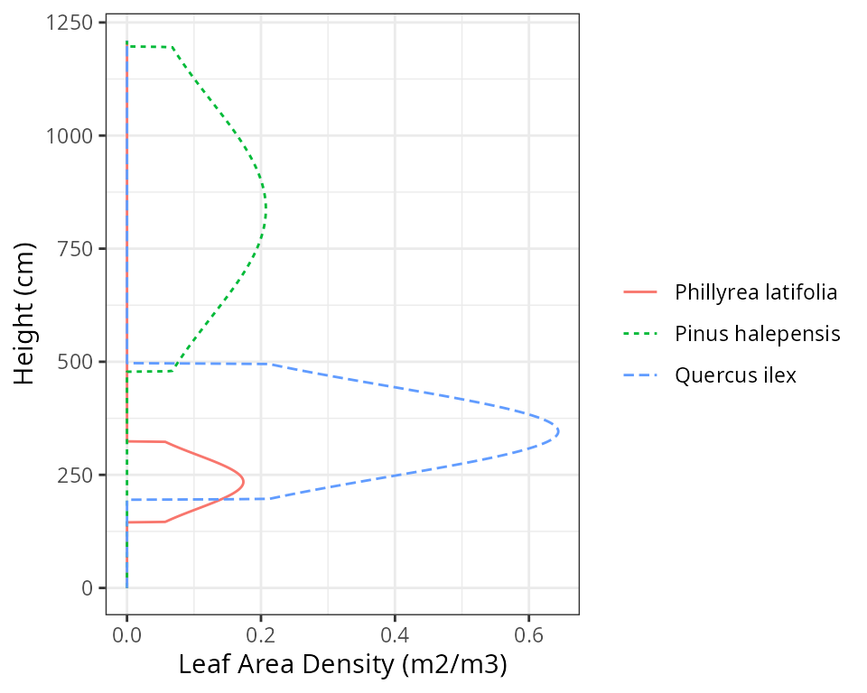

Regarding **belowground** information, the usuer should supply a matrix
describing for each plant cohort, the proportion of fine roots in each
soil layer. As before, we use internal function
[`forest2belowground()`](https://emf-creaf.github.io/medfate/reference/forest2aboveground.md)
on the object `fb_forest` to show how should the data look like:

``` r

fb_below <- forest2belowground(fb_forest, fb_soil, SpParamsFB)
fb_below
```

    ##                 1         2          3           4
    ## T1_2790 0.6505881 0.2719302 0.05418875 0.023292883
    ## T2_2851 0.7035917 0.2658370 0.02440189 0.006169504
    ## T3_3094 0.5075225 0.3714797 0.08507611 0.035921747

In our case, these proportions were implicitly specified in parameters
`Z50` and `Z95`. In fact, these values describe a continuous
distribution of fine roots along depth, which can be displayed using
function
[`vprofile_rootDistribution()`](https://emf-creaf.github.io/medfate/reference/vprofile_leafAreaDensity.md):

``` r

vprofile_rootDistribution(fb_forest, SpParamsFB, bySpecies = T)
```

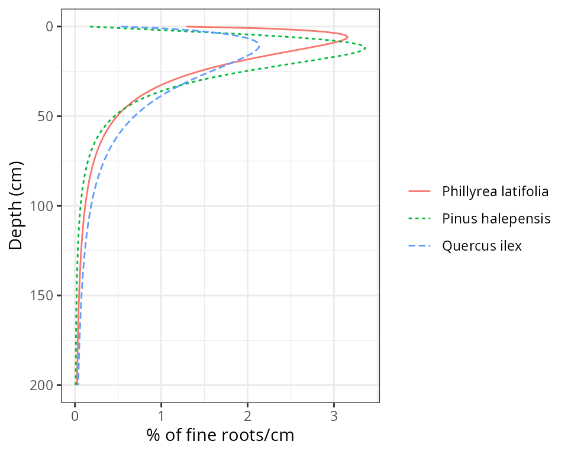

Note that in Font-Blanche we set that the root system of Aleppo pines
(*Pinus halepensis*) would be more superficial than that of the other
two species. Moreover, holm oak trees are the ones who extend their
roots down to deepest soil layers.

### Meteorology

Water balance simulations of function
[`spwb()`](https://emf-creaf.github.io/medfate/reference/spwb.md)
require **daily weather** inputs. The weather variables that are
required depend on the complexity of the soil water balance model we are
using. In the simplest case, only **mean temperature**,
**precipitation** and **potential evapo-transpiration (PET)** is
required, but the more complex simulation model also requires radiation,
wind speed, min/max temparature and relative humitidy. Here we already
have a data frame with the daily meteorology measured at Font-Blanche
for year 2014:

``` r

fb_meteo <- fb$meteoData
head(fb_meteo)
```

    ##        dates MeanTemperature MinTemperature MaxTemperature MeanRelativeHumidity
    ## 1 2014-01-01        7.661856       5.988889       8.960000             87.78224
    ## 2 2014-01-02        9.525431       7.958333      11.550000             96.40669
    ## 3 2014-01-03        9.482417       8.176111      11.762220             93.05705
    ## 4 2014-01-04       10.016813       6.313000      11.010000             96.31667
    ## 5 2014-01-05        6.619919       4.766000       9.060555             57.77938
    ## 6 2014-01-06        8.923008       6.793889      12.329440             64.40477
    ##   MinRelativeHumidity MaxRelativeHumidity WindSpeed Precipitation Radiation
    ## 1            80.37265            98.48404  2.317495      0.000000 1.5050178
    ## 2            84.22588           100.00000  2.407691      0.000000 2.6173102
    ## 3            79.93501           100.00000  1.950114      0.000000 3.9089762
    ## 4            90.14023           100.00000  3.596797      2.590674 0.4753025
    ## 5            48.92043            65.71329  7.310334      0.000000 8.6224570
    ## 6            51.31975            74.46718  2.301697      0.000000 6.7835715

Simulation models in `medfate` have been designed to work along with
data generated from package `meteoland` (De Cáceres et al. 2018), which
specifies conventions for variable names and units. The user is strongly
recommended to resort to this package to obtain suitable weather input
for soil water balance simulations (see
<http://emf-creaf.github.io/meteoland>).

### Simulation control

Apart from data inputs, the behavior of simulation models can be
controlled using a set of **global parameters**. The default global
parameter values are obtained using function
[`defaultControl()`](https://emf-creaf.github.io/medfate/reference/defaultControl.md):

``` r

fb_control <- defaultControl(transpirationMode = "Sureau")
fb_control$subdailyResults <- TRUE
```

Where the following changes are set to control parameters:

1.  Transpiration is set `transpirationMode = "Sureau"`, which implies a
    greater complexity of plant hydraulics and energy balance
    calculations.
2.  Subdaily results generated by the model are kept.

### Water balance input object

A last step is needed before calling simulation functions. It consists
in the compilation of all aboveground and belowground parameters and the
specification of additional parameter values for each plant cohort, such
as their light extinction coefficient or their response to drought. If
one has a `forest` object, the `spwbInput` object can be generated in
directly from it, avoiding the need to explicitly build `fb_above` and
`fb_below` data frames:

``` r

fb_x <- spwbInput(fb_forest, fb_soil, SpParamsFB, fb_control)
```

Different species parameter variables will be drawn from `SpParamsMED`
depending on the value of `transpirationMode`. For the simple water
balance model, relatively few parameters are needed. All the input
information for forest data and species parameter values can be
inspected by printing the input object.

Finally, note that one can play with plant-specific parameters for soil
water balance (instead of using species-level values) by using function
[`modifyCohortParams()`](https://emf-creaf.github.io/medfate/reference/modifyParams.md).

## Running the model

Function
[`spwb()`](https://emf-creaf.github.io/medfate/reference/spwb.md)
requires two main objects as input:

- A `spwbInput` object with forest and soil parameters (`fb_x` in our
  case).
- A data frame with daily meteorology for the study period (`fb_meteo`
  in our case).

Now we are ready to call function
[`spwb()`](https://emf-creaf.github.io/medfate/reference/spwb.md):

``` r

fb_SWB <- spwb(fb_x, fb_meteo, elevation = 420, latitude = 43.24083)
```

    ## Initial plant water content (mm): 35.1976
    ## Initial soil water content (mm): 213.886
    ## Initial snowpack content (mm): 0
    ## Performing daily simulations
    ## 
    ##  [Year 2014]:............
    ##  [Year 2015]:............
    ##  [Year 2016]:............
    ##  [Year 2017]:............
    ##  [Year 2018]:............
    ## 
    ## Final plant water content (mm): 34.6133
    ## Final soil water content (mm): 250.121
    ## Final snowpack content (mm): 0
    ## Change in plant water content (mm): -0.584299
    ## Plant water balance result (mm): -7.24589
    ## Change in soil water content (mm): 36.235
    ## Soil water balance result (mm): 36.235
    ## Change in snowpack water content (mm): 0
    ## Snowpack water balance result (mm): 0
    ## Water balance components:
    ##   Precipitation (mm) 3638 Rain (mm) 3638 Snow (mm) 1
    ##   Interception (mm) 569 Net rainfall (mm) 3069 Runon (mm) 0
    ##   Infiltration (mm) 2735 Infiltration excess (mm) 335 Saturation excess (mm) 422 Capillarity rise (mm) 0
    ##   Soil evaporation (mm) 130  Herbaceous transpiration (mm) 0  Woody plant transpiration (mm) 1217  Mistletoe transpiration (mm) 0
    ##   Plant extraction from soil (mm) 1209  Plant water balance (mm) -7 Hydraulic redistribution (mm) 74
    ##   Runoff (mm) 756 Deep drainage (mm) 937

Console output provides the water balance totals for the period
considered, which may span several years. The output of function
[`spwb()`](https://emf-creaf.github.io/medfate/reference/spwb.md) is an
object of class with the same name, actually a list:

``` r

class(fb_SWB)
```

    ## [1] "spwb" "list"

If we inspect its elements, we realize that there are several
components:

``` r

names(fb_SWB)
```

    ##  [1] "latitude"      "topography"    "weather"       "spwbInput"    
    ##  [5] "spwbOutput"    "WaterBalance"  "EnergyBalance" "Temperature"  
    ##  [9] "Soil"          "Snow"          "Stand"         "Plants"       
    ## [13] "SunlitLeaves"  "ShadeLeaves"   "subdaily"

For example, `WaterBalance` contains water balance components in form of
a data frame with days in rows:

``` r

head(fb_SWB$WaterBalance)
```

    ##                  PET Precipitation     Rain Snow   NetRain Snowmelt Runon
    ## 2014-01-01 0.6209989      0.000000 0.000000    0 0.0000000        0     0
    ## 2014-01-02 0.5671238      0.000000 0.000000    0 0.0000000        0     0
    ## 2014-01-03 0.5418115      0.000000 0.000000    0 0.0000000        0     0
    ## 2014-01-04 0.6072565      2.590674 2.590674    0 0.6850664        0     0
    ## 2014-01-05 2.0447148      0.000000 0.000000    0 0.0000000        0     0
    ## 2014-01-06 0.9330456      0.000000 0.000000    0 0.0000000        0     0
    ##            Infiltration InfiltrationExcess SaturationExcess Runoff DeepDrainage
    ## 2014-01-01    0.0000000                  0                0      0    0.0000000
    ## 2014-01-02    0.0000000                  0                0      0    0.0000000
    ## 2014-01-03    0.0000000                  0                0      0    0.0000000
    ## 2014-01-04    0.6850664                  0                0      0    0.1611078
    ## 2014-01-05    0.0000000                  0                0      0    0.0000000
    ## 2014-01-06    0.0000000                  0                0      0    0.0000000
    ##            CapillarityRise Evapotranspiration Interception SoilEvaporation
    ## 2014-01-01               0          0.2409107     0.000000       0.2151227
    ## 2014-01-02               0          0.2114911     0.000000       0.1964596
    ## 2014-01-03               0          0.2259221     0.000000       0.1876911
    ## 2014-01-04               0          2.0791665     1.905607       0.1735306
    ## 2014-01-05               0          0.6095844     0.000000       0.2715329
    ## 2014-01-06               0          0.4084490     0.000000       0.1505002
    ##            HerbTranspiration PlantExtraction Transpiration
    ## 2014-01-01                 0    0.0245690059  2.578802e-02
    ## 2014-01-02                 0    0.0150889547  1.503145e-02
    ## 2014-01-03                 0    0.0369622399  3.823104e-02
    ## 2014-01-04                 0   -0.0002648113  2.869237e-05
    ## 2014-01-05                 0    0.3217052550  3.380515e-01
    ## 2014-01-06                 0    0.2606914097  2.579488e-01
    ##            MistletoeTranspiration HydraulicRedistribution
    ## 2014-01-01                      0            0.0000000000
    ## 2014-01-02                      0            0.0006940889
    ## 2014-01-03                      0            0.0019030409
    ## 2014-01-04                      0            0.0056865010
    ## 2014-01-05                      0            0.0000000000
    ## 2014-01-06                      0            0.0000000000

## Comparing results with observations

Before examining the results of the model, it is important to compare
its predictions against observed data, if available. The following
observations are available from the experimental forest plot for year
2014:

- Stand total evapotranspiration estimated using an Eddy-covariance flux
  tower.
- Soil moisture content of the first 0-30 cm layer.
- Cohort transpiration estimates derived from sapflow measurements
  for Q. ilex and P. halepensis.
- Pre-dawn and midday leaf water potentials for Q. ilex and P.
  halepensis.

We first load the measured data into the workspace and filter for the
dates used in the simulation:

``` r

fb_observed <- fb$measuredData
fb_observed <- fb_observed[fb_observed$dates %in% fb_meteo$dates,]
row.names(fb_observed) <- fb_observed$dates
head(fb_observed)
```

    ##                 dates       SWC E_T2_2851 E_T2_2851_err E_T3_3094 E_T3_3094_err
    ## 2014-01-01 2014-01-01 0.5813407        NA            NA        NA            NA
    ## 2014-01-02 2014-01-02 0.6507478        NA            NA        NA            NA
    ## 2014-01-03 2014-01-03 0.6224243        NA            NA        NA            NA
    ## 2014-01-04 2014-01-04        NA        NA            NA        NA            NA
    ## 2014-01-05 2014-01-05 0.6285134        NA            NA        NA            NA
    ## 2014-01-06 2014-01-06 0.6035415        NA            NA        NA            NA
    ##            PD_T2_2851 PD_T2_2851_err PD_T3_3094 PD_T3_3094_err MD_T2_2851
    ## 2014-01-01         NA             NA         NA             NA         NA
    ## 2014-01-02         NA             NA         NA             NA         NA
    ## 2014-01-03         NA             NA         NA             NA         NA
    ## 2014-01-04         NA             NA         NA             NA         NA
    ## 2014-01-05         NA             NA         NA             NA         NA
    ## 2014-01-06         NA             NA         NA             NA         NA
    ##            MD_T2_2851_err MD_T3_3094 MD_T3_3094_err LE  H
    ## 2014-01-01             NA         NA             NA NA NA
    ## 2014-01-02             NA         NA             NA NA NA
    ## 2014-01-03             NA         NA             NA NA NA
    ## 2014-01-04             NA         NA             NA NA NA
    ## 2014-01-05             NA         NA             NA NA NA
    ## 2014-01-06             NA         NA             NA NA NA

### Stand evapotranspiration

Package `medfate` contains several functions to assist the evaluation of
model results. We can first compare the observed vs modelled latent
heat. We can plot the two time series:

``` r

evaluation_plot(fb_SWB, fb_observed, type = "LE", plotType="dynamics")+
  theme(legend.position = c(0.8,0.85))
```

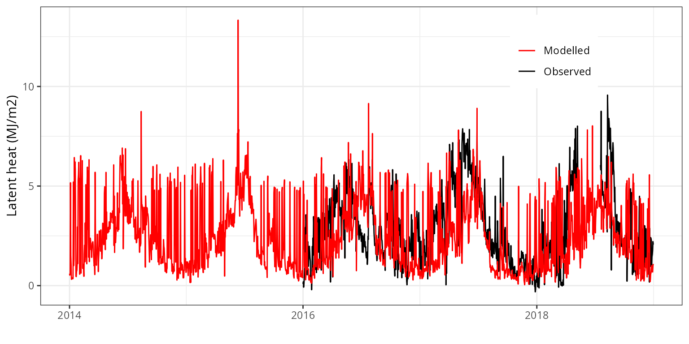

The relationship can be shown in a scatter plot:

``` r

evaluation_plot(fb_SWB, fb_observed, type = "LE", plotType="scatter")
```

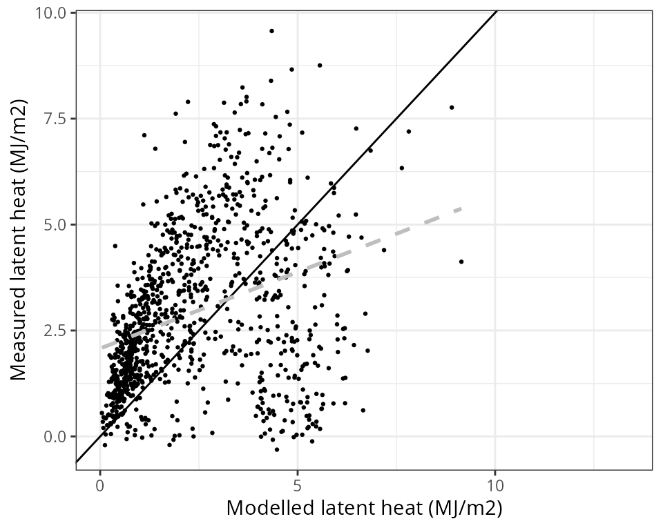 Where we see
that the model tends to underestimate total evapotranspiration during
seasons with low evaporative demand. Function
[`evaluation_stats()`](https://emf-creaf.github.io/medfate/reference/evaluation.md)
allows us to generate evaluation statistics:

``` r

evaluation_stats(fb_SWB, fb_observed, type = "LE")
```

    ##            n         Bias     Bias.rel          MAE      MAE.rel            r 
    ## 1026.0000000   -0.5616335  -19.1551891    1.7238650   58.7945017    0.3398818 
    ##          NSE      NSE.abs 
    ##   -0.3399039   -0.1396819

### Soil moisture

We can compare observed vs modelled soil moisture content in a similar
way as we did for total evapotranspiration:

``` r

evaluation_plot(fb_SWB, fb_observed, type = "SWC", plotType="dynamics")
```

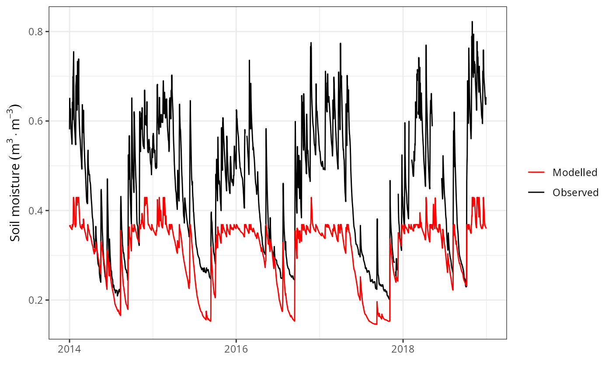

As before, we can generate a scatter plot:

``` r

evaluation_plot(fb_SWB, fb_observed, type = "SWC", plotType="scatter")
```

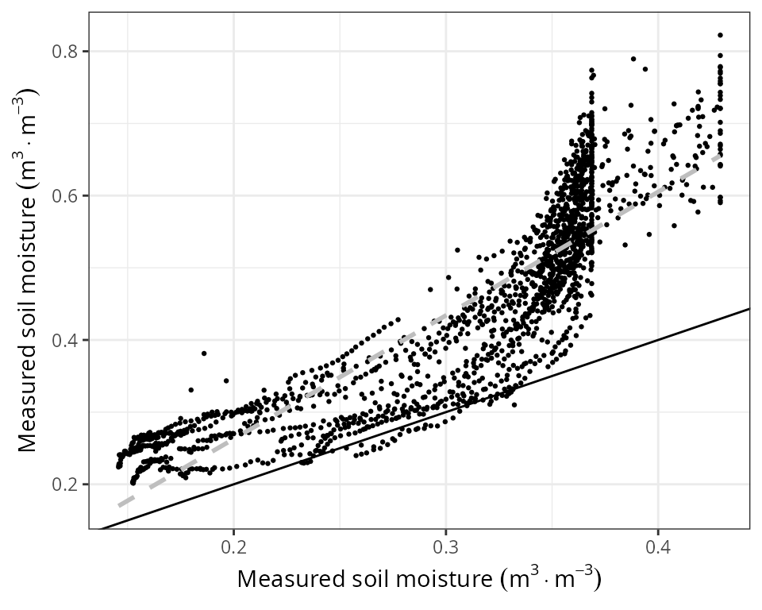

or examine evaluation statistics:

``` r

evaluation_stats(fb_SWB, fb_observed, type = "SWC")
```

    ##             n          Bias      Bias.rel           MAE       MAE.rel 
    ## 1760.00000000   -0.13888293  -31.16254356    0.13931074   31.25853723 
    ##             r           NSE       NSE.abs 
    ##    0.88028023   -0.25550299   -0.08994198

### Plant transpiration

The following plots display the observed and predicted transpiration
dynamics for *Pinus halepensis* and *Quercus ilex*:

``` r

g1<-evaluation_plot(fb_SWB, fb_observed, 
                            cohort = "T2_2851",
                            type="E", plotType = "dynamics")+
  theme(legend.position = c(0.85,0.83))
g2<-evaluation_plot(fb_SWB, fb_observed, 
                            cohort = "T3_3094",
                            type="E", plotType = "dynamics")+
  theme(legend.position = c(0.85,0.83))
plot_grid(g1, g2, ncol=1)
```

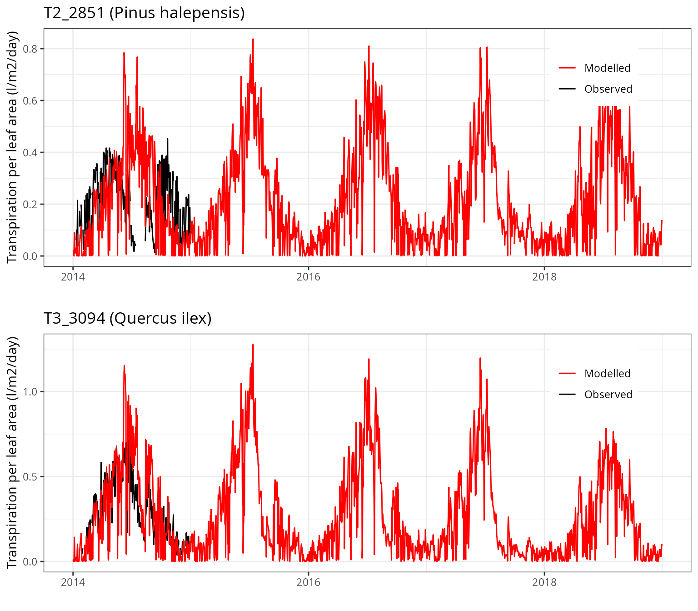

In general, the agreement is quite good, but the model seems to
overestimate the transpiration of *P. halepensis* in early summer and
after the first drought period. The transpiration of *Q. ilex* seems
also overestimated in spring and autumn. We can also inspect the
evaluation statistics for both species using:

``` r

evaluation_stats(fb_SWB, fb_observed, cohort = "T2_2851", type="E")
```

    ##             n          Bias      Bias.rel           MAE       MAE.rel 
    ## 300.000000000   0.002047195   0.995370418   0.142096636  69.089074063 
    ##             r           NSE       NSE.abs 
    ##   0.200199897  -1.511902775  -0.435959635

``` r

evaluation_stats(fb_SWB, fb_observed, cohort = "T3_3094", type="E")
```

    ##            n         Bias     Bias.rel          MAE      MAE.rel            r 
    ## 309.00000000   0.04496391  15.53379454   0.10894780  37.63847223   0.85048886 
    ##          NSE      NSE.abs 
    ##   0.16940236   0.25776153

### Leaf water potentials

Finally, we can compare observed with predicted water potentials. In
this case measurements are available for three dates, but they include
the standard deviation of several measurements.

``` r

g1<-evaluation_plot(fb_SWB, fb_observed, 
                            cohort = "T2_2851",
                            type="WP", plotType = "dynamics")+
  theme(legend.position = c(0.85,0.23))
g2<-evaluation_plot(fb_SWB, fb_observed, 
                            cohort = "T3_3094",
                            type="WP", plotType = "dynamics")+
  theme(legend.position = c(0.85,0.23))
plot_grid(g1, g2, ncol=1)
```

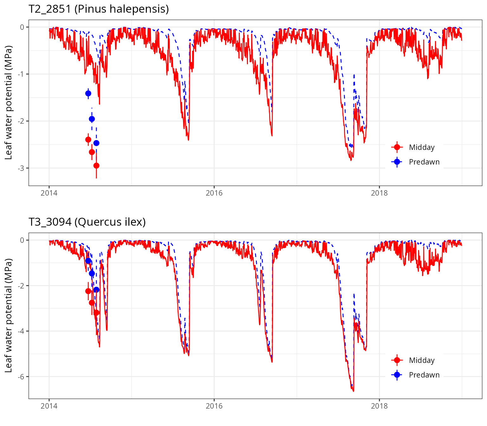

The model seems to overestimate water potentials (i.e. it predicts less
negative values than those observed) for P. halepensis during the
drought season.

## Drawing plots

Package `medfate` provides a simple `plot` function for objects of class
`spwb`. Here we will use this function to display the seasonal variation
predicted by the model, as well as the variation at higher temporal
resolution within four different selected 3-day periods that we define
here:

``` r

d1 = seq(as.Date("2014-03-01"), as.Date("2014-03-03"), by="day")
d2 = seq(as.Date("2014-06-01"), as.Date("2014-06-03"), by="day")
d3 = seq(as.Date("2014-08-01"), as.Date("2014-08-03"), by="day")
d4 = seq(as.Date("2014-10-01"), as.Date("2014-10-03"), by="day")
```

### Meteorological input and input/output water flows

Function [`plot()`](https://rdrr.io/r/graphics/plot.default.html) can be
used to show the meteorological input:

``` r

plot(fb_SWB, type = "PET_Precipitation")
```

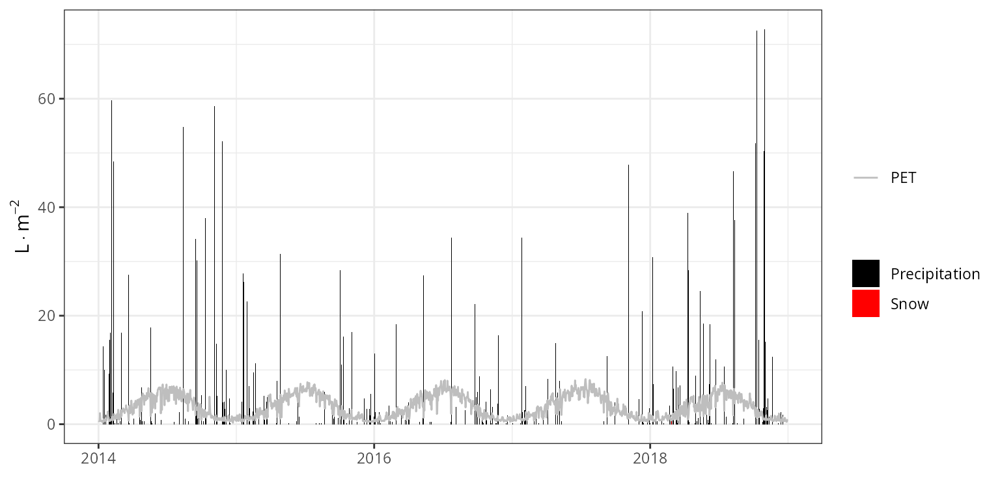 It is apparent
the climatic drought period between april and august 2014. This should
have an impact on soil moisture and plant stress.

If we are interested in forest hydrology, we can plot the amount of
water that the model predicts to leave the forest via surface runoff or
drainage to lower water compartments.

``` r

plot(fb_SWB, type = "Export")
```

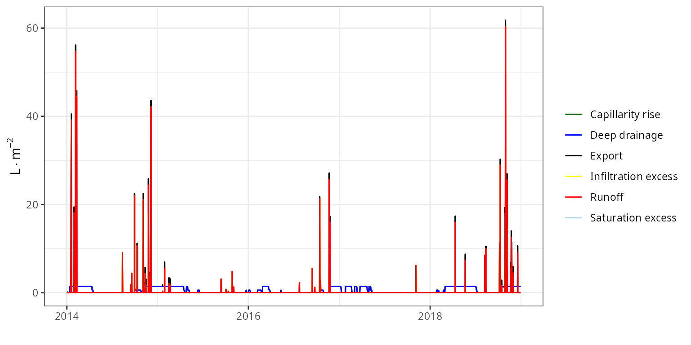 As expected,
water exported from the forest plot was only relevant for the autumn and
winter periods. Note also that the model predicts some runoff during
convective storms during autumn, whereas winter events occur when the
soil is already full, so that most exported water is assumed to be lost
via deep drainage. One can also display the evapotranspiration flows,
which we do in the following plot that also combines the two previous:

``` r

g1<-plot(fb_SWB)+scale_x_date(date_breaks = "1 month", date_labels = "%m")+theme(legend.position = "none")
g2<-plot(fb_SWB, "Evapotranspiration")+scale_x_date(date_breaks = "1 month", date_labels = "%m")+theme(legend.position = c(0.13,0.73))
g3<-plot(fb_SWB, "Export")+scale_x_date(date_breaks = "1 month", date_labels = "%m")+theme(legend.position = c(0.35,0.60))
plot_grid(g1,g2, g3, ncol=1, rel_heights = c(0.4,1,0.6))
```

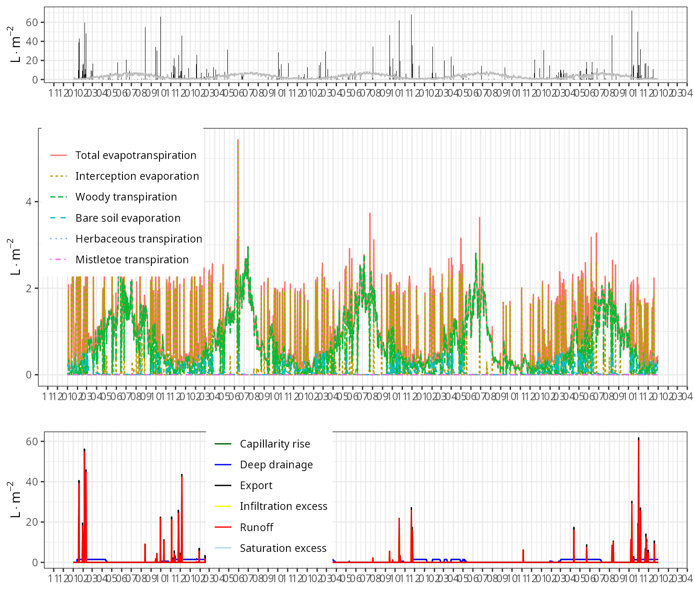

### Soil moisture dynamics and hydraulic redistribution

It is also useful to plot the dynamics of soil state variables by layer,
such as the percentage of moisture in relation to field capacity:

``` r

plot(fb_SWB, type="SoilTheta")
```

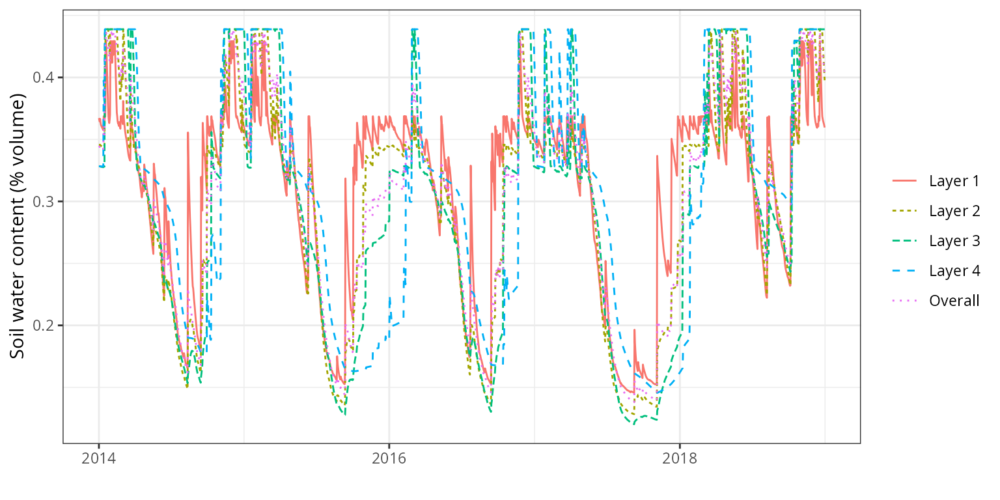 Note that the
model predicts soil drought to occur earlier in the season for the first
three layers (0-200 cm) whereas the bottom layer dries out much more
slowly. At this point is important to mention that the water balance
model incorporates. We can also display the dynamics of the
corresponding soil layer water potentials:

``` r

plot(fb_SWB, type="SoilPsi")
```

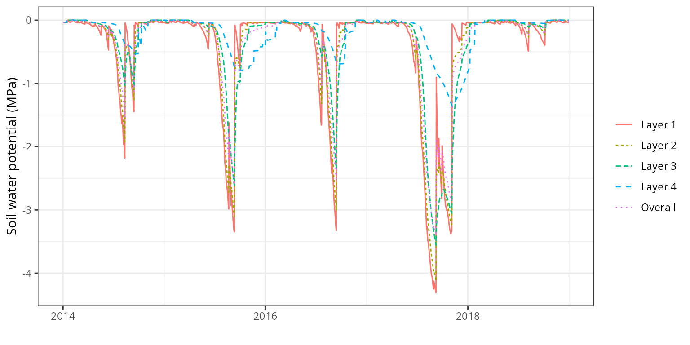 or draw a
composite plot including absolute soil water volume:

``` r

g1<-plot(fb_SWB)+scale_x_date(date_breaks = "1 month", date_labels = "%m")+theme(legend.position = "none")
g2<-plot(fb_SWB, "SoilVol")+scale_x_date(date_breaks = "1 month", date_labels = "%m")+theme(legend.position = c(0.08,0.65))
g3<-plot(fb_SWB, "SoilPsi")+scale_x_date(date_breaks = "1 month", date_labels = "%m")+theme(legend.position = c(0.08,0.5))
plot_grid(g1, g2,  g3, rel_heights = c(0.4,0.8,0.8), ncol=1)
```

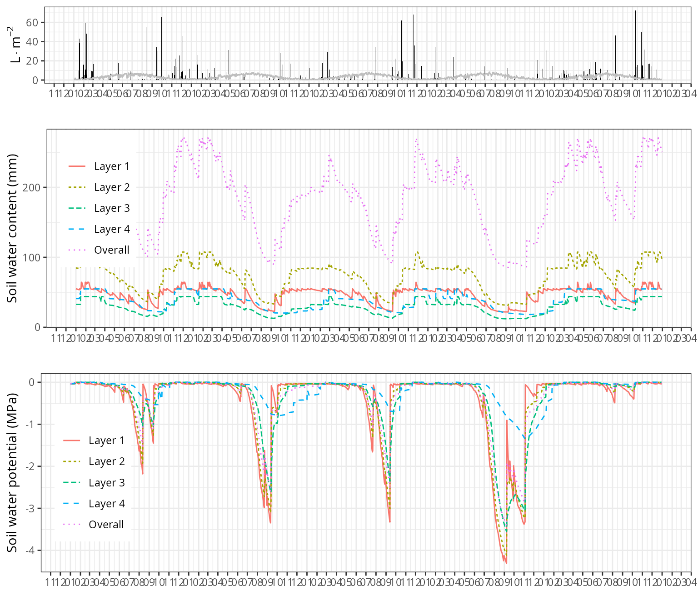

### Root water uptake and hydraulic redistribution

The following composite plot shows the daily root water uptake (or
release) from different soil layers, and the daily amount of water
entering soil layers due to hydraulic redistribution:

``` r

g1<-plot(fb_SWB, "SoilPsi")+scale_x_date(date_breaks = "1 month", date_labels = "%m")+theme(legend.position = "none")+ylab("Soil wp (MPa)")
g2<-plot(fb_SWB, "PlantExtraction")+scale_x_date(date_breaks = "1 month", date_labels = "%m")+theme(legend.position = c(0.08,0.68))
g3<-plot(fb_SWB, "HydraulicRedistribution")+scale_x_date(date_breaks = "1 month", date_labels = "%m")+theme(legend.position = c(0.08,0.5))
plot_grid(g1, g2,  g3, rel_heights = c(0.4,0.8,0.8), ncol=1)
```

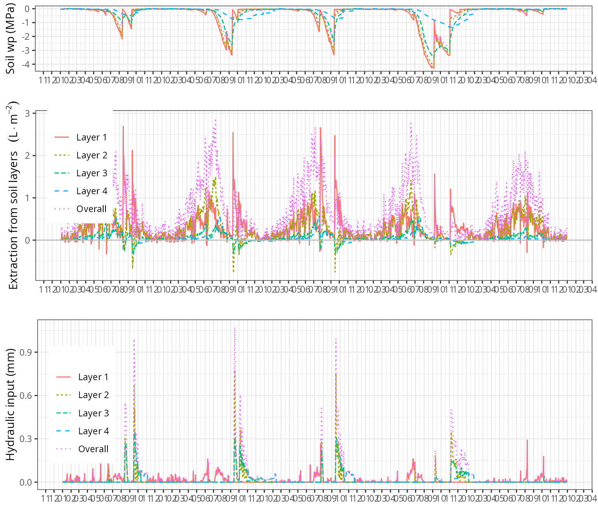

If we create a composite plot including subdaily water uptake/release
patterns, we can further understand the redistribution flows created by
the model during different periods:

``` r

g0<-plot(fb_SWB, "PlantExtraction")+scale_x_date(date_breaks = "1 month", date_labels = "%m")+theme(legend.position = c(0.08,0.68))
g1<-plot(fb_SWB, "PlantExtraction", subdaily = T, dates = d1)+scale_x_datetime(date_breaks = "1 day",  date_labels = "%m/%d")+theme(legend.position = "none")+ylim(c(-0.05,0.13))
g2<-plot(fb_SWB, "PlantExtraction", subdaily = T, dates = d2)+scale_x_datetime(date_breaks = "1 day",  date_labels = "%m/%d")+theme(legend.position = "none")+ylab("")+ylim(c(-0.05,0.13))
g3<-plot(fb_SWB, "PlantExtraction", subdaily = T, dates = d3)+scale_x_datetime(date_breaks = "1 day",  date_labels = "%m/%d")+theme(legend.position = "none")+ylab("")+ylim(c(-0.05,0.13))
g4<-plot(fb_SWB, "PlantExtraction", subdaily = T, dates = d4)+scale_x_datetime(date_breaks = "1 day",  date_labels = "%m/%d")+theme(legend.position = "none")+ylab("")+ylim(c(-0.05,0.13))
plot_grid(g0,plot_grid(g1, g2, g3, g4, ncol=4),ncol=1)
```

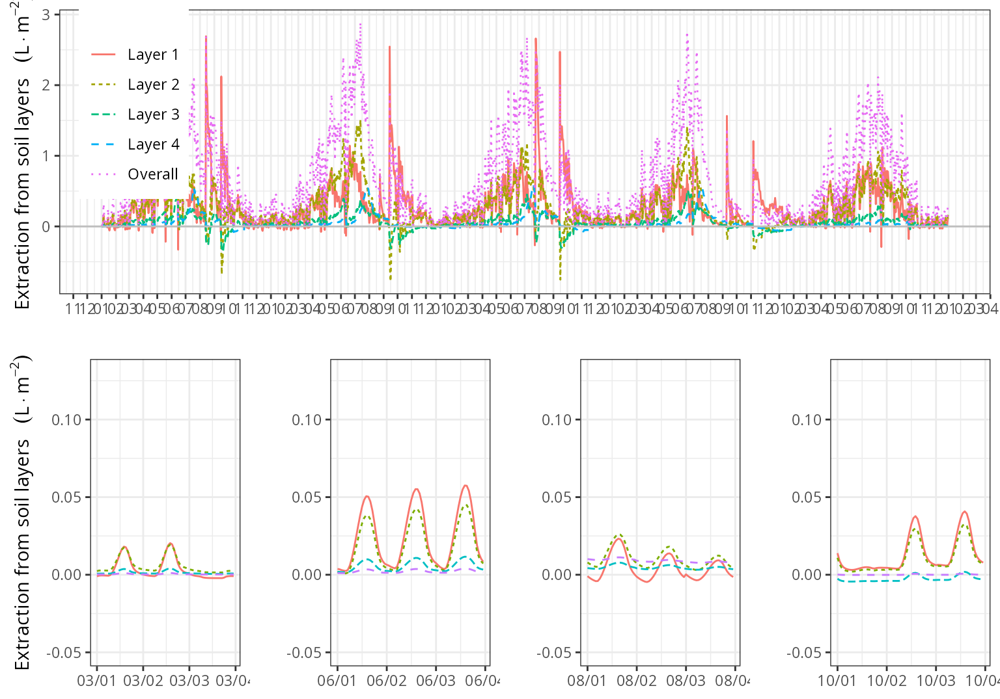

### Plant transpiration

We can use function
[`plot()`](https://rdrr.io/r/graphics/plot.default.html) to display the
seasonal dynamics of cohort-level variables, such as plant transpiration
per leaf area:

``` r

par(mar=c(5,5,1,1))
plot(fb_SWB, type="TranspirationPerLeaf", bySpecies = T)
```

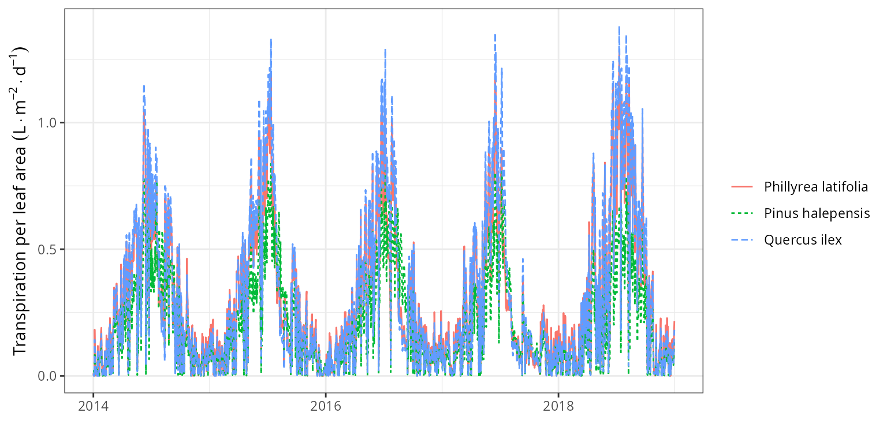 Where we can
observe that some species transpire more than others due to their
vertical position within the canopy.

``` r

g1<-plot(fb_SWB)+scale_x_date(date_breaks = "1 month", date_labels = "%m")+theme(legend.position = "none")
g2<-plot(fb_SWB, "TranspirationPerLeaf", bySpecies = T)+scale_x_date(date_breaks = "1 month", date_labels = "%m")+theme(legend.position = c(0.1,0.75))
g21<-plot(fb_SWB, "LeafTranspiration", subdaily = T, dates = d1)+scale_x_datetime(date_breaks = "1 day",  date_labels = "%m/%d")+theme(legend.position = "none")+ylim(c(0,0.32))
g22<-plot(fb_SWB, "LeafTranspiration", subdaily = T, dates = d2)+scale_x_datetime(date_breaks = "1 day",  date_labels = "%m/%d")+theme(legend.position = "none")+ylab("")+ylim(c(0,0.32))
g23<-plot(fb_SWB, "LeafTranspiration", subdaily = T, dates = d3)+scale_x_datetime(date_breaks = "1 day",  date_labels = "%m/%d")+theme(legend.position = "none")+ylab("")+ylim(c(0,0.32))
g24<-plot(fb_SWB, "LeafTranspiration", subdaily = T, dates = d4)+scale_x_datetime(date_breaks = "1 day",  date_labels = "%m/%d")+theme(legend.position = "none")+ylab("")+ylim(c(0,0.32))
plot_grid(g1, g2,  
          plot_grid(g21,g22,g23,g24, ncol=4), 
          ncol=1, rel_heights = c(0.4,0.8,0.8))
```

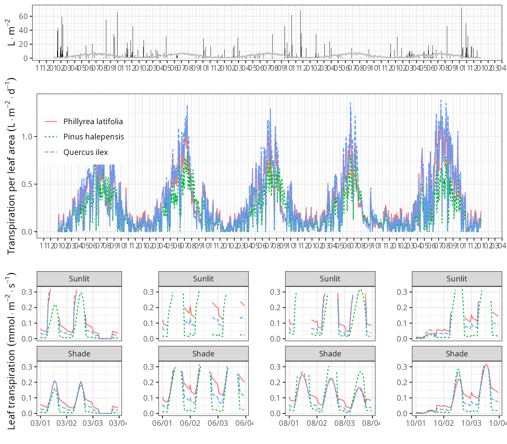

### Plant stress

In the model, reduction of (whole-plant) plant transpiration is what
used to define drought stress, which depends on the species identity:

``` r

plot(fb_SWB, type="PlantStress", bySpecies = T)
```

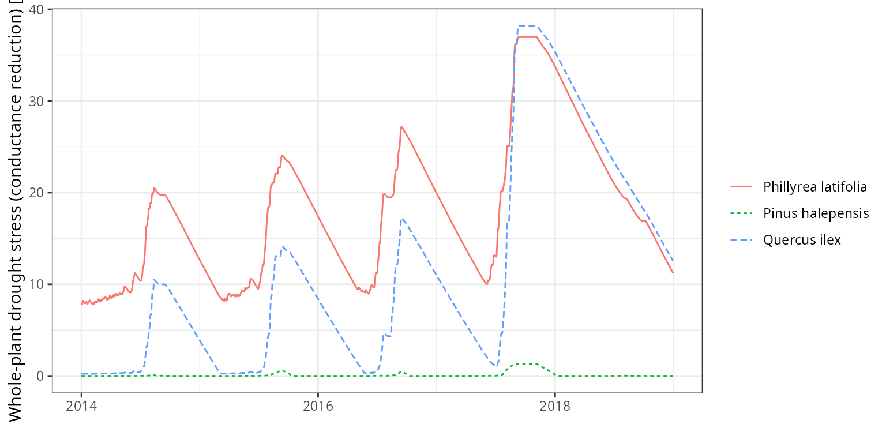

To examine the impact of drought on plants, one can inspect the
whole-plant conductance (from which the stress index is derived) or the
stem percent loss of conductance derived from embolism, as we do in the
following composite plot:

``` r

g1<-plot(fb_SWB)+scale_x_date(date_breaks = "1 month", date_labels = "%m")+theme(legend.position = "none")
g2<-plot(fb_SWB, "SoilPlantConductance", bySpecies = T)+scale_x_date(date_breaks = "1 month", date_labels = "%m")+
  ylab(expression(paste("Soil-plant conductance ",(mmol%.%m^{-2}%.%s^{-1}))))+
  theme(legend.position = "none")
g3<-plot(fb_SWB, "StemPLC", bySpecies = T)+scale_x_date(date_breaks = "1 month", date_labels = "%m")+theme(legend.position = c(0.2,0.75))
plot_grid(g1, g2,g3,                          
          ncol=1, rel_heights = c(0.4,0.8,0.8))
```

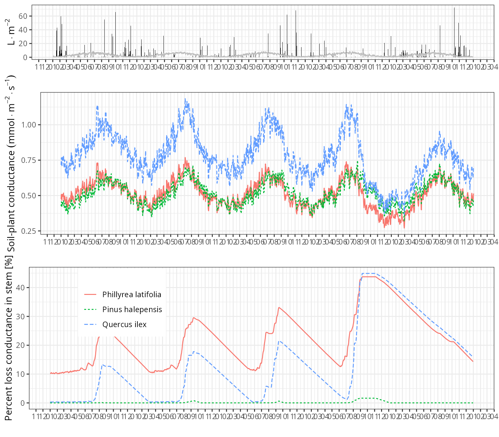

### Leaf water potentials

``` r

g1<-plot(fb_SWB)+scale_x_date(date_breaks = "1 month", date_labels = "%m")+theme(legend.position = "none")
g2<-plot(fb_SWB, "LeafPsiRange", bySpecies = T)+scale_x_date(date_breaks = "1 month", date_labels = "%m")+theme(legend.position = c(0.1,0.25)) + ylab("Leaf water potential (MPa)")
g21<-plot(fb_SWB, "LeafPsi", subdaily = T, dates = d1)+scale_x_datetime(date_breaks = "1 day",  date_labels = "%m/%d")+theme(legend.position = "none")+ylim(c(-7,0))
g22<-plot(fb_SWB, "LeafPsi", subdaily = T, dates = d2)+scale_x_datetime(date_breaks = "1 day",  date_labels = "%m/%d")+theme(legend.position = "none")+ylab("")+ylim(c(-7,0))
g23<-plot(fb_SWB, "LeafPsi", subdaily = T, dates = d3)+scale_x_datetime(date_breaks = "1 day",  date_labels = "%m/%d")+theme(legend.position = "none")+ylab("")+ylim(c(-7,0))
g24<-plot(fb_SWB, "LeafPsi", subdaily = T, dates = d4)+scale_x_datetime(date_breaks = "1 day",  date_labels = "%m/%d")+theme(legend.position = "none")+ylab("")+ylim(c(-7,0))
plot_grid(g1, g2,                          
          plot_grid(g21,g22,g23,g24, ncol=4), 
          ncol=1, rel_heights = c(0.4,0.8,0.8))
```

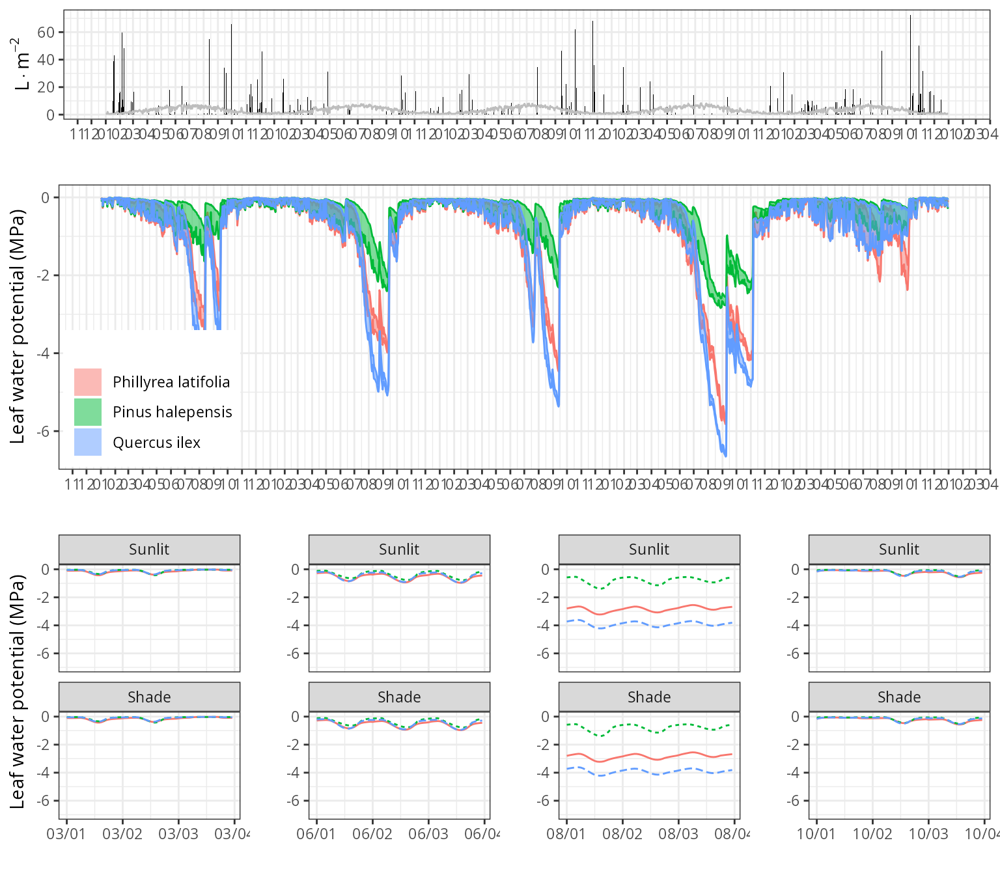

### Stomatal conductance

``` r

g1<-plot(fb_SWB)+scale_x_date(date_breaks = "1 month", date_labels = "%m")+theme(legend.position = "none")
g2<-plot(fb_SWB, "GSWMax_SL", bySpecies = T)+scale_x_date(date_breaks = "1 month", date_labels = "%m")+theme(legend.position = c(0.5,0.74))+ylab("Sunlit leaf stomatal conductance")+ylim(c(0,0.3))
g21<-plot(fb_SWB, "LeafStomatalConductance", subdaily = T, dates = d1)+scale_x_datetime(date_breaks = "1 day",  date_labels = "%m/%d")+theme(legend.position = "none")+ylim(c(0,0.2))
g22<-plot(fb_SWB, "LeafStomatalConductance", subdaily = T, dates = d2)+scale_x_datetime(date_breaks = "1 day",  date_labels = "%m/%d")+theme(legend.position = "none")+ylab("")+ylim(c(0,0.2))
g23<-plot(fb_SWB, "LeafStomatalConductance", subdaily = T, dates = d3)+scale_x_datetime(date_breaks = "1 day",  date_labels = "%m/%d")+theme(legend.position = "none")+ylab("")+ylim(c(0,0.2))
g24<-plot(fb_SWB, "LeafStomatalConductance", subdaily = T, dates = d4)+scale_x_datetime(date_breaks = "1 day",  date_labels = "%m/%d")+theme(legend.position = "none")+ylab("")+ylim(c(0,0.2))
plot_grid(g1, g2,
          plot_grid(g21,g22,g23,g24, ncol=4),
          ncol=1, rel_heights = c(0.4,0.8,0.8))
```

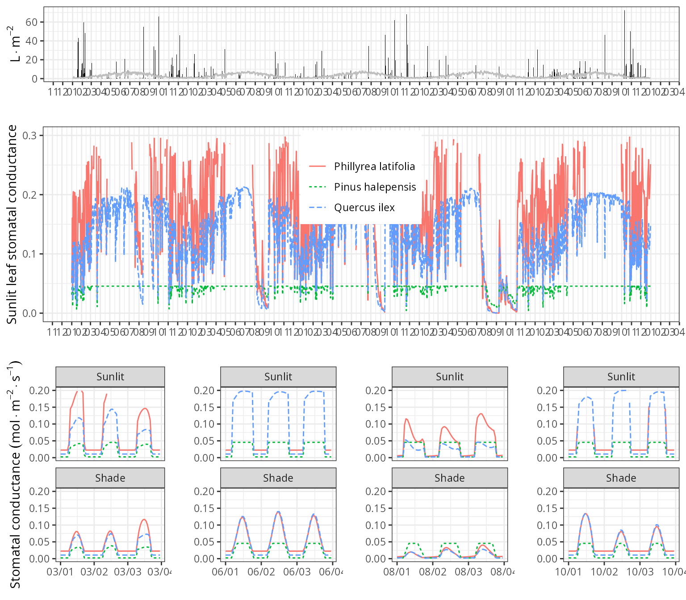

## Generating output summaries

While the water balance model operates at daily and sub-daily steps,
users will normally be interested in outputs at larger time scales. The
package provides a `summary` for objects of class `spwb`. This function
can be used to summarize the model’s output at different temporal steps
(i.e. weekly, monthly or annual). For example, to obtain the average
soil moisture and water potentials by months one can use:

``` r

summary(fb_SWB, freq="months",FUN=sum, output="WaterBalance")
```

    ##                  PET Precipitation      Rain Snow      NetRain Snowmelt Runon
    ## 2014-01-01  27.03414     205.04814 205.04814  0.0 182.21891719      0.0     0
    ## 2014-02-01  37.11592     181.09641 181.09641  0.0 154.86636937      0.0     0
    ## 2014-03-01  80.49737      44.61248  44.61248  0.0  39.82086699      0.0     0
    ## 2014-04-01 109.24874      15.00000  15.00000  0.0   7.20513388      0.0     0
    ## 2014-05-01 147.99639      21.60000  21.60000  0.0  16.29630901      0.0     0
    ## 2014-06-01 167.27898      33.60000  33.60000  0.0  25.81618817      0.0     0
    ## 2014-07-01 183.99299       0.60000   0.60000  0.0   0.14355482      0.0     0
    ## 2014-08-01 159.66330      60.40000  60.40000  0.0  52.82344138      0.0     0
    ## 2014-09-01 103.42793     137.60000 137.60000  0.0 125.88472902      0.0     0
    ## 2014-10-01  63.53896      50.60000  50.60000  0.0  41.91877773      0.0     0
    ## 2014-11-01  30.12083     222.60000 222.60000  0.0 198.02957497      0.0     0
    ## 2014-12-01  26.01617      93.00000  93.00000  0.0  78.71452980      0.0     0
    ## 2015-01-01  33.33412      97.40000  97.40000  0.0  86.41561059      0.0     0
    ## 2015-02-01  38.17936      67.60000  67.60000  0.0  47.45225601      0.0     0
    ## 2015-03-01  78.27482      53.00000  53.00000  0.0  36.74376488      0.0     0
    ## 2015-04-01 109.20859      41.20000  41.20000  0.0  35.27399383      0.0     0
    ## 2015-05-01 157.73664       0.80000   0.80000  0.0   0.19736142      0.0     0
    ## 2015-06-01 176.08186      71.80000  71.80000  0.0  58.25297616      0.0     0
    ## 2015-07-01 199.29900       0.20000   0.20000  0.0   0.04934036      0.0     0
    ## 2015-08-01 158.13941       6.40000   6.40000  0.0   4.16752532      0.0     0
    ## 2015-09-01 107.67144      50.40000  50.40000  0.0  41.03901161      0.0     0
    ## 2015-10-01  54.97221      94.00000  94.00000  0.0  79.00852468      0.0     0
    ## 2015-11-01  40.87647      32.20000  32.20000  0.0  26.16199654      0.0     0
    ## 2015-12-01  18.36149      23.80000  23.80000  0.0  12.52682515      0.0     0
    ## 2016-01-01  25.98382      21.40000  21.40000  0.0  13.12184713      0.0     0
    ## 2016-02-01  42.43210      87.80000  87.80000  0.0  74.31542761      0.0     0
    ## 2016-03-01  72.70349      19.40000  19.40000  0.0  11.66632551      0.0     0
    ## 2016-04-01 110.36442      13.00000  13.00000  0.0   5.24667046      0.0     0
    ## 2016-05-01 151.45145      50.20000  50.20000  0.0  37.50633432      0.0     0
    ## 2016-06-01 168.69569       8.20000   8.20000  0.0   5.52838070      0.0     0
    ## 2016-07-01 194.66192      41.40000  41.40000  0.0  36.33017379      0.0     0
    ## 2016-08-01 167.03376       6.00000   6.00000  0.0   2.07639110      0.0     0
    ## 2016-09-01 113.75042      87.40000  87.40000  0.0  79.11683494      0.0     0
    ## 2016-10-01  59.38548     109.80000 109.80000  0.0  95.78270501      0.0     0
    ## 2016-11-01  31.62855     154.40000 154.40000  0.0 140.16194121      0.0     0
    ## 2016-12-01  25.74714      16.60000  16.60000  0.0  13.13348304      0.0     0
    ## 2017-01-01  30.97017      51.20000  51.20000  0.0  40.78581355      0.0     0
    ## 2017-02-01  39.00523      27.20000  27.20000  0.0  13.27360779      0.0     0
    ## 2017-03-01  75.39796      59.00000  59.00000  0.0  48.82356439      0.0     0
    ## 2017-04-01 115.11745      71.00000  71.00000  0.0  59.69566089      0.0     0
    ## 2017-05-01 148.68280      21.20000  21.20000  0.0  13.29581895      0.0     0
    ## 2017-06-01 178.51316      14.20000  14.20000  0.0  11.11110321      0.0     0
    ## 2017-07-01 200.88791       0.60000   0.60000  0.0   0.15684688      0.0     0
    ## 2017-08-01 171.08660       1.40000   1.40000  0.0   0.39061697      0.0     0
    ## 2017-09-01 109.87609      19.80000  19.80000  0.0  14.94932947      0.0     0
    ## 2017-10-01  75.77870       0.40000   0.40000  0.0   0.13620949      0.0     0
    ## 2017-11-01  40.14167      48.00000  48.00000  0.0  45.86640164      0.0     0
    ## 2017-12-01  26.10486      57.40000  57.40000  0.0  45.75251497      0.0     0
    ## 2018-01-01  34.17212      68.60000  68.60000  0.0  59.15452607      0.0     0
    ## 2018-02-01  32.99313      27.60000  27.00000  0.6  16.14493127      0.0     0
    ## 2018-03-01  65.00212     105.60000 105.60000  0.0  86.90143482      0.6     0
    ## 2018-04-01 106.80480      89.40000  89.40000  0.0  80.60576075      0.0     0
    ## 2018-05-01 110.14567     101.20000 101.20000  0.0  82.63457302      0.0     0
    ## 2018-06-01 149.84895      51.60000  51.60000  0.0  38.41439386      0.0     0
    ## 2018-07-01 188.24784      12.00000  12.00000  0.0   9.39517013      0.0     0
    ## 2018-08-01 161.32739      89.00000  89.00000  0.0  82.53875484      0.0     0
    ## 2018-09-01 113.71008       1.00000   1.00000  0.0   0.34052418      0.0     0
    ## 2018-10-01  61.59182     299.40000 299.40000  0.0 279.79595189      0.0     0
    ## 2018-11-01  28.64739     153.00000 153.00000  0.0 131.95508802      0.0     0
    ## 2018-12-01  25.83913      48.20000  48.20000  0.0  41.81933091      0.0     0
    ##            Infiltration InfiltrationExcess SaturationExcess     Runoff
    ## 2014-01-01 182.21891719           0.000000        90.324915  90.324915
    ## 2014-02-01 154.86636937           0.000000       122.585230 122.585230
    ## 2014-03-01  39.82086699           0.000000         0.000000   0.000000
    ## 2014-04-01   7.20513388           0.000000         0.000000   0.000000
    ## 2014-05-01  16.29630901           0.000000         0.000000   0.000000
    ## 2014-06-01  25.81618817           0.000000         0.000000   0.000000
    ## 2014-07-01   0.14355482           0.000000         0.000000   0.000000
    ## 2014-08-01  43.75483791           9.068603         0.000000   9.068603
    ## 2014-09-01  97.76173052          28.122998         0.000000  28.122998
    ## 2014-10-01  31.28062836          10.638149         0.000000  10.638149
    ## 2014-11-01 144.88017338          53.149402        20.747025  73.896427
    ## 2014-12-01  78.71452980           0.000000        55.150218  55.150218
    ## 2015-01-01  86.41561059           0.000000         5.900124   5.900124
    ## 2015-02-01  47.45225601           0.000000         3.726284   3.726284
    ## 2015-03-01  36.74376488           0.000000         0.000000   0.000000
    ## 2015-04-01  35.27399383           0.000000         0.000000   0.000000
    ## 2015-05-01   0.19736142           0.000000         0.000000   0.000000
    ## 2015-06-01  58.25297616           0.000000         0.000000   0.000000
    ## 2015-07-01   0.04934036           0.000000         0.000000   0.000000
    ## 2015-08-01   4.16752532           0.000000         0.000000   0.000000
    ## 2015-09-01  37.93403631           3.104975         0.000000   3.104975
    ## 2015-10-01  73.06646614           5.942059         0.000000   5.942059
    ## 2015-11-01  24.84282990           1.319167         0.000000   1.319167
    ## 2015-12-01  12.52682515           0.000000         0.000000   0.000000
    ## 2016-01-01  13.12184713           0.000000         0.000000   0.000000
    ## 2016-02-01  74.31542761           0.000000         0.000000   0.000000
    ## 2016-03-01  11.66632551           0.000000         0.000000   0.000000
    ## 2016-04-01   5.24667046           0.000000         0.000000   0.000000
    ## 2016-05-01  37.50633432           0.000000         0.000000   0.000000
    ## 2016-06-01   5.52838070           0.000000         0.000000   0.000000
    ## 2016-07-01  34.04850880           2.281665         0.000000   2.281665
    ## 2016-08-01   2.07639110           0.000000         0.000000   0.000000
    ## 2016-09-01  72.33884216           6.777993         0.000000   6.777993
    ## 2016-10-01  71.61494472          24.167760         0.000000  24.167760
    ## 2016-11-01  97.98263167          42.179310         9.042271  51.221581
    ## 2016-12-01  13.13348304           0.000000         0.000000   0.000000
    ## 2017-01-01  40.78581355           0.000000         0.000000   0.000000
    ## 2017-02-01  13.27360779           0.000000         0.000000   0.000000
    ## 2017-03-01  48.82356439           0.000000         0.000000   0.000000
    ## 2017-04-01  59.69566089           0.000000         0.000000   0.000000
    ## 2017-05-01  13.29581895           0.000000         0.000000   0.000000
    ## 2017-06-01  11.11110321           0.000000         0.000000   0.000000
    ## 2017-07-01   0.15684688           0.000000         0.000000   0.000000
    ## 2017-08-01   0.39061697           0.000000         0.000000   0.000000
    ## 2017-09-01  14.94932947           0.000000         0.000000   0.000000
    ## 2017-10-01   0.13620949           0.000000         0.000000   0.000000
    ## 2017-11-01  39.66959422           6.196807         0.000000   6.196807
    ## 2017-12-01  45.75251497           0.000000         0.000000   0.000000
    ## 2018-01-01  59.15452607           0.000000         0.000000   0.000000
    ## 2018-02-01  16.14493127           0.000000         0.000000   0.000000
    ## 2018-03-01  87.50143482           0.000000         0.000000   0.000000
    ## 2018-04-01  80.60576075           0.000000        15.951971  15.951971
    ## 2018-05-01  82.63457302           0.000000         7.325660   7.325660
    ## 2018-06-01  38.41439386           0.000000         0.000000   0.000000
    ## 2018-07-01   9.39517013           0.000000         0.000000   0.000000
    ## 2018-08-01  64.03475750          18.503997         0.000000  18.503997
    ## 2018-09-01   0.34052418           0.000000         0.000000   0.000000
    ## 2018-10-01 188.44982892          91.346123        29.249058 120.595181
    ## 2018-11-01 100.11122637          31.843862        52.469303  84.313165
    ## 2018-12-01  41.81933091           0.000000         9.206655   9.206655
    ##            DeepDrainage CapillarityRise Evapotranspiration Interception
    ## 2014-01-01   27.4042891               0          30.576545   22.8292233
    ## 2014-02-01   40.1478462               0          34.206390   26.2300389
    ## 2014-03-01   44.4494011               0          25.569636    4.7916094
    ## 2014-04-01   19.4112968               0          31.119618    7.7948661
    ## 2014-05-01    0.0000000               0          40.415140    5.3036910
    ## 2014-06-01    0.0000000               0          57.344445    7.7838118
    ## 2014-07-01    0.0000000               0          44.833652    0.4564452
    ## 2014-08-01    0.0000000               0          42.360325    7.5765586
    ## 2014-09-01    0.5718093               0          36.117711   11.7152700
    ## 2014-10-01   13.4822347               0          24.958619    8.6812223
    ## 2014-11-01   38.7139945               0          32.867027   24.5704250
    ## 2014-12-01   44.4494011               0          22.067213   14.2854702
    ## 2015-01-01   44.4296362               0          19.952199   10.9843894
    ## 2015-02-01   40.1478462               0          28.221342   20.1477440
    ## 2015-03-01   44.4494011               0          35.809493   16.2562351
    ## 2015-04-01   29.6018774               0          30.724609    5.9260062
    ## 2015-05-01    5.9168323               0          41.777876    0.6026386
    ## 2015-06-01    3.5488203               0          64.509124   13.5470228
    ## 2015-07-01    0.0000000               0          63.814042    0.1506596
    ## 2015-08-01    0.0000000               0          26.128100    2.2324747
    ## 2015-09-01    0.0000000               0          27.667688    9.3609884
    ## 2015-10-01    0.0000000               0          27.282540   14.9914743
    ## 2015-11-01    0.0000000               0          17.955164    6.0380035
    ## 2015-12-01    1.0162611               0          17.425109   11.2731749
    ## 2016-01-01    3.8714483               0          14.590527    8.2781529
    ## 2016-02-01   13.2097174               0          24.281434   13.4845724
    ## 2016-03-01   34.9687228               0          22.551824    7.7336745
    ## 2016-04-01    0.0000000               0          29.817515    7.7533295
    ## 2016-05-01    0.9097488               0          46.781090   12.6936657
    ## 2016-06-01    0.0000000               0          48.648678    2.6716193
    ## 2016-07-01    0.0000000               0          60.092612    5.0698262
    ## 2016-08-01    0.0000000               0          40.689841    3.9236089
    ## 2016-09-01    0.0000000               0          28.340244    8.2831651
    ## 2016-10-01    7.0584299               0          30.714388   14.0172950
    ## 2016-11-01   14.3385165               0          22.809023   14.2380588
    ## 2016-12-01   44.4494011               0          13.916082    3.4665170
    ## 2017-01-01   19.3227045               0          18.066395   10.4141864
    ## 2017-02-01   26.9895458               0          23.909028   13.9263922
    ## 2017-03-01   23.2227347               0          28.902308   10.1764356
    ## 2017-04-01   34.4285840               0          37.464957   11.3043391
    ## 2017-05-01   11.1460790               0          46.682443    7.9041811
    ## 2017-06-01    0.0000000               0          53.692326    3.0888968
    ## 2017-07-01    0.0000000               0          46.456526    0.4431531
    ## 2017-08-01    0.0000000               0          13.184473    1.0093830
    ## 2017-09-01    0.0000000               0          13.789566    4.8506705
    ## 2017-10-01    0.0000000               0           6.231332    0.2637905
    ## 2017-11-01    0.0000000               0           8.903519    2.1335984
    ## 2017-12-01    0.0000000               0          16.536741   11.6474850
    ## 2018-01-01    2.8590464               0          17.953355    9.4454739
    ## 2018-02-01    3.4464629               0          18.983473   10.8550687
    ## 2018-03-01   43.0334827               0          33.237458   18.6985652
    ## 2018-04-01   43.0155495               0          30.644047    8.7942393
    ## 2018-05-01   44.4494011               0          40.201757   18.5654270
    ## 2018-06-01   43.0155495               0          46.534929   13.1856061
    ## 2018-07-01    8.2953196               0          50.693433    2.6048299
    ## 2018-08-01    0.7630943               0          50.604930    6.4612452
    ## 2018-09-01    0.0000000               0          28.341969    0.6594758
    ## 2018-10-01   29.3073977               0          36.823159   19.6040481
    ## 2018-11-01   43.0155495               0          25.674263   21.0449120
    ## 2018-12-01   44.4494011               0          15.090275    6.3806691
    ##            SoilEvaporation HerbTranspiration PlantExtraction Transpiration
    ## 2014-01-01     4.392466754                 0        3.337293      3.354855
    ## 2014-02-01     3.185606064                 0        4.753489      4.790745
    ## 2014-03-01     3.385089390                 0       17.300658     17.392937
    ## 2014-04-01     0.614720430                 0       22.600162     22.710031
    ## 2014-05-01     0.422436992                 0       34.574736     34.689012
    ## 2014-06-01     0.323238523                 0       48.975880     49.237395
    ## 2014-07-01     0.148710726                 0       42.863141     44.228496
    ## 2014-08-01     0.461788749                 0       34.623732     34.321977
    ## 2014-09-01     0.813926872                 0       23.928832     23.588514
    ## 2014-10-01     3.396671438                 0       12.907385     12.880725
    ## 2014-11-01     3.807240562                 0        4.509253      4.489362
    ## 2014-12-01     3.319813583                 0        4.447267      4.461929
    ## 2015-01-01     2.474407248                 0        6.494064      6.493402
    ## 2015-02-01     2.735234465                 0        5.330482      5.338363
    ## 2015-03-01     5.902021452                 0       13.573157     13.651237
    ## 2015-04-01     1.276026356                 0       23.431816     23.522577
    ## 2015-05-01     0.565448566                 0       40.425750     40.609789
    ## 2015-06-01     2.044835163                 0       48.827468     48.917266
    ## 2015-07-01     0.158269815                 0       62.193369     63.505113
    ## 2015-08-01     0.056732663                 0       22.686036     23.838893
    ## 2015-09-01     0.156085606                 0       19.246902     18.150614
    ## 2015-10-01     2.141525583                 0       10.457808     10.149540
    ## 2015-11-01     3.134202238                 0        8.782430      8.782958
    ## 2015-12-01     3.487708634                 0        2.677265      2.664225
    ## 2016-01-01     2.984230157                 0        3.319804      3.328144
    ## 2016-02-01     4.307905809                 0        6.487444      6.488956
    ## 2016-03-01     2.598112137                 0       12.197193     12.220037
    ## 2016-04-01     0.708295543                 0       21.319522     21.355890
    ## 2016-05-01     1.337115378                 0       32.703311     32.750309
    ## 2016-06-01     0.358526588                 0       45.328809     45.618532
    ## 2016-07-01     0.212670684                 0       54.443099     54.810115
    ## 2016-08-01     0.095068304                 0       35.085145     36.671164
    ## 2016-09-01     1.169902281                 0       19.773229     18.887177
    ## 2016-10-01     4.073688949                 0       12.651780     12.623404
    ## 2016-11-01     3.036593079                 0        5.547361      5.534371
    ## 2016-12-01     3.507741204                 0        6.921697      6.941824
    ## 2017-01-01     2.448963274                 0        5.210268      5.203246
    ## 2017-02-01     3.932142731                 0        6.041859      6.050493
    ## 2017-03-01     3.838070317                 0       14.857139     14.887802
    ## 2017-04-01     2.880423557                 0       23.270082     23.280194
    ## 2017-05-01     2.980264036                 0       35.700143     35.797997
    ## 2017-06-01     0.192984664                 0       50.151504     50.410445
    ## 2017-07-01     0.098583534                 0       44.095018     45.914790
    ## 2017-08-01     0.006731428                 0       10.657665     12.168359
    ## 2017-09-01     0.045729712                 0        9.244940      8.893166
    ## 2017-10-01     0.033858191                 0        5.767158      5.933683
    ## 2017-11-01     0.282664141                 0        7.210078      6.487257
    ## 2017-12-01     1.658471070                 0        3.315714      3.230785
    ## 2018-01-01     3.842344748                 0        4.679999      4.665536
    ## 2018-02-01     4.563879725                 0        3.561081      3.564525
    ## 2018-03-01     7.247861370                 0        7.278031      7.291031
    ## 2018-04-01     2.212255359                 0       19.616028     19.637553
    ## 2018-05-01     4.791492501                 0       16.834604     16.844838
    ## 2018-06-01     2.918413377                 0       30.366837     30.430909
    ## 2018-07-01     0.350559000                 0       47.623662     47.738044
    ## 2018-08-01     1.681296518                 0       42.476008     42.462389
    ## 2018-09-01     0.253641877                 0       27.332191     27.428851
    ## 2018-10-01     5.736599104                 0       11.565937     11.482512
    ## 2018-11-01     1.566168594                 0        3.060205      3.063182
    ## 2018-12-01     4.005883666                 0        4.682379      4.703723
    ##            MistletoeTranspiration HydraulicRedistribution
    ## 2014-01-01                      0             0.311699537
    ## 2014-02-01                      0             0.316548263
    ## 2014-03-01                      0             0.162191210
    ## 2014-04-01                      0             0.279468245
    ## 2014-05-01                      0             0.329388152
    ## 2014-06-01                      0             1.003465101
    ## 2014-07-01                      0             1.054253551
    ## 2014-08-01                      0             4.115644527
    ## 2014-09-01                      0             5.932156667
    ## 2014-10-01                      0             1.900081967
    ## 2014-11-01                      0             0.515760747
    ## 2014-12-01                      0             0.383514154
    ## 2015-01-01                      0             0.205141905
    ## 2015-02-01                      0             0.404637774
    ## 2015-03-01                      0             0.237076405
    ## 2015-04-01                      0             0.170308303
    ## 2015-05-01                      0             0.373437322
    ## 2015-06-01                      0             0.988884314
    ## 2015-07-01                      0             1.759715373
    ## 2015-08-01                      0             0.639431711
    ## 2015-09-01                      0             5.736004717
    ## 2015-10-01                      0             6.357917229
    ## 2015-11-01                      0             0.983109040
    ## 2015-12-01                      0             0.800019681
    ## 2016-01-01                      0             0.589714744
    ## 2016-02-01                      0             0.470284347
    ## 2016-03-01                      0             0.063797059
    ## 2016-04-01                      0             0.052573141
    ## 2016-05-01                      0             0.173020594
    ## 2016-06-01                      0             0.312093683
    ## 2016-07-01                      0             3.921409407
    ## 2016-08-01                      0             0.230720525
    ## 2016-09-01                      0             6.898091436
    ## 2016-10-01                      0             3.065666796
    ## 2016-11-01                      0             1.241373783
    ## 2016-12-01                      0             0.166891643
    ## 2017-01-01                      0             0.078766230
    ## 2017-02-01                      0             0.074142728
    ## 2017-03-01                      0             0.056003570
    ## 2017-04-01                      0             0.125160050
    ## 2017-05-01                      0             0.016036840
    ## 2017-06-01                      0             2.436530994
    ## 2017-07-01                      0             0.814139793
    ## 2017-08-01                      0             0.003743454
    ## 2017-09-01                      0             0.943151316
    ## 2017-10-01                      0             0.088048165
    ## 2017-11-01                      0             7.474750112
    ## 2017-12-01                      0             4.901749711
    ## 2018-01-01                      0             2.035625845
    ## 2018-02-01                      0             0.033025112
    ## 2018-03-01                      0             0.056659233
    ## 2018-04-01                      0             0.105203394
    ## 2018-05-01                      0             0.058512147
    ## 2018-06-01                      0             0.035562582
    ## 2018-07-01                      0             0.206563658
    ## 2018-08-01                      0             0.644983556
    ## 2018-09-01                      0             0.644337559
    ## 2018-10-01                      0             0.658231610
    ## 2018-11-01                      0             0.175720372
    ## 2018-12-01                      0             0.248090929

Parameter `output` is used to indicate the element of the `spwb` object
for which we desire summaries. Similarly, it is possible to calculate
the average stress of the three tree species by months:

``` r

summary(fb_SWB, freq="months",FUN=mean, output="PlantStress", bySpecies = TRUE)
```

    ##            Phillyrea latifolia Pinus halepensis Quercus ilex
    ## 2014-01-01          0.08025025     0.0001081547  0.002362212
    ## 2014-02-01          0.08065017     0.0001081388  0.002371080
    ## 2014-03-01          0.08441716     0.0001287957  0.002592229
    ## 2014-04-01          0.08782962     0.0001400269  0.002793517
    ## 2014-05-01          0.09298450     0.0001654619  0.003219069
    ## 2014-06-01          0.10427223     0.0002083842  0.004333695
    ## 2014-07-01          0.14095343     0.0002854101  0.022900350
    ## 2014-08-01          0.19880762     0.0005190591  0.094027878
    ## 2014-09-01          0.19562070     0.0002201322  0.098275076
    ## 2014-10-01          0.17877314     0.0001232870  0.083807537
    ## 2014-11-01          0.15819800     0.0001100801  0.065982070
    ## 2014-12-01          0.13728637     0.0001090586  0.047874584
    ## 2015-01-01          0.11668268     0.0001146543  0.029907147
    ## 2015-02-01          0.09713699     0.0001096304  0.012869447
    ## 2015-03-01          0.08463709     0.0001224528  0.002748900
    ## 2015-04-01          0.08790503     0.0001406276  0.002799705
    ## 2015-05-01          0.09254470     0.0001726556  0.003253375
    ## 2015-06-01          0.10086189     0.0002006546  0.003798278
    ## 2015-07-01          0.12967902     0.0003965965  0.014348709
    ## 2015-08-01          0.20925574     0.0024601666  0.100439332
    ## 2015-09-01          0.23492551     0.0048835522  0.136425069
    ## 2015-10-01          0.22564007     0.0008097612  0.129196807
    ## 2015-11-01          0.20566223     0.0001208806  0.111682446
    ## 2015-12-01          0.18499799     0.0001098334  0.093559559
    ## 2016-01-01          0.16376306     0.0001106399  0.075140907
    ## 2016-02-01          0.14359867     0.0001163242  0.057615878
    ## 2016-03-01          0.12383098     0.0001231412  0.040281754
    ## 2016-04-01          0.10431564     0.0001399977  0.023046569
    ## 2016-05-01          0.09334315     0.0001563811  0.007302349
    ## 2016-06-01          0.09820809     0.0001940571  0.003739874
    ## 2016-07-01          0.16846409     0.0003886763  0.027780020
    ## 2016-08-01          0.20290121     0.0006566666  0.072047709
    ## 2016-09-01          0.25896227     0.0034141138  0.158489757
    ## 2016-10-01          0.25277033     0.0003103429  0.156171159
    ## 2016-11-01          0.23163005     0.0001132349  0.137783732
    ## 2016-12-01          0.21014557     0.0001161737  0.119098106
    ## 2017-01-01          0.18884367     0.0001151088  0.100465387
    ## 2017-02-01          0.16869200     0.0001157010  0.082891733
    ## 2017-03-01          0.14905079     0.0001274403  0.065628964
    ## 2017-04-01          0.12937298     0.0001403290  0.048135206
    ## 2017-05-01          0.11027492     0.0001565341  0.031008577
    ## 2017-06-01          0.11348576     0.0002833727  0.016059209
    ## 2017-07-01          0.18015505     0.0013385882  0.038118585
    ## 2017-08-01          0.28128639     0.0094529983  0.219804099
    ## 2017-09-01          0.36804007     0.0129746609  0.377313154
    ## 2017-10-01          0.36961360     0.0129239287  0.381864599
    ## 2017-11-01          0.36416611     0.0109409292  0.377330122
    ## 2017-12-01          0.34795266     0.0049627105  0.362739704
    ## 2018-01-01          0.32679640     0.0002746338  0.343395476
    ## 2018-02-01          0.30522213     0.0001125450  0.323369280
    ## 2018-03-01          0.28367675     0.0001157756  0.303290038
    ## 2018-04-01          0.26221951     0.0001344841  0.283013230
    ## 2018-05-01          0.24124692     0.0001237477  0.263096359
    ## 2018-06-01          0.22057850     0.0001447335  0.243437919
    ## 2018-07-01          0.20232903     0.0002058205  0.225112728
    ## 2018-08-01          0.18897825     0.0002089901  0.208005026
    ## 2018-09-01          0.17331271     0.0001939121  0.190309244
    ## 2018-10-01          0.16306097     0.0001442523  0.173048305
    ## 2018-11-01          0.14293566     0.0001052773  0.153926713
    ## 2018-12-01          0.12225692     0.0001111778  0.134794917

In this case, the `summary` function aggregates the output by species
using LAI values as weights.

## Bibliography

- De Caceres M, Martin-StPaul N, Turco M, et al (2018) Estimating daily
  meteorological data and downscaling climate models over landscapes.
  Environ Model Softw 108:186–196.
  <https://doi.org/10.1016/j.envsoft.2018.08.003>

- De Caceres M, Martinez-Vilalta J, Coll L, et al (2015) Coupling a
  water balance model with forest inventory data to predict drought
  stress: the role of forest structural changes vs. climate changes.
  Agric For Meteorol 213:77–90.
  <https://doi.org/10.1016/j.agrformet.2015.06.012>

- Simioni G, Durand-gillmann M, Huc R, et al (2013) Asymmetric
  competition increases leaf inclination effect on light absorption in
  mixed canopies. Ann For Sci 70:123–131.
  <https://doi.org/10.1007/s13595-012-0246-8>

- Moreno, M., Simioni, G., Cailleret, M., Ruffault, J., Badel, E.,
  Carrière, S., Davi, H., Gavinet, J., Huc, R., Limousin, J.-M.,
  Marloie, O., Martin, L., Rodríguez-Calcerrada, J., Vennetier, M.,
  Martin-StPaul, N., 2021. Consistently lower sap velocity and growth
  over nine years of rainfall exclusion in a Mediterranean mixed
  pine-oak forest. Agric. For. Meteorol. 308–309, 108472.
  <https://doi.org/10.1016/j.agrformet.2021.108472>
