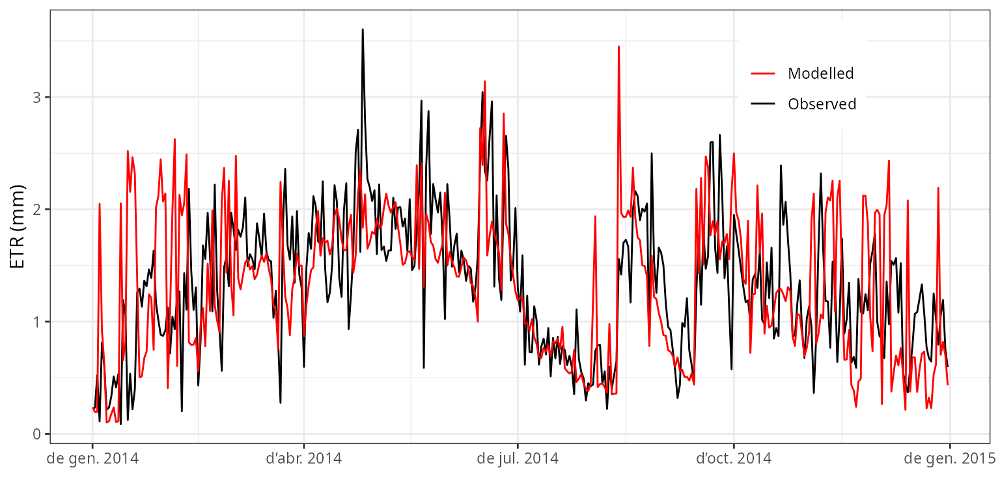
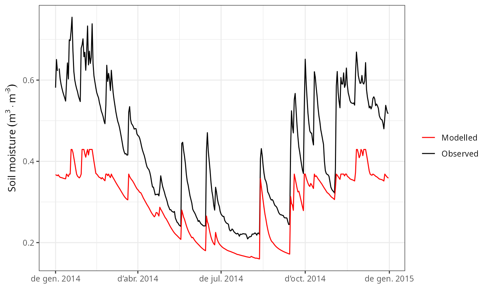
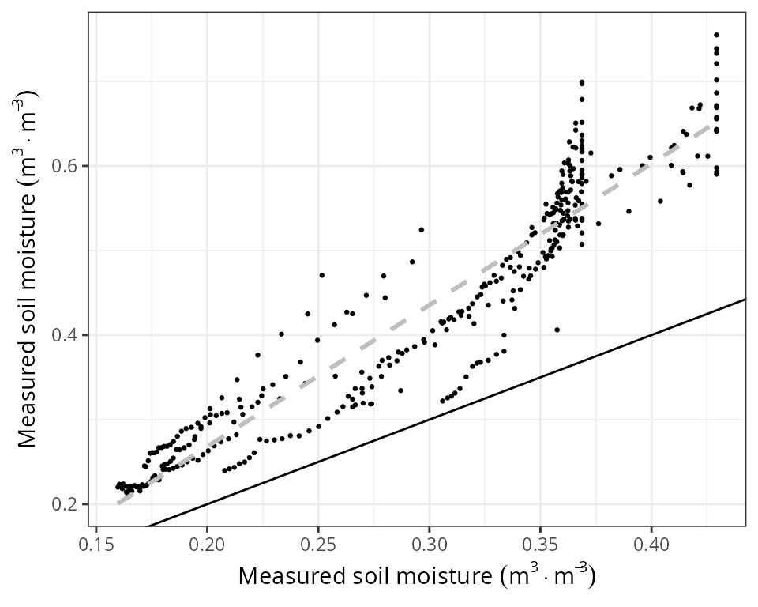
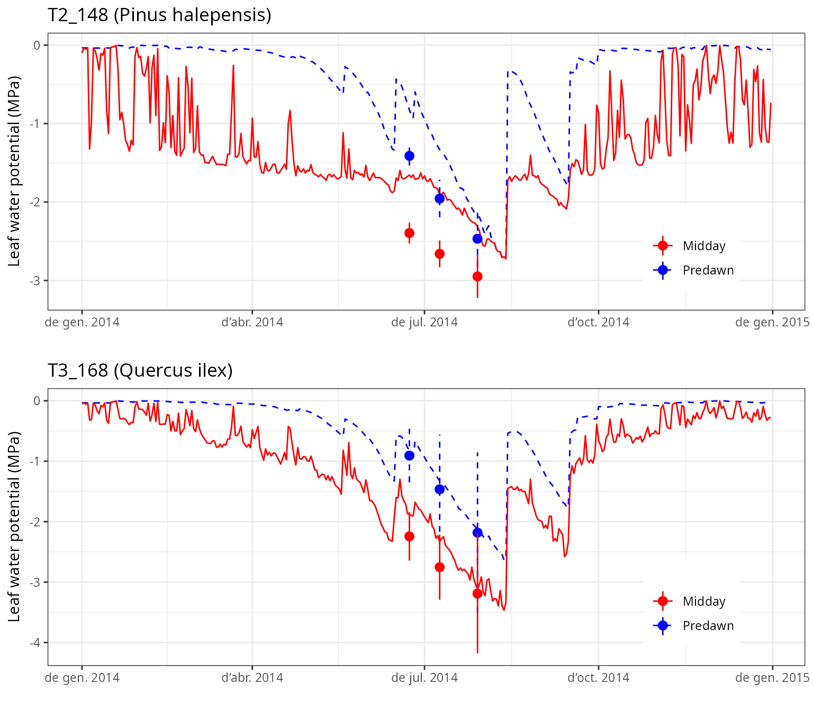
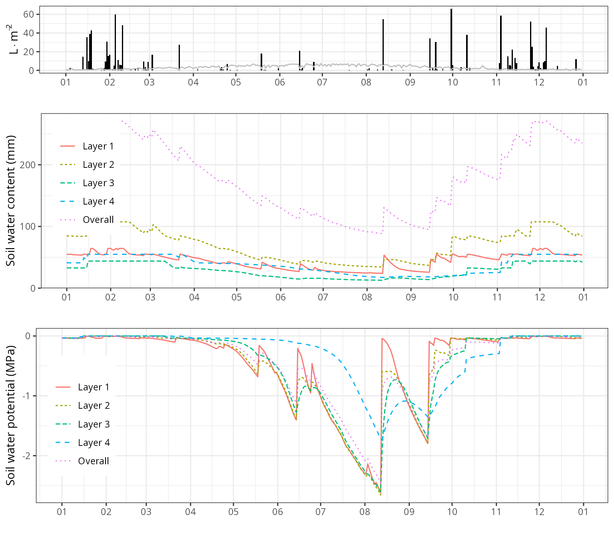
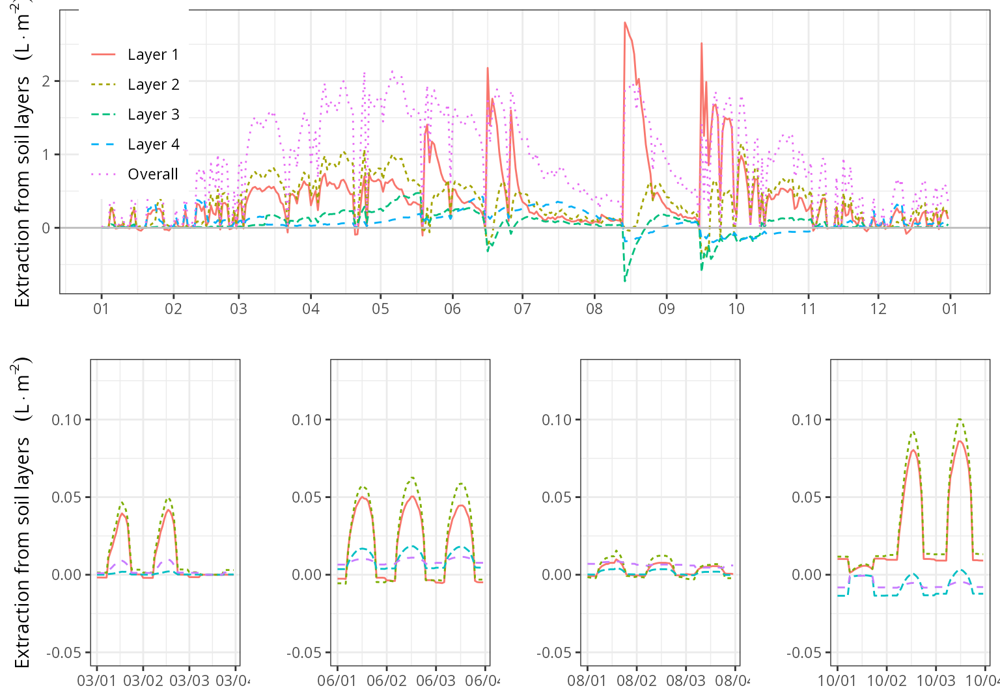
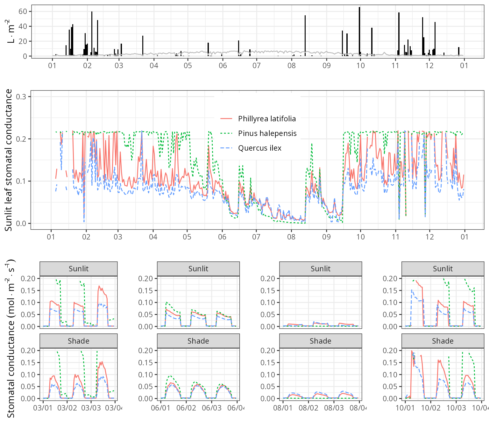

# Soil and plant water balances at Font-Blanche

## Introduction

### About this vignette

This document describes how to run the water balance model on a forest
plot at Font-Blanche (France), using the R function
[`spwb()`](https://emf-creaf.github.io/medfate/reference/spwb.md)
included in package `medfate`. The document indicates how to prepare the
model inputs, use the model simulation function, evaluate the
predictions against available observations and inspect the outputs.

### About the Font-Blanche research forest

The Font-Blanche research forest, located in southeastern France
(43º14′27″ N 5°40′45″ E, 420 m elevation), is composed of a top strata
of *Pinus halepensis* (Aleppo pine) reaching about 12 m, a lower strata
of *Quercus ilex* (holm oak), reaching about 6 m, and an understorey
strata dominated by *Quercus coccifera* but including other species such
as *Phillyrea latifolia*. It is spatially heterogeneous: not all trees
in each strata are contiguous, so trees from the lower stratas are
partially exposed to direct light. The forest grows on rocky and shallow
soils that have a low retention capacity and are of Jurassic limestone
origin. The climate is Mediterranean, with a water stress period in
summer, cold or mild winters and most precipitation occurring between
September and May. The experimental site, which is dedicated to study
forest carbon and water cycles, has an enclosed area of 80×80 m (Simioni
et al. 2013) but our specific plot is a quadrat of dimensions 25x25 m.

## Model inputs

Any forest water balance model needs information on **climate**,
**vegetation** and **soils** of the forest stand to be simulated.
Moreover, since the soil water balance in `medfate` differentiates
between species, **species-specific parameters** are also needed. Since
FontBlanche is one of the sites used for evaluating the model, and much
of the data can be found in Moreno et al. (2021). We can use a data list
`fb` with all the necessary inputs:

``` r
fb <- medfatereports::load_list("FONBLA")
```

``` r
fb <- readRDS("fb_data.rds")
names(fb)
```

    ##  [1] "siteData"       "treeData"       "shrubData"      "customParams"  
    ##  [5] "measuredData"   "meteoData"      "miscData"       "soilData"      
    ##  [9] "terrainData"    "remarks"        "sp_params"      "forest_object1"

### Soil

We require information on the physical attributes of soil in
Font-Blanche, namely *soil depth*, *texture*, *bulk density* and *rock
fragment content*. Soil information needs to be entered as a
`data frame` with soil layers in rows and physical attributes in
columns. The model accepts one to five soil layers with arbitrary
widths. Because soil properties vary strongly at fine spatial scales,
ideally soil physical attributes should be measured on samples taken at
the forest stand to be simulated. For those users lacking such data,
soil properties modelled at larger scales are available via
soilgrids.org (see function `soilgridsParams()`). In our case soil
physical attributes are already defined in the data bundled for
FontBlanche:

``` r
spar <- fb$soilData
print(spar)
```

    ##   widths clay sand om   bd rfc
    ## 1    300   39   26  6 1.45  50
    ## 2    700   39   26  3 1.45  65
    ## 3   1000   39   26  1 1.45  90
    ## 4   2500   39   26  1 1.45  95

The soil input for function
[`spwb()`](https://emf-creaf.github.io/medfate/reference/spwb.md) is
actually an object of class `soil` that is created using a function with
the same name:

``` r
fb_soil <- soil(spar)
```

The [`print()`](https://rdrr.io/r/base/print.html) function for objects
`soil` provides a lot of information on soil physical properties and
water capacity:

``` r
print(fb_soil)
```

    ##   widths sand clay      usda om nitrogen   bd rfc   macro     Ksat VG_alpha
    ## 1    300   26   39 Clay loam  6       NA 1.45  50 0.07387 7232.425 44.14586
    ## 2    700   26   39 Clay loam  3       NA 1.45  65 0.07387 3481.917 61.34088
    ## 3   1000   26   39 Clay loam  1       NA 1.45  90 0.07387 1879.187 76.38182
    ## 4   2500   26   39 Clay loam  1       NA 1.45  95 0.07387 1879.187 76.38182
    ##       VG_n VG_theta_res VG_theta_sat W Temp
    ## 1 1.254346        0.041    0.4388377 1   NA
    ## 2 1.273896        0.041    0.4388377 1   NA
    ## 3 1.287757        0.041    0.4388377 1   NA
    ## 4 1.287757        0.041    0.4388377 1   NA

The soil object is also used to store the moisture degree of each soil
layer. In particular, `W` contains the state variable that represents
moisture content - the proportion of moisture **relative to field
capacity** - which is by default initialized to 1 for each layer:

``` r
fb_soil$W
```

    ## [1] 1 1 1 1

### Species parameters

Simulation models in `medfate` require a data frame with species
parameter values. The package provides a default data set of parameter
values for a number of Mediterranean species occurring in Spain (rows),
resulting from bibliographic search, fit to empirical data or
expert-based guesses:

``` r
data("SpParamsMED")
```

However, sometimes one may wish to override species defaults with custom
values. In the case of FontBlanche there is a table of preferred
parameters:

``` r
fb$customParams
```

    ##               Species VCleaf_P12 VCleaf_P50 VCleaf_P88 VCleaf_slope VCstem_P12
    ## 1 Phillyrea latifolia         NA         NA         NA           NA  -1.971750
    ## 2    Pinus halepensis         NA         NA         NA           NA  -3.707158
    ## 3        Quercus ilex         NA         NA         NA           NA  -4.739642
    ##   VCstem_P50 VCstem_P88 VCstem_slope VCroot_P12 VCroot_P50 VCroot_P88
    ## 1      -6.50 -11.028250           11         NA         NA         NA
    ## 2      -4.79  -5.872842           46         -1  -1.741565  -2.301482
    ## 3      -6.40  -8.060358           30         NA         NA         NA
    ##   VCroot_slope VCleaf_kmax LeafEPS LeafPI0 LeafAF StemEPS StemPI0 StemAF Gswmin
    ## 1           NA        3.00   12.38   -2.13    0.5   12.38   -2.13    0.4  0.002
    ## 2           NA        4.00    5.31   -1.50    0.6    5.00   -1.65    0.4  0.001
    ## 3           NA        2.63   15.00   -2.50    0.4   15.00   -2.50    0.4  0.002
    ##   Gswmax    Gs_P50 Gs_slope    Al2As
    ## 1 0.2200 -2.207094 89.41176       NA
    ## 2 0.2175 -1.871216 97.43590  631.000
    ## 3 0.2200 -2.114188 44.70588 1540.671

We can use function
[`modifySpParams()`](https://emf-creaf.github.io/medfate/reference/modifyParams.md)
to replace the values of parameters for the desired traits, leaving the
rest unaltered:

``` r
SpParamsFB <- modifySpParams(SpParamsMED, fb$customParams)
SpParamsFB
```

    ##                    Name IFNcodes SpIndex        AcceptedName
    ## 143 Phillyrea latifolia        8     142 Phillyrea latifolia
    ## 149    Pinus halepensis       24     148    Pinus halepensis
    ## 169        Quercus ilex   45/245     168        Quercus ilex
    ##                 Species     Genus   Family    Order      Group GrowthForm
    ## 143 Phillyrea latifolia Phillyrea Oleaceae Lamiales Angiosperm       Tree
    ## 149    Pinus halepensis     Pinus Pinaceae  Pinales Gymnosperm       Tree
    ## 169        Quercus ilex   Quercus Fagaceae  Fagales Angiosperm Tree/Shrub
    ##         LifeForm LeafShape LeafSize      PhenologyType DispersalType Hmed Hmax
    ## 143 Phanerophyte     Broad   Medium oneflush-evergreen    vertebrate  150  900
    ## 149 Phanerophyte    Needle    Small oneflush-evergreen          wind  850 1900
    ## 169 Phanerophyte     Broad   Medium oneflush-evergreen    vertebrate  500 1300
    ##     Dmax Z50  Z95 fHDmin fHDmax    a_ash    b_ash    a_bsh     b_bsh    a_btsh
    ## 143   NA  NA 2353     45    109       NA       NA       NA        NA        NA
    ## 149   NA  NA 7500     80    160       NA       NA       NA        NA        NA
    ## 169   NA  NA 5020     40    100 1.857486 1.885548 0.523883 0.7337293 0.7327147
    ##       b_btsh cr BTsh      a_fbt    b_fbt       c_fbt    a_cr  b_1cr    b_2cr
    ## 143       NA NA   NA         NA       NA          NA      NA     NA       NA
    ## 149       NA NA   NA 0.07607828 1.462411 -0.02280106      NA     NA       NA
    ## 169 0.737577 NA   NA 0.07848713 1.497670 -0.00309341 1.98539 -0.552 -0.01386
    ##            b_3cr    c_1cr    c_2cr      a_cw   b_cw      a_bt      b_bt
    ## 143           NA       NA       NA        NA     NA        NA        NA
    ## 149           NA       NA       NA 0.6415296 0.7310 0.5535741 1.1848613
    ## 169 -0.000110736 -0.00685 -0.20101 0.5681897 0.7974 0.5622245 0.9626839
    ##     LeafDuration t0gdd  Sgdd Tbgdd  Ssen Phsen Tbsen xsen ysen      SLA
    ## 143     2.556345    NA    NA    NA    NA    NA    NA   NA   NA 6.881886
    ## 149     2.536875    NA    NA    NA    NA    NA    NA   NA   NA 5.140523
    ## 169     2.183837  54.5 240.7  4.34 10178  12.5  28.5    2    2 6.340000
    ##     LeafDensity WoodDensity FineRootDensity conduit2sapwood     r635    pDead
    ## 143   0.5327417   0.7050000              NA              NA 1.917579 0.119768
    ## 149   0.2982842   0.6077016              NA       0.9236406 1.964226 0.000500
    ## 169   0.4893392   0.9008264              NA       0.6238125 1.805872 0.000260
    ##        Al2As Ar2Al LeafWidth      SRL RLD    maxFMC   minFMC LeafPI0 LeafEPS
    ## 143 1698.950    NA 1.2000000       NA  NA 108.24724 56.53442   -2.13   12.38
    ## 149  631.000    NA 0.1384772 3172.572  NA 126.03063 86.22550   -1.50    5.31
    ## 169 1540.671    NA 1.7674359 4398.812  NA  93.15304 57.44192   -2.50   15.00
    ##     LeafAF StemPI0 StemEPS StemAF  SAV HeatContent LigninPercent LeafAngle
    ## 143    0.5   -2.13   12.38    0.4 9630       21400            NA        NA
    ## 149    0.6   -1.65    5.00    0.4 6050       22150      24.52473        NA
    ## 169    0.4   -2.50   15.00    0.4 4050       19300      28.97492        NA
    ##     LeafAngleSD ClumpingIndex gammaSWR alphaSWR kPAR  g  Tmax_LAI   Tmax_LAIsq
    ## 143          NA            NA       NA       NA   NA NA        NA           NA
    ## 149          NA            NA       NA       NA   NA NA 0.1869849 -0.008372458
    ## 169          NA            NA       NA       NA   NA NA 0.1251027 -0.005601615
    ##     Psi_Extract Exp_Extract      WUE   WUE_par     WUE_co2    WUE_vpd Gswmin
    ## 143  -1.8969940          NA       NA        NA          NA         NA  0.002
    ## 149  -0.9218219    1.504542 8.525550 0.5239136 0.002586327 -0.2647169  0.001
    ## 169  -1.9726871    1.149052 8.968208 0.1412266 0.002413091 -0.5664879  0.002
    ##     Gswmax Gsw_AC_slope Gs_Toptim Gs_Tsens    Gs_P50 Gs_slope VCleaf_kmax
    ## 143 0.2200           NA        NA       NA -2.207094 89.41176        3.00
    ## 149 0.2175           NA        NA       NA -1.871216 97.43590        4.00
    ## 169 0.2200           NA        NA       NA -2.114188 44.70588        2.63
    ##     VCleaf_P12 VCleaf_P50 VCleaf_P88 VCleaf_slope Kmax_stemxylem VCstem_P12
    ## 143         NA         NA         NA           NA      0.4083769  -1.971750
    ## 149 -1.9793246  -2.303772  -2.547056    133.86620      0.1500000  -3.707158
    ## 169 -0.5559123  -1.964085  -4.525766     19.14428      0.4000000  -4.739642
    ##     VCstem_P50 VCstem_P88 VCstem_slope Kmax_rootxylem VCroot_P12 VCroot_P50
    ## 143      -6.50 -11.028250           11             NA -3.1224807  -5.300000
    ## 149      -4.79  -5.872842           46             NA -1.0000000  -1.741565
    ## 169      -6.40  -8.060358           30             NA -0.4766469  -1.684034
    ##     VCroot_P88 VCroot_slope  Vmax298  Jmax298    Nleaf Nsapwood Nfineroot
    ## 143  -7.477519     17.45105 65.23250 146.2701 16.09170  2.78000        NA
    ## 149  -2.301482    103.96607 72.19617 124.1687 11.91507  1.26556  9.187476
    ## 169  -3.880455     22.32794 68.51600 118.7863 14.11983  5.66150 12.166747
    ##         WoodC    RERleaf RERsapwood RERfineroot CCleaf CCsapwood CCfineroot
    ## 143        NA         NA         NA          NA 1.6300        NA         NA
    ## 149 0.4979943 0.01210607         NA          NA 1.5905      1.47        1.3
    ## 169 0.4740096 0.01757808         NA          NA 1.4300        NA         NA
    ##     RGRleafmax RGRsapwoodmax RGRcambiummax RGRfinerootmax SRsapwood SRfineroot
    ## 143         NA            NA  0.0006653797             NA        NA         NA
    ## 149         NA            NA  0.0026280949             NA        NA         NA
    ## 169         NA            NA            NA             NA        NA         NA
    ##       RSSG MortalityBaselineRate SurvivalModelStep SurvivalB0 SurvivalB1
    ## 143     NA           0.001622378                NA         NA         NA
    ## 149 0.3725           0.005000000                10   7.311515 -0.6532989
    ## 169 0.9500           0.001000000                10   7.484348 -0.5420550
    ##     SeedProductionHeight SeedProductionDiameter SeedMass SeedLongevity
    ## 143                   NA                     NA       NA            NA
    ## 149                   NA                     NA       NA            NA
    ## 169                   NA               10.64702       NA            NA
    ##     DispersalDistance DispersalShape   ProbRecr MinTempRecr MinMoistureRecr
    ## 143                NA             NA 0.04459023   -2.570181      0.05070956
    ## 149                NA             NA 0.02473379    1.083300      0.10154153
    ## 169                NA             NA 0.03005748   -3.744526      0.09657161
    ##     MinFPARRecr RecrAge RecrTreeDBH RecrTreeHeight RecrShrubHeight
    ## 143   0.4943654      NA          NA       52.54367              NA
    ## 149   4.5625766      NA          NA       56.93647              NA
    ## 169   0.1307250      NA          NA       47.23629              NA
    ##     RecrTreeDensity RecrShrubCover RespFire RespDist RespClip
    ## 143              NA             NA      0.9     0.95     0.96
    ## 149              NA             NA       NA       NA       NA
    ## 169              NA             NA      0.9     0.95     0.96
    ##     IngrowthTreeDensity IngrowthTreeDBH
    ## 143            235.1347              NA
    ## 149            246.2793              NA
    ## 169            352.2668              NA

Note that the function returns a subset of rows for the species
mentioned in `customParams`. Not all parameters are needed for the soil
water balance model. The user can find parameter definitions in the help
page of this data set. However, to fully understand the role of
parameters in the model, the user should read the details of model
design and formulation (<http://emf-creaf.github.io/medfate>).

### Vegetation

Models included in `medfate` were primarily designed to be ran on
**forest inventory plots**. In this kind of data, the vegetation of a
sampled area is described in terms of woody plants (trees and shrubs)
along with their size and species identity. Forest plots in `medfate`
are assumed to be in a format that follows closely the Spanish forest
inventory. Each forest plot is represented in an object of class
`forest`, a list that contains several elements. Among them, the most
important items are two data frames, `treeData` (for trees) and
`shrubData` for shrubs:

``` r
fb_forest <- emptyforest()
fb_forest
```

    ## $treeData
    ## [1] Species DBH     Height  N       Z50     Z95    
    ## <0 rows> (or 0-length row.names)
    ## 
    ## $shrubData
    ## [1] Species Height  Cover   Z50     Z95    
    ## <0 rows> (or 0-length row.names)
    ## 
    ## $herbCover
    ## [1] NA
    ## 
    ## $herbHeight
    ## [1] NA
    ## 
    ## $seedlingBank
    ## [1] Species Percent Age     Z50     Z95     Z100   
    ## <0 rows> (or 0-length row.names)
    ## 
    ## $seedBank
    ## [1] Species Percent
    ## <0 rows> (or 0-length row.names)
    ## 
    ## attr(,"class")
    ## [1] "forest" "list"

Trees are expected to be primarily described in terms of species,
diameter (DBH) and height, whereas shrubs are described in terms of
species, percent cover and mean height. In our case, we will for
simplicity avoid shrubs and concentrate on the main three tree species
in the Font-Blanche forest plot: *Phillyrea latifolia* (code 142),
*Pinus halepensis* (Alepo pine, code 148), and *Quercus ilex* (holm oak;
code 168). In order to run the model, one has to prepare a data table
like this one, already prepared for Font-Blanche:

``` r
fb$treeData
```

    ##               Species       DBH    Height    N Z50  Z95       LAI
    ## 1 Phillyrea latifolia  2.587859  323.0000 1248 390 1470 0.2581029
    ## 2    Pinus halepensis 26.759914 1195.7667  256 300 1200 1.0035486
    ## 3        Quercus ilex  6.220031  495.5532 3104 500 2287 1.4383485

Trees have been grouped by species, so DBH and height values are means
(in cm), and `N` indicates the number of trees in each category. Package
`medfate` allows separating trees by size, but for simplicity we do not
distinguish here between tree sizes within each species. Columns `Z50`
and `Z95` indicate the depths (in mm) corresponding to cumulative 50%
and 95% of fine roots, respectively.

In order to use this data, we need to replace the part corresponding to
trees into the forest object that we created before:

``` r
fb_forest$treeData <- fb$treeData
fb_forest
```

    ## $treeData
    ##               Species       DBH    Height    N Z50  Z95       LAI
    ## 1 Phillyrea latifolia  2.587859  323.0000 1248 390 1470 0.2581029
    ## 2    Pinus halepensis 26.759914 1195.7667  256 300 1200 1.0035486
    ## 3        Quercus ilex  6.220031  495.5532 3104 500 2287 1.4383485
    ## 
    ## $shrubData
    ## [1] Species Height  Cover   Z50     Z95    
    ## <0 rows> (or 0-length row.names)
    ## 
    ## $herbCover
    ## [1] NA
    ## 
    ## $herbHeight
    ## [1] NA
    ## 
    ## $seedlingBank
    ## [1] Species Percent Age     Z50     Z95     Z100   
    ## <0 rows> (or 0-length row.names)
    ## 
    ## $seedBank
    ## [1] Species Percent
    ## <0 rows> (or 0-length row.names)
    ## 
    ## attr(,"class")
    ## [1] "forest" "list"

Because the forest plot format is rather specific, `medfate` also allows
starting in an alternative way using two data frames, one with
**aboveground** information (i.e. the leave area and size of plants) and
the other with **belowground** information (i.e. root distribution). The
aboveground data frame does not distinguish between trees and shrubs. It
includes, for each plant cohort to be considered in rows, its *species
identity*, *height*, *leaf area index* (LAI) and *crown ratio*. While
users can build their input data themselves, we use internal function
[`forest2aboveground()`](https://emf-creaf.github.io/medfate/reference/forest2aboveground.md)
on the object `fb_forest` to show how should the data look like:

``` r
fb_above <- forest2aboveground(fb_forest, SpParamsFB)
fb_above
```

    ##         SP    N       DBH Cover         H        CR  LAI_live LAI_expanded
    ## T1_142 142 1248  2.587859    NA  323.0000 0.5510653 0.2581029    0.2581029
    ## T2_148 148  256 26.759914    NA 1195.7667 0.6126601 1.0035486    1.0035486
    ## T3_168 168 3104  6.220031    NA  495.5532 0.5531152 1.4383485    1.4383485
    ##        LAI_dead LAI_nocomp Age ObsID
    ## T1_142        0  0.2581029  NA  <NA>
    ## T2_148        0  1.0035486  NA  <NA>
    ## T3_168        0  1.4383485  NA  <NA>

Note that the call to
[`forest2aboveground()`](https://emf-creaf.github.io/medfate/reference/forest2aboveground.md)
included species parameters, because species-specific parameter values
are needed to calculate leaf area from tree diameters or shrub cover
using allometric relationships. Columns `N`, `DBH` and `Cover` are
required for simulating growth, but not for soil water balance, which
only requires columns `SP`, `H` (in cm), `CR` (i.e. the crown ratio),
`LAI_live`, `LAI_expanded` and `LAI_dead`. Here plant cohorts are given
unique codes that tell us whether they correspond to trees or shrubs. In
practice, the user only needs to worry to calculate the values for
`LAI_live`. `LAI_live` and `LAI_expanded` can contain the same LAI
values, and `LAI_dead` is normally zero.

We see that at Font-Blanche holm oaks (code 68) represent most of the
total leaf area. On the other hand, pines are taller than oaks.
`medfate` assumes that leaf distribution follows a truncated normal
curve between the crown base height and the total height. This can be
easily inspected using function
[`vprofile_leafAreaDensity()`](https://emf-creaf.github.io/medfate/reference/vprofile_leafAreaDensity.md):

``` r
vprofile_leafAreaDensity(fb_forest, SpParamsFB, byCohorts = T, bySpecies = T)
```


Regarding **belowground** information, the usuer should supply a matrix
describing for each plant cohort, the proportion of fine roots in each
soil layer. As before, we use internal function
[`forest2belowground()`](https://emf-creaf.github.io/medfate/reference/forest2aboveground.md)
on the object `fb_forest` to show how should the data look like:

``` r
fb_below <- forest2belowground(fb_forest, fb_soil, SpParamsFB)
fb_below
```

    ##                1         2          3          4
    ## T1_142 0.3602157 0.5332967 0.08477533 0.02171222
    ## T2_148 0.5016024 0.4291685 0.05479894 0.01443019
    ## T3_168 0.2752236 0.5286425 0.14537757 0.05075634

In our case, these proportions were implicitly specified in parameters
`Z50` and `Z95`. In fact, these values describe a continuous
distribution of fine roots along depth, which can be displayed using
function
[`vprofile_rootDistribution()`](https://emf-creaf.github.io/medfate/reference/vprofile_leafAreaDensity.md):

``` r
vprofile_rootDistribution(fb_forest, SpParamsFB, bySpecies = T)
```


Note that in Font-Blanche we set that the root system of Aleppo pines
(*Pinus halepensis*) would be more superficial than that of the other
two species. Moreover, holm oak trees are the ones who extend their
roots down to deepest soil layers.

### Meteorology

Water balance simulations of function
[`spwb()`](https://emf-creaf.github.io/medfate/reference/spwb.md)
require **daily weather** inputs. The weather variables that are
required depend on the complexity of the soil water balance model we are
using. In the simplest case, only **mean temperature**,
**precipitation** and **potential evapo-transpiration (PET)** is
required, but the more complex simulation model also requires radiation,
wind speed, min/max temparature and relative humitidy. Here we already
have a data frame with the daily meteorology measured at Font-Blanche
for year 2014:

``` r
fb_meteo <- fb$meteoData
head(fb_meteo)
```

    ##        dates MeanTemperature MinTemperature MaxTemperature MeanRelativeHumidity
    ## 1 2014-01-01        7.661856       5.988889       8.960000             87.78224
    ## 2 2014-01-02        9.525431       7.958333      11.550000             96.40669
    ## 3 2014-01-03        9.482417       8.176111      11.762220             93.05705
    ## 4 2014-01-04       10.016813       6.313000      11.010000             96.31667
    ## 5 2014-01-05        6.619919       4.766000       9.060555             57.77938
    ## 6 2014-01-06        8.923008       6.793889      12.329440             64.40477
    ##   MinRelativeHumidity MaxRelativeHumidity WindSpeed Precipitation Radiation
    ## 1            80.37265            98.48404  2.317495      0.000000 1.5050178
    ## 2            84.22588           100.00000  2.407691      0.000000 2.6173102
    ## 3            79.93501           100.00000  1.950114      0.000000 3.9089762
    ## 4            90.14023           100.00000  3.596797      2.590674 0.4753025
    ## 5            48.92043            65.71329  7.310334      0.000000 8.6224570
    ## 6            51.31975            74.46718  2.301697      0.000000 6.7835715

Simulation models in `medfate` have been designed to work along with
data generated from package `meteoland` (De Cáceres et al. 2018), which
specifies conventions for variable names and units. The user is strongly
recommended to resort to this package to obtain suitable weather input
for soil water balance simulations (see
<http://emf-creaf.github.io/meteoland>).

### Simulation control

Apart from data inputs, the behavior of simulation models can be
controlled using a set of **global parameters**. The default global
parameter values are obtained using function
[`defaultControl()`](https://emf-creaf.github.io/medfate/reference/defaultControl.md):

``` r
fb_control <- defaultControl()
fb_control$transpirationMode <- "Sperry"
fb_control$subdailyResults <- TRUE
fb_control$stemCavitationRecovery <- "rate"
fb_control$leafCavitationRecovery <- "total"
fb_control$fracRootResistance <- 0.4
```

Where the following changes are set to control parameters:

1.  Transpiration is set `transpirationMode = "Sperry"`, which implies a
    greater complexity of plant hydraulics and energy balance
    calculations.
2.  Soil water retention curves are calculated using Van Genuchten’s
    equations.
3.  Subdaily results generated by the model are kept.
4.  Coarse root resistance is assumed to be 40% of total plant
    resistance

### Water balance input object

A last step is needed before calling simulation functions. It consists
in the compilation of all aboveground and belowground parameters and the
specification of additional parameter values for each plant cohort, such
as their light extinction coefficient or their response to drought. If
one has a `forest` object, the `spwbInput` object can be generated in
directly from it, avoiding the need to explicitly build `fb_above` and
`fb_below` data frames:

``` r
fb_x <- spwbInput(fb_forest, fb_soil, SpParamsFB, fb_control)
```

Different species parameter variables will be drawn from `SpParamsMED`
depending on the value of `transpirationMode`. For the simple water
balance model, relatively few parameters are needed. All the input
information for forest data and species parameter values can be
inspected by printing the input object.

Finally, note that one can play with plant-specific parameters for soil
water balance (instead of using species-level values) by using function
[`modifyCohortParams()`](https://emf-creaf.github.io/medfate/reference/modifyParams.md).

## Running the model

Function
[`spwb()`](https://emf-creaf.github.io/medfate/reference/spwb.md)
requires two main objects as input:

- A `spwbInput` object with forest and soil parameters (`fb_x` in our
  case).
- A data frame with daily meteorology for the study period (`fb_meteo`
  in our case).

Now we are ready to call function
[`spwb()`](https://emf-creaf.github.io/medfate/reference/spwb.md):

``` r
fb_SWB <- spwb(fb_x, fb_meteo, elevation = 420, latitude = 43.24083)
```

    ## Package 'meteoland' [ver. 2.2.4]

    ## Initial plant water content (mm): 31.8864
    ## Initial soil water content (mm): 213.886
    ## Initial snowpack content (mm): 0
    ## Performing daily simulations
    ## 
    ##  [Year 2014]:............
    ## 
    ## Final plant water content (mm): 31.8309
    ## Final soil water content (mm): 235.07
    ## Final snowpack content (mm): 0
    ## Change in plant water content (mm): -0.0554502
    ## Plant water balance result (mm): -9.83278e-16
    ## Change in soil water content (mm): 21.1846
    ## Soil water balance result (mm): 21.1846
    ## Change in snowpack water content (mm): 0
    ## Snowpack water balance result (mm): 0
    ## Water balance components:
    ##   Precipitation (mm) 1066 Rain (mm) 1066 Snow (mm) 0
    ##   Interception (mm) 141 Net rainfall (mm) 925
    ##   Infiltration (mm) 833 Infiltration excess (mm) 92 Saturation excess (mm) 272 Capillarity rise (mm) 0
    ##   Soil evaporation (mm) 21  Herbaceous transpiration (mm) 0 Woody plant transpiration (mm) 323
    ##   Plant extraction from soil (mm) 323  Plant water balance (mm) -0 Hydraulic redistribution (mm) 36
    ##   Runoff (mm) 364 Deep drainage (mm) 195

Console output provides the water balance totals for the period
considered, which may span several years. The output of function
[`spwb()`](https://emf-creaf.github.io/medfate/reference/spwb.md) is an
object of class with the same name, actually a list:

``` r
class(fb_SWB)
```

    ## [1] "spwb" "list"

If we inspect its elements, we realize that there are several
components:

``` r
names(fb_SWB)
```

    ##  [1] "latitude"      "topography"    "weather"       "spwbInput"    
    ##  [5] "spwbOutput"    "WaterBalance"  "EnergyBalance" "Temperature"  
    ##  [9] "Soil"          "Snow"          "Stand"         "Plants"       
    ## [13] "SunlitLeaves"  "ShadeLeaves"   "subdaily"

For example, `WaterBalance` contains water balance components in form of
a data frame with days in rows:

``` r
head(fb_SWB$WaterBalance)
```

    ##                  PET Precipitation     Rain Snow   NetRain Snowmelt
    ## 2014-01-01 0.6209989      0.000000 0.000000    0 0.0000000        0
    ## 2014-01-02 0.5671238      0.000000 0.000000    0 0.0000000        0
    ## 2014-01-03 0.5418115      0.000000 0.000000    0 0.0000000        0
    ## 2014-01-04 0.6072565      2.590674 2.590674    0 0.7213133        0
    ## 2014-01-05 2.0447148      0.000000 0.000000    0 0.0000000        0
    ## 2014-01-06 0.9330456      0.000000 0.000000    0 0.0000000        0
    ##            Infiltration InfiltrationExcess SaturationExcess Runoff DeepDrainage
    ## 2014-01-01    0.0000000                  0                0      0    0.0000000
    ## 2014-01-02    0.0000000                  0                0      0    0.0000000
    ## 2014-01-03    0.0000000                  0                0      0    0.0000000
    ## 2014-01-04    0.7213133                  0                0      0    0.1891113
    ## 2014-01-05    0.0000000                  0                0      0    0.0000000
    ## 2014-01-06    0.0000000                  0                0      0    0.0000000
    ##            CapillarityRise Evapotranspiration Interception SoilEvaporation
    ## 2014-01-01               0          0.2369034      0.00000       0.2145403
    ## 2014-01-02               0          0.1959278      0.00000       0.1959278
    ## 2014-01-03               0          0.1971447      0.00000       0.1871830
    ## 2014-01-04               0          2.0494022      1.86936       0.1800420
    ## 2014-01-05               0          0.9200973      0.00000       0.2941821
    ## 2014-01-06               0          0.6256207      0.00000       0.1367511
    ##            HerbTranspiration PlantExtraction Transpiration
    ## 2014-01-01                 0    2.236303e-02    0.02236303
    ## 2014-01-02                 0   -1.409463e-18    0.00000000
    ## 2014-01-03                 0    9.961750e-03    0.00996175
    ## 2014-01-04                 0    9.486769e-19    0.00000000
    ## 2014-01-05                 0    6.259152e-01    0.62591524
    ## 2014-01-06                 0    4.888697e-01    0.48886969
    ##            HydraulicRedistribution
    ## 2014-01-01             0.000000000
    ## 2014-01-02             0.002400632
    ## 2014-01-03             0.003379188
    ## 2014-01-04             0.004276351
    ## 2014-01-05             0.000000000
    ## 2014-01-06             0.001303872

## Comparing results with observations

Before examining the results of the model, it is important to compare
its predictions against observed data, if available. The following
observations are available from the experimental forest plot for year
2014:

- Stand total evapotranspiration estimated using an Eddy-covariance flux
  tower.
- Soil moisture content of the first 0-30 cm layer.
- Cohort transpiration estimates derived from sapflow measurements
  for Q. ilex and P. halepensis.
- Pre-dawn and midday leaf water potentials for Q. ilex and P.
  halepensis.

We first load the measured data into the workspace and filter for the
dates used in the simulation:

``` r
fb_observed <- fb$measuredData
fb_observed <- fb_observed[fb_observed$dates %in% fb_meteo$dates,]
row.names(fb_observed) <- fb_observed$dates
head(fb_observed)
```

    ##                 dates       SWC SWC.err       ETR E_T2_148 E_T2_148_err
    ## 2014-01-01 2014-01-01 0.5813407      NA 0.2259528       NA           NA
    ## 2014-01-02 2014-01-02 0.6507478      NA 0.2337668       NA           NA
    ## 2014-01-03 2014-01-03 0.6224243      NA 0.5229000       NA           NA
    ## 2014-01-04 2014-01-04        NA      NA 0.1117191       NA           NA
    ## 2014-01-05 2014-01-05 0.6285134      NA 0.8132403       NA           NA
    ## 2014-01-06 2014-01-06 0.6035415      NA 0.6012234       NA           NA
    ##            E_T3_168 E_T3_168_err PD_T2_148 PD_T2_148_err PD_T3_168
    ## 2014-01-01       NA           NA        NA            NA        NA
    ## 2014-01-02       NA           NA        NA            NA        NA
    ## 2014-01-03       NA           NA        NA            NA        NA
    ## 2014-01-04       NA           NA        NA            NA        NA
    ## 2014-01-05       NA           NA        NA            NA        NA
    ## 2014-01-06       NA           NA        NA            NA        NA
    ##            PD_T3_168_err MD_T2_148 MD_T2_148_err MD_T3_168 MD_T3_168_err
    ## 2014-01-01            NA        NA            NA        NA            NA
    ## 2014-01-02            NA        NA            NA        NA            NA
    ## 2014-01-03            NA        NA            NA        NA            NA
    ## 2014-01-04            NA        NA            NA        NA            NA
    ## 2014-01-05            NA        NA            NA        NA            NA
    ## 2014-01-06            NA        NA            NA        NA            NA

### Stand evapotranspiration

Package `medfate` contains several functions to assist the evaluation of
model results. We can first compare the observed vs modelled total
evapotranspiration. We can plot the two time series:

``` r
evaluation_plot(fb_SWB, fb_observed, type = "ETR", plotType="dynamics")+
  theme(legend.position = c(0.8,0.85))
```



It is easy to see that in rainy days the predicted evapotranspiration is
much higher than that of the observed data. We repeat the comparison but
excluding the intercepted water from modeled results:

``` r
evaluation_plot(fb_SWB, fb_observed, type = "SE+TR", plotType="dynamics")+
  theme(legend.position = c(0.8,0.85))
```


The relationship can be shown in a scatter plot:

``` r
evaluation_plot(fb_SWB, fb_observed, type = "SE+TR", plotType="scatter")
```

 Where we see a
reasonably good relationship, but the model tends to underestimate total
evapotranspiration during seasons with low evaporative demand. Function
[`evaluation_stats()`](https://emf-creaf.github.io/medfate/reference/evaluation.md)
allows us to generate evaluation statistics:

``` r
evaluation_stats(fb_SWB, fb_observed, type = "SE+TR")
```

    ##             n          Bias      Bias.rel           MAE       MAE.rel 
    ## 365.000000000  -0.389036614 -29.198664329   0.470818543  35.336706323 
    ##             r           NSE       NSE.abs 
    ##   0.691315875  -0.009887544   0.054424469

### Soil moisture

We can compare observed vs modelled soil moisture content in a similar
way as we did for total evapotranspiration:

``` r
evaluation_plot(fb_SWB, fb_observed, type = "SWC", plotType="dynamics")
```



As before, we can generate a scatter plot:

``` r
evaluation_plot(fb_SWB, fb_observed, type = "SWC", plotType="scatter")
```



or examine evaluation statistics:

``` r
evaluation_stats(fb_SWB, fb_observed, type = "SWC")
```

    ##            n         Bias     Bias.rel          MAE      MAE.rel            r 
    ## 364.00000000  -0.13283708 -30.96872370   0.13283708  30.96872370   0.94976486 
    ##          NSE      NSE.abs 
    ##  -0.09616646  -0.04072213

### Plant transpiration

The following plots display the observed and predicted transpiration
dynamics for *Pinus halepensis* and *Quercus ilex*:

``` r
g1<-evaluation_plot(fb_SWB, fb_observed, 
                            cohort = "T2_148",
                            type="E", plotType = "dynamics")+
  theme(legend.position = c(0.85,0.83))
g2<-evaluation_plot(fb_SWB, fb_observed, 
                            cohort = "T3_168",
                            type="E", plotType = "dynamics")+
  theme(legend.position = c(0.85,0.83))
plot_grid(g1, g2, ncol=1)
```


In general, the agreement is quite good, but the model seems to
overestimate the transpiration of *P. halepensis* in early summer and
after the first drought period. The transpiration of *Q. ilex* seems
also overestimated in spring and autumn. We can also inspect the
evaluation statistics for both species using:

``` r
evaluation_stats(fb_SWB, fb_observed, cohort = "T2_148", type="E")
```

    ##           n        Bias    Bias.rel         MAE     MAE.rel           r 
    ## 300.0000000   0.3121143 151.7537015   0.3282208 159.5848671   0.8564806 
    ##         NSE     NSE.abs 
    ## -11.6385648  -2.3168403

``` r
evaluation_stats(fb_SWB, fb_observed, cohort = "T3_168", type="E")
```

    ##             n          Bias      Bias.rel           MAE       MAE.rel 
    ## 309.000000000  -0.006040064  -2.086676013   0.067209664  23.219092424 
    ##             r           NSE       NSE.abs 
    ##   0.887009157   0.762024744   0.542114689

### Leaf water potentials

Finally, we can compare observed with predicted water potentials. In
this case measurements are available for three dates, but they include
the standard deviation of several measurements.

``` r
g1<-evaluation_plot(fb_SWB, fb_observed, 
                            cohort = "T2_148",
                            type="WP", plotType = "dynamics")+
  theme(legend.position = c(0.85,0.23))
g2<-evaluation_plot(fb_SWB, fb_observed, 
                            cohort = "T3_168",
                            type="WP", plotType = "dynamics")+
  theme(legend.position = c(0.85,0.23))
plot_grid(g1, g2, ncol=1)
```



The model seems to underestimate water potentials (i.e. it predicts more
negative values than those observed) during the drought season.

## Drawing plots

Package `medfate` provides a simple `plot` function for objects of class
`spwb`. Here we will use this function to display the seasonal variation
predicted by the model, as well as the variation at higher temporal
resolution within four different selected 3-day periods that we define
here:

``` r
d1 = seq(as.Date("2014-03-01"), as.Date("2014-03-03"), by="day")
d2 = seq(as.Date("2014-06-01"), as.Date("2014-06-03"), by="day")
d3 = seq(as.Date("2014-08-01"), as.Date("2014-08-03"), by="day")
d4 = seq(as.Date("2014-10-01"), as.Date("2014-10-03"), by="day")
```

### Meteorological input and input/output water flows

Function [`plot()`](https://rdrr.io/r/graphics/plot.default.html) can be
used to show the meteorological input:

``` r
plot(fb_SWB, type = "PET_Precipitation")
```

 It is apparent
the climatic drought period between april and august 2014. This should
have an impact on soil moisture and plant stress.

If we are interested in forest hydrology, we can plot the amount of
water that the model predicts to leave the forest via surface runoff or
drainage to lower water compartments.

``` r
plot(fb_SWB, type = "Export")
```

 As expected,
water exported from the forest plot was only relevant for the autumn and
winter periods. Note also that the model predicts some runoff during
convective storms during autumn, whereas winter events occur when the
soil is already full, so that most exported water is assumed to be lost
via deep drainage. One can also display the evapotranspiration flows,
which we do in the following plot that also combines the two previous:

``` r
g1<-plot(fb_SWB)+scale_x_date(date_breaks = "1 month", date_labels = "%m")+theme(legend.position = "none")
g2<-plot(fb_SWB, "Evapotranspiration")+scale_x_date(date_breaks = "1 month", date_labels = "%m")+theme(legend.position = c(0.13,0.73))
g3<-plot(fb_SWB, "Export")+scale_x_date(date_breaks = "1 month", date_labels = "%m")+theme(legend.position = c(0.35,0.60))
plot_grid(g1,g2, g3, ncol=1, rel_heights = c(0.4,1,0.6))
```


### Soil moisture dynamics and hydraulic redistribution

It is also useful to plot the dynamics of soil state variables by layer,
such as the percentage of moisture in relation to field capacity:

``` r
plot(fb_SWB, type="SoilTheta")
```

 Note that the
model predicts soil drought to occur earlier in the season for the first
three layers (0-200 cm) whereas the bottom layer dries out much more
slowly. At this point is important to mention that the water balance
model incorporates. We can also display the dynamics of the
corresponding soil layer water potentials:

``` r
plot(fb_SWB, type="SoilPsi")
```

 or draw a
composite plot including absolute soil water volume:

``` r
g1<-plot(fb_SWB)+scale_x_date(date_breaks = "1 month", date_labels = "%m")+theme(legend.position = "none")
g2<-plot(fb_SWB, "SoilVol")+scale_x_date(date_breaks = "1 month", date_labels = "%m")+theme(legend.position = c(0.08,0.65))
g3<-plot(fb_SWB, "SoilPsi")+scale_x_date(date_breaks = "1 month", date_labels = "%m")+theme(legend.position = c(0.08,0.5))
plot_grid(g1, g2,  g3, rel_heights = c(0.4,0.8,0.8), ncol=1)
```



### Root water uptake and hydraulic redistribution

The following composite plot shows the daily root water uptake (or
release) from different soil layers, and the daily amount of water
entering soil layers due to hydraulic redistribution:

``` r
g1<-plot(fb_SWB, "SoilPsi")+scale_x_date(date_breaks = "1 month", date_labels = "%m")+theme(legend.position = "none")+ylab("Soil wp (MPa)")
g2<-plot(fb_SWB, "PlantExtraction")+scale_x_date(date_breaks = "1 month", date_labels = "%m")+theme(legend.position = c(0.08,0.68))
g3<-plot(fb_SWB, "HydraulicRedistribution")+scale_x_date(date_breaks = "1 month", date_labels = "%m")+theme(legend.position = c(0.08,0.5))
plot_grid(g1, g2,  g3, rel_heights = c(0.4,0.8,0.8), ncol=1)
```


If we create a composite plot including subdaily water uptake/release
patterns, we can further understand the redistribution flows created by
the model during different periods:

``` r
g0<-plot(fb_SWB, "PlantExtraction")+scale_x_date(date_breaks = "1 month", date_labels = "%m")+theme(legend.position = c(0.08,0.68))
g1<-plot(fb_SWB, "PlantExtraction", subdaily = T, dates = d1)+scale_x_datetime(date_breaks = "1 day",  date_labels = "%m/%d")+theme(legend.position = "none")+ylim(c(-0.05,0.13))
g2<-plot(fb_SWB, "PlantExtraction", subdaily = T, dates = d2)+scale_x_datetime(date_breaks = "1 day",  date_labels = "%m/%d")+theme(legend.position = "none")+ylab("")+ylim(c(-0.05,0.13))
g3<-plot(fb_SWB, "PlantExtraction", subdaily = T, dates = d3)+scale_x_datetime(date_breaks = "1 day",  date_labels = "%m/%d")+theme(legend.position = "none")+ylab("")+ylim(c(-0.05,0.13))
g4<-plot(fb_SWB, "PlantExtraction", subdaily = T, dates = d4)+scale_x_datetime(date_breaks = "1 day",  date_labels = "%m/%d")+theme(legend.position = "none")+ylab("")+ylim(c(-0.05,0.13))
plot_grid(g0,plot_grid(g1, g2, g3, g4, ncol=4),ncol=1)
```



### Plant transpiration

We can use function
[`plot()`](https://rdrr.io/r/graphics/plot.default.html) to display the
seasonal dynamics of cohort-level variables, such as plant transpiration
per leaf area:

``` r
par(mar=c(5,5,1,1))
plot(fb_SWB, type="TranspirationPerLeaf", bySpecies = T)
```

 Where we can
observe that some species transpire more than others due to their
vertical position within the canopy.

``` r
g1<-plot(fb_SWB)+scale_x_date(date_breaks = "1 month", date_labels = "%m")+theme(legend.position = "none")
g2<-plot(fb_SWB, "TranspirationPerLeaf", bySpecies = T)+scale_x_date(date_breaks = "1 month", date_labels = "%m")+theme(legend.position = c(0.1,0.75))
g21<-plot(fb_SWB, "LeafTranspiration", subdaily = T, dates = d1)+scale_x_datetime(date_breaks = "1 day",  date_labels = "%m/%d")+theme(legend.position = "none")+ylim(c(0,0.32))
g22<-plot(fb_SWB, "LeafTranspiration", subdaily = T, dates = d2)+scale_x_datetime(date_breaks = "1 day",  date_labels = "%m/%d")+theme(legend.position = "none")+ylab("")+ylim(c(0,0.32))
g23<-plot(fb_SWB, "LeafTranspiration", subdaily = T, dates = d3)+scale_x_datetime(date_breaks = "1 day",  date_labels = "%m/%d")+theme(legend.position = "none")+ylab("")+ylim(c(0,0.32))
g24<-plot(fb_SWB, "LeafTranspiration", subdaily = T, dates = d4)+scale_x_datetime(date_breaks = "1 day",  date_labels = "%m/%d")+theme(legend.position = "none")+ylab("")+ylim(c(0,0.32))
plot_grid(g1, g2,  
          plot_grid(g21,g22,g23,g24, ncol=4), 
          ncol=1, rel_heights = c(0.4,0.8,0.8))
```


### Plant stress

In the model, reduction of (whole-plant) plant transpiration is what
used to define drought stress, which depends on the species identity:

``` r
plot(fb_SWB, type="PlantStress", bySpecies = T)
```


To examine the impact of drought on plants, one can inspect the
whole-plant conductance (from which the stress index is derived) or the
stem percent loss of conductance derived from embolism, as we do in the
following composite plot:

``` r
g1<-plot(fb_SWB)+scale_x_date(date_breaks = "1 month", date_labels = "%m")+theme(legend.position = "none")
g2<-plot(fb_SWB, "SoilPlantConductance", bySpecies = T)+scale_x_date(date_breaks = "1 month", date_labels = "%m")+
  ylab(expression(paste("Soil-plant conductance ",(mmol%.%m^{-2}%.%s^{-1}))))+
  theme(legend.position = "none")
g3<-plot(fb_SWB, "StemPLC", bySpecies = T)+scale_x_date(date_breaks = "1 month", date_labels = "%m")+theme(legend.position = c(0.2,0.75))
plot_grid(g1, g2,g3,                          
          ncol=1, rel_heights = c(0.4,0.8,0.8))
```


### Leaf water potentials

``` r
g1<-plot(fb_SWB)+scale_x_date(date_breaks = "1 month", date_labels = "%m")+theme(legend.position = "none")
g2<-plot(fb_SWB, "LeafPsiRange", bySpecies = T)+scale_x_date(date_breaks = "1 month", date_labels = "%m")+theme(legend.position = c(0.1,0.25)) + ylab("Leaf water potential (MPa)")
g21<-plot(fb_SWB, "LeafPsi", subdaily = T, dates = d1)+scale_x_datetime(date_breaks = "1 day",  date_labels = "%m/%d")+theme(legend.position = "none")+ylim(c(-7,0))
g22<-plot(fb_SWB, "LeafPsi", subdaily = T, dates = d2)+scale_x_datetime(date_breaks = "1 day",  date_labels = "%m/%d")+theme(legend.position = "none")+ylab("")+ylim(c(-7,0))
g23<-plot(fb_SWB, "LeafPsi", subdaily = T, dates = d3)+scale_x_datetime(date_breaks = "1 day",  date_labels = "%m/%d")+theme(legend.position = "none")+ylab("")+ylim(c(-7,0))
g24<-plot(fb_SWB, "LeafPsi", subdaily = T, dates = d4)+scale_x_datetime(date_breaks = "1 day",  date_labels = "%m/%d")+theme(legend.position = "none")+ylab("")+ylim(c(-7,0))
plot_grid(g1, g2,                          
          plot_grid(g21,g22,g23,g24, ncol=4), 
          ncol=1, rel_heights = c(0.4,0.8,0.8))
```


### Stomatal conductance

``` r
g1<-plot(fb_SWB)+scale_x_date(date_breaks = "1 month", date_labels = "%m")+theme(legend.position = "none")
g2<-plot(fb_SWB, "GSWMax_SL", bySpecies = T)+scale_x_date(date_breaks = "1 month", date_labels = "%m")+theme(legend.position = c(0.5,0.74))+ylab("Sunlit leaf stomatal conductance")+ylim(c(0,0.3))
g21<-plot(fb_SWB, "LeafStomatalConductance", subdaily = T, dates = d1)+scale_x_datetime(date_breaks = "1 day",  date_labels = "%m/%d")+theme(legend.position = "none")+ylim(c(0,0.2))
g22<-plot(fb_SWB, "LeafStomatalConductance", subdaily = T, dates = d2)+scale_x_datetime(date_breaks = "1 day",  date_labels = "%m/%d")+theme(legend.position = "none")+ylab("")+ylim(c(0,0.2))
g23<-plot(fb_SWB, "LeafStomatalConductance", subdaily = T, dates = d3)+scale_x_datetime(date_breaks = "1 day",  date_labels = "%m/%d")+theme(legend.position = "none")+ylab("")+ylim(c(0,0.2))
g24<-plot(fb_SWB, "LeafStomatalConductance", subdaily = T, dates = d4)+scale_x_datetime(date_breaks = "1 day",  date_labels = "%m/%d")+theme(legend.position = "none")+ylab("")+ylim(c(0,0.2))
plot_grid(g1, g2,
          plot_grid(g21,g22,g23,g24, ncol=4),
          ncol=1, rel_heights = c(0.4,0.8,0.8))
```



## Generating output summaries

While the water balance model operates at daily and sub-daily steps,
users will normally be interested in outputs at larger time scales. The
package provides a `summary` for objects of class `spwb`. This function
can be used to summarize the model’s output at different temporal steps
(i.e. weekly, monthly or annual). For example, to obtain the average
soil moisture and water potentials by months one can use:

``` r
summary(fb_SWB, freq="months",FUN=sum, output="WaterBalance")
```

    ##                  PET Precipitation      Rain Snow     NetRain Snowmelt
    ## 2014-01-01  27.03414     205.04814 205.04814    0 182.5767907        0
    ## 2014-02-01  37.11592     181.09641 181.09641    0 155.2573002        0
    ## 2014-03-01  80.49737      44.61248  44.61248    0  39.8917051        0
    ## 2014-04-01 109.24874      15.00000  15.00000    0   7.2713589        0
    ## 2014-05-01 147.99639      21.60000  21.60000    0  16.3281633        0
    ## 2014-06-01 167.27898      33.60000  33.60000    0  25.8839490        0
    ## 2014-07-01 183.99299       0.60000   0.60000    0   0.1428946        0
    ## 2014-08-01 159.66330      60.40000  60.40000    0  52.8025568        0
    ## 2014-09-01 103.42793     137.60000 137.60000    0 125.8957242        0
    ## 2014-10-01  63.53896      50.60000  50.60000    0  41.9066889        0
    ## 2014-11-01  30.12083     222.60000 222.60000    0 198.0975096        0
    ## 2014-12-01  26.01617      93.00000  93.00000    0  78.7534201        0
    ##            Infiltration InfiltrationExcess SaturationExcess     Runoff
    ## 2014-01-01  182.5767907           0.000000        87.131292  87.131292
    ## 2014-02-01  155.2573002           0.000000       122.052322 122.052322
    ## 2014-03-01   39.8917051           0.000000         0.000000   0.000000
    ## 2014-04-01    7.2713589           0.000000         0.000000   0.000000
    ## 2014-05-01   16.3281633           0.000000         0.000000   0.000000
    ## 2014-06-01   25.8839490           0.000000         0.000000   0.000000
    ## 2014-07-01    0.1428946           0.000000         0.000000   0.000000
    ## 2014-08-01   43.9831062           8.819451         0.000000   8.819451
    ## 2014-09-01  100.5141047          25.381619         0.000000  25.381619
    ## 2014-10-01   32.2966990           9.609990         0.000000   9.609990
    ## 2014-11-01  149.6168145          48.480695         8.236761  56.717456
    ## 2014-12-01   78.7534201           0.000000        54.503273  54.503273
    ##            DeepDrainage CapillarityRise Evapotranspiration Interception
    ## 2014-01-01     27.43229               0           33.72460   22.4713498
    ## 2014-02-01     40.14785               0           39.97770   25.8391081
    ## 2014-03-01     44.44940               0           44.31867    4.7207713
    ## 2014-04-01      2.97102               0           51.42681    7.7286411
    ## 2014-05-01      0.00000               0           55.90230    5.2718367
    ## 2014-06-01      0.00000               0           50.52022    7.7160510
    ## 2014-07-01      0.00000               0           23.42626    0.4571054
    ## 2014-08-01      0.00000               0           39.94402    7.5974432
    ## 2014-09-01      0.00000               0           38.85580   11.7042748
    ## 2014-10-01      0.00000               0           40.94474    8.6933111
    ## 2014-11-01     35.63848               0           38.86009   24.5024904
    ## 2014-12-01     44.44940               0           27.36741   14.2465799
    ##            SoilEvaporation HerbTranspiration PlantExtraction Transpiration
    ## 2014-01-01       4.1371318                 0        7.116121      7.116121
    ## 2014-02-01       2.8861399                 0       11.252448     11.252448
    ## 2014-03-01       2.8231565                 0       36.774743     36.774743
    ## 2014-04-01       0.3572535                 0       43.340913     43.340913
    ## 2014-05-01       0.2003021                 0       50.430160     50.430160
    ## 2014-06-01       0.1570277                 0       42.647138     42.647138
    ## 2014-07-01       0.1053905                 0       22.863761     22.863761
    ## 2014-08-01       0.2145482                 0       32.132033     32.132033
    ## 2014-09-01       0.8479270                 0       26.303598     26.303598
    ## 2014-10-01       2.7214885                 0       29.529940     29.529940
    ## 2014-11-01       3.8341497                 0       10.523454     10.523454
    ## 2014-12-01       3.1304478                 0        9.990378      9.990378
    ##            HydraulicRedistribution
    ## 2014-01-01               0.3413862
    ## 2014-02-01               0.3351108
    ## 2014-03-01               0.7914425
    ## 2014-04-01               1.5215724
    ## 2014-05-01               3.8436734
    ## 2014-06-01               4.9136961
    ## 2014-07-01               2.0482198
    ## 2014-08-01               7.9501235
    ## 2014-09-01               9.0616152
    ## 2014-10-01               4.5184551
    ## 2014-11-01               0.5537272
    ## 2014-12-01               0.5609182

Parameter `output` is used to indicate the element of the `spwb` object
for which we desire summaries. Similarly, it is possible to calculate
the average stress of the three tree species by months:

``` r
summary(fb_SWB, freq="months",FUN=mean, output="PlantStress", bySpecies = TRUE)
```

    ##            Phillyrea latifolia Pinus halepensis Quercus ilex
    ## 2014-01-01         0.001135310     0.0001555995  0.007214914
    ## 2014-02-01         0.002700621     0.0002211655  0.013129655
    ## 2014-03-01         0.009591910     0.0017087985  0.037889474
    ## 2014-04-01         0.019287437     0.0061613082  0.066432415
    ## 2014-05-01         0.066296190     0.0784977110  0.148168137
    ## 2014-06-01         0.239111429     0.3777808093  0.300404204
    ## 2014-07-01         0.554959953     0.7392473424  0.516900103
    ## 2014-08-01         0.433248835     0.5375966514  0.435511569
    ## 2014-09-01         0.277632275     0.3754657422  0.282362375
    ## 2014-10-01         0.027594879     0.0085234976  0.036201343
    ## 2014-11-01         0.016473943     0.0029963609  0.011201982
    ## 2014-12-01         0.010979466     0.0002299063  0.007583226

In this case, the `summary` function aggregates the output by species
using LAI values as weights.

## Bibliography

- De Caceres M, Martin-StPaul N, Turco M, et al (2018) Estimating daily
  meteorological data and downscaling climate models over landscapes.
  Environ Model Softw 108:186–196.
  <https://doi.org/10.1016/j.envsoft.2018.08.003>

- De Caceres M, Martinez-Vilalta J, Coll L, et al (2015) Coupling a
  water balance model with forest inventory data to predict drought
  stress: the role of forest structural changes vs. climate changes.
  Agric For Meteorol 213:77–90.
  <https://doi.org/10.1016/j.agrformet.2015.06.012>

- Simioni G, Durand-gillmann M, Huc R, et al (2013) Asymmetric
  competition increases leaf inclination effect on light absorption in
  mixed canopies. Ann For Sci 70:123–131.
  <https://doi.org/10.1007/s13595-012-0246-8>

- Moreno, M., Simioni, G., Cailleret, M., Ruffault, J., Badel, E.,
  Carrière, S., Davi, H., Gavinet, J., Huc, R., Limousin, J.-M.,
  Marloie, O., Martin, L., Rodríguez-Calcerrada, J., Vennetier, M.,
  Martin-StPaul, N., 2021. Consistently lower sap velocity and growth
  over nine years of rainfall exclusion in a Mediterranean mixed
  pine-oak forest. Agric. For. Meteorol. 308–309, 108472.
  <https://doi.org/10.1016/j.agrformet.2021.108472>
