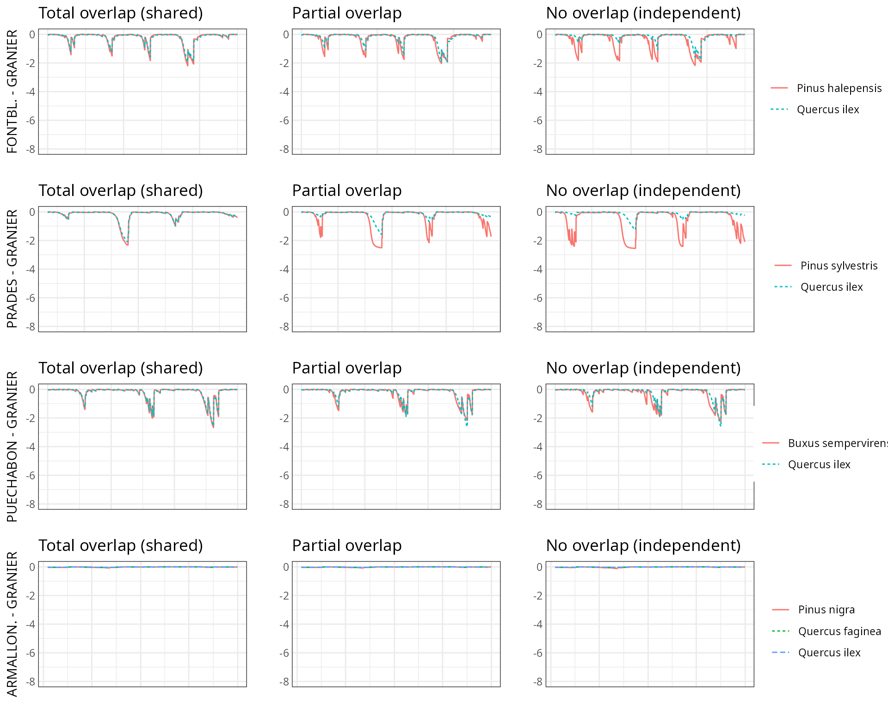
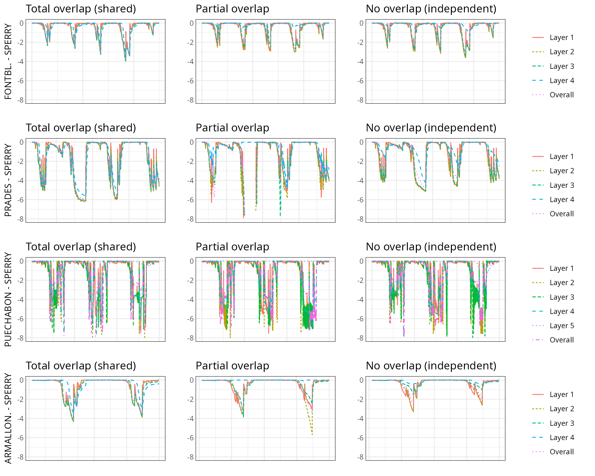
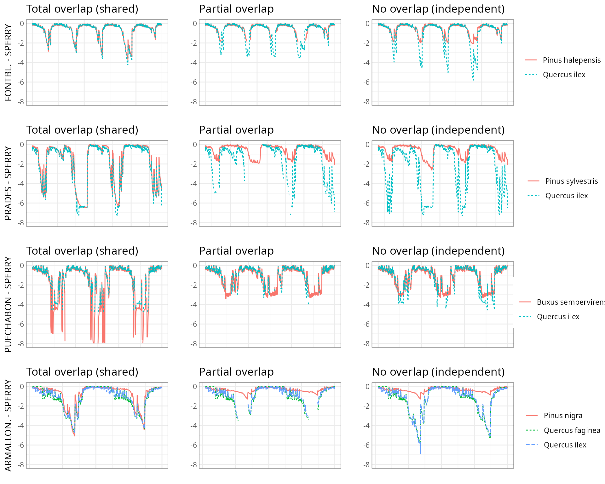
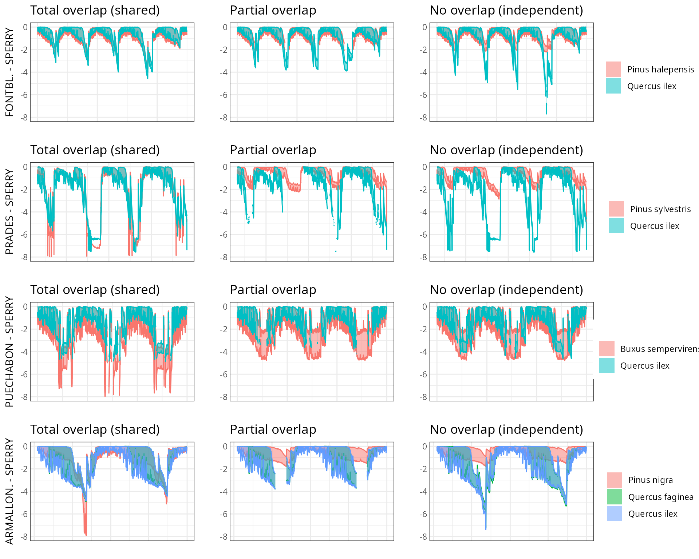
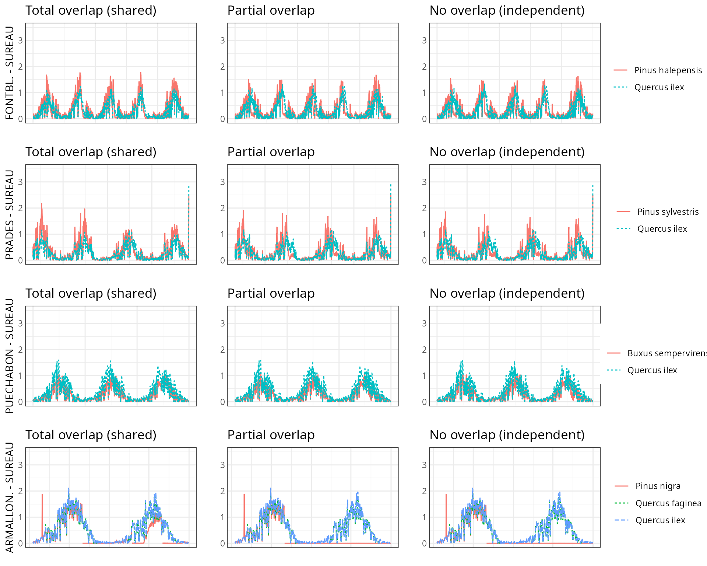
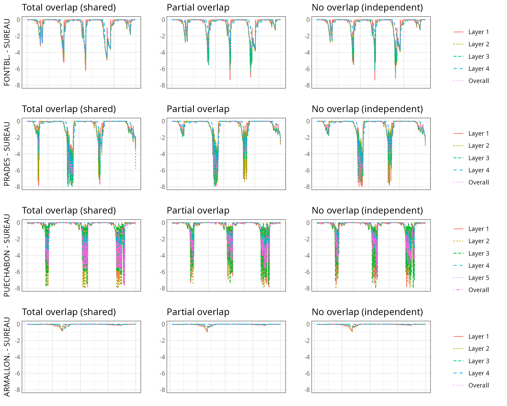
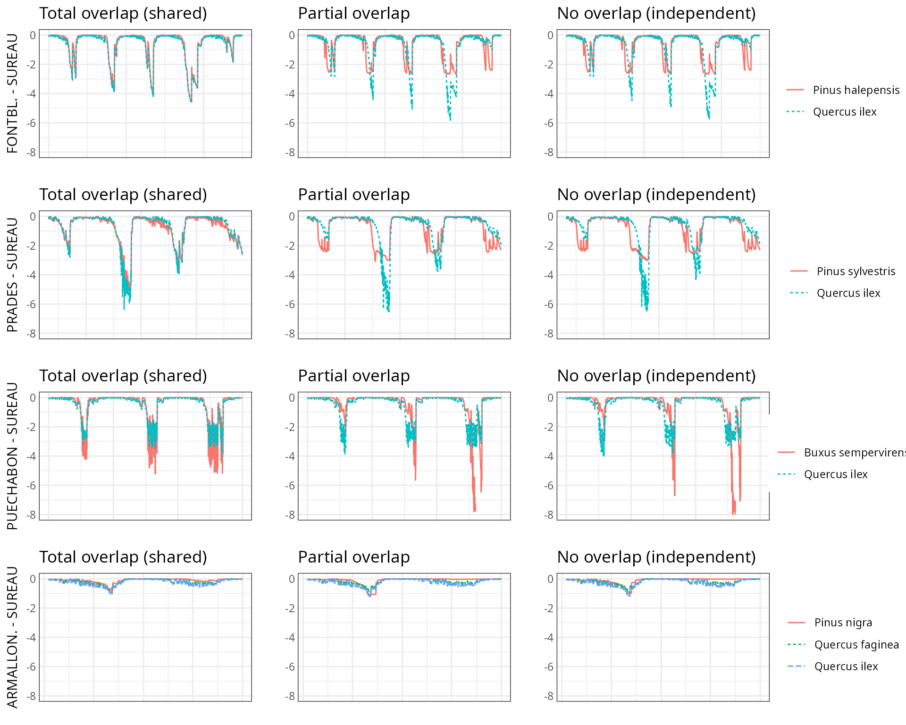

# Water pools and species interactions

## About this vignette

By default, simulations in **medfate** assume that soil moisture under
all plant cohorts is the same (i.e. water sources corresponding to
vertical soil layers are shared among cohorts). Therefore, the models
neglect spatial variation in soil moisture observed in mixed forest
stands (Schume et al. 2004). Variations in soil moisture beneath plant
cohorts (and, implicitly, horizontal variation of soil moisture) can be
simulated in **medfate** if required by the user (see control parameter
`rhizosphereOverlap`). This involves considering that a given plant
cohort will perform water uptake from the **water pool** surrounding its
roots, whereas it may not have access to the water beneath other plants.
However, there can exist some degree of horizontal overlap between water
pools exploited by different plants.

The aim of this vignette is to illustrate the sensitivity of the
advanced water balance model (De Cáceres et al. 2021) to the
consideration of independent water pools.

## Simulations

As target forest stands we take five experimental plots whose data was
already used when presenting the water balance model in De Cáceres et
al. (2021). An evaluation of model performance in these experimental
plots is given in [*Stand-level
evaluation*](https://emf-creaf.github.io/medfate/articles/evaluation/StandLevelEvaluation.html).

For each of these plots we performed simulations using combinations of
the three different transpiration modes:

- `transpirationMode = "Granier"`
- `transpirationMode = "Sperry"`
- `transpirationMode = "Sureau"`

And different assumptions with respect to rhizosphere overlap:

- Default assumption of complete rhizosphere overlap
  (`rhizosphereOverlap = "total"`).
- Assuming partial dynamic rhizosphere overlap
  (`rhizosphereOverlap = "partial"`).
- Assuming complete independence of water pools
  (`rhizosphereOverlap = "none"`).

Recovery from embolism was assumed to depend on soil moisture
(`stemCavitationRecovery = "rate"` and
`leafCavitationRecovery = "rate"`).

## Results

### Results with Granier

#### Transpiration per leaf area unit (l·m-2)

#### Soil water potential (MPa)

#### Plant water potential (MPa)

#### Stem percent loss conductance (%)

### Results with Sperry

#### Transpiration per leaf area unit (l·m-2)

#### Soil water potential (MPa)

#### Root-crown water potential (MPa)

#### Range of leaf water potential (MPa)

#### Stem percent loss conductance (%)

### Results with Sureau

#### Transpiration per leaf area unit (l·m-2)

#### Soil water potential (MPa)

#### Root-crown water potential (MPa)

#### Range of leaf water potential (MPa)

#### Stem percent loss conductance (%)

## Bibliography

- De Cáceres, M., M. Mencuccini, N. Martin-StPaul, J.-M. Limousin, L.
  Coll, R. Poyatos, A. Cabon, V. Granda, A. Forner, F. Valladares,
  and J. Martínez-Vilalta. 2021. Unravelling the effect of species
  mixing on water use and drought stress in Mediterranean forests: A
  modelling approach. Agricultural and Forest Meteorology 296:108233.
- Schume, H., G. Jost, and H. Hager. 2004. Soil water depletion and
  recharge patterns in mixed and pure forest stands of European beech
  and Norway spruce. Journal of Hydrology 289:258–274.
